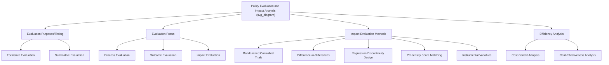

## Policy Evaluation and Impact Analysis

### Overview

Policy evaluation is the systematic application of social scientific research methods to assess the design, implementation, and outcomes of public policies and programs. Impact analysis, a core component of evaluation, specifically seeks to determine the **causal effect** of a policy — isolating the change attributable to the intervention itself from changes that would have occurred regardless of the intervention. Rigorous evaluation is central to evidence-based policymaking, program accountability, and the feedback loop that connects the final stages of the policy cycle back to renewed agenda-setting and formulation.

### Purposes and Types of Evaluation

**Key Points**

- Evaluation serves multiple, sometimes competing purposes: **accountability** (demonstrating to funders, legislatures, or the public that resources were used effectively), **program improvement** (generating actionable feedback to refine ongoing operations), and **knowledge generation** (contributing generalizable evidence about what works, for whom, and under what conditions).

**Formative vs. Summative Evaluation**

- **Formative evaluation**: Conducted *during* program implementation, intended to provide real-time feedback for ongoing adjustment and improvement rather than a final verdict on overall effectiveness. Often emphasizes process-oriented questions (Is the program reaching its intended target population? Are activities being delivered as designed?).
- **Summative evaluation**: Conducted *after* a program has been implemented for a sufficient period, intended to render an overall judgment on effectiveness, efficiency, and impact — typically the basis for decisions about continuation, expansion, modification, or termination.

**Process Evaluation vs. Outcome/Impact Evaluation**

- **Process evaluation**: Assesses whether a program is being implemented as intended (fidelity to design), examining service delivery mechanisms, coverage, and operational efficiency — closely related to the implementation-studies concerns discussed under Policy Implementation.
- **Outcome evaluation**: Measures whether the program's intended short- and medium-term outcomes were achieved (e.g., did enrolled students show improved test scores?), without necessarily establishing that the program *caused* the observed outcome as opposed to other concurrent factors.
- **Impact evaluation**: The most methodologically rigorous category, specifically designed to isolate the **causal** effect attributable to the program itself, using a credible **counterfactual** — an estimate of what would have happened to the same population in the program's absence.

### The Counterfactual Problem and the Fundamental Problem of Causal Inference

**Core Claim**

The central methodological challenge in impact evaluation is that any individual or unit can either receive the policy intervention or not — never both simultaneously — meaning the "true" counterfactual outcome for a treated unit is fundamentally unobservable. This is often termed the **fundamental problem of causal inference** (Holland, 1986, drawing on the Rubin Causal Model).

$$\tau_i = Y_i(1) - Y_i(0)$$

Where $\tau_i$ is the individual-level causal effect for unit $i$, $Y_i(1)$ is the outcome unit $i$ would experience under treatment, and $Y_i(0)$ is the outcome the same unit would experience without treatment. Since only one of $Y_i(1)$ or $Y_i(0)$ can ever actually be observed for any given unit, impact evaluation methodology is fundamentally about constructing credible **estimates** of the unobserved counterfactual, typically by estimating an **average treatment effect (ATE)** across a population rather than a true individual-level effect:

$$\text{ATE} = E[Y_i(1) - Y_i(0)]$$

**Key Points**

- All impact evaluation methods are, at their core, strategies for approximating this unobservable counterfactual as credibly as possible, given that a randomized controlled experiment (the methodological gold standard, discussed below) is not always ethically, politically, or practically feasible for public policy interventions.

### Core Impact Evaluation Methodologies

**1. Randomized Controlled Trials (RCTs)**

Widely regarded as the methodological gold standard for causal impact evaluation. Eligible units (individuals, households, schools, communities) are **randomly assigned** to either a treatment group (receiving the policy intervention) or a control group (not receiving it), ensuring that — in expectation, across a sufficiently large sample — the two groups are statistically identical on both observed and *unobserved* characteristics prior to treatment, so that any subsequent difference in outcomes can be causally attributed to the treatment itself.

- **Strengths**: Provides the strongest possible internal validity for causal claims; eliminates concerns about confounding variables and selection bias by construction.
- **Limitations**: Often ethically or politically infeasible to deny a potentially beneficial intervention to a randomly selected control group (particularly for interventions addressing acute need); can be expensive and time-consuming; results may have limited **external validity** — findings from a specific pilot context may not generalize to full-scale, different-context implementation. [Inference: the external validity limitation of RCTs is a well-documented and widely discussed concern in the program evaluation and development economics literature, sometimes termed the "scaling problem."]

**2. Quasi-Experimental Designs**

Used when random assignment is infeasible, quasi-experimental methods attempt to approximate a credible counterfactual using naturally occurring variation or statistical adjustment techniques.

- **Difference-in-Differences (DiD)**: Compares the change in outcomes over time between a treatment group and a comparison group not receiving the intervention, under the key identifying assumption of **parallel trends** — that, absent the intervention, the two groups would have followed similar outcome trajectories. Commonly used to evaluate policies implemented in some jurisdictions but not others (e.g., comparing states/provinces adopting a minimum wage increase against neighboring states that did not).
- **Regression Discontinuity Design (RDD)**: Exploits a policy's use of a sharp eligibility threshold (an income cutoff for a benefit program, a test-score cutoff for program admission) — comparing outcomes for units just above versus just below the threshold, on the assumption that units close to the cutoff are otherwise very similar, so the threshold itself functions similarly to random assignment locally around the cutoff point.
- **Propensity Score Matching (PSM)**: Statistically matches treated units to comparison units with similar observed characteristics (based on a computed "propensity score" estimating the probability of receiving treatment given observed covariates), constructing a comparison group that resembles the treatment group on measured characteristics — though PSM cannot control for **unobserved** confounding factors the way randomization can.
- **Instrumental Variables (IV)**: Uses a variable (the "instrument") that affects treatment assignment but has no direct effect on the outcome except through its effect on treatment, allowing estimation of a causal effect even amid non-random treatment assignment — a technically demanding method requiring a credible, defensible instrument.

**3. Non-Experimental / Descriptive Approaches**

Simple pre-post comparisons (measuring outcomes before and after an intervention without any comparison group) or cross-sectional correlations are frequently used in practice due to resource and data constraints, but are methodologically weak for causal inference, since they cannot rule out the influence of confounding trends or other concurrent factors unrelated to the policy itself. [Inference: while widely used in practice, particularly in resource-constrained government evaluation contexts, most program evaluation methodologists regard purely descriptive pre-post designs as providing only weak, suggestive evidence of causal impact rather than rigorous causal proof.]

### Visual Model: The Counterfactual Logic of Impact Evaluation

<svg xmlns="http://www.w3.org/2000/svg" viewBox="0 0 720 320">
<text x="360" y="24" text-anchor="middle" font-size="16" font-weight="bold" fill="#1a1a1a">Counterfactual Logic of Impact Evaluation (svg_diagram)</text>
<line x1="80" y1="150" x2="640" y2="150" stroke="#ccc" stroke-width="1" stroke-dasharray="3,3" />
<text x="80" y="140" font-size="10" fill="#777">Baseline</text>
<text x="640" y="140" font-size="10" fill="#777" text-anchor="end">Endline</text>
<path d="M 80 200 L 640 90" stroke="#a8d5ba" stroke-width="3" fill="none" />
<text x="650" y="90" font-size="11" font-weight="bold" fill="#1a1a1a">Treatment group</text>
<text x="650" y="103" font-size="9" fill="#333">(observed outcome)</text>
<path d="M 80 200 L 640 170" stroke="#999" stroke-width="3" stroke-dasharray="6,4" fill="none" />
<text x="650" y="175" font-size="11" font-weight="bold" fill="#777">Counterfactual</text>
<text x="650" y="188" font-size="9" fill="#777">(unobserved, estimated)</text>
<line x1="640" y1="90" x2="640" y2="170" stroke="#e6a97e" stroke-width="2" />
<text x="500" y="120" font-size="12" font-weight="bold" fill="#e6a97e">Impact = Treatment − Counterfactual</text>
<circle cx="80" cy="200" r="6" fill="#333" />
<text x="80" y="225" text-anchor="middle" font-size="10" fill="#555">Both groups start</text>
<text x="80" y="238" text-anchor="middle" font-size="10" fill="#555">at similar baseline</text>
</svg>

### Cost-Benefit and Cost-Effectiveness Analysis

Distinct from but complementary to impact evaluation, these techniques assess the **economic efficiency** of a policy once impact (or expected impact) is established:

- **Cost-Benefit Analysis (CBA)**: Monetizes both the costs and benefits of a policy in common units (currency), enabling comparison of the **net present value** of different interventions, including those with entirely different types of outcomes (e.g., comparing a road-safety program to an education program using a common monetary metric). Requires monetizing outcomes that are sometimes ethically or methodologically contentious to monetize (e.g., valuing a statistical life, valuing environmental amenities).
- **Cost-Effectiveness Analysis (CEA)**: Compares the cost of achieving a given outcome across different interventions using a **non-monetary** outcome metric (e.g., cost per additional year of schooling completed, cost per case of a disease prevented) — avoiding the need to monetize the outcome itself, but restricting comparison to interventions targeting the same or comparable outcome types.

$$\text{Cost-Effectiveness Ratio} = \frac{\text{Total Program Cost}}{\text{Units of Outcome Achieved}}$$

### Institutionalized Evaluation Practice

**Key Points**

- Many governments and multilateral institutions have institutionalized program evaluation through dedicated evaluation units, statutory evaluation requirements, and sometimes independent evaluation offices designed to insulate evaluation findings from the implementing agency's own institutional interests (e.g., the World Bank's Independent Evaluation Group; national supreme audit institutions and commissions on audit that assess government program performance in many countries, including the Philippines' Commission on Audit).
- A persistent institutional challenge is that the agency implementing a program often has an institutional interest in a favorable evaluation outcome (continued funding, program legitimacy), creating a potential conflict of interest that many evaluation systems attempt to address through independent, external, or arms-length evaluation arrangements. [Inference: the effectiveness of any given independence safeguard in practice varies substantially by institutional context and is a recurring subject of public administration and evaluation-practice scholarship, rather than a fully solved design problem.]

### Worked Example: Impact Evaluation of a Philippine Conditional Cash Transfer Program

**Example**

The Philippines' Pantawid Pamilyang Pilipino Program (4Ps), a large-scale conditional cash transfer program providing cash grants to poor households conditional on health check-ups and school attendance requirements, has been the subject of formal impact evaluation using quasi-experimental and experimental methods commissioned by the Department of Social Welfare and Development in partnership with international research institutions.

- **Methodology**: Evaluations of 4Ps have employed randomized phase-in designs (comparing early-enrolled municipalities/households against those scheduled for later enrollment, exploiting the program's phased geographic rollout as a source of quasi-random variation) to estimate impacts on school enrollment, health facility visits, and other targeted outcomes, rather than relying solely on simple before-after comparisons.
- **Findings context**: Such evaluations have generally found positive impacts on the specific conditionalities directly incentivized (school enrollment, health check-up attendance), consistent with a broader international evidence base on conditional cash transfer programs (e.g., Mexico's Prospera/Oportunidades and Brazil's Bolsa Família, extensively studied using similar quasi-experimental designs), while evidence on longer-term outcomes (learning outcomes, sustained poverty reduction beyond the transfer period) has been more mixed and methodologically harder to establish with high confidence given longer time horizons and more numerous confounding factors. [Unverified: readers requiring current, specific quantitative findings from the latest official 4Ps impact evaluation reports should consult the most recent DSWD and World Bank publications directly, as evaluation findings are periodically updated with new rounds of data collection.]

This example illustrates a broader pattern in impact evaluation practice: even well-resourced, rigorously evaluated flagship programs face persistent methodological challenges in establishing confident causal claims about longer-term, more diffuse outcomes, compared to the relatively more tractable task of measuring proximate, directly-incentivized behavioral outcomes.

### Diagrammatic Summary: Evaluation Types and Methods

### Common Analytical Pitfalls

- **Confusing correlation/outcome measurement with causal impact**: Observing that outcomes improved after a program began (a simple pre-post comparison) does not by itself establish that the program *caused* the improvement — concurrent trends, other policy changes, or broader economic conditions could equally explain the observed change, which is precisely why the counterfactual-based methods above are necessary for genuine impact claims.
- **Overgeneralizing from pilot RCT results**: A rigorously demonstrated positive impact in a small-scale randomized pilot does not automatically guarantee equivalent impact at full national scale — implementation quality, general-equilibrium effects, and context-specific factors can all cause "scaled-up" program impact to differ from pilot-study findings.
- **Neglecting process evaluation when interpreting weak outcome results**: A program showing weak or null outcome/impact results could reflect either a genuinely ineffective program design (a "theory failure") or a poorly implemented version of a potentially effective design (an "implementation failure") — process evaluation data is necessary to distinguish these two very different diagnoses and corresponding policy responses.

### Conclusion

Policy evaluation and impact analysis provide the methodological toolkit for assessing whether public policies achieve their intended objectives, distinguishing formative from summative and process from outcome/impact evaluation, and employing methods ranging from the gold-standard randomized controlled trial to quasi-experimental approaches (difference-in-differences, regression discontinuity, propensity score matching, instrumental variables) designed to construct a credible counterfactual where randomization is infeasible. As the Philippine 4Ps conditional cash transfer example illustrates, rigorous impact evaluation is achievable even for large-scale government programs, though persistent methodological challenges remain in establishing confident causal claims about longer-term, more diffuse policy outcomes.

**Related Topics**

- Stages of the Policy Cycle (evaluation's role in the feedback loop to agenda-setting)
- Policy Implementation and Street-Level Bureaucracy (process evaluation connections)
- Cost-Benefit Analysis and Formal Policy Analysis Techniques
- The Rubin Causal Model and the Fundamental Problem of Causal Inference
- Conditional Cash Transfer Programs in Comparative Perspective
- Randomized Controlled Trials in Development Economics and Public Policy
- Evidence-Based Policymaking and Institutionalized Evaluation Systems
- Case Study: Pantawid Pamilyang Pilipino Program (4Ps) Impact Evaluation