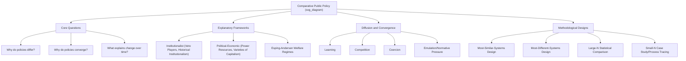

## Comparative Public Policy

### Overview

Comparative public policy is the subfield of political science and public policy studies that systematically examines policy content, processes, and outcomes across different countries, jurisdictions, or time periods, seeking to explain **why** policy choices and results vary (or converge) across otherwise different political systems. It combines the substantive concerns of public policy analysis with the methodological toolkit of comparative politics, asking not only "what is this policy" but "why does this policy differ from a similar policy elsewhere, and what explains that difference."

### Core Analytical Questions

**Key Points**

- Comparative public policy scholarship typically organizes around three related but distinct questions: (1) **Why do policies differ across countries** facing seemingly similar problems? (2) **Why do policies converge** across countries despite different institutional and political starting points? (3) **What explains policy change or stability** within a given country over time, and can lessons from one context be transferred to another (**policy transfer/policy learning**)?
- The field's methodological core relies on structured comparison — most-similar-systems designs (comparing countries that share many characteristics but differ on the key variable of interest) and most-different-systems designs (comparing countries that differ substantially but arrive at similar policy outcomes) — to isolate which factors genuinely explain observed policy variation, as opposed to spurious correlation.

### Major Explanatory Frameworks

**1. Institutionalist Approaches**

Institutionalist explanations argue that formal political institutions — electoral systems, federal versus unitary structure, presidential versus parliamentary government, veto-player configurations — systematically shape which policy options are feasible and which actors hold effective power to block or advance change.

- **Veto players theory** (George Tsebelis, 2002): The number of institutional and partisan actors whose agreement is necessary to change the status quo (veto players) strongly predicts policy stability versus change — systems with many veto players (e.g., the U.S. federal system with separation of powers, bicameralism, and judicial review) tend to exhibit greater policy stability/inertia, while systems with fewer veto players (e.g., a unitary parliamentary system with a single-party majority government) can enact more rapid, larger policy shifts.
- **Historical institutionalism**: Emphasizes **path dependency** — once a policy trajectory is established, institutional arrangements, vested constituencies, and the high costs of reversal tend to entrench that trajectory, making certain policy directions progressively more difficult to reverse over time even if circumstances change (e.g., the entrenchment of employer-based health insurance systems in some countries, which shapes and constrains subsequent healthcare policy reform options long after the original institutional choice was made).

**2. Political-Economic Approaches**

- **Power resources theory**: Associated with scholarship on comparative welfare states (e.g., Walter Korpi, Gøsta Esping-Andersen), this approach explains cross-national variation in social policy generosity primarily as a function of the relative political power of labor movements and left political parties versus capital/business interests — countries with historically strong, well-organized labor movements and durable left-party governance tend to develop more generous, universalistic welfare states.
- **Varieties of Capitalism** (Peter Hall and David Soskice, 2001): Distinguishes **Liberal Market Economies** (LMEs, e.g., the US, UK — coordination primarily through competitive markets) from **Coordinated Market Economies** (CMEs, e.g., Germany, Japan — coordination through non-market institutions like employer associations, works councils, and coordinated wage bargaining), arguing that this institutional distinction shapes comparative advantage, labor market policy, vocational training systems, and corporate governance regulation across advanced industrial democracies.

**3. Esping-Andersen's Welfare Regime Typology (1990)**

A highly influential comparative framework classifying advanced industrial democracies' welfare states into three "worlds":

- **Liberal welfare regimes**: Modest, means-tested benefits, mild redistribution, strong reliance on the market for social provision, and stigmatized state assistance for the poor (e.g., the United States, historically the UK).
- **Conservative/Corporatist welfare regimes**: Benefits linked to employment status and occupational category, moderate redistribution, and social policy designed partly to preserve existing status differentials rather than to equalize outcomes broadly (e.g., Germany, France, historically influenced by Bismarckian social insurance traditions).
- **Social-democratic welfare regimes**: Universal, generous benefits available to all citizens regardless of market position, high redistribution, and strong support for female labor force participation through public childcare and family policy (e.g., Sweden, Denmark, Norway).

[Inference: Esping-Andersen's three-regime typology remains foundational and widely taught but has also been extensively critiqued and refined — notably for inadequately capturing Southern European ("Mediterranean") welfare states, East Asian developmental welfare regimes, and post-communist welfare systems, leading subsequent scholars to propose additional regime categories or hybrid classifications.]

### Visual Model: Comparative Policy Explanatory Frameworks

<svg xmlns="http://www.w3.org/2000/svg" viewBox="0 0 720 320">
<text x="360" y="24" text-anchor="middle" font-size="16" font-weight="bold" fill="#1a1a1a">Comparative Public Policy: Explanatory Frameworks (svg_diagram)</text>
<rect x="40" y="60" width="200" height="90" rx="6" fill="#a8d5ba" stroke="#333" stroke-width="1.5" />
<text x="140" y="85" text-anchor="middle" font-size="12" font-weight="bold" fill="#1a1a1a">Institutionalist</text>
<text x="140" y="105" text-anchor="middle" font-size="9" fill="#333">Veto Players (Tsebelis)</text>
<text x="140" y="120" text-anchor="middle" font-size="9" fill="#333">Historical Institutionalism</text>
<text x="140" y="135" text-anchor="middle" font-size="9" fill="#333">Path Dependency</text>
<rect x="260" y="60" width="200" height="90" rx="6" fill="#f4d58d" stroke="#333" stroke-width="1.5" />
<text x="360" y="85" text-anchor="middle" font-size="12" font-weight="bold" fill="#1a1a1a">Political-Economic</text>
<text x="360" y="105" text-anchor="middle" font-size="9" fill="#333">Power Resources Theory</text>
<text x="360" y="120" text-anchor="middle" font-size="9" fill="#333">Varieties of Capitalism</text>
<text x="360" y="135" text-anchor="middle" font-size="9" fill="#333">(LME vs CME)</text>
<rect x="480" y="60" width="200" height="90" rx="6" fill="#c9dfa8" stroke="#333" stroke-width="1.5" />
<text x="580" y="85" text-anchor="middle" font-size="12" font-weight="bold" fill="#1a1a1a">Diffusion/Transfer</text>
<text x="580" y="105" text-anchor="middle" font-size="9" fill="#333">Policy Diffusion</text>
<text x="580" y="120" text-anchor="middle" font-size="9" fill="#333">Lesson-Drawing</text>
<text x="580" y="135" text-anchor="middle" font-size="9" fill="#333">Policy Convergence</text>
<rect x="150" y="200" width="420" height="70" rx="6" fill="#f0c987" fill-opacity="0.5" stroke="#333" stroke-width="1.5" />
<text x="360" y="225" text-anchor="middle" font-size="12" font-weight="bold" fill="#1a1a1a">Esping-Andersen Welfare Regime Typology</text>
<text x="360" y="245" text-anchor="middle" font-size="9" fill="#333">Liberal | Conservative/Corporatist | Social-Democratic</text>
<text x="360" y="260" text-anchor="middle" font-size="9" fill="#333">(applied primarily to advanced industrial democracies)</text>
</svg>

### Policy Diffusion, Transfer, and Convergence

**Key Points**

- **Policy diffusion**: The process by which a policy innovation spreads across jurisdictions over time, typically following an identifiable pattern (often modeled as an S-shaped adoption curve) driven by mechanisms including learning (jurisdictions observe and evaluate other jurisdictions' experience), competition (jurisdictions adopt policies to remain competitive with peers, e.g., tax incentive competition), coercion (powerful actors, international organizations, or treaty obligations compel adoption), and emulation/normative pressure (adoption driven by a desire for social legitimacy or conformity with perceived best practice, independent of rigorous evidence of effectiveness).
- **Policy transfer**: The more deliberate, agency-driven process by which knowledge about policies, institutions, or programs in one setting is used to develop policies in another — ranging from voluntary lesson-drawing to more coercive forms of transfer (e.g., conditions attached to international financial assistance).
- **Convergence vs. persistent divergence debate**: A long-standing empirical and theoretical debate concerns whether globalization, international economic integration, and policy diffusion mechanisms are producing genuine cross-national policy convergence (e.g., in areas like central bank independence, trade liberalization, or certain regulatory standards) or whether deep institutional and political-economic differences (as emphasized by historical institutionalism and Varieties of Capitalism scholarship) continue to sustain significant persistent cross-national policy divergence even amid globalizing pressures. [Inference: this convergence/divergence debate remains genuinely unresolved and actively contested in the comparative public policy literature, with substantial evidence supporting both convergence in some policy domains (financial regulation, trade policy) and persistent divergence in others (welfare state design, labor market institutions).]

### Methodological Approaches in Comparative Policy Research

- **Most-Similar-Systems Design (MSSD)**: Compares cases that are similar on most background characteristics (e.g., neighboring countries with comparable economic development, similar historical trajectories) to isolate the effect of the specific variable(s) that differ, on the logic that similar cases hold many potential confounding factors constant.
- **Most-Different-Systems Design (MDSD)**: Compares cases that differ substantially on most characteristics but arrive at a similar policy outcome, seeking to identify the few shared factors that might explain the common outcome despite otherwise wide variation.
- **Large-N statistical comparison**: Uses quantitative cross-national datasets (e.g., OECD social expenditure data, World Bank governance indicators) to test hypotheses about policy variation across many countries simultaneously, trading depth of contextual understanding for greater generalizability and statistical power.
- **Small-N/case-study comparison**: Provides deeper contextual and process-level understanding of a smaller number of cases, often better suited to tracing causal mechanisms (process tracing) but with more limited generalizability.

### Worked Example: Comparative Healthcare Policy — Explaining Divergent Systems

**Example**

Comparing healthcare financing systems across the United States, United Kingdom, and Germany illustrates how the frameworks above jointly explain persistent cross-national policy divergence despite all three being advanced industrial democracies facing broadly similar demographic and cost pressures:

- **Institutionalist explanation**: The U.S.'s multiple veto players (separation of powers, filibuster-enabled Senate supermajority requirements, federalism) have historically made comprehensive healthcare reform exceptionally difficult to enact, contributing to a fragmented, historically employer-based system that persisted even amid recognized inefficiencies, illustrating veto-player theory's prediction that high-veto-player systems exhibit policy stability/inertia even where reform might be broadly desired.
- **Power resources explanation**: The UK's National Health Service, established in 1948 amid a strong postwar Labour Party government and historically influential labor movement, reflects power-resources theory's prediction that stronger labor/left political power correlates with more universalistic, redistributive social policy outcomes.
- **Path dependency explanation**: Germany's statutory health insurance system, tracing back to Bismarck's 1883 social insurance legislation, illustrates historical institutionalism's path-dependency logic — the specific institutional form (employment-linked, multi-payer social insurance through "sickness funds") established over a century ago continues to structure the basic architecture of German healthcare financing today, constraining reform options to adjustments within this established framework rather than wholesale system replacement.
- **Esping-Andersen regime classification**: These three systems map recognizably onto Esping-Andersen's typology — the historically liberal-leaning, market-oriented U.S. system; the UK's social-democratic-leaning universal NHS model; and Germany's conservative/corporatist, occupationally-structured social insurance system — demonstrating the typology's continued utility for organizing comparative analysis even though healthcare-specific classification sometimes diverges somewhat from each country's overall welfare-regime classification. [Inference: applying welfare-regime typology specifically to the healthcare sub-sector (as opposed to overall welfare state architecture) is a common but not universally standardized analytical extension in the comparative health policy literature.]

### Comparative Public Policy in the Southeast Asian/Philippine Context

**Example**

Comparative public policy scholarship increasingly examines Southeast Asian and developing-country cases, which sometimes require adapting frameworks originally developed for advanced industrial democracies. The Philippines' universal healthcare policy (Republic Act 11223, the Universal Health Care Act of 2019) can be productively compared to Thailand's earlier Universal Coverage Scheme (2002) and Indonesia's Jaminan Kesehatan Nasional (JKN, 2014) — all three representing a broader Southeast Asian regional trend toward universal health coverage expansion, illustrating policy diffusion dynamics (regional learning and emulation among geographically and economically comparable neighbors) combined with country-specific institutional path dependencies (each country's pre-existing healthcare financing architecture, fiscal capacity, and political coalition dynamics shaping the specific design chosen). [Inference: the relative causal weight of regional policy diffusion/learning versus independent domestic policy development in explaining this shared Southeast Asian trend toward UHC expansion is a matter warranting dedicated comparative case-study research rather than a definitively established, singularly-attributable finding.]

### Diagrammatic Summary: Comparative Public Policy Framework

### Common Analytical Pitfalls

- **Overgeneralizing frameworks developed for advanced industrial democracies**: Esping-Andersen's typology and Varieties of Capitalism were both originally developed based primarily on OECD/advanced-industrial-democracy cases; applying them uncritically to developing-country contexts without adaptation risks obscuring important context-specific dynamics (informal labor markets, weaker state administrative capacity, different historical colonial legacies) that these frameworks were not originally designed to capture.
- **Treating policy diffusion/convergence as automatically evidence of policy effectiveness**: A policy spreading across many countries (diffusion) does not by itself demonstrate that the policy is effective — diffusion can be driven by emulation, normative fashion, or donor/international-organization pressure independent of rigorous evidence, a distinction comparative policy analysis should not elide.
- **Confusing correlation of institutional features with causal explanation**: Comparative policy analysis, like any comparative method, faces the general methodological challenge of distinguishing genuine causal institutional/political-economic explanations from spurious correlations, particularly given the relatively small number of country-level cases typically available for comparison (the "many variables, small N" problem long recognized in comparative politics methodology).

### Conclusion

Comparative public policy examines why policy content, processes, and outcomes vary or converge across different political systems, drawing on institutionalist frameworks (veto players, historical institutionalism), political-economic approaches (power resources theory, Varieties of Capitalism), and typological frameworks like Esping-Andersen's welfare regime classification, alongside dedicated theories of policy diffusion, transfer, and convergence. As the healthcare policy and Southeast Asian universal health coverage examples illustrate, rigorous comparative analysis requires combining these explanatory frameworks with careful methodological design (most-similar or most-different systems comparison, large-N or small-N approaches) while remaining attentive to the risk of uncritically applying frameworks developed for one regional/institutional context to substantially different settings.

**Related Topics**

- Theories of Federalism and Federal and Unitary Systems (institutional variation as an explanatory variable)
- Stages of the Policy Cycle (comparative variation in process across systems)
- Welfare State Typologies and Social Policy Design
- Veto Players Theory and Institutional Analysis
- Policy Diffusion and Regional Policy Learning in Southeast Asia
- Varieties of Capitalism and Comparative Political Economy
- Case Study: Universal Health Coverage Reforms (Philippines, Thailand, Indonesia)
- Methodology of Comparative Politics (MSSD, MDSD, Large-N vs. Small-N)