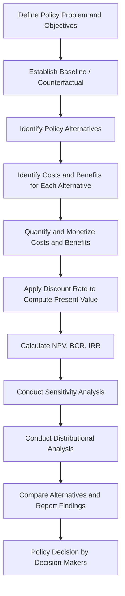

## Cost-Benefit Analysis in Policy Evaluation

### Definition and Conceptual Foundations

Cost-Benefit Analysis (CBA) is a systematic analytical framework used to evaluate public policies, programs, or projects by identifying, quantifying, and comparing their total expected costs against their total expected benefits, typically expressed in monetary terms. Rooted in welfare economics, CBA operationalizes the **Kaldor-Hicks efficiency criterion**, which holds that a policy is socially desirable if the winners from the policy could, in principle, compensate the losers and still remain better off — even if such compensation never actually occurs.

CBA emerged from 19th-century French engineer Jules Dupuit's work on public works valuation and was formalized in the United States through the **Flood Control Act of 1936**, which required that the benefits of federal water projects exceed their costs. Since then, CBA has become a standard requirement in regulatory review, most notably through **Executive Order 12866** (1993) in the U.S., which mandates that federal agencies assess costs and benefits of significant regulations.

### Core Purpose in the Policy Process

Within the public policy cycle, CBA is primarily deployed at the **evaluation** and **ex-ante appraisal** stages:

- **Ex-ante analysis**: Conducted before a policy is implemented, used to inform the decision of whether to adopt a policy at all, or to choose among competing policy alternatives.
- **Ex-post analysis**: Conducted after implementation, used to assess whether a policy achieved a net social benefit and to inform future decisions.

CBA answers the fundamental allocative question: *given scarce public resources, does this intervention produce more social value than its next-best alternative use of those resources?*

### Key Steps in Conducting a Cost-Benefit Analysis

**Key Points**

1. **Define the policy scope and baseline (counterfactual)** — Establish what would happen in the absence of the policy ("do-nothing" or "business-as-usual" scenario), since all costs and benefits are measured relative to this baseline.
2. **Identify all relevant costs and benefits** — Include direct, indirect, tangible, and intangible effects, and specify the standing (whose costs/benefits count — local residents, national citizens, or global populations).
3. **Quantify costs and benefits** — Assign monetary values using market prices where available, and non-market valuation techniques where not.
4. **Discount future values to present value** — Because costs and benefits occur across different time periods, they must be converted to a common time basis.
5. **Aggregate and compute summary metrics** — Calculate Net Present Value (NPV), Benefit-Cost Ratio (BCR), and/or Internal Rate of Return (IRR).
6. **Conduct sensitivity and distributional analysis** — Test how results change under different assumptions and examine who bears costs versus who receives benefits.
7. **Make a recommendation** — Compare alternatives and present findings to decision-makers alongside non-monetized considerations.

### Types of Costs and Benefits

| Category | Description | Example |
| --- | --- | --- |
| Direct/Tangible | Costs or benefits with clear market prices, borne directly by the policy's target | Construction costs of a highway; toll revenue |
| Indirect/Secondary | Spillover effects on third parties (externalities) | Reduced travel time for non-users due to less congestion elsewhere |
| Tangible | Effects that can be readily quantified in monetary terms | Fuel savings, medical costs averted |
| Intangible | Effects difficult to price but real in welfare terms | Improved quality of life, aesthetic value, community cohesion |
| Real | Net effects on aggregate social welfare | New jobs created by increased productivity |
| Pecuniary/Transfer | Effects that merely redistribute existing wealth without net social gain | A subsidy that shifts income from taxpayers to farmers |

Distinguishing **real** effects from **pecuniary/transfer** effects is essential: transfers should generally be excluded from the net social calculation because they do not represent a change in total social resources, only a redistribution among groups (though they matter for distributional/equity analysis).

### Valuation Techniques for Non-Market Goods

Since many public policy outcomes (clean air, human life, biodiversity, time) lack direct market prices, analysts rely on several established non-market valuation methods:

- **Revealed Preference Methods** — Infer value from actual observed behavior:
  - *Hedonic Pricing*: Uses variation in market prices (e.g., housing prices) to isolate the implicit value of an attribute (e.g., proximity to a polluting facility).
  - *Travel Cost Method*: Estimates the value of a recreational site (e.g., a national park) based on the time and money people spend traveling to it.
  - *Averting Behavior/Defensive Expenditures*: Uses spending on protective measures (e.g., bottled water, air filters) to estimate the value of a risk reduction.
- **Stated Preference Methods** — Elicit value through surveys of hypothetical scenarios:
  - *Contingent Valuation*: Directly asks respondents their willingness to pay (WTP) or willingness to accept (WTA) for a good.
  - *Choice Experiments*: Asks respondents to choose among bundles of attributes at different price points to statistically derive implicit valuations.
- **Value of a Statistical Life (VSL)**: A widely used and often contested metric that translates small reductions in mortality risk into monetary terms, typically derived from wage-risk studies (how much extra pay workers demand for riskier jobs) [Inference: exact VSL figures vary substantially by country, agency, and year, and are frequently updated — analysts should consult the specific regulatory agency's current guidance rather than relying on a fixed number].

### Discounting and the Social Discount Rate

Because a policy's costs and benefits typically occur at different points in time, CBA converts all future values into **present value (PV)** using a discount rate, reflecting the principle that a dollar of benefit today is worth more than a dollar of benefit in the future (time preference and opportunity cost of capital).

$$PV = \sum_{t=0}^{n} \frac{B_t - C_t}{(1+r)^t}$$

Where $B_t$ is benefits in year $t$, $C_t$ is costs in year $t$, $r$ is the discount rate, and $n$ is the time horizon.

**Key Points on discount rate selection:**

- Government agencies often specify a standard **social discount rate** (historically debated between 3% and 7% in U.S. federal guidance, with lower rates favored for intergenerational projects like climate policy).
- Higher discount rates systematically disadvantage policies with long-term, delayed benefits (e.g., environmental protection, infrastructure durability) relative to policies with immediate benefits.
- The choice of discount rate is one of the most politically and methodologically contested elements of CBA, since it can reverse a policy's apparent desirability [Inference: the appropriate rate for intergenerational and climate-related policy remains an active area of academic and policy debate, without full consensus].

### Summary Decision Metrics

**Net Present Value (NPV)**

$$NPV = \sum_{t=0}^{n} \frac{B_t - C_t}{(1+r)^t}$$

A policy is considered economically justified if $NPV > 0$. Among mutually exclusive alternatives, the option with the highest positive NPV is generally preferred.

**Benefit-Cost Ratio (BCR)**

$$BCR = \frac{PV(\text{Benefits})}{PV(\text{Costs})}$$

A policy is considered justified if $BCR > 1$. BCR is useful for ranking projects under a constrained budget but can be misleading when comparing projects of very different scales.

**Internal Rate of Return (IRR)**

The discount rate at which $NPV = 0$; used to compare a policy's implicit rate of return against a hurdle rate, though it can produce ambiguous results with unconventional cash flow patterns.

### Illustrative Numerical Example

**Example**

Consider a proposed municipal flood-control levee with a 3-year evaluation horizon and a discount rate of 5%:

| Year | Costs (₱M) | Benefits (₱M) | Net Cash Flow (₱M) | Discount Factor | PV (₱M) |
| --- | --- | --- | --- | --- | --- |
| 0 | 100 | 0 | -100 | 1.000 | -100.00 |
| 1 | 10 | 40 | 30 | 0.952 | 28.57 |
| 2 | 10 | 60 | 50 | 0.907 | 45.35 |
| 3 | 10 | 60 | 50 | 0.864 | 43.19 |

$$NPV = -100.00 + 28.57 + 45.35 + 43.19 = 17.11$$

Since $NPV = ₱17.11M > 0$, the levee project passes the basic CBA efficiency test. The Benefit-Cost Ratio would be computed as $PV(\text{Benefits}) / PV(\text{Costs})$, giving further context on cost efficiency per peso invested.

### Sensitivity Analysis and Uncertainty

Because CBA relies on projected, often uncertain future values, robust analysis requires testing how conclusions change under varying assumptions:

- **One-way sensitivity analysis**: Varying a single input (e.g., discount rate, construction cost overruns) while holding others constant to identify which variables most affect the outcome.
- **Scenario analysis**: Constructing distinct "optimistic," "baseline," and "pessimistic" scenarios.
- **Monte Carlo simulation**: Assigning probability distributions to uncertain inputs and running repeated simulations to generate a distribution of possible NPV outcomes.
- **Break-even analysis**: Identifying the threshold value (e.g., minimum VSL, minimum discount rate) at which the policy shifts from net-beneficial to net-costly.

[Inference: The specific choice of sensitivity technique often depends on data availability and the analytical capacity of the conducting agency, and practices vary across jurisdictions.]

### Distributional and Equity Considerations

A frequently raised critique is that standard CBA aggregates costs and benefits into a single efficiency metric without regard to **who** bears the costs and **who** receives the benefits. To address this, analysts may supplement CBA with:

- **Distributional weighting**: Assigning greater weight to benefits/costs accruing to lower-income or vulnerable populations.
- **Disaggregated reporting**: Presenting separate cost-benefit tables by income group, region, or demographic category alongside the aggregate NPV.
- **Environmental justice screening**: Assessing whether externalities (e.g., pollution from a facility) disproportionately burden specific communities.

This reflects a broader tension in policy analysis between the **efficiency** criterion (maximizing aggregate net social value) and the **equity** criterion (fair distribution of that value), which CBA alone does not resolve.

### Process Flow Diagram

### Comparison with Related Evaluation Frameworks

| Framework | Core Metric | Best Suited For |
| --- | --- | --- |
| Cost-Benefit Analysis (CBA) | Net monetary value (NPV) | Comparing dissimilar policies where all effects can be monetized |
| Cost-Effectiveness Analysis (CEA) | Cost per unit of non-monetary outcome (e.g., cost per life saved) | Comparing policies with a shared, non-monetizable outcome (common in health policy) |
| Cost-Utility Analysis (CUA) | Cost per Quality-Adjusted Life Year (QALY) | Health policy comparisons incorporating quality-of-life adjustments |
| Multi-Criteria Decision Analysis (MCDA) | Weighted score across multiple criteria | Decisions involving diverse, non-commensurable values (environmental, social, cultural) |
| Social Return on Investment (SROI) | Ratio of social value created to investment | Nonprofit and social program evaluation with broad stakeholder impact |

### Critiques and Limitations

- **Commensurability problem**: Reducing qualitative or intrinsic values (human life, cultural heritage, ecosystems) to a single monetary figure is ethically contested and methodologically difficult.
- **Discount rate sensitivity**: Long-term policies (e.g., climate mitigation) can appear unjustified under high discount rates, raising intergenerational equity concerns.
- **Distributional blindness**: Standard CBA can approve policies that concentrate costs on disadvantaged groups while benefits accrue to wealthier groups, since it measures aggregate net value only.
- **Data and valuation uncertainty**: Non-market valuation techniques (contingent valuation, VSL) rely on assumptions and survey methodologies that can yield widely varying estimates [Unverified: precise variance ranges depend on the specific study design and are not fixed across contexts].
- **Political manipulability**: Because assumptions (discount rate, scope of externalities, valuation method) significantly affect outcomes, CBA can be selectively framed to support predetermined conclusions — a critique often labeled "analysis as advocacy."
- **Standing problem**: Determining whose costs and benefits "count" (local vs. national vs. global populations, current vs. future generations) is a normative choice embedded within an ostensibly technical method.

### Application in Comparative Policy Contexts

- **United States**: Office of Management and Budget (OMB) Circular A-4 provides formal guidance for federal regulatory CBA, including standardized discount rate ranges.
- **European Union**: Impact assessment guidelines require CBA-informed analysis for major legislative proposals, often integrated with broader sustainability impact assessments.
- **Developing and middle-income countries** (including LGU-level project appraisal in the Philippines): CBA is frequently required for infrastructure projects seeking multilateral development bank financing (e.g., World Bank, Asian Development Bank) or under national investment coordination frameworks such as the **Philippine NEDA ICC (Investment Coordination Committee)** project evaluation guidelines, which require CBA for major public investment projects above defined cost thresholds. [Inference: specific thresholds and procedural requirements are periodically updated by NEDA and should be verified against current NEDA guidelines for precise figures.]

### Illustrative Conceptual Diagram (svg_diagram)

<svg xmlns="http://www.w3.org/2000/svg" viewBox="0 0 720 340">
<text x="360" y="28" text-anchor="middle" font-size="18" font-weight="bold" fill="#1a1a1a">Cost-Benefit Analysis: Time Value Comparison (svg_diagram)</text>
<line x1="80" y1="290" x2="680" y2="290" stroke="#333" stroke-width="2" />
<line x1="80" y1="290" x2="80" y2="60" stroke="#333" stroke-width="2" />
<text x="40" y="180" font-size="13" fill="#333" transform="rotate(-90 40 180)">Value (₱)</text>
<text x="380" y="320" font-size="13" fill="#333" text-anchor="middle">Time (Years)</text>
<rect x="100" y="250" width="40" height="40" fill="#c0392b" />
<text x="120" y="245" text-anchor="middle" font-size="11" fill="#333">Year 0 Cost</text>
<rect x="220" y="190" width="40" height="100" fill="#27ae60" />
<text x="240" y="185" text-anchor="middle" font-size="11" fill="#333">Year 1 Benefit</text>
<rect x="340" y="150" width="40" height="140" fill="#27ae60" />
<text x="360" y="145" text-anchor="middle" font-size="11" fill="#333">Year 2 Benefit</text>
<rect x="460" y="150" width="40" height="140" fill="#27ae60" />
<text x="480" y="145" text-anchor="middle" font-size="11" fill="#333">Year 3 Benefit</text>
<path d="M 240 190 C 300 130, 350 100, 420 90" stroke="#2980b9" stroke-width="2" fill="none" stroke-dasharray="6,4" />
<text x="430" y="88" font-size="11" fill="#2980b9">Discounted to Present Value</text>
<rect x="580" y="100" width="90" height="60" fill="none" stroke="#1a1a1a" stroke-width="1.5" />
<text x="625" y="125" text-anchor="middle" font-size="11" fill="#1a1a1a">NPV =</text>
<text x="625" y="142" text-anchor="middle" font-size="11" fill="#1a1a1a">ΣPV(B) − ΣPV(C)</text>

<text x="120" y="55" text-anchor="middle" font-size="10" fill="#555">Red = Cost outlay</text>

<text x="300" y="55" text-anchor="middle" font-size="10" fill="#555">Green = Realized benefit</text>

</svg>

### Practical Skills for Analysts

**Next Steps**

- Build proficiency in spreadsheet-based NPV/BCR modeling (Excel or equivalent) as the baseline technical skill for conducting CBA.
- Study official CBA guidance documents such as OMB Circular A-4 (U.S.), HM Treasury's Green Book (U.K.), and NEDA project evaluation guidelines (Philippines) to understand jurisdiction-specific methodological standards.
- Practice constructing sensitivity tables and tornado diagrams to communicate uncertainty to non-technical decision-makers.
- Explore complementary frameworks (CEA, CUA, MCDA) to understand when CBA is inappropriate and an alternative evaluation method is warranted.
- Examine real-world regulatory impact analyses (e.g., EPA rulemakings, ADB project appraisal documents) as applied case studies.

**Related Topics**

- Cost-Effectiveness Analysis and Cost-Utility Analysis in health and social policy
- The Kaldor-Hicks Efficiency Criterion and Welfare Economics Foundations
- Regulatory Impact Assessment (RIA) Frameworks
- The Social Discount Rate Debate and Intergenerational Equity
- Contingent Valuation and Stated Preference Survey Design
- Political Feasibility Analysis versus Technical/Economic Analysis in Policy Evaluation
- Program Evaluation Methods (Impact Evaluation, Randomized Controlled Trials in Policy)