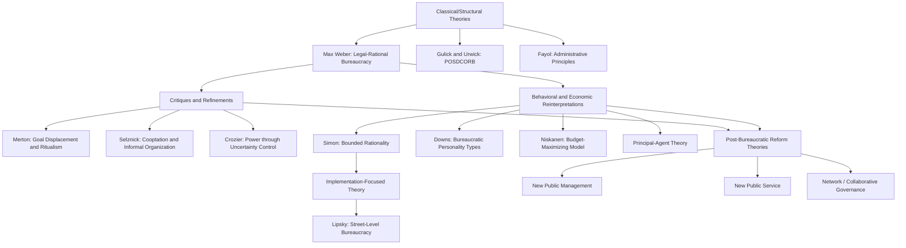

## Theories of Bureaucratic Organization

### Overview and Significance

Theories of bureaucratic organization constitute a core body of thought in Public Administration explaining how large-scale administrative institutions are structured, how they function, why they behave as they do, and how they relate to political authority, efficiency, and democratic accountability. These theories span classical structural models, sociological and behavioral critiques, economic/rational-choice reinterpretations, and contemporary post-bureaucratic reforms. Understanding this body of theory is essential for analyzing how public policy, once decided, is actually implemented through administrative machinery.

### Max Weber's Classical Model of Bureaucracy

Max Weber, writing in the early 20th century, provided the foundational sociological theory of bureaucracy, treating it as the purest form of **legal-rational authority** — one of his three ideal types of authority alongside traditional and charismatic authority.

**Key Points — Weber's Defining Characteristics of Bureaucracy:**

1. **Hierarchical structure of authority** — A clear chain of command with well-defined levels of supervision and subordination.
2. **Division of labor and specialization** — Tasks are distributed according to functional specialization, with each official responsible for a defined sphere of competence.
3. **Formal rules and procedures** — Consistent, written regulations govern decision-making, ensuring predictability and reducing arbitrary action.
4. **Impersonality** — Officials apply rules uniformly regardless of personal relationships, ensuring equal treatment of cases.
5. **Career orientation and merit-based appointment** — Officials are selected based on technical qualifications, employment is a career, and advancement follows seniority or achievement rather than patronage.
6. **Separation of office and office-holder** — Official position and the resources attached to it belong to the organization, not the individual; private and official spheres are separated.
7. **Written documentation ("the files")** — Administrative acts, decisions, and rules are recorded and archived, forming an institutional memory independent of any single official.

Weber viewed this "ideal type" bureaucracy as technically superior to other forms of organization due to its precision, speed, unambiguity, continuity, and reduction of friction — while also warning of the **"iron cage"** effect, in which excessive rationalization could dehumanize both officials and citizens, trapping them within impersonal, rule-bound systems.

### Structural/Classical Administrative Theory

Parallel to Weber, early 20th-century administrative theorists in the U.S. and Europe developed prescriptive principles for organizing bureaucracies efficiently:

- **Frederick Taylor's Scientific Management**: Applied principles of efficiency and standardization from industrial management to administrative work, emphasizing the "one best way" to perform tasks.
- **Luther Gulick and Lyndall Urwick — POSDCORB**: A widely cited acronym summarizing the core functions of a chief executive in an administrative organization: **P**lanning, **O**rganizing, **S**taffing, **D**irecting, **C**oordinating, **R**eporting, and **B**udgeting.
- **Henri Fayol's Administrative Principles**: Proposed universal principles of management including unity of command, scalar chain, and span of control.

These theories share Weber's emphasis on hierarchy and formal structure but focus more explicitly on prescriptive efficiency-maximizing organizational design rather than sociological explanation of authority.

### Robert Merton's Critique — Bureaucratic Dysfunction

Sociologist Robert K. Merton offered an influential structural-functionalist critique, arguing that the very features Weber praised could produce unintended dysfunctions:

- **Goal displacement**: Officials become so committed to following rules that adherence to procedure becomes an end in itself, displacing the original substantive goals the rules were meant to serve.
- **Trained incapacity**: Skills and habits that once made an official effective become liabilities when circumstances change, because rigid training reduces adaptive capacity.
- **Ritualism**: Excessive conformity to rules produces overly cautious, inflexible behavior — a pattern later echoed in Merton's broader strain theory of deviance.
- **Bureaupathology**: A pattern of self-defeating, overly defensive administrative behavior arising from excessive rule-following.

### Philip Selznick — Institutional and Informal Organization Perspective

Selznick's study of the Tennessee Valley Authority (*TVA and the Grass Roots*, 1949) introduced the concept of **cooptation** — the process by which an organization absorbs new elements (individuals or groups) into its leadership or policy-determining structure as a means of averting threats to its stability. Selznick's broader institutional theory emphasized that formal organizational charts do not capture the full reality of bureaucratic behavior; informal norms, values, and power structures ("the informal organization") significantly shape actual outcomes.

### Michel Crozier — The Bureaucratic Phenomenon

French sociologist Michel Crozier argued that bureaucracies generate **power through the control of uncertainty**. Officials or units that control unpredictable, non-routinized aspects of an organization's environment gain disproportionate informal power, even within a formally rigid hierarchical structure. This explains why lower-level officials (e.g., maintenance technicians who alone understand a malfunctioning machine) can wield outsized influence despite low formal rank — a key insight into the gap between formal bureaucratic structure and actual organizational power dynamics.

### Anthony Downs — Economic Theory of Bureaucracy

Downs applied rational-choice economic reasoning to bureaucratic behavior in *Inside Bureaucracy* (1967), modeling officials as self-interested actors who seek to maximize personal utility (power, income, prestige, security, convenience) within organizational constraints. Downs proposed a typology of bureaucratic personalities:

| Type | Motivation |
| --- | --- |
| Climbers | Seek to maximize personal power, income, and prestige |
| Conservers | Seek security and convenience; resist change |
| Zealots | Loyal to narrow policies or programs they champion |
| Advocates | Loyal to broader organizational functions and missions |
| Statesmen | Motivated by loyalty to society/the general welfare |

Downs also articulated the **"law of increasing conservatism"**, suggesting that bureaucracies tend to become more risk-averse and rule-bound over time as they age.

### William Niskanen — Budget-Maximizing Bureaucrat Model

Niskanen's *Bureaucracy and Representative Government* (1971) is a seminal public choice theory contribution, modeling bureaucrats as budget-maximizers who seek to expand their agency's budget beyond the socially optimal level because larger budgets confer greater power, staff, salary, and prestige to agency heads. Because bureaucrats possess an **information asymmetry advantage** over their political overseers (legislatures/sponsors) regarding the true cost of providing a service, Niskanen argued bureaucracies systematically over-supply public services relative to what citizens would choose under competitive market conditions.

[Inference: Niskanen's model has been empirically contested — later scholars (including a revised model by Niskanen himself) noted that budget-maximization does not always hold uniformly across all agency types or political contexts, and the degree of oversight capacity significantly moderates the effect.]

### Principal-Agent Theory Applied to Bureaucracy

Drawing from institutional economics, principal-agent theory frames the relationship between elected officials (**principals**) and administrative agencies (**agents**) as one plagued by:

- **Information asymmetry**: Agents (bureaucrats) typically possess more specialized knowledge about their policy domain than principals (legislators/executives).
- **Moral hazard**: Once delegated authority, agents may pursue their own preferences rather than faithfully executing principals' intentions.
- **Adverse selection**: Principals may struggle to select or identify agents whose preferences align with their own before delegation occurs.

This framework underlies modern administrative oversight mechanisms such as reporting requirements, performance audits, legislative vetoes, and "police patrol" versus "fire alarm" oversight strategies (McCubbins and Schwartz, 1984) — where police-patrol oversight involves active, continuous monitoring, while fire-alarm oversight relies on third parties (interest groups, media, citizens) to flag problems as they arise.

### Herbert Simon — Bounded Rationality and Administrative Behavior

Herbert Simon's *Administrative Behavior* (1947) challenged the classical assumption of purely rational decision-making within bureaucracies, introducing **bounded rationality**: the idea that administrators operate under cognitive, informational, and time constraints, leading them to seek a **"satisficing"** solution (one that is good enough) rather than an optimal one. This behavioral turn shifted administrative theory away from prescriptive structural principles ("principles of administration," which Simon famously dismissed as mere "proverbs") toward empirical study of actual decision-making processes.

### Michael Lipsky — Street-Level Bureaucracy

Lipsky's *Street-Level Bureaucracy* (1980) examined front-line public service workers (teachers, police officers, social workers) who interact directly with citizens and exercise substantial **discretion** in how policy is actually implemented "on the ground," regardless of formal top-down directives. Key concepts include:

- **Discretion as inevitable**: Because street-level bureaucrats face high caseloads, ambiguous policy goals, and limited resources, some degree of discretionary judgment is unavoidable.
- **Coping mechanisms**: Workers develop routines, categorization shortcuts, and rationing techniques to manage overwhelming demands, which can shape policy outcomes independent of formal design.
- **Policy is effectively made at the point of implementation**, not solely at the point of legislative enactment — a foundational insight for implementation studies.

### Post-Bureaucratic and Reform-Oriented Theories

**New Public Management (NPM)**: Emerging in the 1980s–1990s (associated with reforms in the U.K., New Zealand, Australia, and the U.S.), NPM sought to inject private-sector management techniques into public bureaucracies: performance measurement, competition/contracting-out, decentralization, customer-orientation, and results-based accountability, moving away from Weberian rule-bound rigidity toward managerial flexibility.

**New Public Service (NPS)**: A response to NPM's market-centric framing (Denhardt and Denhardt, 2000), emphasizing that public administrators should serve citizens, not "customers," and prioritize democratic values, collaborative governance, and public interest over narrow efficiency metrics.

**Network Governance / Collaborative Governance Theory**: Recognizes that contemporary public problems are often addressed not by single hierarchical bureaucracies but through networks of governmental, nonprofit, and private actors, requiring coordination mechanisms distinct from classical hierarchy.

**Post-New Public Management / Whole-of-Government Approaches**: A reaction to the fragmentation caused by NPM's decentralization, emphasizing renewed coordination, integration, and "joined-up government."

### Comparative Summary Table

| Theorist/School | Core Concept | View of Bureaucracy |
| --- | --- | --- |
| Max Weber | Legal-rational authority, ideal type | Technically efficient but risks dehumanizing "iron cage" |
| Gulick & Urwick | POSDCORB | Prescriptive efficiency-oriented structure |
| Robert Merton | Goal displacement, ritualism | Rule-following produces unintended dysfunction |
| Philip Selznick | Cooptation, informal organization | Formal structure incomplete without informal dynamics |
| Michel Crozier | Power through uncertainty control | Informal power subverts formal hierarchy |
| Anthony Downs | Bureaucratic personality types | Officials are self-interested utility maximizers |
| William Niskanen | Budget-maximization | Bureaucrats over-supply services due to information advantage |
| Herbert Simon | Bounded rationality, satisficing | Decision-making constrained by cognitive limits |
| Michael Lipsky | Street-level discretion | Policy effectively made during implementation |
| NPM theorists | Market mechanisms, performance | Bureaucracy should mimic private-sector efficiency |
| Denhardt & Denhardt (NPS) | Citizenship, public interest | Bureaucracy should serve democratic values, not customers |

### Conceptual Relationship Diagram

### Illustrative Example

**Example**

Consider a national social welfare agency processing benefit applications:

- Under **Weber's model**, the agency would apply uniform, written eligibility rules impersonally to every applicant, with clear hierarchical review of contested cases.
- Under **Merton's critique**, caseworkers might reject a legitimate but unconventional application purely because it does not fit standard rule categories — an example of ritualistic goal displacement.
- Under **Niskanen's model**, agency leadership might request a larger annual budget than strictly necessary, citing rising caseloads, because legislators lack the specialized knowledge to verify true operating costs.
- Under **Lipsky's street-level bureaucracy framework**, individual caseworkers — facing hundreds of case files and ambiguous eligibility guidelines — develop informal shortcuts (e.g., prioritizing "clear-cut" cases first), meaning the actual lived experience of applicants depends heavily on frontline discretion rather than the formal policy alone.

This illustrates how a single bureaucratic function can be simultaneously explained, and critiqued, from multiple theoretical lenses.

### Contemporary Relevance and Debates

- **Digital-era bureaucracy**: The rise of e-government and algorithmic decision-making raises new questions about how Weberian impersonality and Lipsky's street-level discretion are reshaped when automated systems replace or augment human caseworkers [Inference: this is an active and evolving research area without settled consensus on outcomes].
- **Accountability versus efficiency trade-offs**: NPM-style reforms promising efficiency gains are frequently critiqued for weakening the due-process protections and equal-treatment guarantees embedded in classical Weberian bureaucracy.
- **Representative bureaucracy theory**: A related contemporary strand examining whether a bureaucracy's demographic composition (reflecting the broader population) affects the substantive responsiveness and fairness of its policy outputs.

**Next Steps**

- Study Weber's broader typology of authority (traditional, charismatic, legal-rational) to situate bureaucratic theory within his general sociology of domination.
- Examine empirical case studies of agency capture and principal-agent dynamics in regulatory bodies.
- Explore Lipsky's street-level bureaucracy theory in depth alongside contemporary "screen-level bureaucracy" literature on digitized administrative discretion.
- Compare New Public Management reforms across different national contexts (U.K. Next Steps Agencies, New Zealand's State Sector Act, U.S. National Performance Review).

**Related Topics**

- Max Weber's Typology of Authority (Traditional, Charismatic, Legal-Rational)
- New Public Management versus New Public Service Debate
- Principal-Agent Theory and Bureaucratic Oversight Mechanisms
- Street-Level Bureaucracy and Administrative Discretion
- Representative Bureaucracy Theory
- Public Choice Theory and Rational Choice Institutionalism
- Policy Implementation Theory (Top-Down vs. Bottom-Up Models)