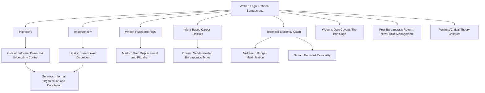

## Weberian Bureaucracy and its Critics

### Definition and Theoretical Origin

Weberian bureaucracy refers to the ideal-typical model of administrative organization developed by German sociologist Max Weber in the early 20th century, most systematically presented in his work *Economy and Society* (posthumously published, 1922). Weber treated bureaucracy as the institutional embodiment of **legal-rational authority** — one of his three "pure types" of legitimate domination, distinguished from **traditional authority** (legitimacy rooted in custom and established practice) and **charismatic authority** (legitimacy rooted in the exceptional personal qualities of a leader).

For Weber, bureaucracy was not merely one organizational form among many, but the historically dominant and technically most efficient mechanism through which modern states and large organizations exercise administrative control.

### The Weberian Ideal Type — Core Characteristics

An "ideal type" in Weber's methodology is a conceptual abstraction — a deliberately exaggerated model against which real-world cases can be compared, not a literal description of any actual bureaucracy. Weber's ideal-typical bureaucracy exhibits the following defining features:

**Key Points**

1. **Fixed jurisdictional areas** — Official duties are organized as fixed, official duties ordered by rules, with clearly delineated authority to issue commands within a defined sphere.
2. **Hierarchy and levels of graded authority** — A firmly ordered system of super- and subordination, with lower offices supervised by higher ones and a clear channel for appeal.
3. **Management based on written documents ("the files")** — Administrative acts, decisions, and rules are recorded in writing, creating an institutional record independent of individual officials.
4. **Specialized training** — Office management, especially in modern administration, presupposes thorough expert training, distinguishing bureaucratic officials from amateur or generalist administrators.
5. **Full working capacity** — In the fully developed bureaucracy, official activity demands the full working capacity of the official, as opposed to being a secondary or occasional occupation.
6. **Rule-governed conduct** — The management of the office follows general, stable, and learnable rules, whose application can, in principle, be studied and predicted.
7. **Separation of the official from ownership of the means of administration** — Officials do not own their offices, the tools of their work, or the resources they manage; these belong to the organization.
8. **Impersonality** — The ideal bureaucrat conducts office business "without regard for persons," applying rules dispassionately regardless of personal sympathy, favor, or social status.
9. **Merit-based appointment and career structure** — Officials are appointed (not elected) based on qualification, receive a fixed salary and pension, and can expect a lifelong career with advancement based on seniority or achievement, judged by superiors.

### Rationale — Why Weber Considered Bureaucracy Superior

Weber argued that bureaucratic administration is technically superior to any other form of organization for a specific set of reasons, captured in his famous comparison to a machine:

> Weber held that bureaucratic organization is capable of attaining the highest degree of efficiency, and is in this sense formally the most rational known means of exercising authority over human beings.

The technical advantages Weber identified include:

- **Precision** — Standardized rules reduce ambiguity in decision-making.
- **Speed** — Routinized procedures allow rapid processing of large caseloads.
- **Unambiguity** — Clear jurisdictional boundaries reduce conflict over authority.
- **Knowledge of files** — Institutional memory persists independent of any single official's tenure.
- **Continuity** — The organization functions independent of the turnover of any specific personnel.
- **Discretion reduction / calculability** — Predictable, rule-bound behavior allows citizens and organizations to plan around administrative decisions with confidence.
- **Unity, strict subordination, and reduction of friction and costs** — Clear hierarchy minimizes interpersonal conflict over authority and resource costs.

### The "Iron Cage" — Weber's Own Ambivalence

Despite praising bureaucracy's technical efficiency, Weber was deeply ambivalent about its broader civilizational consequences. He warned that the expansion of rational-legal bureaucratic authority across modern society — not just in government but in corporations, universities, and other large institutions — risked producing an **"iron cage" (stahlhartes Gehäuse)**, a condition in which individuals become trapped within impersonal, rule-bound systems that prioritize procedural rationality over substantive human values, potentially eroding individual freedom and charismatic or value-driven action.

This ambivalence positions Weber not as a naive celebrant of bureaucracy but as a diagnostician who saw both its indispensable efficiency and its dehumanizing potential as two sides of the same rationalizing process he termed **"disenchantment" (Entzauberung)** of the modern world.

### Major Critics of the Weberian Model

**Robert Merton — Bureaucratic Dysfunction**

Merton's structural-functionalist critique argued that the very features Weber identified as sources of efficiency could, under real-world conditions, produce dysfunction:

- **Goal displacement**: Rule-following becomes an end in itself rather than a means to substantive organizational goals — officials adhere to procedure even when it undermines the purpose the procedure was meant to serve.
- **Trained incapacity**: Skills adapted to one set of conditions become liabilities when conditions change, since officials trained in rigid procedures may struggle to adapt to novel situations.
- **Overconformity and ritualism**: Excessive emphasis on rule-adherence produces timid, inflexible officials unable to exercise judgment in unanticipated cases.

**Philip Selznick — Informal Organization and Cooptation**

Selznick's institutional analysis (notably his study of the Tennessee Valley Authority) demonstrated that formal bureaucratic structure never fully captures organizational reality. Real organizations develop **informal norms, values, and power relations** that shape behavior alongside — and sometimes in tension with — the formal rule structure. Selznick introduced **cooptation**: the process of absorbing external groups into an organization's leadership to neutralize threats to institutional stability, showing how formally rational bureaucracies adapt through informal, non-rule-based mechanisms.

**Michel Crozier — Power Through Control of Uncertainty**

Crozier's *The Bureaucratic Phenomenon* (1964) challenged the Weberian assumption that formal hierarchy determines actual power distribution. Crozier argued that within a bureaucracy, informal power accrues to whichever actors control the organization's **zones of uncertainty** — unpredictable elements the formal rules cannot fully specify. This explains apparent paradoxes such as low-ranking technical specialists exercising outsized influence over nominally superior officials.

**Anthony Downs and Rational Choice Critics**

Downs's *Inside Bureaucracy* (1967) challenged Weber's implicit assumption of dispassionate, impersonal officials by modeling bureaucrats as self-interested actors pursuing personal utility (power, income, prestige, security). This reframing suggested that bureaucratic behavior could deviate systematically from purely rule-bound impersonality whenever official self-interest and formal duty diverged.

**William Niskanen — Budget-Maximization Critique**

Niskanen's public-choice model argued that Weberian bureaucratic officials, rather than being neutral instruments, exploit their **informational advantage** over political principals to expand agency budgets beyond socially optimal levels — a direct challenge to the Weberian assumption that bureaucratic expertise serves organizational and public goals neutrally. [Inference: subsequent empirical research has found mixed support for strict budget-maximization, suggesting the degree of self-interested behavior varies by institutional oversight context.]

**Michael Lipsky — Street-Level Discretion versus Rule-Boundedness**

Lipsky's *Street-Level Bureaucracy* directly challenges the Weberian premise that lower-level officials merely apply fixed rules impersonally. Lipsky demonstrated that front-line workers (teachers, police, caseworkers) inevitably exercise substantial **discretion** due to high caseloads, ambiguous policy directives, and resource constraints — meaning actual policy outcomes are shaped as much by informal coping behavior as by the formal rules Weber emphasized.

**Herbert Simon — Bounded Rationality**

Simon's *Administrative Behavior* challenged the classical/Weberian assumption of fully rational, rule-following administrative action, proposing instead that officials operate under **bounded rationality**, relying on simplified decision routines and "satisficing" rather than optimizing — a psychological rather than structural critique of bureaucratic rationality.

**Feminist and Critical Theory Critiques**

Scholars such as Kathy Ferguson (*The Feminist Case Against Bureaucracy*, 1984) have argued that Weberian bureaucratic impersonality and hierarchy encode gendered power relations, framing the "rational" bureaucratic subject in ways that marginalize relational, care-oriented, and non-hierarchical modes of organization. [Inference: this remains a distinct normative/critical strand rather than an empirical refinement of Weber's descriptive model, and is contested among scholars regarding its generalizability.]

**Post-Bureaucratic and New Public Management (NPM) Critiques**

From the 1980s onward, NPM reformers criticized Weberian bureaucracy as excessively rigid, rule-bound, and insulated from market discipline, advocating instead for performance-based management, competition, decentralization, and customer-orientation — a *normative* critique aimed at replacing rather than merely explaining deficiencies in the Weberian model.

### Comparative Summary Table

| Critic/School | Core Critique | Nature of Critique |
| --- | --- | --- |
| Robert Merton | Goal displacement, ritualism, trained incapacity | Structural-functionalist (unintended dysfunction) |
| Philip Selznick | Informal organization, cooptation | Institutional (formal structure incomplete) |
| Michel Crozier | Power through uncertainty control | Structural-power (formal hierarchy ≠ actual power) |
| Anthony Downs | Self-interested bureaucratic personalities | Rational choice (challenges impersonality assumption) |
| William Niskanen | Budget-maximization via information asymmetry | Public choice/economic |
| Michael Lipsky | Street-level discretion | Implementation-focused (challenges rule-boundedness) |
| Herbert Simon | Bounded rationality, satisficing | Behavioral/cognitive |
| Kathy Ferguson (feminist critique) | Gendered power encoded in hierarchy/impersonality | Critical/normative |
| NPM reformers | Rigidity, inefficiency, lack of market discipline | Normative/reformist |

### Conceptual Diagram

### Illustrative Example

**Example**

Consider a national passport-issuing agency, structured along strictly Weberian lines: applicants submit standardized forms, clerks apply uniform eligibility criteria impersonally, and decisions follow a documented, appealable hierarchy.

- **Weberian prediction**: Every applicant meeting identical criteria receives identical treatment, regardless of personal connections — this predictability is the model's core strength.
- **Merton's critique in action**: A clerk denies a valid application because it does not perfectly match a rigid checklist format, even though the underlying eligibility is clearly met — ritualistic rule-following displaces the agency's actual goal of serving eligible citizens.
- **Crozier's critique in action**: A single IT technician who maintains the agency's aging application-processing software becomes informally indispensable and can delay or expedite processing based on personal relationships, despite occupying a low formal rank.
- **Lipsky's critique in action**: Overworked front-desk clerks, facing long queues, develop informal shortcuts — such as more strictly scrutinizing applicants who "seem suspicious" — meaning actual service delivery diverges from the formally uniform rule Weber's model assumes.

This example shows how Weberian structure provides the formal skeleton of bureaucratic organization while critics reveal the behavioral, political, and informal realities operating within and around that skeleton.

### Contemporary Relevance

- **Persistence of the Weberian model**: Despite decades of critique and NPM-style reform, core Weberian features (hierarchy, written rules, merit-based civil service) remain foundational to most modern public administrations, particularly in contexts emphasizing rule-of-law and anti-corruption safeguards, since impersonal rule-application is often precisely the defense against patronage and arbitrary power. [Inference: the relative desirability of Weberian rigidity versus post-bureaucratic flexibility remains a live and context-dependent debate in comparative public administration.]
- **Digital transformation**: Algorithmic and automated decision-making systems in e-government represent, in some respects, an intensification of Weberian impersonality and rule-codification, while simultaneously raising new versions of Lipsky's discretion critique in the form of "screen-level bureaucracy" and algorithmic accountability debates.
- **Developing-country administrative reform**: In many contexts — including local government units in the Philippines — debates over strengthening Weberian features (merit-based civil service, standardized procedures) versus adopting NPM-style flexibility remain central to public sector reform agendas, reflecting the continuing tension between rule-bound predictability and administrative responsiveness.

**Next Steps**

- Study Weber's broader tripartite typology of authority (traditional, charismatic, legal-rational) to situate bureaucratic theory within his sociology of domination.
- Examine Robert Merton's structural-functionalism in greater depth as a bridge between classical and behavioral organizational theory.
- Explore Michael Lipsky's street-level bureaucracy theory and its extensions into "screen-level bureaucracy" in digital government contexts.
- Compare Weberian bureaucratic models against New Public Management and New Public Service reform paradigms.

**Related Topics**

- Theories of Bureaucratic Organization (broader survey)
- Max Weber's Typology of Authority
- Merton's Theory of Bureaucratic Dysfunction
- Street-Level Bureaucracy and Administrative Discretion
- New Public Management versus New Public Service
- Principal-Agent Theory in Public Administration
- Civil Service Systems and Merit-Based Appointment