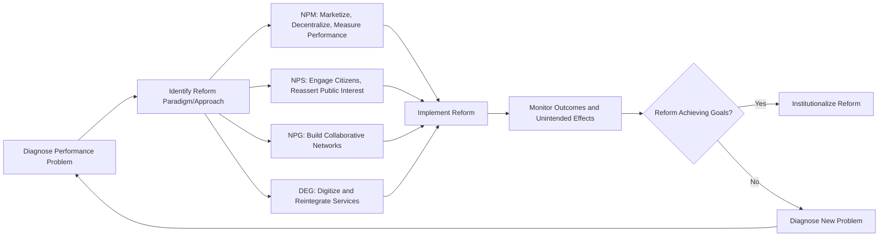

## Public Sector Management and Reform

### Definition and Scope

Public Sector Management and Reform refers to the body of theory and practice concerned with how government organizations are administered, resourced, and continuously restructured to improve performance, accountability, efficiency, and responsiveness to citizens. It encompasses both **management** — the ongoing operational administration of public agencies (budgeting, personnel, service delivery, performance measurement) — and **reform** — deliberate, often large-scale efforts to change administrative structures, processes, or cultures in response to perceived deficiencies, fiscal pressure, technological change, or shifting political ideology.

This field sits at the intersection of public administration theory, organizational management, political science, and economics, and has undergone several distinct paradigm shifts over the past century.

### Historical Evolution of Public Sector Management Paradigms

**Key Points**

1. **Traditional Public Administration (TPA)** — Dominant from the late 19th century through the mid-20th century, rooted in Weberian bureaucracy and Woodrow Wilson's politics-administration dichotomy; emphasizes hierarchy, rule-following, career civil service, and neutral competence.
2. **New Public Management (NPM)** — Rising from the late 1970s/1980s, driven by fiscal crises and neoliberal ideology, emphasizing market mechanisms, competition, decentralization, and results-based accountability.
3. **New Public Service (NPS)** — A normative corrective to NPM (early 2000s), reasserting democratic citizenship, public interest, and collaborative governance over market-based customer framing.
4. **New Public Governance (NPG) / Network Governance** — Emphasizes collaborative, multi-actor networks (government, private sector, civil society) rather than either hierarchy (TPA) or markets (NPM) as the dominant coordination mechanism.
5. **Digital-Era Governance (DEG)** — Emphasizes reintegration, needs-based holism, and digitization as correctives to the fragmentation caused by NPM-style agencification.

### Traditional Public Administration (TPA)

Rooted in Woodrow Wilson's 1887 essay *The Study of Administration* and Max Weber's bureaucratic theory, TPA rests on several foundational assumptions:

- **Politics-administration dichotomy**: Elected officials set policy; professional civil servants neutrally implement it.
- **Hierarchical, rule-bound structure**: Clear chains of command and standardized procedures ensure predictability and fairness.
- **Career civil service and merit-based appointment**: Officials are selected on qualifications, not political patronage, and enjoy job security to ensure independence from political pressure.
- **Input-focused budgeting and control**: Emphasis on ensuring funds are spent according to approved line-item budgets, rather than on measuring resulting outcomes.

By the mid-20th century, critics argued TPA had become excessively rigid, slow, unresponsive to citizens, and poorly suited to an era of fiscal constraint and rising public expectations — setting the stage for the NPM reform wave.

### New Public Management (NPM)

NPM emerged prominently in the United Kingdom (Thatcher era), New Zealand, Australia, and later the United States, as a response to fiscal crisis, public dissatisfaction with bureaucratic inefficiency, and the influence of public choice theory and managerialism.

**Core NPM Principles:**

- **Marketization**: Introducing competition into public service delivery through contracting-out, privatization, and internal markets (purchaser-provider splits).
- **Disaggregation/Agencification**: Breaking large, monolithic ministries into smaller, semi-autonomous executive agencies with specific performance mandates (e.g., the U.K.'s "Next Steps" agencies).
- **Performance management**: Shifting focus from input controls to measurable outputs and outcomes, using performance indicators, targets, and performance-based pay.
- **Customer orientation**: Reframing citizens as "customers" of public services, emphasizing service quality and responsiveness.
- **Decentralization and managerial autonomy**: Granting managers greater flexibility over budgets and personnel in exchange for accountability for results ("let the managers manage").
- **Private-sector management techniques**: Importing tools such as strategic planning, total quality management (TQM), and results-based budgeting from the private sector.

**Notable Country Examples:**

| Country | Key NPM Reform Initiative |
| --- | --- |
| United Kingdom | Next Steps Agencies (1988); Citizen's Charter (1991) |
| New Zealand | State Sector Act (1988); Public Finance Act (1989) — often cited as the most comprehensive NPM reform globally |
| United States | National Performance Review (1993, under Vice President Al Gore) — "Reinventing Government" |
| Australia | Financial Management Improvement Program |

### Critiques of New Public Management

- **Fragmentation**: Agencification and decentralization, while improving specialized performance, often undermined coordination across government, producing "silo" effects that hindered responses to cross-cutting problems.
- **Accountability gaps**: Contracting-out and public-private partnerships blurred lines of democratic accountability, making it harder for citizens to identify who is responsible for service failures.
- **Erosion of public service ethos**: Critics (notably Denhardt and Denhardt) argued that treating citizens as "customers" undermines the deeper democratic conception of citizens as rights-bearing members of a political community, not merely consumers of services.
- **Gaming and goal displacement**: Performance targets, when poorly designed, incentivized agencies to optimize for measurable indicators rather than genuine service quality (a phenomenon closely related to Merton's goal displacement critique of bureaucracy).
- **Overestimation of market analogies**: Public goods often lack the competitive conditions (multiple providers, informed consumer choice) that make market mechanisms effective in the private sector.

### New Public Service (NPS)

Developed by Janet Denhardt and Robert Denhardt as a normative alternative to NPM, NPS is grounded in democratic theory, communitarianism, and organizational humanism rather than economic/market theory. Its core principles include:

**Key Points — NPS Principles**

1. **Serve citizens, not customers** — Public interest arises from dialogue about shared values, not aggregated individual self-interest.
2. **Seek the public interest** — Administrators should actively facilitate the articulation of shared public interests, not merely satisfy individual client preferences.
3. **Value citizenship over entrepreneurship** — Public value is created through citizen engagement, not solely through managerial risk-taking.
4. **Think strategically, act democratically** — Policies and programs should be pursued through collaborative, participatory processes.
5. **Recognize accountability is not simple** — Public servants must attend to law, community values, political norms, professional standards, and citizen interests simultaneously.
6. **Serve rather than steer** — Public administrators should help citizens articulate shared interests, rather than trying to control or direct society unilaterally (a direct critique of the "reinventing government" metaphor of government "steering" rather than "rowing").
7. **Value people, not just productivity** — Public organizations succeed through collaborative processes and shared leadership rooted in respect for all people, not just productivity metrics.

### New Public Governance (NPG) and Network Governance

NPG reflects a broader recognition that many contemporary public problems ("wicked problems" such as climate change, public health, and poverty) cannot be effectively addressed by any single hierarchical bureaucracy or market mechanism alone, but instead require coordinated action across networks of governmental, private, and civil-society actors.

- **Collaborative governance**: Formal, consensus-oriented decision-making processes that engage public agencies directly with non-state stakeholders.
- **Multi-level governance**: Coordination across national, regional, and local government tiers, as well as supranational bodies (e.g., EU-level policy coordination).
- **Public-private partnerships (PPPs)**: Contractual arrangements distributing risk and resources between government and private entities for infrastructure or service delivery.

### Digital-Era Governance (DEG)

Proposed by Patrick Dunleavy and colleagues (2006) as a successor paradigm to NPM, DEG emphasizes:

- **Reintegration**: Reversing NPM-driven fragmentation by re-consolidating agencies and functions where coordination benefits outweigh specialization benefits.
- **Needs-based holism**: Reorganizing services around citizen needs (e.g., a single portal for all government interactions) rather than agency-based silos.
- **Digitization**: Leveraging information technology to enable direct, disintermediated citizen-government interaction, reduce transaction costs, and enable data-driven administration.

[Inference: the precise long-term trajectory of digital-era governance — including the role of artificial intelligence in administrative decision-making — remains an actively evolving area, and specific technological practices should be verified against current government digital service standards for any given jurisdiction.]

### Comparative Summary Table

| Paradigm | Coordination Mechanism | Core Values | Primary Critique Addressed |
| --- | --- | --- | --- |
| Traditional Public Administration | Hierarchy | Neutral competence, rule of law | N/A (baseline model) |
| New Public Management | Markets/Competition | Efficiency, results, managerial flexibility | TPA rigidity and inefficiency |
| New Public Service | Democratic deliberation | Citizenship, public interest, collaboration | NPM's market/customer framing |
| New Public Governance | Networks | Collaboration, multi-actor coordination | NPM/TPA's inability to solve wicked problems |
| Digital-Era Governance | Digital integration | Holism, reintegration, citizen-centricity | NPM-driven fragmentation |

### Public Sector Reform Process Diagram

### Illustrative Example

**Example**

Consider a national health ministry facing complaints of slow, unresponsive hospital administration:

- A **TPA-style response** would focus on tightening rule compliance and hierarchical supervision of hospital administrators.
- An **NPM-style reform** might convert public hospitals into semi-autonomous trusts with performance-based funding, introduce patient choice between providers, and measure success via wait-time and satisfaction metrics.
- An **NPS-style critique** of the NPM reform might argue that treating patients purely as "customers" ignores the deeper public health equity concerns that require citizen and community engagement in service design, not just competitive choice.
- An **NPG-style approach** might convene a formal network including the ministry, local governments, NGOs, and private clinics to jointly coordinate a regional health strategy addressing the wicked problem of underserved rural access.
- A **DEG-style approach** might consolidate patient records, referrals, and scheduling into a single integrated digital health platform, reducing fragmentation between primary care, specialist referral, and hospital admission systems.

This layered example shows how successive reform paradigms often respond directly to the perceived shortcomings of their predecessors, rather than emerging in isolation.

### Reform Implementation Challenges

- **Political sustainability**: Reforms initiated by one administration are vulnerable to reversal or abandonment by successors, particularly when reform benefits are diffuse and costs are concentrated on specific stakeholders (e.g., civil service unions resisting performance pay).
- **Capacity constraints**: Many reforms (particularly performance measurement systems) require significant technical and administrative capacity that may be lacking, especially in developing-country and local government contexts.
- **Isomorphic mimicry**: Governments sometimes adopt the formal appearance of reform (new organizational charts, mission statements, performance frameworks) without corresponding changes in actual administrative practice — a phenomenon documented extensively in development administration literature. [Inference: the extent of isomorphic mimicry varies significantly across contexts and is difficult to measure precisely without in-depth case study research.]
- **Sequencing and context-sensitivity**: Reforms successful in one institutional and cultural context (e.g., New Zealand's comprehensive NPM reforms) do not necessarily transfer successfully to contexts with different administrative capacity, legal traditions, or political cultures.

### Application to Local Government Reform Contexts

In many decentralizing states — including local government units (LGUs) in the Philippines under the Local Government Code — public sector management reform frequently centers on:

- Strengthening **local fiscal administration** and revenue generation capacity.
- Introducing **e-governance systems** (e.g., digital permitting, document management systems) to reduce transaction costs and corruption opportunities, reflecting DEG-style digitization principles at the subnational level.
- Balancing **decentralized service delivery autonomy** (an NPM-influenced value) against the need for **national standard-setting and equity** across LGUs of varying fiscal capacity.
- Promoting **participatory local governance mechanisms** (e.g., local development councils, citizen participation in budgeting), reflecting NPS and NPG values of citizen engagement.

**Next Steps**

- Study specific country case studies of NPM implementation (New Zealand, U.K.) to understand comprehensive versus partial reform trajectories.
- Examine performance measurement system design and the risks of goal displacement/gaming in results-based management.
- Explore collaborative governance and network management theory in greater depth as a complement to NPG.
- Investigate digital government/e-governance frameworks and their application to local government service delivery reform.

**Related Topics**

- Theories of Bureaucratic Organization
- Weberian Bureaucracy and its Critics
- New Public Management versus New Public Service (in-depth comparison)
- Decentralization and Local Governance
- Performance-Based Budgeting and Results-Based Management
- E-Governance and Digital Transformation in the Public Sector
- Public-Private Partnerships in Service Delivery