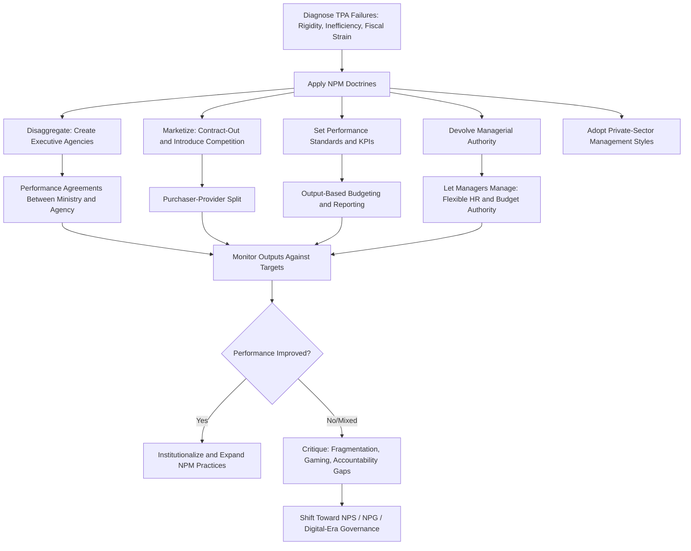

## New Public Management

### Definition and Origins

New Public Management (NPM) is a paradigm of public sector reform that emerged in the late 1970s and gained dominance through the 1980s and 1990s, advocating the application of private-sector management principles, market mechanisms, and results-oriented accountability to the administration of government organizations. NPM arose as a direct response to perceived failures of Traditional Public Administration (TPA) — namely excessive rigidity, inefficiency, unresponsiveness to citizens, and unsustainable fiscal growth — compounded by the fiscal crises of the 1970s oil shocks and the ideological ascendance of neoliberalism and public choice theory.

The term itself was popularized by scholar **Christopher Hood** in his influential 1991 article "A Public Management for All Seasons?", which systematized the disparate reform trends occurring across Anglophone democracies into a coherent theoretical framework.

### Intellectual and Ideological Foundations

NPM draws on several distinct theoretical traditions:

- **Public Choice Theory**: Assumes bureaucrats and politicians, like private actors, are self-interested utility maximizers; informs the view that bureaucracies left unchecked will over-expand (drawing directly on Niskanen's budget-maximization model).
- **Principal-Agent Theory**: Frames the relationship between political principals and bureaucratic agents as one requiring incentive alignment and performance monitoring to overcome information asymmetries.
- **Transaction Cost Economics**: Informs decisions about which government functions should be contracted out versus retained in-house, based on comparative transaction costs.
- **Managerialism**: The belief that management is a generic, transferable skill applicable equally to public and private organizations, and that private-sector management techniques (strategic planning, performance appraisal, total quality management) can improve public sector performance.

### Christopher Hood's Seven Doctrinal Components

Hood's foundational framework identified seven interrelated doctrines characterizing the NPM reform agenda:

**Key Points**

1. **Hands-on professional management** — Active, visible discretionary control by managers at the top of organizations, rather than diffuse, rule-bound administration.
2. **Explicit standards and measures of performance** — Clearly defined goals, targets, and indicators of success, expressed as measurable outputs.
3. **Greater emphasis on output controls** — Resource allocation and rewards linked to measured performance/results, rather than input/process compliance.
4. **Disaggregation of units** — Breaking up large, monolithic public bureaucracies into smaller, more manageable corporatized units organized by product/service lines.
5. **Greater competition** — Introducing rivalry between public agencies and/or between public and private providers through term contracts and competitive tendering.
6. **Private-sector styles of management practice** — Moving away from rigid, military-style public service ethics toward greater flexibility in hiring, rewards, and organizational culture.
7. **Greater discipline and parsimony in resource use** — Cutting direct costs, raising labor discipline, and resisting union demands to "do more with less."

### Core Mechanisms and Tools

**Marketization and Competition**

- **Contracting-out/Outsourcing**: Delegating service delivery to private or nonprofit providers through competitive bidding, while government retains a purchaser/oversight role.
- **Privatization**: Transferring ownership of state-owned enterprises to the private sector entirely.
- **Purchaser-Provider Split**: Separating the function of specifying and funding a service (purchaser) from the function of delivering it (provider), even when both remain within government, to introduce internal market discipline.
- **Voucher Systems**: Providing citizens with vouchers (e.g., for education or housing) redeemable across competing providers, injecting consumer choice into public service allocation.

**Disaggregation and Agencification**

- **Executive Agencies**: Semi-autonomous bodies created to deliver specific services under a performance agreement/framework document, while policy-setting remains with a parent ministry (exemplified by the U.K.'s Next Steps Agencies launched in 1988).
- **Corporatization**: Restructuring public bodies to operate with private-company-like governance (boards, commercial accounting) while remaining publicly owned.

**Performance Management**

- **Key Performance Indicators (KPIs)**: Quantifiable metrics used to assess agency and individual performance against targets.
- **Performance-Based Budgeting**: Allocating budgets based on demonstrated outputs/outcomes rather than historical line-item spending patterns.
- **Performance-Related Pay**: Linking compensation, particularly for senior managers, to measured achievement of targets.

**Customer Orientation**

- **Citizen's Charters**: Formal public commitments specifying service standards citizens can expect (e.g., the U.K.'s Citizen's Charter, 1991), and remedies when standards are unmet.
- **Total Quality Management (TQM)**: A private-sector-derived management philosophy focused on continuous improvement and customer satisfaction, adapted for public service delivery contexts.

### Country Case Studies

| Country | Reform Program | Notable Features |
| --- | --- | --- |
| New Zealand | State Sector Act (1988); Public Finance Act (1989) | Widely regarded as the most comprehensive and theoretically consistent NPM reform globally, applying agency theory rigorously through chief executive performance contracts |
| United Kingdom | Next Steps Agencies (1988); Citizen's Charter (1991); Compulsory Competitive Tendering | Extensive agencification and contracting-out under Thatcher and continued under Major/Blair governments |
| United States | National Performance Review (1993) — "Reinventing Government," led by Vice President Al Gore, drawing on Osborne and Gaebler's influential 1992 book of the same name | Emphasized entrepreneurial government, decentralization, and customer service, though implemented with less structural radicalism than New Zealand or the U.K. |
| Australia | Financial Management Improvement Program; extensive corporatization of government business enterprises | Strong emphasis on devolved financial management authority |

[Inference: the degree and permanence of NPM implementation varies substantially across and even within these countries over time, as subsequent governments have modified, partially reversed, or supplemented these reforms with later paradigms such as Digital-Era Governance.]

### NPM Process Model

### Illustrative Example

**Example**

Consider a national postal service historically run as a government department under TPA principles:

- Under NPM, the postal service is **corporatized** into a state-owned enterprise with its own board and commercial accounting standards.
- **Competition is introduced** by licensing private courier companies to compete on parcel delivery, while the state enterprise retains a "universal service obligation" for basic mail delivery.
- **Performance targets** are set (e.g., percentage of first-class mail delivered within one business day), with public reporting against these targets.
- **Managerial flexibility** is granted: the CEO can now set staff compensation and hire externally, rather than following rigid civil-service pay scales, in exchange for accountability to the board for meeting profitability and service targets.

This illustrates the characteristic NPM sequence: disaggregation → marketization → performance measurement → managerial autonomy in exchange for results-based accountability.

### Critiques and Limitations

**Key Points — Major Critiques**

1. **Fragmentation ("hollowing out of the state")**: Agencification and contracting-out dispersed formerly unified government functions across numerous semi-autonomous bodies and private contractors, undermining coordination on cross-cutting policy problems — a critique that directly motivated the subsequent Digital-Era Governance paradigm's emphasis on "reintegration."
2. **Accountability deficits**: When services are delivered through contracted private providers or arm's-length agencies, it becomes harder for citizens and legislators to identify clear lines of political responsibility for failures — sometimes termed the "accountability gap" or "problem of many hands."
3. **Gaming and goal displacement**: Rigid performance targets create incentives to optimize the measured indicator rather than the underlying service quality (e.g., hospitals prioritizing easily-treated cases to hit waiting-time targets while underserving complex cases) — directly echoing Merton's classical critique of bureaucratic ritualism, now applied to performance metrics rather than procedural rules.
4. **Erosion of public service ethos**: Critics including Denhardt and Denhardt (originators of the New Public Service paradigm) argued NPM's "customer" framing undermines the deeper democratic conception of citizens as rights-bearing participants in self-governance, reducing complex civic relationships to transactional service consumption.
5. **Overestimated market analogies**: Many public goods (national defense, public health, regulatory oversight) lack the competitive market conditions — multiple providers, low switching costs, informed consumer choice — that make private-sector management techniques effective, limiting the applicability of market-based tools.
6. **Transitional and transaction costs**: Contracting-out and competitive tendering processes themselves impose significant administrative costs (tender preparation, contract monitoring, dispute resolution) that can offset anticipated efficiency gains. [Inference: whether net efficiency gains materialize depends heavily on contract design and monitoring capacity, and empirical findings vary across sectors and countries.]

### NPM's Legacy and Successor Paradigms

While few contemporary scholars advocate NPM in its pure 1980s–1990s form, its legacy persists substantially in modern public administration:

- **Performance management and results-based budgeting** remain standard tools across most governments, even where broader marketization has been curtailed.
- **New Public Service (NPS)** emerged explicitly as a normative corrective, reasserting citizenship and public interest values over NPM's market/customer framing.
- **New Public Governance (NPG)** responded to NPM's fragmentation critique by emphasizing collaborative, networked coordination mechanisms.
- **Digital-Era Governance (DEG)** explicitly targeted NPM-induced fragmentation through digitally-enabled reintegration and citizen-needs-based service redesign.

### Relevance to Local Government Reform

In decentralizing and developing-country contexts — including local government units (LGUs) in the Philippines — selective NPM tools remain influential in ongoing public sector modernization efforts, particularly:

- **Performance-based local governance assessment systems** used to evaluate LGU service delivery.
- **Business Process Reengineering (BPR)** initiatives to streamline permitting and licensing, directly reflecting NPM's efficiency and output-orientation.
- **Public-private partnerships (PPPs)** for local infrastructure, reflecting NPM's marketization principle at the subnational level.
- **Digitization of local records and document management systems**, which — while more closely aligned with Digital-Era Governance — often builds on NPM-era efficiency and output-measurement logic as its conceptual foundation.

**Next Steps**

- Study Christopher Hood's original 1991 typology in greater depth alongside subsequent scholarly critiques and refinements.
- Examine New Zealand's comprehensive 1980s NPM reforms as the paradigmatic "hard" NPM case study.
- Compare NPM's performance measurement tools against the New Public Service and New Public Governance alternatives.
- Explore contracting-out and public-private partnership contract design as a specialized area of public procurement and administrative law.

**Related Topics**

- Public Sector Management and Reform (broader paradigm survey)
- Weberian Bureaucracy and its Critics
- New Public Service and New Public Governance
- Performance-Based Budgeting and Results-Based Management
- Public-Private Partnerships in Service Delivery
- Principal-Agent Theory in Public Administration
- Digital-Era Governance and E-Government