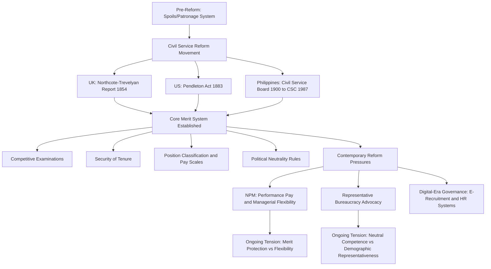

## Civil Service Systems

### Definition and Purpose

A civil service system is the institutionalized framework governing the recruitment, appointment, classification, compensation, promotion, discipline, and separation of career government employees (civil servants) who administer public policy on a non-partisan, professional basis. The core purpose of a civil service system is to ensure **continuity, neutral competence, and professionalism** in public administration independent of the turnover of elected political leadership, while providing safeguards against patronage, corruption, and arbitrary personnel decisions.

Civil service systems operationalize several of the Weberian bureaucratic principles discussed elsewhere in this chapter — particularly merit-based appointment, career orientation, and the separation of the official from ownership of the office — into concrete legal and administrative structures.

### Historical Development

**The Spoils System (Pre-Reform Era)**

Prior to modern civil service reform, many democracies — most notably the 19th-century United States — operated under a **spoils system** (also called the patronage system), in which government jobs were distributed by victorious political parties to loyal supporters, regardless of qualification, following the maxim "to the victor belong the spoils." This system produced significant problems:

- Widespread incompetence and lack of institutional expertise, as officials were replaced wholesale after every election.
- Corruption, as officeholders often extracted personal financial benefit from their positions to recoup campaign contributions or personal investment.
- Political instability in administration, undermining consistent policy implementation.

**Civil Service Reform Movements**

- **United Kingdom — Northcote-Trevelyan Report (1854)**: A landmark reform document recommending open competitive examinations for entry, promotion based on merit, and a unified, professional civil service — establishing the template later emulated globally.
- **United States — Pendleton Civil Service Reform Act (1883)**: Enacted following public outrage after the assassination of President James Garfield by a disappointed office-seeker, this act established the U.S. Civil Service Commission and mandated competitive examinations for an initial (later greatly expanded) category of federal positions, gradually displacing the spoils system.
- **Philippines — Civil Service Act and 1935/1987 Constitutional Provisions**: The Philippine civil service system was formally established under American colonial administration (Public Act No. 5, 1900, creating the Philippine Civil Service Board) and has been continuously developed through subsequent constitutions, with the **1987 Philippine Constitution (Article IX-B)** establishing the **Civil Service Commission (CSC)** as an independent constitutional body responsible for civil service administration.

### Core Principles of Modern Civil Service Systems

**Key Points**

1. **Merit-based recruitment and promotion** — Appointment and advancement based on demonstrated qualifications, competitive examinations, and performance, rather than political affiliation or personal connections.
2. **Political neutrality** — Career civil servants are expected to serve any duly elected government impartially, implementing lawful policy directives regardless of personal political views (often codified through legal restrictions on partisan political activity by civil servants).
3. **Security of tenure** — Protection from arbitrary dismissal, particularly for reasons unrelated to job performance or misconduct, to insulate career officials from political retaliation and enable independent professional judgment.
4. **Position classification and standardized compensation** — Systematic organization of jobs into classes/grades with corresponding salary structures, ensuring equitable pay for comparable work across government.
5. **Due process in discipline and removal** — Formal procedures (charges, hearing, appeal rights) governing disciplinary action, protecting against arbitrary punitive action.
6. **Equal opportunity and non-discrimination** — Prohibitions against discrimination in hiring and promotion based on characteristics unrelated to job qualification.

### Civil Service System Models — Comparative Typology

| Model | Description | Example Countries |
| --- | --- | --- |
| **Career-Based (Closed) System** | Officials enter at junior levels early in their careers and progress through a structured internal hierarchy; lateral entry from outside is limited | France (Grands Corps, ENA/INSP tradition), Japan, Germany |
| **Position-Based (Open) System** | Positions at any level are open to competitive recruitment from both inside and outside government; emphasizes matching specific job qualifications to specific posts | United States, United Kingdom (post-reform), New Zealand |
| **Rank-in-Person System** | Status, rank, and pay are attached to the individual official (based on qualifications, experience) rather than the specific position occupied | Traditional French and German civil service |
| **Rank-in-Position System** | Status, rank, and pay are attached to the specific position/job, with the classification determined by job duties and responsibilities | United States federal General Schedule (GS) system |

[Inference: many contemporary civil service systems, including reformed Anglophone systems, incorporate hybrid features of both career-based and position-based models, and pure typological categorization oversimplifies significant institutional variation across countries.]

### Key Functional Components of a Civil Service System

**Recruitment and Selection**

- **Competitive examinations**: Standardized tests (written, oral, or performance-based) used to assess candidate qualifications objectively.
- **Eligibility lists**: Ranked lists of qualified candidates from which hiring agencies select, often following a "rule of three" or similar mechanism limiting managerial discretion in final selection.

**Position Classification**

- **Job classification systems**: Systematic grouping of positions into classes based on duties, responsibilities, and required qualifications, ensuring "equal pay for equal work" principles.
- **Compensation/pay scales**: Salary structures typically organized into grades and steps, with progression tied to tenure and/or performance.

**Performance Management**

- **Performance appraisal systems**: Periodic, often annual, formal evaluation of employee performance against defined standards, informing promotion, retention, and (in reformed systems) performance-based pay decisions.

**Employee Rights and Discipline**

- **Due process protections**: Formal procedural requirements before adverse personnel actions (suspension, demotion, dismissal) can be taken.
- **Grievance and appeals mechanisms**: Internal or quasi-judicial bodies (e.g., civil service commissions, merit systems protection boards) empowered to review contested personnel decisions.
- **Union/collective bargaining rights**: Varying degrees of civil servant unionization and collective bargaining authority, differing significantly by country and level of government.

**Political Neutrality Safeguards**

- **Hatch Act-type restrictions** (U.S. example): Legal limitations on partisan political activity by career civil servants, such as running for partisan office or actively campaigning while employed in specified categories of federal service.
- **Politically appointed versus career distinction**: Most systems distinguish a relatively small layer of politically appointed senior officials (who change with administrations) from a much larger career civil service that persists across administrations.

### The Philippine Civil Service System — Illustrative National Case

**Example**

The Philippine civil service system, as constitutionally established, provides a concrete illustrative case:

- **Civil Service Commission (CSC)**: An independent constitutional commission (Article IX-B, 1987 Constitution) serving as the central personnel agency of the Philippine government, mandated to establish a career service and adopt measures to promote morale, efficiency, integrity, responsiveness, and courtesy in the civil service.
- **Career and Non-Career Service classification**: Philippine civil service positions are divided into the **Career Service** (entered through competitive examination, security of tenure, opportunity for advancement) and the **Non-Career Service** (includes elective officials, department heads serving at the pleasure of the appointing authority, and contractual/casual employees without security of tenure).
- **Merit and Fitness principle**: Article IX-B explicitly states that appointments in the civil service shall be made only according to merit and fitness, to be determined as far as practicable by competitive examination.
- **Local Government Units (LGUs)**: Civil service principles extend to LGU personnel systems, governing the hiring, classification, and tenure of local government employees — directly relevant to administrative systems such as document management and records administration within LGU bureaucracies, since personnel handling official government records typically fall under career civil service protections and classification standards.

[Inference: specific procedural details of CSC rules, examination requirements, and classification standards are periodically updated through CSC issuances (Memorandum Circulars), and current requirements should be verified against the CSC's official issuances for precise, up-to-date compliance purposes.]

### Civil Service Reform Debates

**Key Points — Contemporary Tensions**

1. **Merit versus managerial flexibility**: Traditional civil service protections (rigid classification, seniority-based promotion, strong tenure protection) can conflict with New Public Management-era demands for managerial flexibility, performance-based pay, and easier termination of underperforming staff.
2. **Political neutrality versus responsiveness**: Strong tenure protections that insulate career officials from political pressure can also make bureaucracies less responsive to the policy priorities of newly elected governments, generating tension between neutral competence and democratic accountability.
3. **Representative bureaucracy**: A body of theory and reform practice concerned with whether the demographic composition of the civil service (gender, ethnicity, regional origin) should reflect the broader population, on the theory that a more representative bureaucracy produces more responsive and legitimate administrative outcomes.
4. **Civil service unionization and collective bargaining**: Debates over the appropriate scope of civil servant unionization, given tensions between employee rights and management's need for operational flexibility, particularly in essential public services.
5. **Performance-based pay adoption**: NPM-influenced reforms in many countries have introduced performance-related pay elements into traditionally seniority-based civil service compensation systems, with mixed empirical results regarding effectiveness and fairness perception. [Inference: the effectiveness of performance-pay schemes in public sector contexts remains contested in the empirical public administration literature, with findings varying by design and implementation context.]

### Comparative Civil Service Reform Diagram

### Civil Service Systems and Public Records/Document Management

Because civil service systems formalize the "separation of official and office" and mandate "management based on written documents" (a core Weberian feature), they are closely intertwined with **institutional records management practices**: personnel actions (appointments, evaluations, disciplinary proceedings, promotions) must themselves be documented, retained, and made available for audit and due-process review. This creates a direct functional link between civil service administration and document/records management systems used within government agencies and local government units — reinforcing why professional recordkeeping and information system integrity are treated as core administrative infrastructure rather than merely clerical support functions.

**Next Steps**

- Study the specific legal framework governing your jurisdiction's civil service commission or personnel authority in greater depth (e.g., Philippine CSC Memorandum Circulars).
- Examine representative bureaucracy theory and its empirical evidence base regarding demographic representation and policy responsiveness.
- Explore performance-based pay system design in public sector human resource management as a specialized subtopic.
- Compare career-based versus position-based civil service models across additional country cases (Germany, Japan, South Korea).

**Related Topics**

- Weberian Bureaucracy and its Critics
- Theories of Bureaucratic Organization
- Public Sector Management and Reform
- New Public Management
- Representative Bureaucracy Theory
- Public Sector Human Resource Management
- Administrative Law and Due Process in Public Employment