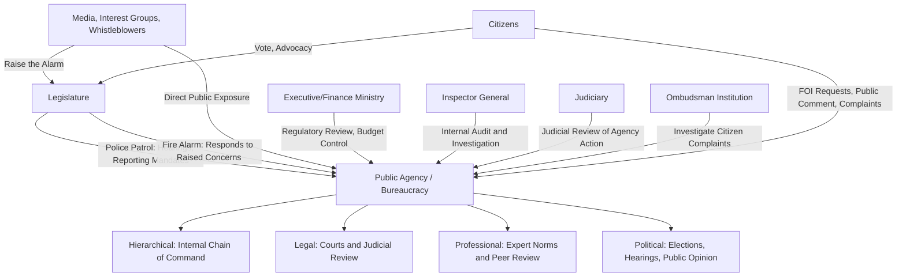

## Bureaucratic Accountability and Oversight

### Definition and Conceptual Significance

Bureaucratic accountability refers to the mechanisms, institutions, and norms through which administrative agencies and officials are held responsible for their decisions, actions, and use of public resources — ensuring that unelected bureaucrats exercising delegated authority remain answerable to democratic principals (legislatures, executives, courts, and ultimately citizens) rather than acting as an unchecked "fourth branch" of government. Oversight refers to the specific institutional mechanisms and processes through which accountability is monitored and enforced.

This topic addresses a foundational tension in democratic governance: bureaucracies require substantial discretion and technical expertise to function effectively, yet that same discretion creates the potential for actions that diverge from democratic mandates, legal constraints, or the public interest — a tension directly connected to the principal-agent problems and street-level discretion issues examined elsewhere in this chapter's bureaucratic theory content.

### Barbara Romzek and Melvin Dubnick's Typology of Accountability

One of the most influential analytical frameworks in public administration, developed by Romzek and Dubnick (1987), identifies **four distinct types of accountability relationships**, distinguished by the source of control (internal or external to the agency) and the degree of control (high or low autonomy granted to the agency):

**Key Points**

1. **Bureaucratic/Hierarchical Accountability** — Internal, high control; based on close supervisory relationships within an organizational hierarchy, relying on rules, standard operating procedures, and direct supervision (the classic Weberian mechanism).
2. **Legal Accountability** — External, high control; based on compliance with externally imposed legal mandates enforced through courts, audits, and formal legal review, emphasizing adherence to law and contractual/statutory obligations.
3. **Professional Accountability** — Internal, low control; relies on the specialized expertise and internalized ethical/professional norms of technically trained officials (e.g., engineers, doctors, scientists) who are granted substantial discretion because their expertise cannot be effectively second-guessed by non-expert supervisors.
4. **Political Accountability** — External, low control; based on responsiveness to the diverse and sometimes competing expectations of multiple external stakeholders (elected officials, interest groups, citizens), operating through elections, legislative hearings, and public opinion rather than direct command.

This typology's central insight is that no single accountability mechanism suffices for all bureaucratic contexts; different institutional designs are appropriate depending on task complexity, the availability of external performance measures, and the degree of specialized expertise required.

### Mechanisms of Legislative Oversight

**Police Patrol versus Fire Alarm Oversight (McCubbins and Schwartz, 1984)**

This influential rational-choice framework distinguishes two contrasting legislative oversight strategies:

- **Police-patrol oversight**: Legislators actively and continuously monitor agency behavior through direct mechanisms such as scheduled hearings, mandatory reporting requirements, and agency audits — analogous to police patrolling a neighborhood regardless of whether a crime has occurred.
- **Fire-alarm oversight**: Legislators rely on third parties (interest groups, media, affected citizens, whistleblowers) to detect and flag agency misconduct or policy deviation, intervening only when an "alarm" is raised — a more decentralized, lower-cost oversight strategy that leverages the monitoring capacity of external stakeholders with direct interest in agency behavior.

McCubbins and Schwartz argued that fire-alarm oversight, despite appearing less rigorous, can be a more efficient allocation of scarce legislative attention, since it shifts monitoring costs onto motivated third parties rather than requiring legislators to expend continuous resources on active surveillance.

**Formal Legislative Oversight Tools**

- **Committee hearings and investigations**: Formal legislative proceedings compelling agency officials to testify regarding policy implementation, spending, or alleged misconduct.
- **Budgetary/appropriations control**: The power of the purse, allowing legislatures to reward or penalize agency behavior through funding levels, earmarks, or conditions attached to appropriations.
- **Confirmation power**: Legislative approval requirements for senior agency appointments, providing leverage over agency leadership selection.
- **Legislative veto mechanisms**: Formal or informal processes allowing legislatures to review and potentially reverse specific agency regulatory actions before they take effect (subject to significant constitutional constraints in some jurisdictions, such as the U.S. Supreme Court's *INS v. Chadha* (1983) ruling limiting the one-house legislative veto).
- **Sunset provisions**: Statutory requirements that an agency or program automatically expires after a specified period unless affirmatively renewed by the legislature, forcing periodic reauthorization review.

### Executive/Administrative Oversight Mechanisms

- **Regulatory review**: Centralized executive review of proposed agency regulations before finalization, often requiring cost-benefit analysis (as in the U.S. Office of Information and Regulatory Affairs' review under Executive Order 12866).
- **Performance management systems**: Executive-branch-wide systems requiring agencies to set and report against performance targets (a legacy tool of the New Public Management reform era).
- **Inspector General offices**: Internal, quasi-independent units embedded within agencies, tasked with auditing agency operations, investigating waste/fraud/abuse, and reporting findings to both agency leadership and the legislature.
- **Central budget/finance ministry review**: Oversight exercised through the annual budget preparation and execution process, requiring agencies to justify resource requests and demonstrate compliance with fiscal regulations.

### Judicial Oversight and Legal Accountability

- **Judicial review of administrative action**: Courts assess whether agency decisions comply with statutory authority, constitutional requirements, and procedural fairness (due process) standards — a core mechanism of "legal accountability" in the Romzek-Dubnick framework.
- **Administrative Procedure Act-type frameworks**: Statutory requirements (exemplified by the U.S. Administrative Procedure Act of 1946) mandating that agencies follow specified procedures (public notice, comment periods, reasoned explanation) when issuing binding rules, enabling subsequent judicial review of procedural compliance.
- **Standing and justiciability doctrines**: Legal rules determining who may bring suit challenging agency action, and which types of agency decisions are subject to judicial review versus committed to agency discretion.
- **Ombudsman institutions**: Independent bodies (found in many democracies, including the Philippine Office of the Ombudsman) empowered to investigate citizen complaints against government agencies and officials, often with authority to recommend or, in some systems, directly impose corrective or disciplinary action.

### Citizen and Societal Oversight Mechanisms

**Key Points**

1. **Freedom of Information (FOI) / Right to Information laws** — Legal frameworks granting citizens and media the right to access government records and information, enabling external monitoring of agency decision-making (in the Philippines, formalized through Executive Order No. 2, s. 2016, on Freedom of Information in the Executive Branch).
2. **Public participation requirements** — Mandated processes (public hearings, comment periods, participatory budgeting) requiring agencies to solicit and consider citizen input before finalizing significant decisions.
3. **Media and investigative journalism** — A core "fire-alarm" mechanism, providing independent scrutiny and public exposure of bureaucratic misconduct or policy failure.
4. **Civil society and interest group monitoring** — Nongovernmental organizations, watchdog groups, and professional associations that specialize in monitoring specific policy domains and raising concerns to legislators, courts, or the public.
5. **Whistleblower protections** — Legal safeguards protecting government employees who report agency misconduct from retaliation, intended to encourage internal disclosure of wrongdoing that might otherwise remain hidden from external oversight bodies.

### Comparative Summary Table

| Accountability Type (Romzek-Dubnick) | Control Source | Control Degree | Primary Mechanism | Example |
| --- | --- | --- | --- | --- |
| Bureaucratic/Hierarchical | Internal | High | Supervisory command, SOPs | Agency chain-of-command review of case decisions |
| Legal | External | High | Courts, audits, statutory compliance | Judicial review of a regulatory rule |
| Professional | Internal | Low | Expert norms, peer review | Medical licensing board self-regulation |
| Political | External | Low | Elections, hearings, public opinion | Legislative committee hearing on agency performance |

### Accountability and Oversight Ecosystem Diagram

### Illustrative Example

**Example**

Consider a national environmental regulatory agency responsible for issuing industrial pollution permits:

- **Hierarchical accountability** operates as senior agency officials review and approve permit decisions made by junior technical staff according to internal standard operating procedures.
- **Legal accountability** operates when an affected community group successfully challenges a permit decision in court, arguing the agency failed to follow mandated public comment procedures under an administrative procedure statute.
- **Professional accountability** operates as the agency's environmental engineers apply technical emission standards based on internalized professional and scientific norms that non-expert political overseers are poorly positioned to directly second-guess.
- **Political accountability** operates when a legislative committee holds a hearing questioning the agency administrator about a controversial permit approval following sustained media coverage and public protest — a clear "fire-alarm" oversight sequence, triggered by civil society mobilization rather than routine legislative monitoring.

This example demonstrates how multiple accountability mechanisms typically operate simultaneously, and sometimes in tension, around a single administrative decision.

### Challenges and Limitations of Bureaucratic Oversight

- **Information asymmetry**: Overseers (legislators, courts, citizens) typically possess far less specialized information than the agencies they oversee, limiting the effectiveness of external scrutiny — the same asymmetry underlying Niskanen's budget-maximization model discussed elsewhere in this chapter.
- **Oversight overload and selective attention**: Legislatures and executives have finite time and political capital, meaning oversight attention is often concentrated on high-salience controversies while routine agency operations receive minimal scrutiny.
- **Regulatory/agency capture**: Agencies may become unduly influenced by the very industries or interest groups they are meant to regulate, undermining the intended direction of accountability (a concern closely associated with, though analytically distinct from, weak oversight).
- **Multiple accountabilities disorder**: A concept describing the dysfunction that can arise when agencies face conflicting demands from multiple accountability relationships simultaneously (e.g., legal compliance requirements conflicting with political demands for rapid results), potentially producing paralysis or strategic gaming of competing overseers. [Inference: the severity and frequency of "multiple accountabilities disorder" as an empirical phenomenon is debated in the literature and likely varies significantly by policy sector and institutional context.]
- **Accountability gaps in networked/contracted governance**: As discussed in New Public Management critiques, when services are delivered through contracted private providers or semi-autonomous agencies, tracing clear lines of accountability for service failures becomes significantly more difficult — the "problem of many hands."

### Application to Local Government and Records/Document Management Contexts

Bureaucratic accountability mechanisms depend heavily on the existence of reliable, accessible **documentary evidence** of agency decision-making — a direct link to institutional records and document management systems:

- **Audit trails**: Legal and hierarchical accountability mechanisms (court review, internal audit) require documented records of how and why decisions were made, making systematic document retention a precondition for effective oversight.
- **Freedom of Information compliance**: Citizen oversight through FOI/Right-to-Information requests depends entirely on agencies maintaining organized, retrievable records systems capable of responding to information requests within legally mandated timeframes.
- **Local government transparency portals**: Many local government units, in response to national transparency mandates (such as the Philippine Full Disclosure Policy for LGUs, requiring posting of budgets, expenditures, and procurement information), rely on structured document management infrastructure to fulfill accountability obligations efficiently.

This underscores why administrative information systems — including document management systems used within local government units — function not merely as operational efficiency tools, but as foundational infrastructure for democratic accountability itself.

**Next Steps**

- Study the Romzek-Dubnick accountability typology in greater depth alongside subsequent scholarly refinements and critiques.
- Examine regulatory/agency capture theory as a distinct but related phenomenon affecting oversight effectiveness.
- Explore Freedom of Information and Right-to-Information legal frameworks comparatively across jurisdictions.
- Investigate the specific oversight architecture of a chosen national or local government context (e.g., Philippine Commission on Audit, Office of the Ombudsman, and Sanggunian oversight of LGU executives).

**Related Topics**

- Theories of Bureaucratic Organization
- Weberian Bureaucracy and its Critics
- Principal-Agent Theory in Public Administration
- Regulatory/Agency Capture Theory
- Freedom of Information and Government Transparency
- Public Sector Management and Reform
- Administrative Law and Judicial Review of Agency Action