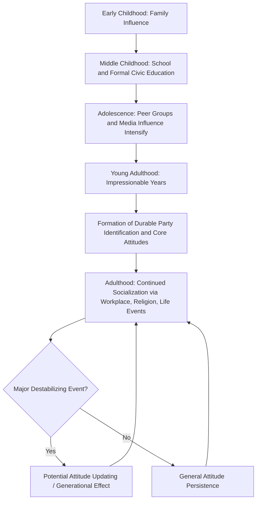

## Political Socialization

### Definition and Conceptual Foundations

Political socialization is the lifelong developmental process through which individuals acquire their political beliefs, values, attitudes, knowledge, and behavioral orientations toward the political system in which they live. It is the primary mechanism through which a society's political culture — its shared norms about legitimate authority, civic participation, and the relationship between citizen and state — is transmitted across generations, ensuring both continuity and gradual change in political systems over time.

The concept draws heavily from developmental psychology and sociology, treating political orientations not as innate but as learned through cumulative exposure to family, institutions, and social experience beginning in early childhood and continuing throughout adulthood.

### Theoretical Origins

Political socialization emerged as a distinct field of systematic study in the 1950s and 1960s, closely associated with the behavioral revolution in political science. Key foundational works include:

- **Herbert Hyman's *Political Socialization*** (1959) — Often credited with coining and popularizing the term, framing political learning as analogous to broader processes of social learning studied in sociology.
- **David Easton and Jack Dennis's *Children in the Political System*** (1969) — Applied systems theory to political socialization, examining how children develop diffuse support for political authority and institutions well before they develop specific policy opinions, arguing this early-formed generalized system support is crucial for long-term political stability.
- **Fred Greenstein's *Children and Politics*** (1965) — Documented the developmental sequence of children's political cognition, including early idealization of political authority figures (e.g., the president) that becomes more critical and differentiated with age.

### Agents of Political Socialization

**Key Points**

1. **Family** — Widely considered the most influential agent, particularly during early childhood; party identification and basic political orientations transmitted through family are among the most durable political attitudes, often persisting (with some attenuation) into adulthood.
2. **Education System** — Schools transmit formal civic knowledge (constitutional structure, history, rights and responsibilities of citizenship) and also socialize students into norms of authority, rule-following, and civic participation through the school's institutional structure itself, not just its curriculum.
3. **Peer Groups** — Gain increasing influence during adolescence and young adulthood, particularly in shaping social and cultural attitudes that intersect with political views.
4. **Mass Media** — Serves as a primary source of political information for most adults, shapes political agendas (agenda-setting), and increasingly interacts with social media as a distinct socializing force, particularly among younger cohorts.
5. **Religious Institutions** — Transmit moral and value frameworks that frequently correlate with political attitudes on a range of issues, and in many societies serve as sites of political mobilization and community-based political discussion.
6. **Significant Political Events** — Major historical events (wars, economic crises, social movements, regime transitions) experienced during formative years can produce lasting "generational effects" on political orientation, distinct from the gradual socialization processes of ordinary institutional agents.
7. **Workplace and Adult Institutions** — Continue socialization into adulthood through occupational associations, labor unions, and professional experience, reflecting the recognition that political socialization does not end with adolescence.

### Life-Cycle Stages of Political Socialization

| Stage | Approximate Age Range | Key Developments |
| --- | --- | --- |
| Early Childhood | 3–7 years | Emotional attachment to political symbols (flag, national anthem); idealized, personalized view of authority figures |
| Middle Childhood | 7–12 years | Growing awareness of political institutions beyond individual leaders; beginning differentiation between roles and office-holders |
| Adolescence | 13–18 years | Development of more abstract political concepts; increasing capacity for critical evaluation of authority; peer and media influence intensifies |
| Young Adulthood | 18–25 years | Often considered the "impressionable years" in political socialization theory; formation of durable party identification and core political attitudes; first voting experiences |
| Adulthood | 25+ years | Continued but generally more gradual attitude change; political orientations become more stable ("persistence" hypothesis), though major life events or historical shocks can still produce updating |

### The "Impressionable Years" Hypothesis

A central theoretical claim in political socialization research holds that individuals are most susceptible to lasting political attitude formation during **late adolescence and early adulthood** (roughly ages 18–25), after which political attitudes — particularly party identification — tend to stabilize and become increasingly resistant to change (the **persistence hypothesis**). This framework helps explain **generational or cohort effects**: individuals who come of political age during a shared formative period (e.g., the Great Depression, the Vietnam War era, the 2008 financial crisis) often display distinctive and durable political orientations shared across their birth cohort, distinguishable from both older and younger cohorts.

[Inference: the precise boundaries and universality of the "impressionable years" window remain subjects of ongoing empirical refinement, and some research suggests continued attitude malleability well into later adulthood under certain conditions, such as major destabilizing events.]

### Political Socialization Process Diagram

### Types of Political Socialization Outcomes

**Diffuse versus Specific Support**

Drawing on David Easton's systems theory, political socialization scholars distinguish:

- **Diffuse support**: General, foundational legitimacy attributed to the political system and its institutions as a whole, largely independent of satisfaction with any specific policy outcome or officeholder — theorized to develop early in childhood and provide crucial systemic stability.
- **Specific support**: Evaluations tied to particular policies, officials, or short-term government performance, which fluctuate more readily based on immediate political and economic conditions.

**Cognitive, Affective, and Evaluative Dimensions**

- **Cognitive orientation**: Factual knowledge about political institutions, processes, and actors.
- **Affective orientation**: Emotional attachment or aversion toward political symbols, institutions, and figures.
- **Evaluative orientation**: Judgments and opinions about the performance, legitimacy, or desirability of political arrangements.

### Comparative and Cross-National Variation

Political socialization processes and outcomes vary substantially across political systems:

- **Regime type**: Authoritarian regimes often deploy formal civic education and state-controlled media more deliberately as instruments of political socialization aimed at reinforcing regime legitimacy, compared to more pluralistic socialization environments in liberal democracies.
- **Political culture transmission**: Societies with strong civic culture traditions (per Almond and Verba's classic comparative work) tend to exhibit more consistent intergenerational transmission of participatory norms and institutional trust.
- **Ethnic, religious, and regional cleavages**: In societies with salient sub-national identity cleavages, political socialization often occurs distinctly within different community/identity groups, contributing to persistent group-based differences in political attitudes and party alignment.
- **Post-conflict and transitional societies**: Political socialization processes in societies undergoing democratic transition or post-conflict recovery face distinctive challenges, as formative political memories may include experiences of authoritarianism, conflict, or institutional breakdown that shape subsequent generations' political trust and participation patterns. [Inference: the long-term effects of conflict-era political socialization on subsequent democratic consolidation remain an active area of comparative political science research without fully settled conclusions.]

### Illustrative Example

**Example**

Consider two individuals born in the same country twenty years apart:

- **Person A**, born during a period of sustained economic prosperity and stable democratic governance, experiences their "impressionable years" (ages 18–25) during a period of institutional trust and civic normalcy — political socialization theory would predict comparatively higher baseline institutional trust and more conventional participatory orientations persisting into their adult political identity.
- **Person B**, born twenty years later, experiences their impressionable years during a severe economic crisis accompanied by a major corruption scandal implicating national leadership — political socialization theory predicts this cohort may develop a durable "generational effect" of heightened political cynicism or support for anti-establishment political movements, distinguishable from both older and younger cohorts who did not share this formative experience.

This illustrates how political socialization theory explains not just individual attitude formation, but broader patterns of generational political cleavage observable in survey research and electoral behavior across many democracies.

### Contemporary Developments and Debates

- **Social media and digital socialization**: The rise of social media platforms as a primary information source for younger cohorts represents a significant and still-evolving disruption to traditional agent hierarchies (family, school, traditional media), with implications for political polarization, misinformation exposure, and civic engagement patterns that remain subjects of active empirical research. [Inference: given the rapid pace of platform and algorithmic change, specific claims about social media's socialization effects should be treated as provisional rather than settled, and current research should be consulted for up-to-date findings.]
- **Formal civic education policy debates**: Ongoing policy discussions in many countries concern the appropriate content, mandatory status, and pedagogical approach of formal civics/citizenship education curricula as a deliberate instrument of political socialization.
- **Political socialization and democratic backsliding**: Scholars increasingly examine whether weakening diffuse institutional support among younger cohorts — potentially linked to shifting socialization patterns — contributes to broader patterns of democratic erosion observed in some established democracies.
- **Intergenerational political conflict**: Growing scholarly and public attention to divergence in political attitudes (e.g., on climate policy, social issues) between socialization-distinct generational cohorts, and its implications for democratic coalition-building and policy formation.

**Next Steps**

- Study David Easton's systems theory framework in greater depth to understand the diffuse/specific support distinction underlying much socialization research.
- Examine Almond and Verba's comparative civic culture research as a complementary framework linking individual socialization to national political culture patterns.
- Explore generational/cohort effect methodology in political behavior research, including its distinction from life-cycle and period effects.
- Investigate contemporary research on social media's role in political socialization among younger cohorts.

**Related Topics**

- Political Culture (Almond and Verba's Civic Culture Framework)
- Political Participation and Voting Behavior
- Party Identification Theory
- Public Opinion Formation and Measurement
- Generational/Cohort Effects in Political Behavior
- Political Psychology and Authority Orientation
- Civic Education Policy