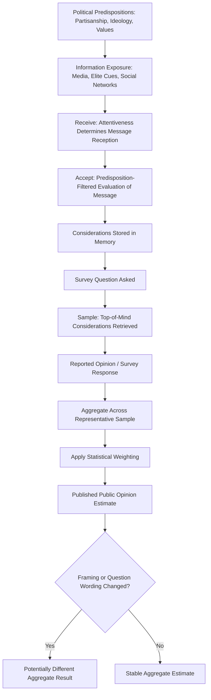

## Formation and Measurement of Public Opinion

### Definition and Conceptual Foundations

Public opinion refers to the aggregate distribution of individual attitudes, preferences, and evaluations held by a population regarding political issues, leaders, institutions, and policies. The study of public opinion in political science encompasses two analytically distinct but interrelated concerns: **formation** — the psychological, social, and informational processes through which individuals develop political attitudes — and **measurement** — the methodological techniques used to systematically capture, quantify, and analyze those attitudes at the population level.

Public opinion research sits at the intersection of political psychology, sociology, statistics, and democratic theory, since the very legitimacy of democratic governance rests partly on claims about government responsiveness to citizen preferences, making accurate opinion measurement a matter of significant political consequence.

### Theoretical Models of Opinion Formation

**Key Points — Major Formation Frameworks**

1. **Rational Choice / Bayesian Updating Model** — Assumes individuals form opinions by rationally processing available information relative to their pre-existing preferences and updating beliefs incrementally as new information arrives, though this model has been substantially qualified by behavioral research showing systematic deviations from strict rationality.
2. **Low-Information Rationality / Heuristics Model** (associated with Samuel Popkin and others) — Argues that most citizens, lacking time or incentive to become fully informed, rely on cognitive shortcuts ("heuristics") such as party cues, endorsements from trusted sources, or candidate likability to form "good enough" political judgments without extensive information processing.
3. **Online Processing Model** (associated with Milton Lodge) — Proposes that individuals continuously update a running affective evaluation ("tally") of political objects (candidates, parties) as new information is encountered, often retaining the summary evaluation while forgetting the specific information that produced it.
4. **Motivated Reasoning Model** — Argues that individuals process political information in a manner biased toward confirming pre-existing beliefs and identities (particularly partisan identity), actively resisting or counter-arguing against attitude-inconsistent information rather than processing it neutrally.
5. **Elite Cue-Taking Model** (associated with John Zaller's *The Nature and Origins of Mass Opinion*, 1992) — Proposes that most citizens' opinions on unfamiliar or complex issues are substantially shaped by the cues and framing provided by trusted political elites (party leaders, pundits, media commentators) rather than independent issue analysis.

### John Zaller's Receive-Accept-Sample (RAS) Model

Zaller's influential RAS model provides a comprehensive account of how political predispositions interact with information exposure to produce survey responses:

- **Receive**: The individual must first be exposed to relevant political information or elite messaging (attentiveness to politics strongly predicts differential rates of message reception).
- **Accept**: The individual evaluates and potentially accepts the received message, filtered through pre-existing political predispositions (partisanship, ideology) that make some messages more persuasive than others.
- **Sample**: When asked for an opinion (e.g., in a survey), individuals sample from the mix of considerations currently accessible in memory — meaning survey responses reflect a probabilistic sampling of top-of-mind considerations rather than a fixed, stable underlying attitude.

A key implication of the RAS model is that public opinion, especially on unfamiliar issues, may exhibit considerable **instability and context-sensitivity** — the same individual might report different opinions depending on which considerations happen to be salient at the moment of measurement, a phenomenon closely related to **framing effects**.

### Key Concepts in Opinion Formation

- **Framing effects**: The way an issue is presented (its "frame") can significantly influence which considerations become salient and thus which opinion is expressed, even when the substantive facts presented remain constant.
- **Priming**: Media and elite communication can influence which criteria the public uses to evaluate political leaders or issues, by making certain considerations more cognitively accessible.
- **Agenda-setting**: Media coverage patterns influence which issues the public considers important, shaping the overall political agenda even without directly telling people what to think about those issues (associated with McCombs and Shaw's foundational research).
- **Spiral of silence** (Elisabeth Noelle-Neumann): A theory proposing that individuals who perceive their opinion to be in the minority become less willing to express it publicly, for fear of social isolation, potentially producing a self-reinforcing dynamic in which perceived minority views are increasingly suppressed from public discourse.
- **Motivated reasoning and identity-protective cognition**: Political and cultural identities (partisan, ideological, group-based) shape not just opinion content but the very process of evaluating evidence, often leading to polarized interpretations of identical factual information across group lines.

### Public Opinion Measurement — Survey Research Fundamentals

**Sampling Methodology**

- **Probability sampling**: The gold standard for representative public opinion measurement, requiring that every member of the target population have a known, non-zero probability of selection — enabling valid statistical inference to the broader population.
- **Random sampling techniques**: Include simple random sampling, stratified sampling (dividing the population into subgroups and sampling within each to ensure representation), and cluster sampling (sampling naturally occurring groups, useful for geographically dispersed populations).
- **Non-probability sampling**: Includes convenience sampling, quota sampling, and opt-in online panels; while often faster and less costly, these methods carry greater risk of unrepresentative bias unless carefully weighted and validated against known population benchmarks.

**Sample Size and Margin of Error**

The relationship between sample size and precision follows standard statistical sampling theory. For a simple random sample estimating a population proportion, the margin of error at a 95% confidence level is approximately:

$$MOE \approx 1.96 \times \sqrt{\frac{p(1-p)}{n}}$$

Where $p$ is the estimated proportion and $n$ is the sample size. A commonly cited illustrative example: a sample of approximately $n=1000$ respondents typically yields a margin of error of roughly ±3 percentage points for proportions near 50%, which is why this sample size is a frequently used industry benchmark for national opinion polls. [Inference: actual margins of error in practice are also affected by design effects from stratification/weighting and are typically larger than the simple random sampling formula suggests; reputable polling organizations report design-adjusted margins where methodologically appropriate.]

**Survey Modes**

| Mode | Description | Key Trade-offs |
| --- | --- | --- |
| In-person/face-to-face | Interviewer conducts survey in person | High response quality and rapport; high cost; declining use in many contexts |
| Telephone (live interviewer) | Interviewer conducts survey by phone | Historically dominant mode; facing declining response rates due to caller ID screening and cell-phone-only households |
| Interactive Voice Response (IVR/robopoll) | Automated phone survey without live interviewer | Lower cost; legal restrictions on calling cell phones in some jurisdictions; concerns about respondent screening |
| Online panel | Web-based survey administered to recruited or opt-in panel | Cost-effective and scalable; representativeness depends heavily on panel recruitment and weighting methodology |
| Mixed-mode | Combination of multiple modes within a single study | Can improve coverage and reduce mode-specific bias, but introduces mode-effect complexity in analysis |

### Question Design and Measurement Validity

**Key Points — Common Sources of Measurement Error**

1. **Question wording effects**: Subtle changes in phrasing can substantially shift response distributions, particularly on emotionally or politically charged topics (a well-documented phenomenon in survey methodology research).
2. **Question order effects**: The sequence in which questions are presented can prime particular considerations, affecting responses to subsequent questions.
3. **Response option framing**: The specific choices offered (e.g., balanced versus one-sided response scales, inclusion/exclusion of a "don't know" option) shape the distribution of recorded responses.
4. **Social desirability bias**: Respondents may misreport attitudes or behaviors perceived as socially unacceptable (e.g., on sensitive topics such as prejudice or controversial policy positions), leading survey researchers to employ techniques such as list experiments or randomized response methods to mitigate this bias.
5. **Non-response bias**: Systematic differences between those who respond to a survey and those who do not can bias results even with an initially well-designed probability sample, requiring weighting adjustments based on known demographic benchmarks.
6. **Acquiescence bias**: A general tendency for some respondents to agree with statements regardless of content, which can be mitigated through balanced question design (including both agree- and disagree-worded items).

### Weighting and Statistical Adjustment

Because achieved survey samples rarely perfectly match the true population distribution across key demographics (age, gender, education, region, party identification), pollsters apply **statistical weighting** to adjust the sample to match known population benchmarks (typically derived from census data or large government surveys), improving the representativeness of aggregate estimates. Common weighting approaches include:

- **Raking (iterative proportional fitting)**: Adjusting weights iteratively across multiple demographic dimensions simultaneously until the weighted sample matches target population margins.
- **Post-stratification**: Dividing the sample into cells based on combinations of demographic characteristics and weighting each cell to match known population proportions.

[Inference: the specific weighting variables and methodology used vary across polling organizations and are not always fully disclosed, which has been a subject of methodological debate, particularly following polling errors in several high-profile elections in the 2010s and 2020s.]

### Public Opinion Formation and Measurement Process Diagram

### Illustrative Example

**Example**

Consider two differently worded survey questions on the same underlying policy issue — government assistance to low-income families:

- **Question A**: "Do you support government spending on welfare programs?"
- **Question B**: "Do you support government spending on assistance to poor families?"

Despite referencing substantively similar policy content, empirical survey methodology research has repeatedly found that the term "welfare" evokes more negative connotations in some national contexts than more neutral phrasings like "assistance to the poor," producing systematically different aggregate support levels between the two question wordings. This illustrates the RAS model's prediction that survey responses reflect currently accessible considerations (in this case, framing-activated associations) rather than a single fixed underlying preference — and demonstrates why careful, validated question wording is a central methodological concern in public opinion research, not a minor technical detail.

### Aggregate versus Individual-Level Opinion Analysis

- **Aggregate stability despite individual instability**: A key insight from public opinion research (notably associated with Benjamin Page and Robert Shapiro's work on the "rational public") is that while individual-level opinion can be unstable and context-sensitive (as the RAS model predicts), aggregate public opinion often displays meaningful stability and responds coherently to major events and information flows — suggesting that random individual-level noise can average out at the population level even when individual attitudes are poorly formed. [Inference: the degree to which aggregate opinion stability reflects genuine collective rationality versus other statistical artifacts remains a subject of ongoing scholarly debate.]
- **Opinion polarization measurement**: Distinguishing between **mass polarization** (increasing divergence in the distribution of ordinary citizens' opinions) and **elite/party polarization** (increasing ideological distance between party elites and activists) is a critical methodological distinction, since evidence suggests these two forms of polarization have not necessarily moved in lockstep in all political systems studied.

### Contemporary Challenges in Public Opinion Measurement

- **Declining survey response rates**: Response rates for traditional telephone surveys have declined substantially over recent decades across many countries, increasing reliance on online panels and raising ongoing methodological questions about representativeness.
- **Polling errors in recent elections**: Several high-profile electoral polling misses (in various countries during the 2010s and 2020s) have prompted extensive methodological review regarding non-response bias, "shy voter" effects, and weighting methodology adequacy. [Inference: the specific causes of any given polling miss are typically debated among methodologists and often involve multiple contributing factors rather than a single identified cause; current post-election methodological reviews should be consulted for case-specific findings.]
- **Social media as an (unreliable) opinion proxy**: The volume and sentiment of social media discussion is sometimes informally treated as a public opinion indicator, but methodologically this is considered highly unreliable due to unrepresentative user demographics, bot activity, and algorithmic amplification effects, and is not considered a valid substitute for probability-based survey research by opinion research professionals.
- **Artificial intelligence and survey research**: The application of large language models and automated tools in survey design, open-ended response analysis, and synthetic respondent simulation is an actively developing methodological frontier. [Inference: given the rapid pace of development in this specific area, current best-practice guidance from professional survey research associations should be consulted rather than relying on any fixed characterization of the state of the field.]

**Next Steps**

- Study John Zaller's RAS model in its original full formulation to understand the broader theoretical architecture linking political awareness to opinion instability.
- Examine survey question design methodology in greater depth, including split-ballot experimental techniques used to detect wording and framing effects.
- Explore statistical weighting methodology (raking, post-stratification) as a technical subfield of survey research.
- Investigate mass versus elite polarization measurement debates in contemporary American and comparative politics literature.

**Related Topics**

- Political Socialization
- Political Culture and Civic Attitudes
- Voting Behavior and Electoral Choice Models
- Media Effects: Agenda-Setting, Priming, and Framing
- Political Polarization (Mass and Elite)
- Survey Research Methodology and Sampling Theory
- Political Psychology and Motivated Reasoning