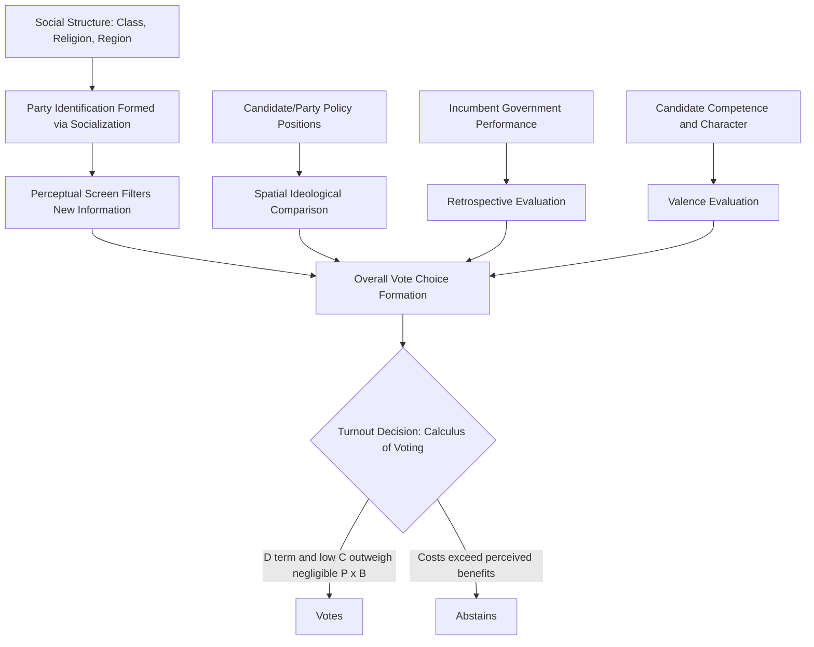

## Voting Behavior and Electoral Choice

### Definition and Scope

Voting behavior and electoral choice is the subfield of political science concerned with explaining why citizens vote (or abstain), and why they choose one candidate, party, or policy option over another. It integrates insights from political psychology, sociology, and economics to model the individual-level and aggregate-level determinants of electoral participation and vote choice, forming a core empirical foundation for understanding democratic representation and political behavior more broadly.

### The Turnout Puzzle — Why People Vote

**The Paradox of Voting (Rational Choice Framework)**

Classical rational choice theory, applied to voting by Anthony Downs (1957) and formalized by William Riker and Peter Ordeshook (1968), presents a foundational puzzle: since any single vote has an infinitesimally small probability of determining an election outcome, the expected instrumental benefit of voting is vanishingly small, and yet substantial proportions of eligible citizens vote in most democracies. This is often expressed through the **calculus of voting** equation:

$$R = (P \times B) - C + D$$

Where:

- $R$ = the net reward/incentive to vote
- $P$ = the probability that one's vote will be decisive
- $B$ = the perceived benefit of one's preferred outcome winning
- $C$ = the costs of voting (time, information-gathering, registration effort)
- $D$ = a residual term capturing non-instrumental benefits (civic duty, social pressure, expressive satisfaction from participating)

Because $P$ is typically extremely small in any large electorate, the $D$ term — capturing **civic duty** and expressive/psychological benefits independent of actually influencing the outcome — has become central to explaining observed turnout levels, since the pure $P \times B$ instrumental calculation alone predicts turnout should be near zero. [Inference: the relative theoretical and empirical weight assigned to the $D$ term versus alternative explanations (social pressure, mobilization) remains debated among voting behavior scholars.]

### Major Theoretical Models of Vote Choice

**Key Points — Three Classical Schools**

1. **Columbia School (Sociological Model)** — Associated with Paul Lazarsfeld and colleagues' *The People's Choice* (1944), this model emphasizes that vote choice is substantially predetermined by an individual's social group memberships — socioeconomic status, religion, and place of residence — with the famous summary formulation that "a person thinks, politically, as he is, socially." Political campaigns, in this view, primarily *reinforce* existing predispositions rather than persuade or convert voters.
2. **Michigan School (Social-Psychological / Party Identification Model)** — Associated with Angus Campbell, Philip Converse, Warren Miller, and Donald Stokes's *The American Voter* (1960), this model centers **party identification** as a stable, early-acquired psychological attachment (often described as analogous to a social identity or "running tally") that serves as the primary lens through which voters interpret candidates, issues, and events — famously depicted through the "funnel of causality," in which distal social/psychological factors (party ID) causally precede and shape more proximate factors (candidate evaluation, issue positions) that directly determine vote choice.
3. **Rational Choice / Downsian Spatial Model** — Associated with Anthony Downs's *An Economic Theory of Democracy* (1957), this model treats voters as rational actors who evaluate candidates/parties based on their policy positions relative to the voter's own ideological position in a spatial (typically left-right) policy space, voting for whichever option is "closest" to their own preferences — providing the theoretical foundation for the **median voter theorem**.

### The Funnel of Causality (Michigan Model)

The Michigan School's funnel of causality conceptualizes vote choice as the outcome of a temporally ordered causal sequence, moving from broad, distal, stable factors toward narrow, proximate, immediate factors:

Party identification, in this model, functions as a stable "perceptual screen" that filters how voters interpret subsequent, more immediate political information — meaning strong partisans are more likely to interpret ambiguous political events in ways favorable to their party, a mechanism closely related to motivated reasoning research in political psychology.

### The Downsian Spatial Model and Median Voter Theorem

Downs's spatial model represents political competition as occurring along one or more policy dimensions (most simply, a single left-right ideological continuum), with voters supporting the candidate/party positioned closest to their own ideal point. A key derived proposition is the **median voter theorem**: under simplifying assumptions (single-peaked preferences, single policy dimension, two-candidate competition), rational vote-maximizing candidates in a plurality electoral system will converge toward the position of the **median voter** — the voter positioned at the exact midpoint of the ideological distribution — since this position maximizes electoral support.

**Key Points — Important Caveats to the Median Voter Theorem**

- The theorem's convergence prediction weakens substantially under multi-party competition, proportional representation electoral systems, or multidimensional policy spaces.
- Empirical candidate/party positioning frequently diverges from strict median convergence due to primary election dynamics, activist/donor influence, and the need to maintain a distinct party "brand" across election cycles.
- Valence issues (universally agreed-upon goals, such as economic competence or honesty, where voters do not disagree on the desired outcome but only on which candidate can best deliver it) operate differently from strictly positional spatial competition.

### Retrospective versus Prospective Voting

- **Retrospective voting** (associated with V.O. Key Jr.'s influential formulation that "voters are not fools"): Voters evaluate incumbents primarily based on past government performance (particularly economic conditions) rather than detailed prospective policy platforms, using performance as a relatively low-information but effective heuristic for holding governments accountable.
- **Prospective voting**: Voters evaluate candidates based on their proposed future policies and platforms, requiring greater information-processing capacity but more directly aligning with normative democratic theory's emphasis on policy mandate and representation.
- **Economic voting theory**: A prominent application of retrospective voting theory, finding robust cross-national evidence that incumbent electoral fortunes are significantly influenced by macroeconomic performance (particularly unemployment, inflation, and GDP growth) during the period preceding an election. [Inference: the specific magnitude of economic effects on vote choice varies across country contexts, election types, and time periods studied, and should not be treated as a fixed universal coefficient.]

### Additional Explanatory Frameworks

**Issue Voting and Salience**

Voters may prioritize specific issues they consider personally important ("issue salience"), meaning candidates' overall vote share can depend heavily on which issues become dominant in public discourse during a campaign — connecting directly to agenda-setting and priming effects discussed in public opinion research.

**Candidate Evaluation / Valence Politics**

Beyond ideological positioning, voters evaluate candidates on perceived competence, integrity, leadership qualities, and likability — dimensions that do not map onto a left-right policy spectrum but significantly influence vote choice, particularly in personalized or candidate-centered electoral systems.

**Social Identity and Group-Based Voting**

Building on and extending the Columbia School's sociological insights, contemporary research emphasizes how social identities (race, ethnicity, religion, gender, urban/rural residence, education) continue to structure vote choice, sometimes operating through **social identity theory** mechanisms wherein partisan attachment itself functions as a social identity comparable to other group memberships, shaping not just policy views but affective orientations toward opposing partisans ("affective polarization").

### Comparative Summary of Vote Choice Models

| Model | Primary Driver of Vote Choice | Key Scholars | Core Metaphor |
| --- | --- | --- | --- |
| Columbia (Sociological) | Social group membership | Lazarsfeld, Berelson, Gaudet | "Politics is group-based" |
| Michigan (Social-Psychological) | Party identification | Campbell, Converse, Miller, Stokes | "Funnel of causality" |
| Downsian (Rational Choice/Spatial) | Ideological/policy proximity | Anthony Downs | "Voters as spatial optimizers" |
| Retrospective/Economic Voting | Past government performance | V.O. Key Jr., Morris Fiorina | "Voters as performance evaluators" |
| Valence Politics | Candidate competence/character | Donald Stokes | "Voters as competence assessors" |

### Turnout Determinants Beyond the Rational Choice Calculus

**Key Points — Institutional and Contextual Factors**

1. **Voter registration systems**: Automatic or same-day registration systems tend to be associated with higher turnout compared to systems requiring advance, voter-initiated registration, by reducing the "cost" (C) term in the calculus of voting.
2. **Compulsory voting laws**: Countries with legally mandated voting (with varying enforcement) tend to exhibit substantially higher turnout, most notably documented in cases such as Australia and Belgium.
3. **Electoral competitiveness**: Closer elections tend to increase perceived stakes and (in some models) perceived probability of decisiveness ($P$), correlating with higher turnout.
4. **Mobilization efforts**: Direct voter contact by campaigns, parties, and civil society organizations (canvassing, phone-banking) has been robustly shown in field-experimental research to causally increase turnout among contacted individuals.
5. **Socioeconomic status**: Higher education and income levels are consistently associated with higher turnout probability across many democracies, a pattern sometimes termed the "socioeconomic status model" of participation, linked to greater civic skills, resources, and political efficacy.
6. **Age and life-cycle effects**: Turnout typically rises through early-to-middle adulthood before stabilizing or gradually declining in advanced old age, reflecting the accumulation of civic integration (homeownership, community ties, stable residence) associated with mid-life stages.

### Illustrative Example

**Example**

Consider a mayoral election in a mid-sized city with two candidates who hold nearly identical policy positions on local infrastructure but differ sharply in party affiliation and perceived competence:

- Under the **Michigan model**, a voter with strong pre-existing party identification is likely to support the co-partisan candidate regardless of the minor policy convergence, interpreting ambiguous campaign claims in a manner favorable to their preferred party.
- Under the **Downsian spatial model**, since both candidates occupy nearly identical policy positions, the model would predict the election should be close to a toss-up based on ideology alone — requiring the analyst to invoke valence factors (perceived competence, scandal history) to explain any decisive outcome.
- Under **retrospective voting theory**, if the incumbent overtly presided over a period of poor municipal service delivery (e.g., visible infrastructure failures), voters would be expected to penalize the incumbent's party at the polls regardless of the challenger's specific prospective policy platform.
- Under the **calculus of voting framework**, a citizen who is only mildly interested in local politics might still turn out to vote due to a strong internalized sense of civic duty ($D$ term), even while recognizing their individual vote has a negligible probability of being decisive ($P$ term).

This example illustrates how different theoretical models emphasize different causal mechanisms that can operate simultaneously within a single electoral contest.

### Voter Behavior Process Diagram

### Comparative and Institutional Considerations

- **Electoral system effects**: Proportional representation systems tend to produce different vote-choice dynamics than plurality/majoritarian systems, since PR systems typically feature multi-party competition reducing the direct applicability of simple two-candidate spatial models, and often exhibit higher turnout linked to greater proportionality between vote share and seat share (reducing "wasted vote" perceptions).
- **Personalization versus party-centered systems**: Political systems vary in the degree to which electoral choice centers on individual candidates (as in most U.S. elections) versus party lists (as in many European proportional systems), affecting the relative weight of candidate valence versus party identification in vote choice models.
- **Developing democracy contexts**: In many developing and transitional democracies — including subnational elections in contexts such as the Philippines — clientelism, patron-client networks, and local personalistic political machines can operate alongside or in tension with the sociological, psychological, and rational-choice models developed primarily in established Western democracies, requiring context-sensitive theoretical adaptation. [Inference: the relative explanatory weight of clientelistic versus programmatic voting models varies substantially by country, election level, and specific local political context, and generalized claims should be treated cautiously without context-specific empirical grounding.]

**Next Steps**

- Study Anthony Downs's *An Economic Theory of Democracy* and the Michigan School's *The American Voter* as foundational primary texts underlying contemporary vote choice research.
- Examine field-experimental get-out-the-vote (GOTV) research methodology as a rigorous approach to studying turnout mobilization causally.
- Explore affective polarization research as a contemporary extension of social identity approaches to partisanship.
- Investigate comparative electoral system effects on vote choice and turnout across proportional versus majoritarian systems.

**Related Topics**

- Political Socialization
- Formation and Measurement of Public Opinion
- Political Parties and Party Systems
- Electoral Systems (Plurality, Proportional Representation, Mixed Systems)
- Political Polarization and Affective Partisanship
- Clientelism and Patron-Client Politics
- Political Psychology and Motivated Reasoning