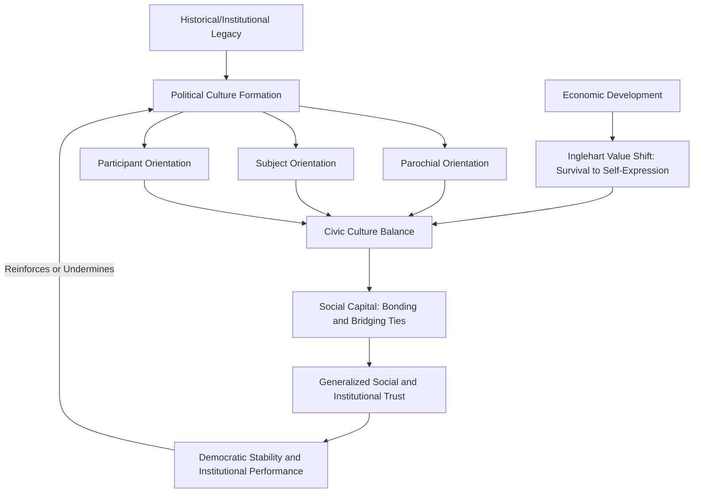

## Political Culture in Comparative Perspective

### Definition and Conceptual Foundations

Political culture refers to the shared, deeply held patterns of beliefs, values, attitudes, and orientations that a population holds toward its political system, including perceptions of political authority, legitimate political processes, the role of the citizen, and the relationship between the individual and the state. Unlike public opinion, which captures relatively fluid attitudes on specific issues, political culture is understood as a more enduring, historically rooted layer of collective political psychology that shapes how citizens interpret political events and institutions across generations.

Comparative political culture research examines how these underlying orientations vary systematically across countries and regions, and how such variation helps explain cross-national differences in democratic stability, institutional performance, civic participation, and governance outcomes.

### Gabriel Almond and Sidney Verba's Foundational Framework

The modern comparative study of political culture originates substantially with Gabriel Almond and Sidney Verba's landmark study *The Civic Culture: Political Attitudes and Democracy in Five Nations* (1963), which conducted systematic survey research across the United States, United Kingdom, Germany, Italy, and Mexico to identify patterns of political orientation associated with stable democratic governance.

**Key Points — Almond and Verba's Three Political Culture Types**

1. **Parochial Political Culture** — Citizens have little to no awareness of, or expectation regarding, the national political system; political orientations remain confined to local, familial, or tribal levels, with minimal expectation of participation in or benefit from national governance.
2. **Subject Political Culture** — Citizens are aware of and recognize the authority of the national political system and its outputs (laws, policies), but see themselves as passive subjects rather than active participants — oriented toward the system's outputs but not toward participation in its inputs (policy formation).
3. **Participant Political Culture** — Citizens see themselves as active, competent participants capable of both understanding the political system's outputs and actively engaging in shaping its inputs through voting, advocacy, and civic organization.

**The Civic Culture Synthesis**

Almond and Verba argued that the most stable and effective democracies exhibit not a purely participant culture, but a **"civic culture"** — a balanced mixture of parochial, subject, and participant orientations, in which citizens are predominantly participatory but retain enough deference to authority and enough passive/traditional orientation to provide systemic stability and prevent excessive political mobilization or destabilizing over-participation. This synthesis reflected their core empirical finding, based substantially on their British and American case studies, that healthy democracies require a balance between active citizen engagement and a reservoir of underlying system trust and deference that tempers pure participatory activism.

### Political Trust and Social Capital

**Robert Putnam's Social Capital Framework**

Robert Putnam's influential comparative work — first in *Making Democracy Work* (1993), comparing regional governance performance in Italy, and later in *Bowling Alone* (2000), examining civic decline in the United States — extended political culture analysis by emphasizing **social capital**: the networks, norms of reciprocity, and generalized social trust that facilitate collective action and, Putnam argued, strongly predict effective democratic governance and institutional performance.

- **Bonding social capital**: Ties within homogeneous groups (family, close friends, in-group members), which reinforce group identity but can limit broader societal cooperation.
- **Bridging social capital**: Ties across diverse social groups, which Putnam argued are particularly valuable for generating the broad-based trust and cooperation necessary for effective, inclusive democratic governance.

Putnam's Italian regional study found that regions with denser historical traditions of civic associationalism (choral societies, cooperatives, mutual aid associations) exhibited significantly more effective regional government performance centuries later, suggesting political culture — once formed — can exhibit remarkable historical persistence independent of contemporaneous economic conditions. [Inference: Putnam's causal claims regarding the persistence and independent causal weight of historical civic tradition, as opposed to alternative explanations, have been subject to ongoing scholarly debate and methodological critique.]

### The World Values Survey and Modernization Theory

**Ronald Inglehart's Cultural Change Framework**

Ronald Inglehart's long-running comparative research, institutionalized through the **World Values Survey** (an ongoing cross-national survey program covering the large majority of the world's population), proposed a systematic theory of cross-national cultural variation organized along two principal dimensions:

- **Traditional versus Secular-Rational values**: Societies range from emphasizing religion, national pride, respect for authority, and traditional family structures (traditional pole) to emphasizing secular, rational, bureaucratic authority structures with reduced emphasis on religion and traditional deference (secular-rational pole).
- **Survival versus Self-Expression values**: Societies range from prioritizing economic and physical security, in-group solidarity, and conformity (survival pole) to prioritizing self-expression, quality of life, environmental protection, gender equality, and tolerance of diversity (self-expression pole).

Inglehart's **modernization/postmaterialism thesis** argues that as societies achieve sustained economic development and existential security, their populations tend to shift systematically from survival values toward self-expression values across generational cohorts (linking this framework directly to the generational/cohort effects discussed in political socialization theory), with corresponding downstream effects on support for democratic institutions, gender equality, and environmental protection.

### Comparative Political Culture Typology Table

| Framework | Key Dimension(s) | Central Claim |
| --- | --- | --- |
| Almond and Verba (Civic Culture) | Parochial – Subject – Participant orientation | Balanced "civic culture" mix best supports stable democracy |
| Putnam (Social Capital) | Bonding vs. Bridging social capital; associational density | Dense civic networks and generalized trust improve governance performance |
| Inglehart (World Values Survey) | Traditional–Secular-Rational; Survival–Self-Expression | Economic development drives systematic generational value shifts |
| Political Trust Literature | Institutional vs. interpersonal trust | Trust in institutions is a distinct but related construct from generalized social trust |

### Political Culture and Democratic Stability

A central empirical and theoretical concern in comparative political culture research is whether particular cultural configurations are **causes or consequences** of democratic stability and institutional performance:

- **Culture as cause**: The classical Almond-Verba and Putnam positions broadly suggest that pre-existing cultural orientations (civic engagement norms, generalized trust) causally enable and sustain stable, effective democratic governance.
- **Culture as consequence**: Critics and alternative theorists argue that political culture is itself substantially shaped by institutional performance and historical political experience — meaning citizens in well-governed, economically prosperous democracies develop trust and participatory orientations *because* their institutions perform well, reversing the presumed causal arrow.
- **Endogeneity problem**: Because political culture and institutional performance are likely mutually reinforcing over time, isolating a clean, unidirectional causal relationship remains a persistent methodological challenge in this literature. [Inference: this endogeneity problem is widely acknowledged in the comparative politics literature as a significant unresolved methodological issue rather than one with a settled consensus resolution.]

### Comparative Political Culture Diagram

### Critiques of the Civic Culture Framework

**Key Points — Major Scholarly Critiques**

1. **Western/ethnocentric bias**: Critics argue the original Almond-Verba framework implicitly treats Anglo-American political culture (particularly British and U.S. patterns) as the normative model of healthy democratic culture, potentially undervaluing alternative culturally rooted participatory traditions in non-Western contexts.
2. **Static versus dynamic culture**: Early political culture research has been criticized for treating culture as a relatively fixed, slow-changing variable, whereas subsequent research (including Inglehart's own generational value-change findings) demonstrates substantial cultural malleability in response to economic and social change.
3. **Methodological nationalism**: Treating "national culture" as a relatively homogeneous unit of analysis can obscure substantial sub-national, regional, ethnic, or class-based variation in political orientations within a single country — a critique with direct relevance to culturally and regionally diverse polities.
4. **Causality and endogeneity concerns**: As noted above, the direction of causality between culture and institutional performance remains contested, complicating straightforward policy applications of political culture theory.
5. **Elite manipulation and constructed culture**: Some scholars emphasize that political elites can deliberately construct or reshape political culture narratives (e.g., through nationalist historical narratives or state-controlled education) rather than culture existing as a purely organic, bottom-up societal phenomenon.

### Illustrative Example

**Example**

Consider two hypothetical countries with similar formal democratic constitutions but differing political cultures:

- **Country A** exhibits a predominantly **participant civic culture** with dense associational life (labor unions, civic clubs, professional associations) and high generalized interpersonal trust — per Putnam's framework, this dense associational network would be expected to correlate with more effective, responsive local governance and lower corruption, since citizens can more easily organize to monitor and hold officials accountable.
- **Country B**, despite an identical formal constitutional structure, exhibits a predominantly **subject political culture**, with citizens expecting government services as passive recipients but showing minimal expectation of, or engagement in, participatory oversight — per the civic culture framework, this pattern would predict weaker grassroots accountability mechanisms and potentially greater vulnerability to elite capture or corruption, despite formally identical democratic institutions on paper.

This illustrates comparative political culture theory's central claim: formally identical political institutions can produce substantially different governance outcomes depending on the underlying cultural orientations of the citizenry interacting with those institutions.

### Political Culture in Southeast Asian and Philippine Context

Comparative political culture research applied to the Philippines and broader Southeast Asian contexts has examined several distinctive features:

- **Patron-client political culture**: Scholarship on Philippine political culture has extensively examined the persistence of patron-client relationships and personalistic politics as a distinctive cultural-institutional pattern shaping electoral behavior and governance, existing in tension with formal participant-democratic institutional structures inherited from American colonial administration.
- **"Bayanihan" and communal solidarity norms**: Filipino political culture scholarship frequently references indigenous communal cooperation traditions as a distinctive form of social capital, though scholars debate the degree to which such traditional bonding social capital translates into the broader bridging social capital Putnam associated with effective democratic governance. [Inference: the specific empirical relationship between traditional Filipino communal norms and formal democratic institutional performance is a subject of ongoing scholarly research and debate rather than settled consensus.]
- **Post-authoritarian democratic culture**: The Philippines' experience of martial law under Ferdinand Marcos (1972–1981, with martial law formally lifted in 1981 though Marcos remained in power until 1986) and subsequent democratic restoration through the 1986 People Power Revolution represents a significant historical juncture frequently examined in political culture research regarding the durability and depth of democratic value commitment following authoritarian interruption.

### Contemporary Developments in Comparative Political Culture Research

- **Digital-era political culture change**: Ongoing research examines whether widespread internet and social media access is reshaping traditional political culture patterns, particularly regarding trust in traditional authority and institutions, and the balance between parochial, subject, and participant orientations among digitally connected populations. [Inference: given the rapid evolution of digital media environments, specific empirical findings in this area should be treated as provisional and current research consulted for updated conclusions.]
- **Democratic backsliding and cultural resilience**: Renewed comparative attention to whether pre-existing civic culture strength serves as a protective factor against contemporary democratic backsliding trends observed in various regions.
- **Cross-national value convergence versus persistent divergence debate**: Ongoing scholarly debate regarding whether globalization and economic development are producing gradual convergence toward Inglehart's self-expression value pole worldwide, or whether persistent civilizational/religious cultural zones (as emphasized in Samuel Huntington's contested "clash of civilizations" framework) will continue to produce durable cross-regional value divergence.

**Next Steps**

- Study Almond and Verba's original five-nation civic culture study in greater methodological depth, including subsequent replications and critiques.
- Examine Robert Putnam's Italian regional governance study alongside methodological critiques of his causal claims.
- Explore the World Values Survey's publicly available cross-national data to examine specific country placements along Inglehart's two value dimensions.
- Investigate Philippine-specific political culture scholarship on patron-clientelism and its relationship to formal democratic institutional performance.

**Related Topics**

- Political Socialization
- Formation and Measurement of Public Opinion
- Voting Behavior and Electoral Choice
- Social Capital Theory
- Modernization Theory and Democratic Development
- Clientelism and Patron-Client Politics
- Democratic Backsliding and Democratic Consolidation