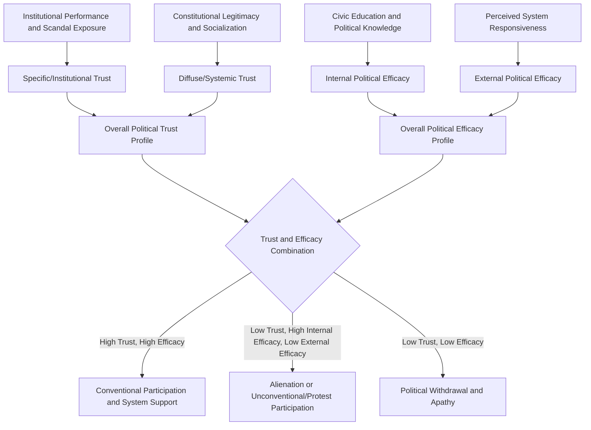

## Political Trust and Efficacy

### Definition and Conceptual Distinction

Political trust and political efficacy are two closely related but analytically distinct core constructs in the study of political behavior and public opinion. **Political trust** refers to citizens' confidence that political institutions and actors will act competently, fairly, and in accordance with citizens' expectations and the public interest. **Political efficacy** refers to citizens' belief in their own capacity to understand and influence the political process — a belief about the citizen's own agency rather than a judgment about the trustworthiness of political objects.

Though frequently studied together because both shape political engagement and system legitimacy, trust is fundamentally an evaluation directed *outward* toward political institutions/actors, while efficacy is a belief directed *inward* about one's own political competence and influence.

### Dimensions of Political Trust

**Key Points — Types of Political Trust**

1. **Diffuse (Systemic) Trust** — General, foundational confidence in the legitimacy and appropriateness of the political system and its constitutional order as a whole, relatively insulated from short-term performance evaluations (drawing directly on David Easton's diffuse/specific support distinction discussed in political socialization theory).
2. **Specific (Institutional) Trust** — Confidence in particular institutions (the legislature, judiciary, police, civil service, electoral commission), which can vary substantially across institutions within the same country and fluctuates more readily based on institutional performance and scandal exposure.
3. **Political Trust in Incumbents/Officeholders** — Confidence in currently serving officials or the sitting government, the most volatile and performance-sensitive form of trust, closely tied to short-term evaluations of economic conditions and policy outcomes.
4. **Interpersonal (Social) Trust** — Generalized trust in fellow citizens, distinct from but often empirically correlated with political trust, and central to Putnam's social capital framework discussed in political culture research.

### The Standard Survey Measurement of Political Trust

Political trust is most commonly measured through survey batteries asking respondents how much confidence or trust they place in specific institutions, using response scales such as "a great deal," "a fair amount," "not very much," and "none at all." The **American National Election Studies (ANES)** trust-in-government index — first developed in the 1950s and continuously fielded since — remains one of the most widely used longitudinal measures internationally, typically combining responses to items such as:

- "How much of the time do you think you can trust the government in [country] to do what is right?"
- "Would you say the government is run for the benefit of all, or for a few big interests?"

Comparative cross-national trust measurement is extensively conducted through instruments such as the **World Values Survey**, the **European Social Survey**, and regional barometer surveys (Afrobarometer, Latinobarómetro, Asian Barometer), enabling systematic cross-national and over-time comparison of institutional trust levels.

### Dimensions of Political Efficacy

**Key Points — Internal versus External Efficacy**

1. **Internal Political Efficacy** — The belief that one personally possesses the knowledge, skills, and competence necessary to understand and participate effectively in politics (e.g., agreement with statements like "I feel that I have a pretty good understanding of important political issues").
2. **External Political Efficacy** — The belief that the political system and its institutions are responsive to citizen input and demands (e.g., agreement with statements like "Public officials care what people like me think"), representing a belief about system responsiveness rather than personal competence, and thus conceptually adjacent to — though empirically distinct from — political trust.

This internal/external distinction, developed substantially through the American National Election Studies research program beginning in the 1950s–1960s, has become the standard framework for efficacy measurement in political behavior research, since the two dimensions have been repeatedly shown to have distinct antecedents and distinct effects on political behavior.

### Theoretical Relationship Between Trust, Efficacy, and Political Behavior

**Key Points — Behavioral Consequences**

1. **Political participation**: Both higher internal efficacy and higher external efficacy are robustly associated with increased likelihood of conventional political participation (voting, contacting officials, campaign involvement), since citizens who believe both in their own competence and in system responsiveness perceive greater expected value from participating.
2. **Trust and compliance**: Higher institutional trust is generally associated with greater voluntary compliance with laws, tax obligations, and public health directives, since citizens are more willing to accept the legitimacy of institutional demands they trust.
3. **Trust and support for democratic norms**: Some research links declining diffuse political trust to greater vulnerability to anti-system or populist political appeals, though the precise causal relationship remains debated. [Inference: whether declining trust is best understood as a *cause* of populist support, a *consequence* of shared underlying grievances, or a reciprocally reinforcing dynamic remains an active and unresolved empirical debate in the literature.]
4. **Low external efficacy and alienation**: Citizens with low external efficacy (believing the system is unresponsive) but high internal efficacy (believing themselves personally competent) are theorized to be particularly susceptible to political alienation, cynicism, or support for radical/anti-establishment alternatives, since they perceive a personal capacity to act that the system nonetheless frustrates.
5. **Efficacy and unconventional participation**: Some research suggests that low external efficacy combined with high internal efficacy may channel political energy toward unconventional participation (protest, direct action) rather than withdrawal, as an alternative avenue when conventional channels are perceived as unresponsive.

### Trust and Efficacy Relationship Diagram

### Determinants and Correlates of Political Trust and Efficacy

- **Socioeconomic status and education**: Higher education levels are consistently associated with higher internal political efficacy across most studied contexts, reflecting greater accumulated civic knowledge and skills (connecting directly to political socialization's education-agent mechanisms).
- **Economic performance**: Trust in government frequently correlates with recent macroeconomic performance, reflecting a form of retrospective evaluation similar to economic voting theory's account of vote choice.
- **Corruption perception**: Perceived or documented corruption is one of the most consistently identified cross-national predictors of lower institutional trust, particularly trust in police, judiciary, and legislative bodies.
- **Media exposure and "video malaise" hypothesis**: Some research (associated with Michael Robinson's original 1976 formulation) proposes that heavy exposure to critical or adversarial political media coverage can erode political trust and efficacy over time, though this hypothesis has received mixed empirical support and remains contested. [Inference: subsequent research has produced inconsistent findings regarding "video malaise," with effects appearing to depend significantly on media type, content tone, and national media system context.]
- **Direct personal experience with institutions**: Positive or negative personal interactions with specific government agencies (e.g., efficient versus bureaucratically frustrating service delivery experiences) can meaningfully shape specific institutional trust, connecting this literature directly to street-level bureaucracy research on how citizens' direct encounters with front-line public servants shape broader system legitimacy perceptions.
- **Generational and cohort effects**: Consistent with political socialization theory's cohort-effects framework, trust and efficacy levels often display durable generational patterns linked to shared formative political experiences (e.g., cohorts socialized during major corruption scandals or economic crises).

### Illustrative Example

**Example**

Consider two citizens in the same country evaluating a newly announced infrastructure policy:

- **Citizen A** reports high internal efficacy ("I understand this policy's tradeoffs well") and high external efficacy ("if I write to my representative, they will genuinely consider my concerns") alongside high institutional trust — this citizen's profile predicts conventional participatory engagement, such as attending a public consultation or contacting their representative directly, since the expected value of participation is high.
- **Citizen B** reports similarly high internal efficacy but low external efficacy ("no matter what citizens say, officials will do what they want") combined with low institutional trust rooted in past corruption scandals — this citizen's profile predicts either political disengagement from conventional channels or, alternatively, participation in unconventional forms of protest or advocacy specifically because conventional channels are perceived as illegitimate or unresponsive.

This illustrates how efficacy and trust operate as distinct but interacting predictors, jointly shaping not just *whether* citizens engage politically but *which mode* of engagement they are likely to pursue.

### Cross-National and Institutional Variation

- **Regime type and trust patterns**: Comparative research using barometer surveys (Afrobarometer, Latinobarómetro, Asian Barometer) has documented substantial cross-regional and cross-institutional variation in trust levels, with military and religious institutions frequently receiving higher trust ratings than elected legislatures or political parties in many surveyed contexts. [Inference: specific comparative rankings shift over time and across survey waves, so current barometer survey data should be consulted for up-to-date country- and institution-specific figures rather than relying on any fixed historical ranking.]
- **Post-authoritarian and transitional contexts**: Political trust research in post-authoritarian democracies frequently examines the durability of institutional distrust rooted in prior authoritarian-era experience, and whether successful democratic institutional performance can gradually rebuild trust across successive post-transition cohorts.
- **Local versus national institutional trust divergence**: Some comparative research finds those citizens' trust in local government institutions can diverge meaningfully from trust in national institutions, reflecting differentiated direct-experience effects — citizens may have more frequent direct interaction with local government service delivery (permitting, local records, community services) than with distant national institutions, making local-level administrative performance and transparency particularly consequential for local institutional trust formation.

### Relevance to Local Governance and Administrative Transparency

Because political trust is substantially shaped by citizens' direct experience with institutional performance and perceived fairness, **local government administrative practices** — including transparency, responsiveness, and service delivery efficiency — carry direct implications for political trust formation at the subnational level:

- Efficient, transparent, and accessible local government record-keeping and document processing systems can positively shape citizens' direct-experience-based trust in local institutions, consistent with the broader finding that direct institutional encounters meaningfully influence specific institutional trust.
- Conversely, opaque or inefficient local administrative processes (e.g., difficulty accessing public records, slow permit processing) can reinforce broader patterns of institutional distrust and low external efficacy, potentially reinforcing citizen disengagement from local participatory governance mechanisms.
- This connects political trust and efficacy research directly to the bureaucratic accountability and transparency mechanisms discussed elsewhere in this course (Freedom of Information compliance, local transparency portals), since citizen-facing administrative infrastructure functions as a direct, recurring touchpoint shaping political trust formation.

**Next Steps**

- Study the American National Election Studies' original internal/external efficacy measurement framework and its subsequent refinements.
- Examine comparative regional barometer survey data (Afrobarometer, Asian Barometer, Latinobarómetro) for country-specific trust and efficacy patterns.
- Explore the "video malaise" hypothesis and subsequent media effects research in greater methodological depth.
- Investigate the relationship between corruption perception indices and institutional trust measures cross-nationally.

**Related Topics**

- Political Socialization
- Formation and Measurement of Public Opinion
- Political Culture in Comparative Perspective
- Voting Behavior and Electoral Choice
- Bureaucratic Accountability and Oversight
- Political Alienation and Populism
- Social Capital Theory