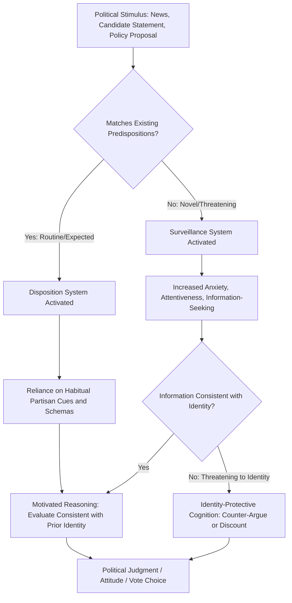

## Political Psychology

### Definition and Scope

Political psychology is an interdisciplinary field that applies theories and methods from psychology to explain political attitudes, beliefs, judgments, and behavior — examining the cognitive, emotional, motivational, and personality-based processes that shape how individuals perceive, evaluate, and act within political contexts. It draws on cognitive psychology, social psychology, personality psychology, and neuroscience to complement and often challenge purely rational-choice or purely sociological accounts of political behavior discussed elsewhere in this chapter.

Political psychology serves as a foundational, cross-cutting framework underlying many of the specific phenomena examined in political socialization, public opinion formation, voting behavior, and political trust research — providing the micro-level psychological mechanisms that explain why those macro-level patterns occur.

### Cognitive Approaches to Political Judgment

**Heuristics and Cognitive Shortcuts**

Building on Daniel Kahneman and Amos Tversky's foundational behavioral decision theory (which distinguishes fast, intuitive "System 1" thinking from slower, deliberative "System 2" reasoning), political psychology research demonstrates that most political judgments rely heavily on cognitive shortcuts rather than exhaustive information processing:

- **Party cue heuristic**: Using a trusted party's position as a proxy for evaluating an unfamiliar policy, substantially reducing the cognitive burden of independent issue analysis (directly connecting to the elite cue-taking models discussed in public opinion formation).
- **Availability heuristic**: Judging the likelihood or importance of political events based on how easily relevant examples come to mind, often influenced by recent or vivid media coverage rather than objective frequency.
- **Representativeness heuristic**: Judging political actors or groups based on how well they match a pre-existing stereotype or prototype, rather than base-rate statistical information.
- **Anchoring effects**: Political judgments (e.g., evaluations of a proposed budget figure) can be systematically biased by an initial reference point presented to the individual, even when that reference point is arbitrary or irrelevant.

**Schema Theory**

Political schemas are organized mental frameworks that help individuals efficiently process new political information by fitting it into pre-existing categories (e.g., a "liberal" or "conservative" schema, a "corrupt politician" schema). Schemas enable rapid processing of complex political information but can also produce systematic biases, since ambiguous or schema-inconsistent information is often distorted, discounted, or reinterpreted to fit existing categories.

### Motivated Reasoning and Identity-Protective Cognition

**Key Points — Core Mechanisms**

1. **Motivated reasoning**: Individuals process information in a manner biased toward reaching conclusions consistent with pre-existing identities and preferences, actively generating counter-arguments against attitude-inconsistent evidence while uncritically accepting attitude-consistent evidence (a mechanism with substantial experimental support in political psychology research).
2. **Identity-protective cognition** (associated with Dan Kahan and colleagues): Individuals evaluate factual claims, particularly on politically charged empirical questions (e.g., climate science, vaccine safety), partly based on whether accepting the claim threatens or reinforces their group identity, rather than through politically neutral evaluation of evidence.
3. **Confirmation bias**: A general tendency to search for, interpret, and recall information in ways that confirm pre-existing beliefs, operating as a component mechanism underlying broader motivated reasoning patterns.
4. **Backfire effects and belief perseverance**: Some research has proposed that corrective factual information can, under certain conditions, paradoxically strengthen rather than weaken a mistaken belief among individuals highly committed to that belief, though the robustness and generalizability of backfire effects specifically has been substantially questioned and qualified in more recent replication studies. [Inference: the empirical status of "backfire effects" is actively contested in current political psychology research, with more recent large-scale studies finding such effects to be considerably less common than earlier research suggested; current literature should be consulted rather than treating early backfire-effect findings as settled.]

### Personality and Political Orientation

**The Authoritarian Personality Tradition**

Beginning with Theodor Adorno and colleagues' controversial *The Authoritarian Personality* (1950) and substantially refined by later researchers including Bob Altemeyer's **Right-Wing Authoritarianism (RWA)** scale, this research tradition examines personality-based predispositions toward submission to authority, conventionalism, and aggression toward out-groups, and their relationship to political attitudes and susceptibility to authoritarian political appeals.

**Big Five Personality Traits and Political Orientation**

Contemporary political psychology research has extensively examined correlations between the **Big Five personality traits** (Openness to Experience, Conscientiousness, Extraversion, Agreeableness, Neuroticism) and political ideology/behavior, with a frequently replicated (though not universal) finding that:

- **Openness to Experience** tends to correlate with more liberal/left political orientations across many studied Western contexts.
- **Conscientiousness** tends to correlate with more conservative/right political orientations in similar contexts.

[Inference: these personality-ideology correlations, while frequently replicated in North American and Western European samples, show meaningful cross-cultural variation and should not be treated as universal psychological laws; the causal direction and generalizability across non-Western political contexts remains an active area of ongoing research.]

**Social Dominance Orientation and System Justification**

- **Social Dominance Orientation (SDO)** (Jim Sidanius and Felicia Pratto): A measured individual-difference construct capturing the degree to which individuals prefer hierarchical, unequal relationships between social groups, associated with support for policies reinforcing group-based hierarchy.
- **System Justification Theory** (John Jost and colleagues): Proposes that individuals, including members of disadvantaged groups, are psychologically motivated to perceive existing social and political arrangements as fair, legitimate, and justified, even when those arrangements do not serve their own material interests — providing a psychological account of why systemic inequality can persist with limited political challenge from affected groups.

### Emotion and Political Behavior

**Key Points — Affective Intelligence Theory**

Political psychologist George Marcus and colleagues' **Affective Intelligence Theory** proposes that emotional processing plays a functional, not merely disruptive, role in political cognition, operating through two principal emotional systems:

1. **Disposition system**: Governs routine political engagement when circumstances match expectations, associated with feelings of enthusiasm or contentment, and generally reinforces reliance on existing habits and predispositions (including established party identification).
2. **Surveillance system**: Activated by novel, threatening, or anxiety-inducing political circumstances, associated with the emotion of anxiety, which — counterintuitively — tends to *increase* attentiveness, information-seeking, and willingness to deviate from habitual partisan voting patterns, since anxiety signals that existing habitual responses may be inadequate to a changed situation.

This theory provides an important corrective to purely cognitive models by demonstrating that specific emotions (anxiety versus enthusiasm versus anger) have distinguishable and sometimes opposing effects on political information-processing and behavior, rather than emotion uniformly degrading rational political judgment.

**Specific Emotions and Political Effects**

- **Anger**: Often associated with increased political action and mobilization, but also increased reliance on existing beliefs and reduced careful information processing, in some contrast to anxiety's information-seeking effect.
- **Fear/Anxiety**: Associated with increased information-seeking, risk-aversion, and (per Affective Intelligence Theory) greater openness to reconsidering habitual political judgments.
- **Enthusiasm**: Associated with reinforced habitual engagement, increased likelihood of turnout among already-mobilized partisans, and reduced scrutiny of in-group political claims.

### Political Psychology Process Diagram

### Group Identity and Intergroup Political Psychology

**Social Identity Theory** (Henri Tajfel and John Turner) provides a foundational framework increasingly applied to partisan political behavior, proposing that group memberships (including partisan identity) become incorporated into individuals' self-concept, generating:

- **In-group favoritism**: Systematic preference for and positive evaluation of one's own party/group.
- **Out-group derogation**: Systematic negative evaluation of opposing parties/groups, sometimes independent of substantive policy disagreement.
- **Affective polarization**: The contemporary application of social identity theory to partisanship, describing the phenomenon whereby partisans increasingly view opposing partisans with dislike, distrust, or even moral contempt, distinct from and sometimes exceeding substantive ideological/policy disagreement — an area of substantial contemporary research attention, particularly in the United States and other polarized democracies. [Inference: the degree and trajectory of affective polarization varies considerably across countries and time periods, and current comparative research should be consulted for up-to-date cross-national patterns rather than assuming a uniform global trend.]

### Illustrative Example

**Example**

Consider a voter encountering a news report alleging financial misconduct by a political candidate:

- If the report concerns a candidate from the voter's **out-group party**, motivated reasoning and identity-protective cognition predict the voter will readily accept the allegation as credible, requiring minimal corroborating evidence, consistent with confirmation bias operating on already-negative out-group schemas.
- If the report concerns a candidate from the voter's **own party**, the same voter is predicted to engage in more effortful counter-arguing, seek out mitigating context, or question the source's credibility — the identical objective evidence is processed asymmetrically depending on its implications for the voter's partisan identity.
- Under **Affective Intelligence Theory**, if this allegation represents a genuinely novel and unexpected development (rather than confirming an already-anticipated pattern), even committed partisans might exhibit heightened anxiety-driven information-seeking and, in some cases, measurable willingness to reconsider their voting intention — illustrating that emotional response type (anxiety versus routine enthusiasm) can meaningfully moderate the strength of motivated reasoning effects.

This example demonstrates how multiple political psychology mechanisms (motivated reasoning, identity-protective cognition, affective intelligence) interact to shape a single act of political judgment.

### Political Psychology and Political Violence/Extremism

Political psychology also examines the individual-level psychological processes associated with political radicalization and support for political violence, including:

- **Relative deprivation theory**: Political grievance and support for radical action are theorized to arise less from absolute material conditions than from perceived unfair comparison relative to a reference group or expected standard.
- **Significance quest theory** (Arie Kruglanski and colleagues): Proposes that the psychological need for personal significance, particularly following experiences of humiliation or marginalization, can motivate individual susceptibility to radicalizing ideological narratives that offer a path to restored significance.
- **Group polarization and echo chambers**: Psychological research on group deliberation demonstrates that like-minded groups discussing a shared position tend to shift toward more extreme versions of that position over the course of discussion, a mechanism with direct relevance to concerns about ideological radicalization within homogeneous online or offline political communities. [Inference: the precise real-world magnitude of online echo chamber effects, as distinct from selective exposure occurring through other channels, remains an actively debated empirical question in contemporary research.]

### Applications and Contemporary Relevance

- **Political communication and campaign strategy**: Political psychology findings on heuristics, emotional appeals, and motivated reasoning directly inform (and are sometimes exploited by) political campaign communication strategy, raising associated normative and ethical considerations regarding manipulation versus legitimate persuasion.
- **Misinformation and fact-checking research**: Contemporary political psychology research extensively examines the effectiveness (and limitations) of fact-checking interventions, "prebunking"/inoculation strategies, and media literacy interventions in countering politically motivated misinformation acceptance.
- **Political psychology and public health communication**: Insights regarding motivated reasoning and identity-protective cognition have been extensively applied to understanding politically polarized responses to public health guidance and scientific consensus messaging.
- **Cross-cultural political psychology**: A growing research emphasis on testing whether foundational political psychology findings (largely developed in North American and Western European samples) replicate across diverse cultural, religious, and political-system contexts, given the historical overrepresentation of WEIRD (Western, Educated, Industrialized, Rich, Democratic) samples in the field's foundational research base.

**Next Steps**

- Study Daniel Kahneman's dual-process (System 1/System 2) framework in greater depth as the foundational cognitive psychology basis for political heuristics research.
- Examine George Marcus's Affective Intelligence Theory in its original formulation alongside subsequent empirical applications.
- Explore social identity theory's application to affective polarization research in greater depth.
- Investigate cross-cultural replication studies testing the generalizability of Western-derived political psychology findings.

**Related Topics**

- Political Socialization
- Formation and Measurement of Public Opinion
- Voting Behavior and Electoral Choice
- Political Culture in Comparative Perspective
- Political Trust and Efficacy
- Affective Polarization and Partisan Identity
- Political Radicalization and Extremism