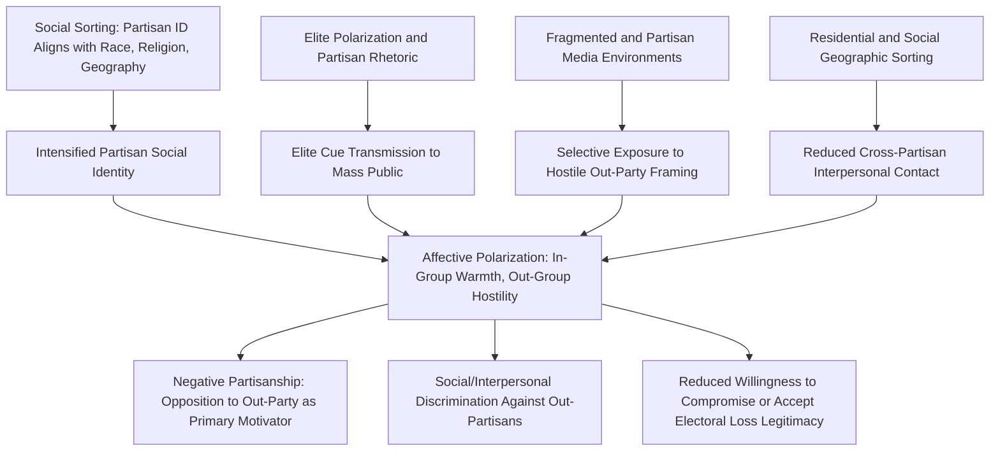

## Polarization and Partisan Identity

### Definition and Conceptual Distinction

Polarization and partisan identity is the study of how political divisions between opposing camps intensify and deepen, and how partisan affiliation functions as a psychological and social identity rather than merely an instrumental policy preference. Political science distinguishes several analytically separate but interrelated forms of polarization, each with distinct measurement approaches and causal mechanisms.

**Key Points — Core Types of Polarization**

1. **Ideological/Policy Polarization** — Increasing divergence in citizens' or elites' substantive policy positions across a left-right or liberal-conservative spectrum.
2. **Elite/Party Polarization** — Increasing ideological distance between the two (or more) major parties' officeholders, activists, and platforms, generally measured through legislative voting record analysis (e.g., DW-NOMINATE scores in U.S. congressional research) or party manifesto content analysis.
3. **Mass Polarization** — Increasing divergence in the distribution of ordinary citizens' policy opinions, distinct from elite polarization and empirically found not to track it in lockstep in several studied contexts.
4. **Affective Polarization** — Increasing emotional dislike, distrust, and social distance between partisans of opposing parties, independent of the magnitude of their substantive policy disagreement — the primary focus of contemporary political psychology research on polarization.

### Affective Polarization — Theoretical Foundations

Affective polarization applies **Social Identity Theory** (Henri Tajfel and John Turner) to partisanship, treating party identification not merely as an instrumental preference but as a genuine social identity comparable to other group memberships (ethnicity, religion, nationality) that becomes incorporated into an individual's self-concept.

**Key Mechanisms:**

- **In-group favoritism**: Systematic positive bias toward one's own party and its members, extending beyond policy agreement to general trait evaluations (perceived honesty, intelligence, patriotism).
- **Out-group derogation**: Systematic negative bias toward the opposing party and its members, sometimes extending to willingness to discriminate against out-partisans in non-political contexts (hiring decisions, social relationships, even, in some documented survey experiments, willingness to accept a family member marrying an out-partisan).
- **Social sorting**: The alignment and reinforcement of partisan identity with other social identities (race, religion, geography, urban/rural residence), theorized by scholars including Lilliana Mason to intensify affective polarization by making partisan identity a more encompassing, cross-reinforcing social category rather than a single cross-cutting affiliation.

**Measurement — Feeling Thermometers**

Affective polarization is most commonly measured using **feeling thermometer** survey items, asking respondents to rate their warmth toward their own party (and its supporters) and the opposing party (and its supporters) on a 0–100 scale, with the **affective polarization index** typically calculated as the difference between in-party and out-party thermometer ratings, averaged across respondents.

$$\text{Affective Polarization} = \frac{(\text{In-Party Rating} - \text{Out-Party Rating})}{2}$$

[Inference: exact index formulas vary somewhat across studies — some use the simple difference, others average across multiple items or apply additional statistical adjustments — so specific published figures should be interpreted with attention to the precise measurement approach used in that study.]

### Distinguishing Mass, Elite, and Affective Polarization

| Type | What Is Measured | Typical Data Source | Key Finding Pattern |
| --- | --- | --- | --- |
| Elite/Party Polarization | Ideological distance between party officeholders | Legislative roll-call votes, party platforms | Substantial, well-documented increase in several studied democracies over recent decades |
| Mass/Ideological Polarization | Distribution of citizen policy opinions | Public opinion surveys on specific issues | More modest and contested increase; evidence is mixed regarding whether ordinary citizens have become substantially more ideologically extreme |
| Affective Polarization | Emotional warmth/coldness toward in-party vs. out-party | Feeling thermometers, social distance measures | Substantial, well-documented increase in the U.S. and several other studied democracies |

A central and influential finding in this literature (associated with scholars including Morris Fiorina) is that **mass ideological polarization has increased considerably less than elite polarization or affective polarization**, suggesting that citizens have not necessarily become dramatically more extreme in their actual policy views, even as they have become substantially more emotionally hostile toward opposing partisans — a pattern requiring separate explanatory accounts for affective polarization beyond simple substantive policy disagreement.

### Causes of Affective Polarization — Competing Explanations

**Key Points — Major Causal Hypotheses**

1. **Social sorting hypothesis** (Lilliana Mason): Partisan identity has become increasingly aligned with other salient social identities (race, religion, ideology, geography), making partisanship a more powerful, encompassing "mega-identity" that intensifies in-group/out-group psychological dynamics.
2. **Elite cue and media hypothesis**: Increasingly polarized elite rhetoric and partisan media ecosystems transmit hostility cues to ordinary citizens, who adopt affective polarization partly by following elite and media signals about how to feel toward the opposing party (connecting to elite cue-taking models discussed in public opinion formation).
3. **Negative partisanship hypothesis**: Increasing political engagement is driven less by positive attachment to one's own party and more by strong negative sentiment toward the opposing party, meaning affective polarization is substantially fueled by growing "negative partisanship" rather than purely intensified in-group loyalty.
4. **Media fragmentation and selective exposure**: The proliferation of ideologically segmented media and social media environments may increase exposure to hostile characterizations of the out-party while reducing cross-cutting exposure to more nuanced or humanizing portrayals of political opponents.
5. **Political geography and residential sorting**: Increasing geographic clustering of like-minded partisans (sometimes termed "the big sort") may reduce ordinary citizens' direct interpersonal contact with out-partisans, reducing opportunities for the sort of positive intergroup contact associated (per classic intergroup contact theory) with reduced prejudice.

[Inference: the relative causal weight of these competing (and likely mutually reinforcing) explanations remains actively debated in the polarization research literature, and current comparative and experimental research should be consulted for the latest evidence regarding their relative contributions.]

### Polarization Causal Pathways Diagram

### Consequences of Polarization

**Key Points — Documented and Theorized Effects**

1. **Legislative gridlock and reduced policy compromise**: Elite polarization is closely associated with reduced cross-party legislative cooperation and increased difficulty passing bipartisan legislation in polarized legislatures.
2. **Democratic norm erosion concerns**: Some scholars (including Steven Levitsky and Daniel Ziblatt in *How Democracies Die*) argue severe affective polarization can erode mutual toleration and forbearance norms essential to democratic stability, as opposing partisans increasingly view electoral loss to the out-party as an existential threat rather than a normal, acceptable outcome of democratic competition.
3. **Reduced acceptance of electoral outcomes**: Severe affective polarization has been associated in some research with increased willingness to question the legitimacy of electoral results won by the out-party, though the specific causal contribution of affective polarization versus other factors (elite rhetoric, specific electoral administration disputes) in any given case remains empirically contested. [Inference: attributing specific instances of electoral legitimacy contestation to affective polarization as opposed to other contributing factors requires case-specific empirical analysis rather than general theoretical inference.]
4. **Social and interpersonal effects**: Documented willingness in some survey experiments to discriminate against out-partisans in non-political contexts (hiring simulations, dating/marriage preferences), suggesting affective polarization can extend beyond the political domain into broader social life.
5. **Discriminatory behavior in economic contexts**: Some experimental research has found evidence of partisan-based discrimination in ostensibly non-political economic interactions (e.g., trust games, employment-related decisions), suggesting polarization's effects may extend into domains not directly related to political competition. [Inference: the generalizability and magnitude of such economic discrimination effects vary across studies and experimental designs.]

### Comparative Cross-National Perspective

While affective polarization research originated substantially in the U.S. context, comparative research increasingly examines its presence and dynamics across other democracies:

- **Multi-party system considerations**: Affective polarization dynamics in multi-party proportional representation systems differ structurally from two-party systems, since coalition-building requirements can create cross-cutting cooperative relationships between parties that complicate simple in-group/out-group binary framing.
- **Cross-national variation in polarization trends**: Comparative survey research (including cross-national studies using harmonized feeling thermometer or party-sympathy measures) has found substantial variation in affective polarization levels and trends across democracies, with some countries showing more pronounced increases than others over comparable time periods. [Inference: given the ongoing and actively evolving nature of comparative polarization research, current cross-national studies should be consulted for up-to-date country-specific findings rather than relying on any fixed comparative ranking.]
- **Polarization in developing and transitional democracies**: In contexts with strong personalistic, clientelistic, or ethnic/regional political cleavages — including various Southeast Asian political contexts — polarization dynamics may be structured more around personalistic political figures or ethnic/regional identity than around programmatic party-ideological divisions common in the U.S. and Western European polarization literature, requiring context-sensitive theoretical adaptation rather than direct application of U.S.-derived frameworks.

### Illustrative Example

**Example**

Consider survey research measuring affective polarization through a feeling thermometer administered to a national sample:

- If respondents rate their own party's supporters at an average of 75 out of 100 ("fairly warm") but rate the opposing party's supporters at an average of 20 out of 100 ("quite cold"), this produces a substantial affective polarization gap of 55 points, indicating strong emotional partisan divergence.
- If a parallel measure of substantive policy positions (e.g., on tax policy or social issues) finds that the same two groups of partisans hold only moderately different average positions — say, a modest gap on a 0–10 ideological scale — this pattern would exemplify the empirically documented divergence between high affective polarization and comparatively more modest mass ideological polarization, illustrating why researchers insist on measuring these constructs separately rather than treating "polarization" as a single undifferentiated phenomenon.

This example demonstrates the practical research distinction between asking "how far apart are people's policy views?" (ideological/mass polarization) versus "how much do people dislike the other side?" (affective polarization) — two related but empirically separable questions.

### Interventions and Depolarization Research

Contemporary political psychology and political science research has examined various interventions aimed at reducing affective polarization, including:

- **Intergroup contact interventions**: Structured positive contact between partisans, drawing on classic intergroup contact theory from social psychology, has shown some experimental evidence of reducing affective polarization in controlled studies.
- **Correcting misperceptions of out-party extremity**: Since citizens frequently overestimate the ideological extremity and demographic homogeneity of the opposing party, interventions providing accurate information about actual out-party attitudes have shown some capacity to modestly reduce affective polarization in experimental settings.
- **Media literacy and exposure diversification**: Interventions encouraging exposure to more balanced or cross-cutting media content have been studied as potential (though not conclusively established) approaches to reducing polarization reinforced by selective media exposure.

[Inference: the durability and real-world scalability of these depolarization interventions beyond controlled experimental settings remains an active area of research, and current meta-analytic evidence should be consulted for the most reliable assessment of intervention effectiveness.]

**Next Steps**

- Study Lilliana Mason's social sorting theory (*Uncivil Agreement*, 2018) in greater depth as a foundational contemporary account of affective polarization.
- Examine DW-NOMINATE and comparable legislative scaling methodologies used to measure elite/party polarization empirically.
- Explore comparative cross-national affective polarization research beyond the U.S. context.
- Investigate depolarization intervention research and its methodological approaches (contact interventions, misperception correction).

**Related Topics**

- Political Psychology
- Political Trust and Efficacy
- Voting Behavior and Electoral Choice
- Formation and Measurement of Public Opinion
- Political Culture in Comparative Perspective
- Political Parties and Party Systems
- Democratic Backsliding and Democratic Consolidation