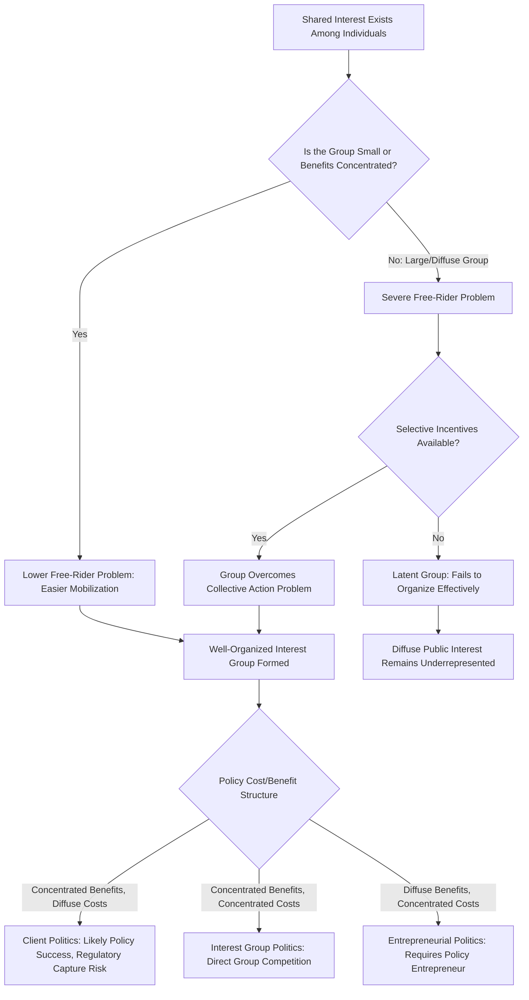

## Theories of Interest Group Politics

### Definition and Scope

Interest group politics is the study of how organized groups — representing shared economic, professional, ideological, or identity-based interests — seek to influence public policy, government decision-making, and the broader political process outside of direct electoral competition. Theories of interest group politics examine why groups form, how they mobilize resources, what tactics they employ, and how their aggregate influence shapes democratic representation and policy outcomes, addressing a foundational question in pluralist democratic theory: whose interests actually get represented in the policymaking process, and through what mechanisms.

### Classical Pluralist Theory

**Core Claims**

Pluralism, most influentially articulated by Robert Dahl (notably in *Who Governs?*, 1961) and David Truman (*The Governmental Process*, 1951), holds that political power in democratic societies is dispersed among numerous competing interest groups, none of which dominates policymaking across all issue areas. Key pluralist propositions include:

- **Multiple, overlapping group memberships**: Individuals belong to multiple groups with potentially cross-cutting interests, moderating the intensity of any single group affiliation and preventing rigid, permanent political cleavages.
- **Open access and group proliferation**: The political system is sufficiently open that any sufficiently motivated and organized interest can form a group and gain access to policymakers, preventing permanent exclusion of any societal interest.
- **Countervailing power**: The mobilization of one interest group tends to stimulate the formation of opposing groups, creating a natural system of checks that prevents any single interest from dominating policy outcomes indefinitely.
- **Government as neutral arbiter**: In the pluralist conception, government institutions function primarily as a neutral marketplace or arena in which competing group interests are processed and balanced, rather than as an independent actor with its own systematic biases.

### Elite Theory — The Critique of Pluralism

Elite theory, associated with scholars including C. Wright Mills (*The Power Elite*, 1956) and later empirically extended by researchers such as Thomas Dye, directly challenges pluralism's core empirical claims:

**Key Points — Elite Theory's Core Arguments**

1. **Concentrated resource advantages**: Business and wealthy interests possess vastly superior financial, organizational, and informational resources compared to diffuse public interests, undermining the pluralist assumption of roughly balanced countervailing power.
2. **Unequal access and influence**: Elite groups (corporate leadership, wealthy donors, established professional associations) enjoy systematically privileged access to policymakers compared to poorly resourced or unorganized constituencies.
3. **Bias in the "mobilization of bias"**: Drawing on E.E. Schattschneider's famous observation that "the flaw in the pluralist heaven is that the heavenly chorus sings with a strong upper-class accent," elite theorists argue the interest group system as a whole systematically privileges already-advantaged interests rather than operating as a genuinely neutral, open marketplace.
4. **Revolving door dynamics**: Elite theorists point to the frequent movement of personnel between government regulatory positions and the industries they regulate as evidence of structural elite interconnection rather than genuine group competition.

### Mancur Olson's Collective Action Theory

Mancur Olson's *The Logic of Collective Action* (1965) provided one of the most influential and analytically rigorous challenges to pluralist assumptions, applying rational choice economic reasoning to explain why interest groups do *not* form as readily or proportionally as pluralist theory would predict, even when large numbers of individuals share a common interest.

**The Collective Action Problem**

Olson's central insight is that most benefits pursued by interest groups constitute **public goods** — non-excludable and non-rival benefits (e.g., cleaner air from environmental regulation, higher prices from an industry tariff) that, once achieved, benefit all members of the relevant group regardless of whether they contributed to the group's advocacy efforts. This creates a powerful incentive for **free-riding**: rational individuals have little incentive to bear the personal costs of participation (dues, time, advocacy effort) when they will receive the resulting benefit regardless of their own contribution.

**Key Points — Olson's Core Propositions**

1. **Small groups organize more easily than large groups**: In small groups, each member's contribution constitutes a larger, more perceptible share of the total effort, and free-riding is more easily detected and socially sanctioned, making successful collective action comparatively more likely.
2. **Concentrated benefits favor mobilization**: Groups pursuing benefits that are concentrated among a small number of members (e.g., a specific industry seeking a tariff) mobilize more readily than groups pursuing benefits diffused across a large population (e.g., consumers who would benefit from lower prices absent that tariff).
3. **Selective incentives solve the free-rider problem**: Successful large-group organizations typically survive not by relying on shared pursuit of the collective public good alone, but by providing **selective incentives** — private, excludable benefits available only to dues-paying members (professional certification, group insurance, exclusive publications, or social/networking benefits) — that provide an independent, non-collective-action-dependent reason for individual participation.
4. **Latent groups and potential group formation**: Large, diffuse "latent groups" (e.g., general consumers, taxpayers) face particularly severe collective action barriers and are systematically less likely to form effective advocacy organizations compared to small, concentrated-interest groups (e.g., specific industries), producing a structural bias in the interest group system that closely parallels elite theory's concerns, though derived from a distinct rational-choice logical foundation rather than elite theory's emphasis on resource inequality per se.

### The Concentrated Benefits, Diffuse Costs Framework

Building directly on Olson's logic, James Q. Wilson's influential typology (*Political Organizations*, 1973) categorizes policy areas based on how costs and benefits are distributed, predicting distinct patterns of interest group mobilization for each:

| Policy Type | Benefits | Costs | Predicted Mobilization Pattern |
| --- | --- | --- | --- |
| Majoritarian Politics | Diffuse | Diffuse | Low mobilization on both sides; general public opinion and ideology drive outcomes |
| Interest Group Politics (Client Politics variant) | Concentrated | Concentrated | Two well-organized opposing groups compete directly (e.g., labor vs. management) |
| Client Politics | Concentrated | Diffuse | Strong mobilization by the beneficiary group; little organized opposition, since costs are too diffuse to motivate counter-organization (classic regulatory capture scenario) |
| Entrepreneurial Politics | Diffuse | Concentrated | Requires a "policy entrepreneur" to overcome weak organic mobilization incentives on the beneficiary side, often relying on media attention, moral framing, or crisis events to build support against a well-organized, concentrated-cost opposing interest |

This framework directly explains phenomena such as **regulatory capture** (client politics scenario, where a concentrated industry interest dominates policy affecting a diffuse public) and helps explain why consumer protection or environmental legislation (entrepreneurial politics scenario) often requires charismatic advocacy leadership or high-salience triggering events to overcome structural collective action disadvantages.

### Neo-Pluralism and Corporatism

**Neo-Pluralism**

Responding to elite theory's critiques while retaining core pluralist commitments, neo-pluralist scholars (notably Charles Lindblom in later work) acknowledged that business interests enjoy a **structurally privileged position** in market economies — since government officials depend on private investment decisions for economic performance (and their own political survival), business interests receive systematically preferential policy consideration even without active, group-specific lobbying, distinguishing this structural advantage from ordinary interest group competition among nominally equal groups.

**Corporatism**

Corporatist theory (associated with Philippe Schmitter and others) describes an alternative institutional model, found prominently in several European welfare states, in which government formally incorporates a limited number of officially recognized "peak" interest organizations (typically a single dominant labor federation and a single dominant employer association) into structured, ongoing tripartite policy negotiation processes — contrasting sharply with the more fragmented, competitive, and numerically unlimited group proliferation characteristic of pluralist systems, particularly the United States.

- **State corporatism**: Government actively creates and controls officially sanctioned interest representation structures, historically associated with authoritarian and some developing-country contexts.
- **Societal/liberal corporatism**: Interest organizations retain autonomy from direct state control but voluntarily participate in institutionalized tripartite bargaining arrangements (government-labor-business), most extensively studied in Northern European contexts.

### Comparative Theoretical Summary

| Theory | Core Claim | Key Scholars |
| --- | --- | --- |
| Pluralism | Power dispersed among competing groups; countervailing power prevents domination | Robert Dahl, David Truman |
| Elite Theory | Power concentrated among resource-advantaged elites; pluralist competition is illusory | C. Wright Mills, Thomas Dye |
| Collective Action Theory | Group formation depends on solving free-rider problems, not merely shared interest | Mancur Olson |
| Concentrated/Diffuse Framework | Mobilization patterns predictable from cost-benefit distribution structure | James Q. Wilson |
| Neo-Pluralism | Business enjoys structural privilege independent of active lobbying | Charles Lindblom |
| Corporatism | Formalized, limited peak-group incorporation into state policymaking | Philippe Schmitter |

### Interest Group Formation and Influence Diagram

### Illustrative Example

**Example**

Consider a proposed regulation requiring costly pollution-control equipment for a specific manufacturing industry, generating diffuse public health benefits but concentrated compliance costs for a small number of firms:

- Under **Wilson's entrepreneurial politics framework**, the diffuse public health beneficiaries (the general population breathing cleaner air) face a severe collective action problem — no individual citizen has sufficient personal incentive to organize, monitor, or heavily invest in advocating for this specific regulation, since the resulting benefit would be shared regardless of individual contribution.
- Meanwhile, the small number of affected manufacturing firms face concentrated costs, giving each firm strong individual incentive to organize opposition (potentially forming or utilizing an existing industry association), consistent with **Olson's prediction** that small groups with concentrated stakes mobilize more readily than large, diffuse beneficiary populations.
- Absent a **policy entrepreneur** — an environmental NGO, an investigative journalist exposing a health crisis, or a politically ambitious legislator building a public profile around the issue — Wilson's framework would predict this regulation faces significant structural difficulty passing despite its aggregate net social benefit, illustrating precisely the systematic bias against diffuse-benefit legislation that both Olson's collective action theory and elite theory identify, albeit through somewhat different theoretical mechanisms.

This example demonstrates how these theories, though originating from different theoretical traditions (rational choice economics versus sociological elite analysis), converge on a similar empirical prediction: policy areas with diffuse benefits and concentrated costs face systematic organizational and political disadvantages relative to policy areas with the reverse structure.

### Contemporary Developments and Applications

- **Astroturfing and manufactured grassroots mobilization**: Contemporary interest group scholarship examines how well-resourced interests sometimes create the appearance of organic, diffuse grassroots support ("astroturf" campaigns) specifically to overcome the collective action disadvantages Olson's theory predicts for genuinely diffuse interests — a strategic response that itself confirms rather than refutes the underlying collective action logic.
- **Digital mobilization and reduced coordination costs**: Social media and digital organizing tools have been argued to reduce some traditional collective action barriers by lowering coordination and communication costs for diffuse interests, potentially enabling more effective mobilization of previously latent groups. [Inference: the degree to which digital tools genuinely overcome Olson's structural free-rider logic, as opposed to merely reducing certain coordination costs while leaving the core incentive problem intact, remains an active and unsettled area of research.]
- **Interest group influence measurement challenges**: A persistent methodological challenge in this literature concerns accurately measuring actual interest group *influence* on policy outcomes (as opposed to merely observing lobbying expenditure or group formation), since influence often operates through indirect, difficult-to-observe channels (agenda control, information provision, relationship-building) rather than easily quantifiable direct causation.
- **Comparative interest group system variation**: Interest group systems vary substantially across countries in their degree of pluralist fragmentation versus corporatist institutionalization, with implications for policy stability, the pace of policy change, and the relative influence of business versus labor interests in different national political economies.

**Next Steps**

- Study Mancur Olson's *The Logic of Collective Action* in its original formulation as a foundational rational-choice text underlying much subsequent interest group research.
- Examine James Q. Wilson's concentrated/diffuse benefits-costs typology alongside specific historical case studies illustrating each policy type.
- Explore comparative corporatism research, particularly Northern European tripartite bargaining institutions, as a contrast to pluralist interest group systems.
- Investigate regulatory capture theory and its relationship to the client politics framework in greater depth.

**Related Topics**

- Lobbying Strategies and Techniques
- Regulatory Capture Theory
- Political Culture in Comparative Perspective
- Political Parties and Party Systems
- Civil Society and Social Movement Theory
- Corporatism and Tripartite Bargaining Institutions
- Public Choice Theory and Rational Choice Institutionalism