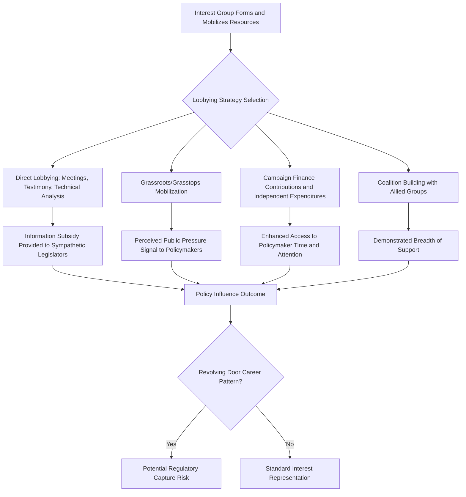

## Lobbying and Political Influence

### Definition and Conceptual Scope

Lobbying refers to the deliberate effort by individuals, organizations, or interest groups to influence the decisions of government officials — legislators, executives, regulators, or bureaucratic agencies — regarding legislation, regulation, appropriations, or other policy outcomes. Political influence, more broadly, encompasses the full range of mechanisms through which non-governmental actors shape political decision-making, extending beyond formal registered lobbying to include campaign finance, public advocacy campaigns, and informal access and relationship-building.

This topic builds directly on the collective action and mobilization theories examined in the preceding discussion of interest group politics, focusing specifically on the tactical and institutional mechanisms through which mobilized groups translate organizational capacity into actual policy influence.

### Types of Lobbying

**Key Points — Direct versus Indirect Lobbying**

1. **Direct Lobbying** — Face-to-face or direct communication between lobbyists and government officials or their staff, including meetings, testimony at legislative hearings, provision of technical policy analysis, and direct advocacy for specific legislative language or regulatory outcomes.
2. **Indirect/Grassroots Lobbying** — Efforts to mobilize public pressure on officials indirectly, by encouraging constituents, members, or the general public to contact officials, participate in public comment processes, or otherwise generate visible public pressure supporting the group's position.
3. **Grasstops Lobbying** — A hybrid approach mobilizing influential, high-status individuals within a policymaker's constituency or social network (community leaders, major donors, respected local figures) to convey a message with greater credibility or access than either purely professional lobbyists or ordinary grassroots constituents.
4. **Coalition Lobbying** — Multiple organizations, sometimes with otherwise divergent interests, forming temporary alliances around a shared specific policy goal to pool resources and demonstrate broader support than any single organization could independently claim.

### The Information Provision Model of Lobbying

A substantial body of political science research, particularly in formal/rational-choice traditions, models lobbying not primarily as an exchange of resources for policy favors, but as a mechanism for **strategic information provision** to resource-constrained, information-poor legislators and regulators.

**Key Points — Information-Based Lobbying Theory**

1. **Legislator information constraints**: Legislators and their staff face severe time and expertise constraints across the wide range of policy areas they must address, creating genuine demand for specialized technical information that well-resourced interest groups can supply.
2. **Legislative subsidy model** (associated with Richard Hall and Alan Deardorff): Proposes that lobbyists function less as persuaders changing legislators' minds against their prior preferences, and more as a "subsidy" providing policy-relevant research, drafting assistance, and political intelligence to *already sympathetic* legislators, helping them pursue shared goals more effectively rather than converting opponents.
3. **Access rather than persuasion**: This model implies that lobbying primarily secures *access* to sympathetic policymakers and enhances the effectiveness of legislators already inclined toward a group's position, rather than functioning primarily as a persuasive tool aimed at converting opposed or undecided officials.
4. **Credibility and reputation effects**: Because legislators rely on lobbyist-provided information, lobbying organizations that develop reputations for providing accurate, reliable information tend to gain greater long-term access and influence than those perceived as providing biased or unreliable information, creating a market-like reputational incentive structure.

### Campaign Finance as a Political Influence Mechanism

**Key Concepts**

- **Political Action Committees (PACs)**: Organizations that pool campaign contributions from members or employees and direct them to candidates, providing a formal, legally regulated conduit connecting interest group resources to electoral campaign finance.
- **Independent expenditures**: Campaign-related spending made independently of, and without coordination with, a candidate's campaign, subject to differing legal treatment than direct contributions in many jurisdictions (e.g., the U.S. Supreme Court's *Citizens United v. FEC*, 2010, which significantly expanded permissible independent corporate and union campaign expenditures).
- **Access versus quid pro quo theories of campaign finance influence**: Political science research distinguishes between campaign contributions functioning as outright vote-buying (**quid pro quo**, generally illegal and empirically rare in direct, provable form) versus contributions primarily securing enhanced **access** to policymakers' time and attention — a more subtle, harder-to-regulate, but empirically better-supported mechanism of influence in most studied democracies. [Inference: the precise empirical magnitude of campaign finance's causal effect on legislative voting behavior, as distinct from simple correlation (donors giving to legislators who already agree with them), remains a genuinely difficult methodological problem in this literature, and findings vary depending on research design and context studied.]
- **Comparative campaign finance regulation**: Democracies vary substantially in campaign finance regulatory approaches, ranging from relatively permissive systems (emphasizing disclosure over spending limits) to systems with strict contribution and spending caps combined with public campaign financing, with significant cross-national variation in the resulting role of private money in electoral politics.

### The Revolving Door Phenomenon

The **"revolving door"** describes the recurring career pattern in which individuals move between government positions (legislative staff, regulatory agency roles, executive branch appointments) and private-sector lobbying or industry positions, often repeatedly across a career. This phenomenon raises distinct theoretical and normative concerns:

- **Information/expertise transfer concern**: Officials who move to industry lobbying positions bring valuable insider knowledge of government processes and personal relationships with former colleagues, potentially providing their new employers disproportionate access and influence compared to outside interests.
- **Regulatory capture connection**: The revolving door is frequently cited as a contributing mechanism to **regulatory capture** (discussed in the interest group politics framework via Wilson's "client politics" category), since regulators anticipating future industry employment may have incentives to maintain favorable relationships with the industries they regulate even during their government tenure.
- **Cooling-off periods**: Many jurisdictions impose mandatory waiting periods ("cooling-off periods") restricting former officials from immediately lobbying their former government colleagues or agency, as a partial regulatory response to revolving-door concerns, though the effectiveness and enforcement rigor of such restrictions vary substantially across jurisdictions. [Inference: specific cooling-off period durations and enforcement mechanisms differ significantly by country and level of government, and current statutory provisions should be verified against the specific jurisdiction in question.]

### Regulatory and Legal Frameworks Governing Lobbying

Democracies vary considerably in how they regulate lobbying activity, generally along several key dimensions:

**Key Points — Common Regulatory Approaches**

1. **Registration and disclosure requirements**: Many jurisdictions require professional lobbyists to formally register and periodically disclose their clients, lobbying targets, and (in some jurisdictions) expenditure amounts, intended to enhance transparency regarding who is attempting to influence which policymakers.
2. **Gift and hospitality restrictions**: Rules limiting or prohibiting gifts, meals, travel, or other hospitality that lobbyists may provide to government officials, aimed at reducing the risk of undue personal influence unrelated to the substantive merits of policy arguments.
3. **Contact/meeting disclosure logs**: Some jurisdictions require officials to maintain and publish logs of meetings with registered lobbyists, providing a public record of access patterns.
4. **Campaign contribution limits and disclosure**: As discussed above, most democracies impose some combination of contribution limits and mandatory disclosure requirements on campaign finance, though the stringency and comprehensiveness of these regimes vary substantially.
5. **Enforcement and compliance gaps**: A recurring concern in comparative lobbying regulation research is the gap between formal disclosure requirements and actual compliance/enforcement rigor, since lobbying disclosure regimes are frequently under-resourced for robust monitoring and enforcement relative to the scale of lobbying activity they are meant to track. [Inference: the specific degree of underenforcement varies substantially across jurisdictions and is difficult to measure precisely without dedicated compliance audits.]

### Lobbying Influence Pathway Diagram

### Illustrative Example

**Example**

Consider a pharmaceutical industry association seeking to influence proposed drug-pricing regulation:

- The association's **direct lobbyists** meet with legislative staff on relevant committees, providing detailed technical analysis of the proposed regulation's projected effects on drug development investment — consistent with the **information subsidy model**, this activity primarily reinforces and equips already-sympathetic legislators rather than attempting to convert firmly opposed ones.
- Simultaneously, the association's **PAC** directs campaign contributions to key committee members, plausibly functioning primarily to secure enhanced **access** for the association's lobbyists to those legislators' time, rather than constituting a direct, provable vote-purchase.
- The association also organizes a **grassroots campaign**, encouraging patients who benefit from the company's medications to contact their representatives directly, adding a public-facing constituent pressure dimension to the technical lobbying effort.
- A former senior official from the relevant regulatory agency, now employed by the association through the **revolving door**, leverages personal relationships with former colleagues to secure informal early insight into the regulation's likely direction — illustrating the distinct, relationship-based influence channel that formal registration and disclosure requirements are specifically designed to make more transparent.

This example illustrates how multiple influence mechanisms typically operate simultaneously and reinforce one another within a single lobbying campaign, rather than any single tactic operating in isolation.

### Measuring Lobbying Influence — Methodological Challenges

Political science research faces persistent methodological difficulty in establishing lobbying's actual **causal influence** on policy outcomes, as distinct from mere correlation between lobbying activity and favorable outcomes:

- **Selection effects**: Interest groups may lobby legislators who already agree with them (to reinforce and equip them, per the information subsidy model), making it difficult to distinguish lobbying's causal persuasive effect from simple strategic targeting of already-sympathetic officials.
- **Counterfactual difficulty**: Establishing what policy outcome would have occurred absent a specific lobbying campaign requires a counterfactual comparison that is inherently difficult to construct with confidence in most real-world policy contexts.
- **Indirect and cumulative effects**: Lobbying influence often operates cumulatively over extended periods (shaping the general policy agenda, framing issues, building long-term relationships) rather than through single, discrete, easily traceable causal events tied to specific legislative votes.

### Comparative and Developing-Democracy Considerations

- **Formal versus informal influence channels**: In many developing and transitional democracies, formal registered-lobbying regulatory frameworks may be less developed or less rigorously enforced than in established Western democracies, with political influence often exercised through informal personal networks, patron-client relationships, or direct financial relationships that fall outside formal lobbying disclosure regimes.
- **Business associations in developing economies**: Business chambers and industry associations frequently play a particularly prominent lobbying/advocacy role in developing-economy contexts, given their comparatively greater organizational capacity relative to diffuse public interests, consistent with Olson's and Wilson's predictions regarding concentrated-interest mobilization advantages.
- **Local government lobbying dynamics**: Lobbying and influence-seeking also occur prominently at the local government level (regarding permits, zoning, procurement contracts, and local ordinances), often through more informal and personalized channels than national-level lobbying, given the comparatively smaller scale and greater relational proximity between local officials and affected local interests.

**Next Steps**

- Study the legislative subsidy model (Hall and Deardorff) in its original formulation as the leading contemporary information-based theory of lobbying.
- Examine campaign finance regulation comparatively across democracies with differing regulatory approaches (contribution limits, public financing, disclosure regimes).
- Explore regulatory capture theory and revolving-door research in greater methodological depth.
- Investigate empirical research methodologies used to estimate lobbying's causal policy influence despite the selection-effect and counterfactual challenges described above.

**Related Topics**

- Theories of Interest Group Politics
- Regulatory Capture Theory
- Campaign Finance Regulation
- Bureaucratic Accountability and Oversight
- Political Parties and Party Systems
- Corporatism and Tripartite Bargaining Institutions
- Civil Society and Social Movement Theory