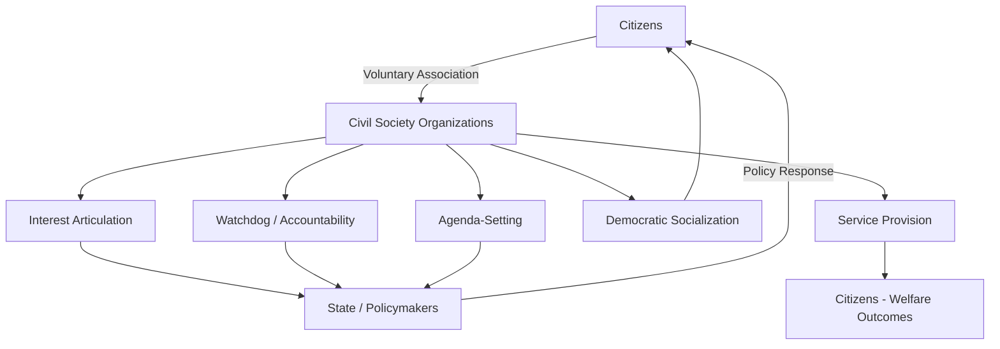
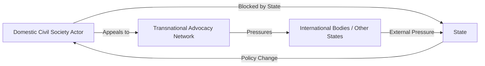

## Civil Society and its Political Role

### Definition and Conceptual Boundaries

Civil society refers to the sphere of voluntary collective action distinct from the state, the market, and the private sphere of the family. It encompasses the associations, organizations, and networks through which citizens pursue shared interests, values, or identities outside of formal governmental structures and profit-oriented enterprises.

**Key Points**

- Civil society is analytically separated from three other spheres: the **state** (coercive public authority), the **market** (profit-driven exchange), and the **private/family sphere** (intimate personal relations)
- It occupies what political theorists often call the "third sector" or "associational space"
- Membership and participation are voluntary rather than compulsory (unlike citizenship in the state) or contractual in the market sense
- Civil society organizations (CSOs) can range from informal neighborhood groups to highly institutionalized international NGOs

The boundaries are not always sharp. [Inference] Some scholars treat political parties as borderline cases, since parties mobilize citizens voluntarily but also seek to capture state power directly, which distinguishes them from most civil society actors that seek to *influence* rather than *occupy* government.

### Historical and Theoretical Development

#### Classical and Enlightenment Roots

The concept traces to Enlightenment social contract theory, where "civil society" (societas civilis) initially referred broadly to organized political community as opposed to a "state of nature." Thinkers such as John Locke and later Adam Ferguson used the term closer to what we would now call organized society under law.

#### Hegel and the Separation from the State

Georg Wilhelm Friedrich Hegel's *Philosophy of Right* (1821) marked a conceptual turning point by distinguishing civil society (*bürgerliche Gesellschaft*) from both the family and the state. For Hegel, civil society was the realm of economic and associational life mediating between private family interests and universal state authority.

#### Tocqueville and Associational Democracy

Alexis de Tocqueville's *Democracy in America* (1835–1840) emphasized voluntary associations as schools of democratic citizenship. He argued that Americans' propensity to form associations counterbalanced both centralized state power and the atomizing tendencies of individualism.

#### Gramsci and Hegemony

Antonio Gramsci reconceptualized civil society as a site of ideological struggle. In his *Prison Notebooks*, civil society is where hegemony — the cultural and ideological dominance of a ruling class — is constructed and contested, distinct from "political society" (the coercive apparatus of the state).

#### Contemporary Revival (1980s–1990s)

The concept experienced a major revival through:

- Anti-communist dissident movements in Eastern Europe (e.g., Solidarity in Poland, Charter 77 in Czechoslovakia), where "civil society" described autonomous social organization resisting authoritarian state control
- Latin American democratization scholarship analyzing transitions from military rule
- Post–Cold War democracy promotion discourse, where international donors framed civil society strengthening as central to democratic consolidation

**Key Points**

- Hegel: civil society as intermediate sphere between family and state
- Tocqueville: associations as democratic training grounds
- Gramsci: civil society as terrain of hegemonic struggle
- 1980s–1990s revival: civil society as counterweight to authoritarianism

### Core Components of Civil Society

Civil society is not a single organizational type but a composite of overlapping sectors.

| Component | Examples | Primary Function |
| --- | --- | --- |
| Non-governmental organizations (NGOs) | Human rights groups, development agencies | Advocacy, service delivery |
| Community-based organizations (CBOs) | Neighborhood associations, self-help groups | Local mobilization, mutual aid |
| Labor unions | Trade unions, professional associations | Interest representation for workers |
| Faith-based organizations | Churches, mosques, temples, religious charities | Moral community, social services |
| Media and independent press | Newspapers, investigative outlets | Information provision, watchdog function |
| Academic and think tank institutions | Universities, policy research centers | Knowledge production, policy analysis |
| Social movements | Environmental, feminist, civil rights movements | Contentious mobilization for change |
| Diaspora and transnational networks | Global advocacy coalitions | Cross-border solidarity and pressure |

### Theoretical Models of Civil Society's Political Role

#### Liberal-Pluralist Model

Civil society is understood as a marketplace of competing interest groups that check state power and articulate diverse societal demands. This model draws on pluralist political theory (Robert Dahl, David Truman), where democracy functions through the aggregation and negotiation of group interests.

#### Neo-Tocquevillian / Social Capital Model

Associated with Robert Putnam's work (*Bowling Alone*, 2000), this model emphasizes civil society's role in generating **social capital** — networks of trust and reciprocity that facilitate cooperation and democratic governance.

$$SC = f(N, T, R)$$

Where $SC$ represents social capital as a function of network density ($N$), generalized trust ($T$), and norms of reciprocity ($R$). [Inference] This is a conceptual heuristic used to illustrate the relationship rather than a formal equation found verbatim in Putnam's text.

#### Habermasian Public Sphere Model

Jürgen Habermas's concept of the **public sphere** (*Öffentlichkeit*) frames civil society as the associational infrastructure enabling rational-critical public deliberation, which in turn legitimates or challenges state authority.

#### Gramscian/Critical Model

Civil society is a contested terrain rather than a neutral space of cooperation. Dominant groups use civil society institutions (media, education, religion) to manufacture consent, while counter-hegemonic movements use the same terrain to challenge existing power structures.

#### Neo-Tocquevillian Democratization Model

In transitions literature (Linz and Stepan; Diamond), a robust civil society is treated as a precondition and safeguard for democratic consolidation, providing checks against authoritarian reversal and channels for citizen participation between elections.

**Key Points**

- Pluralist model: civil society aggregates competing interests
- Social capital model: civil society builds trust networks (Putnam)
- Public sphere model: civil society enables deliberation (Habermas)
- Gramscian model: civil society as ideological battleground
- Democratization model: civil society as democratic safeguard

### Functions of Civil Society in Political Systems

#### 1. Interest Articulation and Aggregation

CSOs translate diffuse citizen preferences into organized demands presented to policymakers, functioning alongside (and sometimes in tension with) political parties.

#### 2. Government Accountability and Oversight (Watchdog Function)

Independent media, anti-corruption NGOs, and audit-focused organizations monitor state conduct, expose malfeasance, and pressure for transparency.

#### 3. Democratic Socialization

Participation in voluntary associations cultivates civic skills — negotiation, deliberation, leadership — that translate into broader political competence, per Tocquevillian and social capital theories.

#### 4. Service Provision

In contexts of state weakness or retrenchment, civil society organizations often supply welfare, education, or humanitarian services (e.g., faith-based charities, international NGOs in fragile states).

#### 5. Policy Innovation and Agenda-Setting

Think tanks and advocacy coalitions generate policy proposals and place new issues on the political agenda (e.g., environmental civil society driving climate policy discourse).

#### 6. Conflict Mediation and Social Cohesion

Cross-cutting associational membership can reduce polarization by fostering contact across social cleavages, though [Inference] this effect is contingent on the associations being genuinely heterogeneous rather than homogeneous "bonding" groups.

#### 7. Resistance and Regime Change

Civil society mobilization has historically played a central role in toppling authoritarian regimes (e.g., People Power in the Philippines 1986, the Arab Spring 2010–2011, Solidarity in Poland).

### Civil Society and the State: Relationship Typologies

The relationship between civil society and state authority varies significantly across regime types.

| Regime Context | Typical Civil Society Role | Illustrative Pattern |
| --- | --- | --- |
| Liberal democracy | Autonomous, pluralistic, legally protected | Multiple competing CSOs, formal consultation channels |
| Illiberal/hybrid regime | Constrained, selectively tolerated | "GONGOs" (government-organized NGOs), restrictive registration laws |
| Authoritarian regime | Suppressed or co-opted | Civil society space closed or channeled through state-controlled corporatist structures |
| Post-conflict/transitional state | Often externally funded and donor-dependent | Heavy presence of international NGOs alongside nascent local CSOs |

#### State Corporatism vs. Societal Pluralism

Philippe Schmitter's classic distinction is directly relevant:

- **State corporatism**: the state licenses and controls a limited number of officially recognized interest associations (common in authoritarian or semi-authoritarian systems)
- **Societal corporatism / pluralism**: associations form autonomously and compete for influence without direct state licensing (more typical of liberal democracies)

**Example**

A comparative illustration: labor unions in liberal democracies (e.g., the United States, United Kingdom) generally register and organize independently of state approval, whereas in some historically corporatist or authoritarian contexts, only state-sanctioned labor federations were permitted to exist, with independent unions banned or absorbed.

### Civil Society Shrinking Space Phenomenon

Since roughly the mid-2000s, scholars and organizations such as CIVICUS have documented a global trend of **shrinking civic space**, wherein governments across regime types adopt restrictive measures against civil society.

#### Common Mechanisms

- **Foreign agent laws**: legislation requiring NGOs receiving foreign funding to register as "foreign agents," often stigmatizing them (e.g., Russia's 2012 Foreign Agents Law, later expanded)
- **NGO registration barriers**: onerous bureaucratic requirements that delay or deny legal status
- **Criminalization of protest**: laws restricting assembly, requiring permits, or imposing harsh penalties for unauthorized demonstrations
- **Digital surveillance and internet shutdowns**: state monitoring or blocking of civil society communication and mobilization tools
- **Physical repression**: harassment, detention, or violence against activists and journalists

[Unverified] Precise cross-national rankings of civic space restriction fluctuate year to year and depend on the specific monitoring methodology (e.g., CIVICUS Monitor categories of "open," "narrowed," "obstructed," "repressed," "closed"), so specific country classifications should be checked against current-year reporting rather than treated as static.

### Civil Society and Social Movements: Distinctions and Overlaps

Within the broader chapter framing of interest groups, civil society, and social movements, it is useful to distinguish these three categories precisely.

| Feature | Interest Groups | Civil Society (Broad) | Social Movements |
| --- | --- | --- | --- |
| Organizational formality | Usually formal, institutionalized | Spans formal to informal | Often informal, network-based |
| Primary tactic | Lobbying, insider access | Varies widely | Contentious politics (protest, disruption) |
| Relationship to state | Seeks influence via established channels | Encompasses both insider and outsider actors | Often positioned outside/against institutional channels |
| Temporal pattern | Persistent, ongoing | Persistent, ongoing | Often cyclical, episodic (rise and decline) |
| Scope example | Chamber of Commerce, trade unions (as lobbyists) | The associational sector as a whole | Civil rights movement, #MeToo, climate strikes |

[Inference] Social movements are often analytically treated as a *subset* or *dynamic expression* of civil society activity, particularly when movements formalize into organizations (a process social movement theorists call "institutionalization").

### Transnational Civil Society

Globalization has produced civil society actors operating beyond national borders.

#### Key Manifestations

- **International NGOs (INGOs)**: Amnesty International, Human Rights Watch, Oxfam
- **Transnational advocacy networks (TANs)**: coalitions of domestic and international actors sharing information and pressuring multiple governments simultaneously (Keck and Sikkink's concept)
- **Global civil society forums**: World Social Forum as a counter-institution to the World Economic Forum
- **Boomerang pattern**: domestic activists blocked by their own state appeal to international allies who pressure the state from outside, producing a "boomerang" effect back onto domestic policy

### Measuring Civil Society Strength

Comparative political scientists use several indices and proxies:

- **CIVICUS Monitor**: categorizes civic space as open, narrowed, obstructed, repressed, or closed
- **V-Dem (Varieties of Democracy) Civil Society Index**: measures indicators such as associational autonomy, entry/exit barriers to civil society, and CSO participatory environment
- **Freedom House indicators**: associational and organizational rights sub-scores within broader freedom ratings
- **Putnam-style social capital surveys**: measure associational membership density and generalized trust via survey instruments

[Inference] No single index is universally accepted as definitive; scholars typically triangulate across multiple measures because each instrument reflects different underlying assumptions about what constitutes "strong" civil society (autonomy vs. density vs. trust).

### Critiques and Limitations of the Civil Society Concept

#### 1. Normative Overload

Critics argue "civil society" is often used as an unqualified normative good, obscuring the fact that associational life can also incubate illiberal or exclusionary movements (e.g., ethno-nationalist associations, militia networks). [Inference] This critique implies that civil society strength alone is not a reliable predictor of democratic outcomes without attention to the substantive orientation of the associations involved.

#### 2. Elite Capture and NGO-ization

Scholars such as those in critical development studies argue that professionalized NGOs can become disconnected from grassroots constituencies, dependent on donor agendas rather than local demands — a phenomenon termed "NGO-ization" of social movements.

#### 3. Western Bias in Conceptualization

The classical civil society framework emerged from European and North American historical experience; applying it uncritically to non-Western contexts risks overlooking indigenous forms of collective organization that do not map neatly onto the state/market/civil-society trichotomy.

#### 4. Donor Dependency

In many developing and post-conflict states, civil society organizations rely heavily on international donor funding, raising questions about sustainability and genuine local accountability versus accountability to external funders.

**Key Points**

- Civil society is not inherently pro-democratic; it can house illiberal actors
- NGO professionalization can create distance from grassroots bases
- The concept has Western historical origins that may not generalize universally
- Donor dependency can compromise organizational autonomy

### Illustrative Diagram: Civil Society's Position in the Political System

<svg xmlns="http://www.w3.org/2000/svg" viewBox="0 0 700 420" font-family="Arial, sans-serif">
<text x="350" y="30" text-anchor="middle" font-size="18" font-weight="bold" fill="#1a1a2e">Spheres of Political-Social Life (svg_diagram)</text>
<circle cx="200" cy="220" r="150" fill="#a2d2ff" fill-opacity="0.5" stroke="#1a1a2e" stroke-width="2" />
<text x="200" y="120" text-anchor="middle" font-size="16" font-weight="bold" fill="#1a1a2e">State</text>
<circle cx="500" cy="220" r="150" fill="#ffafcc" fill-opacity="0.5" stroke="#1a1a2e" stroke-width="2" />
<text x="500" y="120" text-anchor="middle" font-size="16" font-weight="bold" fill="#1a1a2e">Market</text>
<circle cx="350" cy="330" r="150" fill="#bde0fe" fill-opacity="0.5" stroke="#1a1a2e" stroke-width="2" />
<text x="350" y="440" text-anchor="middle" font-size="16" font-weight="bold" fill="#1a1a2e">Family / Private Sphere</text>
<ellipse cx="350" cy="240" rx="110" ry="80" fill="#cdb4db" fill-opacity="0.7" stroke="#1a1a2e" stroke-width="2" />
<text x="350" y="235" text-anchor="middle" font-size="15" font-weight="bold" fill="#1a1a2e">Civil</text>
<text x="350" y="255" text-anchor="middle" font-size="15" font-weight="bold" fill="#1a1a2e">Society</text>

<text x="60" y="230" font-size="11" fill="`#1a1a2e`">Coercive authority,</text>

<text x="60" y="245" font-size="11" fill="`#1a1a2e`">law, public policy</text>

<text x="530" y="230" font-size="11" fill="`#1a1a2e`">Profit-driven</text>

<text x="530" y="245" font-size="11" fill="`#1a1a2e`">exchange</text>

<text x="300" y="395" font-size="11" fill="`#1a1a2e`">Intimate, personal</text>

<text x="300" y="410" font-size="11" fill="`#1a1a2e`">relations</text>

</svg>

### Case Illustrations

**Example**

- **Poland's Solidarity movement (1980s)**: an independent trade union that grew into a broad civil society coalition, ultimately contributing to the collapse of communist rule and Poland's democratic transition
- **Indian RTI (Right to Information) movement**: grassroots civil society campaigning (led by groups such as the Mazdoor Kisan Shakti Sangathan) that pressured the Indian state into passing the Right to Information Act (2005), enhancing government transparency
- **South African anti-apartheid civil society**: church groups, trade unions (e.g., COSATU), and community organizations that formed the United Democratic Front, playing a central role in dismantling apartheid alongside formal political opposition

### Conclusion

Civil society occupies a structurally distinct but politically consequential space between the state, the market, and the private sphere. Its political role spans interest articulation, government oversight, democratic socialization, service delivery, and — in more contentious moments — direct resistance to authoritarian rule. Theoretical traditions ranging from Tocquevillian associationalism to Gramscian hegemony analysis offer complementary rather than mutually exclusive lenses for understanding this role. Contemporary scholarship increasingly emphasizes that civil society's political effects are contingent: strength alone does not guarantee democratic outcomes, and the same associational infrastructure can serve both liberalizing and illiberal political projects depending on context, funding structures, and the substantive goals of the organizations involved.

**Related Topics**

- Interest group theory and lobbying strategies (pluralism vs. corporatism)
- Social movement theory: resource mobilization, political opportunity structure, framing theory
- Political parties versus civil society organizations as channels of representation
- The Habermasian public sphere and deliberative democracy
- Authoritarian resilience and co-optation strategies toward civil society
- Transnational advocacy networks and the "boomerang effect" (Keck and Sikkink)
- NGO-ization and the professionalization of grassroots movements
- Comparative measurement of democracy and civic space (V-Dem, Freedom House, CIVICUS)
- Social capital theory and its critics (Putnam vs. critics of "bonding" social capital)
- Media freedom and the watchdog function within civil society