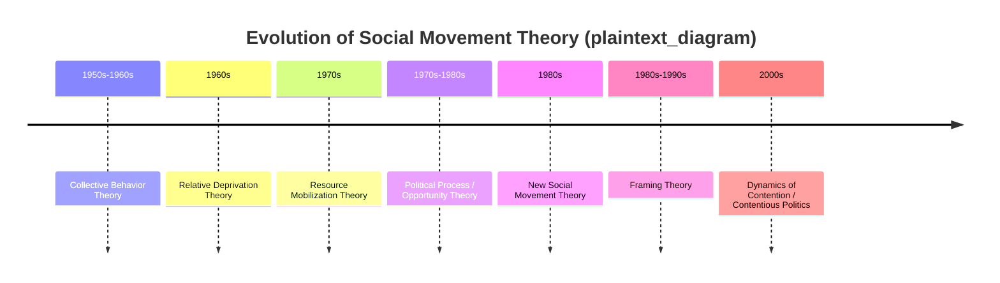
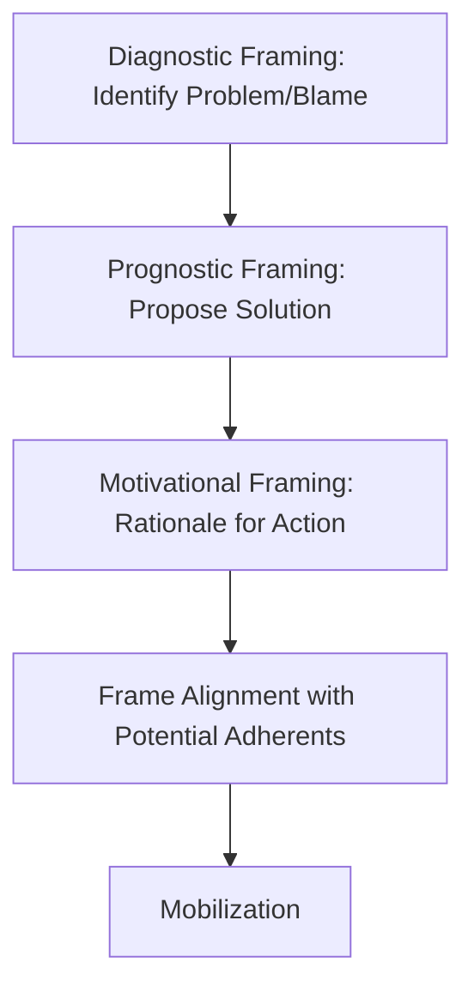
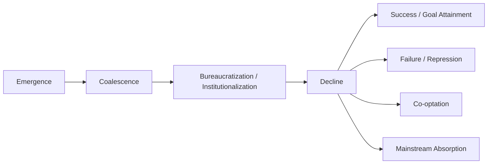

## Social Movement Theory

### Definition and Scope

Social movement theory is the body of political science and sociological scholarship that explains why, how, and when collective actors mobilize outside institutionalized political channels to pursue or resist social change. It addresses the emergence, dynamics, strategies, and outcomes of sustained collective action organized around shared grievances, identities, or goals.

**Key Points**

- A **social movement** is generally defined as a sustained, organized effort by a group of people using non-institutional and/or institutional tactics to promote or resist change in society
- Social movement theory sits at the intersection of political science, sociology, and social psychology
- It has evolved through several distinct theoretical paradigms, each responding to perceived weaknesses in its predecessors

### Historical Development of the Field

#### Classical Collective Behavior Theory (1950s–1960s)

Early approaches, associated with scholars such as Neil Smelser and Herbert Blumer, treated social movements as a subset of "collective behavior" alongside crowds, riots, and panics. This tradition emphasized:

- Psychological strain and structural breakdown as root causes
- Movements as relatively irrational, emotion-driven responses to social disorganization
- A sharp analytical distinction between "normal" institutional politics and "abnormal" collective behavior

[Inference] This paradigm is now largely regarded as superseded within mainstream political science, primarily because it struggled to explain the strategic, organized character of many actual movements, but it remains historically important as the baseline against which later theories defined themselves.

#### Relative Deprivation Theory (1960s)

Drawing on social-psychological research (Ted Gurr's *Why Men Rebel*, 1970), this approach argued that discontent arises not from absolute poverty but from a perceived gap between expectations and actual conditions.

$$RD = E - A$$

Where $RD$ is relative deprivation, $E$ is expected achievement/status, and $A$ is actual achievement/status. [Inference] This is a simplified conceptual representation used pedagogically to summarize the theory's core logic rather than a precise formula found verbatim in the original texts.

#### Resource Mobilization Theory (RMT) (1970s)

Developed prominently by John McCarthy and Mayer Zald, RMT shifted the analytical focus from grievances (assumed to be relatively constant) to the **resources** movements need to mobilize successfully.

**Key Points**

- Grievances alone do not explain mobilization, since discontent is often widespread but movements are rare
- Movements succeed based on access to money, labor, organizational infrastructure, media access, and leadership
- Introduced the concept of the **social movement organization (SMO)** as the formal vehicle for mobilization
- Highlighted the role of "conscience constituents" — external supporters (donors, elites) who provide resources without being direct beneficiaries of the movement's goals

#### Political Process / Political Opportunity Theory (1970s–1980s)

Associated with Charles Tilly, Doug McAdam, and Sidney Tarrow, this framework argues that movement emergence and success depend heavily on the broader political context, not just internal resources.

**Key Points**

- **Political opportunity structure (POS)**: the degree to which the political system is open or closed to challengers, including elite divisions, allies within institutions, and state capacity for repression
- Movements are more likely to emerge and succeed when opportunities open (e.g., elite fragmentation, electoral realignment, weakening state capacity)
- McAdam's *Political Process and the Development of Black Insurgency* (1982) is a foundational text applying this model to the U.S. civil rights movement

#### Framing Theory (1980s–1990s)

Developed by David Snow, Robert Benford, and colleagues, framing theory addresses how movements construct meaning to mobilize adherents and legitimate their cause.

**Key Points**

- **Diagnostic framing**: identifying a problem and assigning blame
- **Prognostic framing**: proposing solutions and strategies
- **Motivational framing**: providing a rationale for action ("call to arms")
- **Frame alignment processes**: bridging, amplification, extension, and transformation — mechanisms by which movements connect their framing to the pre-existing beliefs of potential adherents

#### New Social Movement (NSM) Theory (1980s, primarily European)

Associated with Alain Touraine, Alberto Melucci, and Jürgen Habermas, NSM theory emerged to explain movements less centered on class/material distribution and more on identity, culture, and quality-of-life concerns (e.g., environmentalism, feminism, LGBTQ+ rights, peace movements).

**Key Points**

- Contrasted with "old" labor-based movements organized primarily around economic redistribution
- Emphasized post-materialist values (drawing on Ronald Inglehart's post-materialism thesis)
- Focused on identity construction and cultural contestation, not only instrumental political goals

#### Dynamics of Contention / Contentious Politics Approach (2000s)

McAdam, Tarrow, and Tilly's *Dynamics of Contention* (2001) sought to synthesize prior approaches by focusing on underlying causal **mechanisms and processes** common across different forms of contention (revolutions, social movements, ethnic conflict, nationalism) rather than treating each as a separate category requiring its own theory.

**Key Points**

- Identifies recurring mechanisms such as brokerage, diffusion, certification, and boundary activation
- Moves away from static structural models toward dynamic, relational, and processual analysis
- Treats social movements as one form within the broader universe of "contentious politics"

### Comparative Summary of Major Paradigms

| Theory | Core Explanatory Variable | Key Theorists | Approximate Era |
| --- | --- | --- | --- |
| Collective Behavior | Psychological strain, structural breakdown | Smelser, Blumer | 1950s–1960s |
| Relative Deprivation | Perceived gap between expectation and reality | Gurr | 1960s |
| Resource Mobilization | Access to organizational resources | McCarthy, Zald | 1970s |
| Political Process/Opportunity | Openness of political system | Tilly, McAdam, Tarrow | 1970s–1980s |
| Framing Theory | Meaning-construction and interpretation | Snow, Benford | 1980s–1990s |
| New Social Movements | Identity, culture, post-materialist values | Touraine, Melucci, Habermas | 1980s |
| Contentious Politics/Dynamics of Contention | Causal mechanisms across contention types | McAdam, Tarrow, Tilly | 2000s |

### Core Analytical Concepts

#### Political Opportunity Structure (POS)

A framework for assessing how features of the political environment shape movement prospects. Commonly cited dimensions (Tarrow's formulation):

- Relative openness or closure of formal political access
- Stability or instability of elite alignments
- Presence or absence of elite allies
- The state's capacity and propensity for repression

#### Resource Mobilization Components

| Resource Type | Examples |
| --- | --- |
| Material | Funding, equipment, physical space |
| Human | Volunteer labor, activist time, skilled personnel |
| Organizational | Formal SMOs, coalitions, communication infrastructure |
| Moral | Legitimacy, solidarity support, celebrity endorsement |
| Cultural | Shared symbols, tactical repertoires, know-how |

#### Framing Processes (Snow and Benford)

#### Repertoires of Contention

Charles Tilly's concept describing the historically and culturally bounded set of tactics available to challengers at a given time and place (e.g., petitions, strikes, boycotts, sit-ins, marches, digital activism). [Inference] Repertoires evolve over time and diffuse across movements through processes of imitation and innovation, though the specific pace of diffusion in any given case is empirically variable.

#### Collective Identity

Alberto Melucci's concept referring to the shared definition a group constructs of itself, its goals, and its relationship to its environment — considered essential for sustaining participation, especially in NSM contexts where instrumental incentives alone are insufficient to explain commitment.

#### Free-Rider Problem

Drawn from Mancur Olson's *The Logic of Collective Action* (1965), this concept highlights a core mobilization puzzle: rational individuals may benefit from a movement's success (a public good) without personally contributing, since they cannot be excluded from the benefit.

$$U_i = B - C_i$$

Where an individual's incentive to participate ($U_i$) depends on the benefit received ($B$, often non-excludable) minus the personal cost of participation ($C_i$). Olson's solution involves **selective incentives** — benefits available only to actual participants (e.g., union-negotiated wage benefits, member-only services).

### Movement Life Cycle

Social movements are commonly analyzed as passing through sequential stages, following models such as those proposed by Herbert Blumer and later refined by movement scholars.

**Key Points**

- **Emergence**: initial grievance articulation, often localized and informal
- **Coalescence**: organizational development, leadership consolidation, strategy formation
- **Bureaucratization**: formalization into structured organizations (SMOs), professionalization of staff
- **Decline**: outcomes vary — the movement may achieve its goals, be repressed, be co-opted into existing institutions, or fade due to member burnout/factionalism

[Inference] Real-world movements do not always follow this sequence linearly; movements can cycle between phases, fragment into multiple trajectories, or re-emerge after apparent decline (e.g., "abeyance structures" per Verta Taylor's concept of movements persisting in latent form during unfavorable periods).

### Movement Outcomes: Assessing Success and Failure

William Gamson's *The Strategy of Social Protest* (1975) proposed a two-dimensional framework for evaluating movement outcomes:

| Dimension | Description |
| --- | --- |
| New advantages | Did the movement secure tangible benefits or policy changes for its constituency? |
| Acceptance | Did the movement gain recognition as a legitimate representative of its constituency? |

This produces four possible outcome types:

|  | Full Response (Acceptance) | No Response (No Acceptance) |
| --- | --- | --- |
| **New Advantages Gained** | Full Success | Co-optation |
| **No New Advantages** | Pre-emption | Collapse/Failure |

**Example**

The U.S. civil rights movement is frequently cited as achieving substantial "new advantages" (Civil Rights Act of 1964, Voting Rights Act of 1965) alongside significant institutional "acceptance" (recognition of civil rights organizations as legitimate negotiating partners), broadly corresponding to Gamson's "full success" category, though [Inference] scholars differ on how completely either dimension was achieved given continuing disparities documented in subsequent decades.

### Repression and State Response

States respond to movements through a spectrum of strategies:

- **Repression**: coercive suppression (arrests, violence, surveillance, legal restriction)
- **Accommodation**: partial concession to movement demands to reduce mobilization pressure
- **Co-optation**: incorporating movement leaders or organizations into formal institutions, thereby diffusing radical energy
- **Framing contestation**: state counter-framing to delegitimize movement claims in public discourse

[Inference] The relationship between repression and mobilization is not straightforward — some scholarship suggests repression can suppress movements in the short term while radicalizing survivors and increasing long-term mobilization potential, a pattern sometimes referred to as the "repression-radicalization" dynamic, though outcomes vary by context and are not law-like.

### Digital and Transnational Dimensions

#### Networked Social Movements

Contemporary scholarship (notably Manuel Castells's *Networks of Outrage and Hope*, 2012) examines how digital platforms alter mobilization dynamics:

- Reduced coordination costs for rapid, large-scale mobilization
- "Connective action" (Bennett and Segerberg) as an alternative to traditional collective action, where personalized digital sharing substitutes for centralized organizational framing
- Examples include the Arab Spring (2010–2011), the Indignados/15-M movement in Spain, Occupy Wall Street (2011), and #MeToo

#### Transnational Advocacy Networks (TANs)

Keck and Sikkink's framework (*Activists Beyond Borders*, 1998) describes how domestic movements facing blocked channels can appeal to international allies, producing the **boomerang pattern** of external pressure redirected back onto the domestic state.

**Key Points**

- Digital tools lower barriers to rapid mobilization but [Inference] some scholars argue they may also produce shallower, less durable organizational commitment compared to traditional high-cost activist networks — this remains a debated and empirically contested claim rather than settled consensus
- Transnational networks link local grievances to global normative frameworks (e.g., international human rights law)

### Illustrative Diagram: Interaction of Core Theoretical Variables

<svg xmlns="http://www.w3.org/2000/svg" viewBox="0 0 700 400" font-family="Arial, sans-serif">
<text x="350" y="30" text-anchor="middle" font-size="18" font-weight="bold" fill="#1a1a2e">Integrated Model of Movement Mobilization (svg_diagram)</text>
<rect x="40" y="80" width="160" height="70" rx="10" fill="#a2d2ff" stroke="#1a1a2e" stroke-width="2" />
<text x="120" y="110" text-anchor="middle" font-size="13" font-weight="bold" fill="#1a1a2e">Political</text>
<text x="120" y="128" text-anchor="middle" font-size="13" font-weight="bold" fill="#1a1a2e">Opportunity</text>
<rect x="270" y="80" width="160" height="70" rx="10" fill="#ffafcc" stroke="#1a1a2e" stroke-width="2" />
<text x="350" y="110" text-anchor="middle" font-size="13" font-weight="bold" fill="#1a1a2e">Mobilizing</text>
<text x="350" y="128" text-anchor="middle" font-size="13" font-weight="bold" fill="#1a1a2e">Structures</text>
<rect x="500" y="80" width="160" height="70" rx="10" fill="#bde0fe" stroke="#1a1a2e" stroke-width="2" />
<text x="580" y="110" text-anchor="middle" font-size="13" font-weight="bold" fill="#1a1a2e">Framing</text>
<text x="580" y="128" text-anchor="middle" font-size="13" font-weight="bold" fill="#1a1a2e">Processes</text>
<line x1="200" y1="115" x2="270" y2="115" stroke="#1a1a2e" stroke-width="2" marker-end="url(#arrow)" />
<line x1="430" y1="115" x2="500" y2="115" stroke="#1a1a2e" stroke-width="2" marker-end="url(#arrow)" />
<line x1="120" y1="150" x2="350" y2="250" stroke="#1a1a2e" stroke-width="2" marker-end="url(#arrow)" />
<line x1="350" y1="150" x2="350" y2="250" stroke="#1a1a2e" stroke-width="2" marker-end="url(#arrow)" />
<line x1="580" y1="150" x2="350" y2="250" stroke="#1a1a2e" stroke-width="2" marker-end="url(#arrow)" />
<rect x="250" y="250" width="200" height="70" rx="10" fill="#cdb4db" stroke="#1a1a2e" stroke-width="2" />
<text x="350" y="280" text-anchor="middle" font-size="14" font-weight="bold" fill="#1a1a2e">Collective</text>
<text x="350" y="298" text-anchor="middle" font-size="14" font-weight="bold" fill="#1a1a2e">Mobilization</text>
<line x1="350" y1="320" x2="350" y2="360" stroke="#1a1a2e" stroke-width="2" marker-end="url(#arrow)" />
<text x="350" y="385" text-anchor="middle" font-size="13" font-weight="bold" fill="#1a1a2e">Movement Outcomes</text>
</svg>

### Critiques of Social Movement Theory

**Key Points**

- **Structural bias in RMT**: critics argue resource mobilization theory underweights the role of emotion, morality, and culture in driving participation, treating activists as overly rational/instrumental actors
- **Eurocentrism in NSM theory**: NSM theory's post-materialist framing has been criticized for limited applicability to movements in the Global South, where material/redistributive grievances often remain central
- **Overgeneralization in Dynamics of Contention**: some scholars argue the mechanisms-based approach risks being so abstract that it loses explanatory specificity for any single case
- **Structure vs. agency tension**: ongoing debate over how much movement outcomes are determined by structural opportunity versus strategic agency and leadership choices

### Related Distinctions Within the Chapter Framework

| Feature | Interest Groups | Civil Society (Broad) | Social Movements |
| --- | --- | --- | --- |
| Formality | Typically formal/institutionalized | Formal to informal | Often informal/network-based |
| Primary tactic | Lobbying, insider access | Varies | Contentious/disruptive tactics |
| Institutional posture | Works within system | Spans inside/outside system | Frequently positioned outside/against system |
| Temporal pattern | Persistent | Persistent | Episodic, cyclical |

### Conclusion

Social movement theory has evolved from early psychological models emphasizing irrational collective behavior toward increasingly sophisticated frameworks integrating resources, political opportunity, framing, identity, and relational mechanisms. No single paradigm fully explains movement emergence, trajectory, or outcomes; contemporary scholarship increasingly favors synthetic, process-oriented approaches (such as the Dynamics of Contention framework) that treat social movements as one form within a broader universe of contentious politics, shaped by the interaction of structural opportunity, organizational capacity, and strategic meaning-making.

**Related Topics**

- Resource mobilization theory in depth: SMOs, professional movement organizations, philanthropic funding
- Political opportunity structure and comparative regime openness
- Framing theory and discourse analysis in political communication
- New social movements and post-materialist value change (Inglehart)
- Repertoires of contention and tactical innovation/diffusion
- State repression strategies and the repression-mobilization nexus
- Digital activism, connective action, and networked movements (Castells, Bennett and Segerberg)
- Transnational advocacy networks and the boomerang pattern (Keck and Sikkink)
- Movement outcomes and the Gamson framework of success/failure
- Comparative case studies: civil rights movement, Arab Spring, anti-apartheid movement, environmental movements