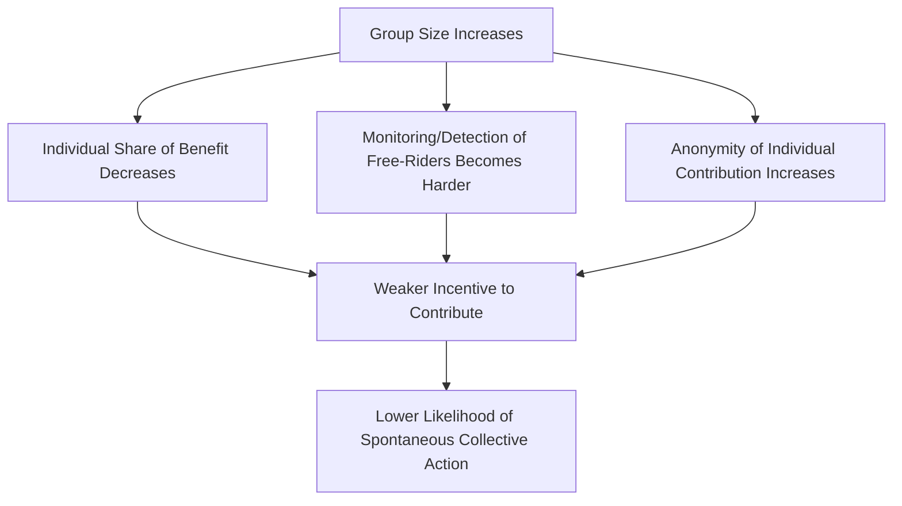
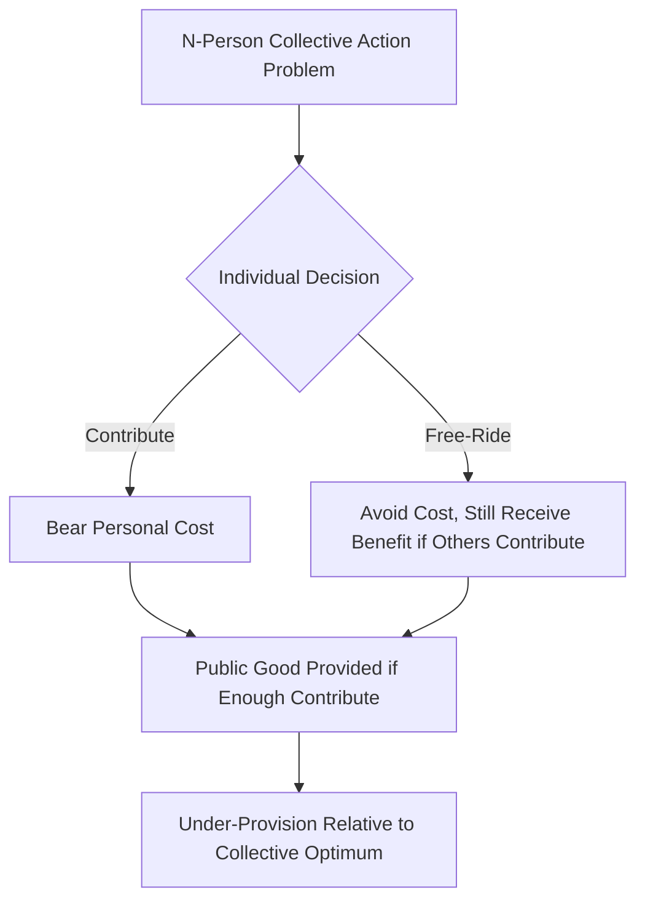

## Collective Action and Free-Rider Problems

### Definition and Core Puzzle

Collective action refers to any effort by a group of individuals to pursue a shared goal or produce a shared benefit. The **collective action problem** describes the difficulty of achieving cooperation when individually rational behavior leads to outcomes that are collectively suboptimal — most famously formalized in Mancur Olson's *The Logic of Collective Action* (1965).

**Key Points**

- The central puzzle: if a benefit is available to all members of a group regardless of individual contribution, rational individuals have an incentive to let others bear the cost while they enjoy the benefit
- This behavior is termed **free-riding**
- The problem is especially acute in **large groups**, where any single individual's contribution has a negligible effect on the outcome
- Olson's work directly challenged the pluralist assumption (common in earlier interest group theory) that shared interests automatically translate into organized group action

### Public Goods and the Structural Basis of the Problem

The free-rider problem arises specifically in relation to **public goods**, defined by two properties:

| Property | Definition |
| --- | --- |
| Non-excludability | Once provided, no one can be effectively prevented from consuming the good, even non-contributors |
| Non-rivalry | One person's consumption does not diminish the amount available to others |

**Example**

Clean air resulting from pollution regulation is a public good: a citizen who did not lobby for the regulation still breathes the same clean air (non-excludable), and their breathing it does not reduce the air quality available to others (non-rival).

By contrast, a **private good** (excludable and rivalrous) does not generate this problem, since non-contributors can simply be denied access.

#### Classification of Goods

|  | Excludable | Non-Excludable |
| --- | --- | --- |
| **Rivalrous** | Private goods (e.g., food, personal property) | Common-pool resources (e.g., fisheries, grazing land) |
| **Non-Rivalrous** | Club goods (e.g., cable television, toll roads) | Public goods (e.g., national defense, clean air, policy change) |

[Inference] Interest group and social movement outcomes (e.g., favorable legislation, regulatory changes) are typically treated as public goods within this framework, since the resulting policy benefit generally applies to an entire class of people regardless of who lobbied for it.

### The Formal Logic of Free-Riding

Consider a rational individual $i$ deciding whether to contribute to a collective effort.

$$U_i = B - C_i$$

Where $U_i$ is individual utility from participating, $B$ is the (often non-excludable) benefit received if the collective good is produced, and $C_i$ is the personal cost of contribution.

If the good is non-excludable, the individual receives $B$ whether or not they personally contribute. Rational self-interest therefore favors abstaining from contribution while still capturing $B$, provided enough *other* members of the group contribute to produce the good. This generates a structural incentive toward under-provision of the public good relative to the group's collective interest, even when every member genuinely values the outcome.

[Inference] This is a simplified, illustrative formalization used to convey Olson's core logic pedagogically; Olson's original argument was primarily verbal/analytical rather than expressed as a single formal utility equation, though later formal and game-theoretic treatments (e.g., using public goods game models) have built on this logic more rigorously.

### Olson's Group Size Argument

A central and often-cited claim in Olson's framework is that **group size** systematically affects the likelihood of successful collective action.

**Key Points**

- In **small groups**, each member's contribution constitutes a larger share of the total effort, individual defection is more visible, and social pressure/monitoring is easier to sustain — making cooperation more likely
- In **large groups**, individual contributions are diluted, monitoring is costly, and anonymity makes free-riding harder to detect or sanction — making cooperation less likely without additional mechanisms
- Olson concluded that large, latent groups (e.g., consumers, taxpayers) are less likely to organize spontaneously than small, concentrated groups (e.g., a specific industry's major firms), even when the large group's aggregate stake in an issue is greater

**Example**

A small number of steel manufacturers lobbying for tariff protection face a more tractable collective action problem than millions of individual steel consumers who would collectively benefit from *opposing* those tariffs (since the per-consumer cost of higher steel prices is small and diffuse, while the per-firm benefit of tariffs is large and concentrated). This asymmetry helps explain why concentrated producer interests often out-organize diffuse consumer interests in trade policy debates.

### Olson's Solution: Selective Incentives

To explain why large-group interest organizations (e.g., labor unions, professional associations, AARP) nonetheless exist and thrive, Olson proposed the concept of **selective incentives** — benefits available exclusively to those who actually participate or join, rather than to the group as a whole.

| Selective Incentive Type | Examples |
| --- | --- |
| Material | Union-negotiated wages/benefits limited to dues-paying members, group insurance rates, member discounts |
| Solidary | Social status, camaraderie, networking opportunities within the organization |
| Purposive | Sense of moral satisfaction or ideological fulfillment from participation itself |
| Coercive | Compulsory membership requirements (e.g., historical closed-shop union arrangements) |

**Key Points**

- Selective incentives convert a pure public-goods dilemma into a more tractable individual cost-benefit calculation by attaching excludable benefits to participation
- Interest groups and unions often rely heavily on such incentives specifically because the policy outcomes they pursue are largely non-excludable public goods
- [Inference] The relative importance of material versus purposive/solidary incentives likely varies by organization type and membership base, though precise weighting is difficult to measure empirically and varies across studies

### Critiques and Extensions of Olson's Framework

#### The "By-Product Theory" and Its Limits

Olson's own theory has been critiqued as insufficient to explain the emergence and persistence of large-scale ideological and social movements (e.g., civil rights, environmentalism) that mobilize millions without offering substantial material selective incentives.

#### Mancur Olson vs. Social Movement Scholarship

Resource mobilization theorists (McCarthy and Zald) and social movement scholars pushed back on strict rational-choice predictions by highlighting:

- **Moral incentives and ideological commitment** as independently sufficient motivators for some participants
- **Pre-existing social networks** that lower the effective cost of participation through peer pressure, solidarity, and shared identity
- **Entrepreneurial leadership** that absorbs disproportionate organizational costs to launch movements (the "political entrepreneur" concept, related to work by Robert Salisbury)

#### Elinor Ostrom's Critique via Common-Pool Resource Research

Elinor Ostrom's *Governing the Commons* (1990) provided an empirically grounded challenge to the assumption that large-group collective action inevitably fails absent external coercion or privatization (as suggested in Garrett Hardin's related "Tragedy of the Commons" thesis, 1968). Ostrom documented numerous historical cases of communities successfully self-governing shared resources (irrigation systems, fisheries, forests) through locally evolved institutional arrangements.

**Ostrom's Design Principles for Successful Self-Governance** (summarized):

| Principle | Description |
| --- | --- |
| Clearly defined boundaries | Membership and resource boundaries are clearly identified |
| Congruence with local conditions | Rules match local social and environmental context |
| Collective-choice arrangements | Those affected by rules can participate in modifying them |
| Monitoring | Members or accountable monitors observe compliance |
| Graduated sanctions | Violations receive proportionate, escalating penalties |
| Conflict-resolution mechanisms | Low-cost, accessible venues for resolving disputes |
| Minimal recognition of rights to organize | External authorities do not undermine local self-governance |
| Nested enterprises | Larger systems are organized in layered, nested institutions |

[Inference] Ostrom's work is widely credited with demonstrating that collective action failure is not inevitable but contingent on institutional design — this is a well-established finding in the commons-governance literature, though the applicability of specific design principles varies by resource type and social context, as Ostrom herself emphasized.

### The Prisoner's Dilemma as a Formal Model

Collective action problems are frequently modeled using the **Prisoner's Dilemma**, a two-actor game illustrating why mutually beneficial cooperation may fail to emerge even when both parties would be better off cooperating.

|  | Player B: Cooperate | Player B: Defect |
| --- | --- | --- |
| **Player A: Cooperate** | (3, 3) — Mutual benefit | (0, 5) — A is exploited |
| **Player A: Defect** | (5, 0) — A exploits B | (1, 1) — Mutual loss |

**Key Points**

- Each player's dominant strategy is to defect regardless of what the other player does, since defection yields a higher payoff in both scenarios the player might face
- The resulting Nash equilibrium (mutual defection, yielding payoff (1,1)) is Pareto-inferior to mutual cooperation (3,3), illustrating the tension between individual rationality and collective welfare
- Extending this to $n$-player versions produces the **n-person Prisoner's Dilemma**, a common formalization of large-group collective action problems, where each individual's incentive to defect (free-ride) persists regardless of group size, but the aggregate cost of widespread defection scales with the number of participants

### Iterated Games and the Emergence of Cooperation

Robert Axelrod's *The Evolution of Cooperation* (1984) demonstrated through computer tournament simulations that repeated interaction can sustain cooperation even among self-interested actors, most notably through the **Tit-for-Tat** strategy (cooperate first, then mirror the other player's previous move).

**Key Points**

- Repeated interaction changes the payoff structure by introducing the possibility of future retaliation or reward, unlike single-shot Prisoner's Dilemma games
- This finding is often invoked to explain how sustained cooperation can emerge in ongoing political relationships (e.g., long-term coalition partners, repeated interest-group interactions with legislators) even absent formal enforcement mechanisms
- [Inference] Applying laboratory/simulation findings to real-world political collective action requires caution, since real political actors face more complex, multi-issue, and multi-actor environments than the simplified iterated dyadic game

### Coordination Problems vs. Cooperation Problems

Political scientists distinguish collective action problems from the related but distinct category of **coordination problems**.

| Feature | Cooperation Problem (e.g., Prisoner's Dilemma) | Coordination Problem (e.g., Stag Hunt, Assurance Game) |
| --- | --- | --- |
| Core tension | Individual incentive to defect even when mutual cooperation is preferred | Multiple equilibria exist; actors need to converge on the same one |
| Example | Free-riding on a public good | Choosing which side of the road to drive on; standardizing on a technology |
| Solution mechanisms | Selective incentives, monitoring, repeated interaction, enforcement | Communication, focal points (Schelling points), conventions |

Thomas Schelling's concept of a **focal point** — a solution that individuals converge on due to shared expectations, even absent communication — is particularly relevant to coordination-type collective action problems.

### Applications Within Interest Groups and Social Movements

**Key Points**

- **Interest group formation**: explains why narrow, concentrated economic interests (trade associations, professional lobbies) are often better organized than broad, diffuse public interests (consumers, taxpayers, environmental beneficiaries)
- **Union organizing**: explains historical reliance on closed-shop arrangements or selective member benefits to overcome free-riding on collectively bargained wage gains
- **Environmental and public-interest movements**: presents a puzzle requiring explanation beyond pure material self-interest, addressed through purposive incentives, moral framing, and network-based mobilization (see also framing theory and resource mobilization theory)
- **Protest participation**: individual protesters bear real costs (time, risk of arrest, potential violence) for outcomes that are largely non-excludable if achieved, requiring explanations rooted in identity, solidarity, or perceived efficacy rather than narrow material calculation alone

### Empirical and Experimental Approaches

Contemporary political science has increasingly tested collective action predictions through:

- **Laboratory public goods games**: experimental economics paradigms measuring real contribution behavior under varying group sizes, communication conditions, and punishment mechanisms
- **Field experiments on voter turnout**: since voting is a classic collective action puzzle (an individual vote rarely changes an election outcome, yet millions vote), researchers test mobilization messages, social pressure, and get-out-the-vote interventions
- **Cross-national studies of union density and labor organization**, testing Olson's group-size predictions against real-world variation in labor movement strength

[Unverified] Specific quantitative findings from any single experimental study (e.g., exact percentage effects of a given mobilization treatment) vary considerably across studies, populations, and methodologies, so such figures should be checked against current primary literature rather than treated as fixed parameters.

### The Voting Paradox as a Related Collective Action Puzzle

Anthony Downs's *An Economic Theory of Democracy* (1957) applied similar logic to electoral turnout, producing the **paradox of voting**: the probability that a single vote is decisive is vanishingly small, so the expected instrumental benefit of voting is close to zero, yet substantial numbers of citizens vote regardless.

$$R = PB - C + D$$

Where $R$ is the net reward from voting, $P$ is the probability of being decisive, $B$ is the benefit of the preferred outcome, $C$ is the cost of voting, and $D$ represents non-instrumental "civic duty" or expressive benefits added by William Riker and Peter Ordeshook (1968) to explain why turnout remains high despite $PB$ being negligible.

### Conclusion

The collective action problem represents one of the most influential analytical frameworks in political science, fundamentally reshaping the study of interest groups, unions, and social movements by challenging the assumption that shared interests automatically produce organized political action. Olson's emphasis on group size and selective incentives explains significant variation in organizational success, but subsequent scholarship — from Ostrom's commons research to resource mobilization and framing theory — has demonstrated that institutional design, social networks, and non-material incentives can and do overcome free-riding in ways the original rational-choice framework did not fully anticipate. The tension between individual rationality and collective welfare remains a foundational lens for analyzing political organization more broadly.

**Related Topics**

- Mancur Olson's *The Logic of Collective Action* and its critiques
- Elinor Ostrom and institutional design for common-pool resource governance
- Resource mobilization theory and selective incentive structures within social movement organizations
- Game theory in political science: Prisoner's Dilemma, Stag Hunt, coordination games
- The paradox of voting and theories of electoral turnout (Downs, Riker and Ordeshook)
- Interest group formation and the concentrated-benefits/diffuse-costs asymmetry in policy lobbying
- Union organizing strategies and closed-shop/right-to-work debates
- Experimental and behavioral approaches to public goods provision
- Tragedy of the commons (Garrett Hardin) and comparisons with Ostrom's counter-evidence
- Political entrepreneurship and leadership in overcoming collective action barriers