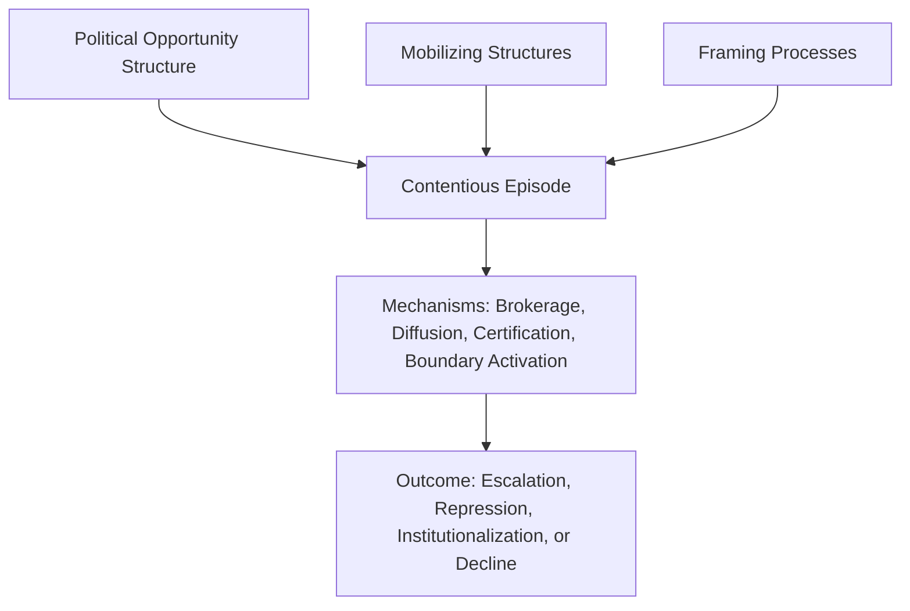
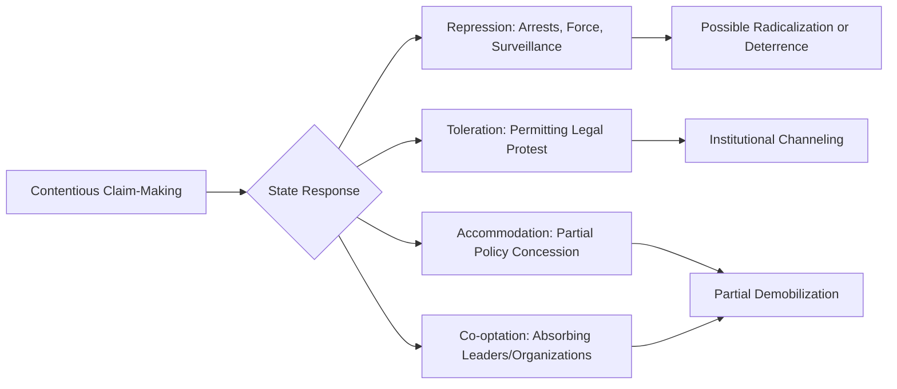

## Protest Politics and Contentious Politics

### Definition and Conceptual Foundations

**Contentious politics** refers to collective, public-facing political interaction among makers of claims and their targets when at least one government is involved as claimant, target, or third party, and when the claims, if realized, would affect the interests of at least one of the claimants. **Protest politics** is a primary tactical subset of contentious politics — the visible, disruptive, extra-institutional actions (marches, demonstrations, strikes, occupations) through which challengers press claims.

**Key Points**

- The term "contentious politics" was systematized by Charles Tilly, Doug McAdam, and Sidney Tarrow, most fully in *Dynamics of Contention* (2001)
- Contentious politics encompasses a broader universe than protest alone: revolutions, civil wars, nationalist movements, and ethnic conflict all fall within its scope
- Protest politics is distinguished from conventional/institutional politics (voting, lobbying, litigation) by its use of **non-institutionalized, often disruptive tactics** to make claims
- Contention is inherently **relational**: it involves interaction between claimants, targets (often the state), and third parties (media, bystander publics, allies)

### Core Conceptual Vocabulary

#### Repertoires of Contention

Charles Tilly's foundational concept describing the historically and culturally bounded set of collective action tactics available to challengers in a given time and place. Repertoires evolve through processes of innovation and diffusion but are not infinitely flexible — actors tend to draw on familiar, learned forms of action.

**Example**

Tilly's historical research traced a shift in Western European contention from parochial, patronized, and particular forms of action (e.g., localized grain riots, food seizures directed at local authorities) in the 18th century toward more national, autonomous, and modular forms (e.g., strikes, demonstrations, petition campaigns) by the 19th and 20th centuries, coinciding with the rise of the centralized nation-state as the primary target of claims.

#### Political Opportunity Structure (POS)

The configuration of the political environment that shapes the relative costs and likely success of contentious action, including:

- Openness or closure of formal political access
- Stability of elite political alignments
- Availability of elite allies for challengers
- The state's capacity and propensity for repression

#### Mobilizing Structures

The organizational vehicles and informal social networks through which people are recruited into and sustain participation in contentious action, including formal social movement organizations (SMOs), churches, unions, and pre-existing friendship or kinship networks.

#### Framing Processes

Following Snow and Benford, the interpretive work through which challengers construct shared understandings of grievances, solutions, and calls to action (diagnostic, prognostic, and motivational framing).

### Mechanisms and Processes in Dynamics of Contention

McAdam, Tarrow, and Tilly's synthesis moved away from static structural variables toward identifying recurring **mechanisms** — delimited classes of events that alter relations among specified sets of elements — that operate across diverse episodes of contention.

| Mechanism | Description |
| --- | --- |
| Brokerage | The linking of two or more previously unconnected social sites by an actor who mediates their relations |
| Diffusion | The spread of a form of contention, frame, or organizational model from one site/actor to another |
| Certification | Validation of actors, their performances, and their claims by external authorities |
| Decertification | Withdrawal of such validation |
| Boundary activation | The increased salience of a distinction between "us" and "them" that mobilizes collective identity |
| Category formation | The creation or consolidation of a socially significant group distinction (e.g., a shared political identity) |

[Inference] The mechanisms-based approach is valued for its ability to identify common causal processes across very different cases (labor strikes, ethnic conflict, democratization movements), though critics note the abstraction can make it harder to generate precise, falsifiable predictions for any single case.

### Typology of Protest Tactics

Protest tactics can be arrayed along a spectrum from conventional/legal to disruptive/illegal.

| Category | Examples | Typical Legal Status |
| --- | --- | --- |
| Conventional/Symbolic | Petitions, rallies, vigils, letter-writing campaigns | Legal, permitted |
| Disruptive but non-violent | Sit-ins, boycotts, strikes, blockades, civil disobedience | Often illegal but non-violent |
| Confrontational | Occupations, unauthorized marches, property destruction | Frequently illegal |
| Violent | Rioting, armed insurgency, terrorism | Illegal, often treated as security threat |

**Key Points**

- Gene Sharp's typology of nonviolent action (*The Politics of Nonviolent Action*, 1973) catalogued nearly 200 distinct methods across three categories: protest and persuasion, noncooperation, and nonviolent intervention
- Civil disobedience — the deliberate, public, non-violent breaking of law to protest its perceived injustice, typically while accepting legal consequences — is analytically distinct from ordinary illegal disruption due to its normative appeal to a "higher law" or moral principle (associated with Henry David Thoreau, Mahatma Gandhi, and Martin Luther King Jr.)
- [Inference] Escalation from conventional to disruptive tactics often occurs when challengers perceive institutional channels as closed or unresponsive, consistent with political opportunity theory, though the precise threshold varies by case and is not a fixed rule

### The Efficacy Debate: Does Protest Work?

#### Radical Flank Effects

Herbert Haines's concept of the **radical flank effect** describes how the presence of more radical factions within a movement can shift the "acceptable" range of demands, making moderate factions appear more reasonable to authorities and the public by comparison ("positive radical flank effect"), though radical flanks can also delegitimize an entire movement in the eyes of potential allies ("negative radical flank effect").

#### Quantitative Studies on Nonviolent vs. Violent Resistance

Erica Chenoweth and Maria Stephan's *Why Civil Resistance Works* (2011) presented cross-national data comparing nonviolent and violent resistance campaigns, concluding that nonviolent campaigns historically achieved success at a notably higher rate than violent campaigns in their dataset, attributing this in part to lower participation barriers for nonviolent tactics (enabling broader and more diverse mobilization) and higher likelihood of security-force defection.

[Unverified] The specific comparative success-rate figures reported in this research are drawn from a particular historical dataset (spanning the 20th century) and specific coding criteria; exact percentages and their applicability to more recent campaigns should be checked against the current edition of the source rather than treated as a fixed universal law, since scholars continue to debate methodology, case selection, and generalizability.

**Key Points**

- Mass **participation** and broad-based **diversity** of participants (across age, gender, class, occupation) are frequently cited as correlated with protest campaign success
- **Security force defection** — when police or military personnel refuse to suppress protesters — is often identified as a critical tipping point in high-stakes contentious episodes (e.g., late-stage authoritarian collapse)
- Media coverage and framing significantly shape whether protest is perceived by third-party publics as legitimate grievance-airing or as disorder to be suppressed

### State Response to Contentious Politics

States respond to protest and contention through a range of strategies existing on a repression-accommodation spectrum.

**Key Points**

- The **repression-mobilization nexus** is empirically ambiguous: repression can deter participation in the short term (a "chilling effect") but may also radicalize survivors and increase long-term mobilization ("backlash" or "radicalization" effect), with outcomes depending on repression's severity, selectivity, and perceived legitimacy
- **Policing styles** of protest have been characterized along a continuum from "escalated force" (common historically, emphasizing crowd control through coercion) to "negotiated management" (contemporary Western democratic norm, emphasizing permits, designated protest zones, and communication with organizers) — a shift documented by scholars such as Patrick McPhail, David Schweingruber, and John McCarthy in U.S. policing history
- Authoritarian regimes typically rely more heavily on preventive repression (surveillance, preemptive arrest, restrictions on assembly) than on reactive crowd management

### Cycles of Contention

Sidney Tarrow's concept of the **protest cycle** (or "cycle of contention") describes a temporally bounded phase of heightened conflict across a social system, characterized by:

**Key Points**

- Rapid diffusion of collective action from one sector or region to others
- An expanded and intensified repertoire of contention
- The emergence of new or transformed collective action frames
- A mix of organized and unorganized participation
- Sequences of interaction between challengers and authorities that create new political opportunities and constraints
- Eventual decline through some combination of repression, concession, exhaustion, institutionalization, or factionalization

**Example**

The global wave of protest in 1968 (student movements in Paris, anti-Vietnam War protests in the United States, the Prague Spring in Czechoslovakia) is frequently cited as a paradigmatic protest cycle, exhibiting rapid transnational diffusion of tactics and framing despite occurring in substantially different political contexts.

### Contentious Politics and Regime Type

| Regime Context | Typical Contentious Dynamics |
| --- | --- |
| Liberal democracy | Institutionalized protest rights, negotiated-management policing, litigation as a complementary channel |
| Hybrid/illiberal regime | Selective tolerance, legal ambiguity, periodic crackdowns on specific movements |
| Authoritarian regime | Preventive repression, criminalization of assembly, contention often forced underground or into diaspora networks |
| Post-conflict/transitional state | Contention intertwined with broader questions of state legitimacy and institution-building |

[Inference] Comparative democratization scholarship generally treats sustained, large-scale contentious mobilization as a significant (though not sole) contributing factor in numerous historical authoritarian breakdowns, but the relative causal weight of protest versus elite defection, international pressure, or economic crisis is contested and case-dependent.

### Digital-Era Contentious Politics

#### Connective Action

Bennett and Segerberg's concept of **connective action** describes a mode of mobilization enabled by digital media in which personalized content-sharing substitutes for centralized organizational framing, lowering the threshold for participation but potentially producing less durable, less hierarchically organized movements compared to traditional "collective action" models.

#### Networked Movements

Manuel Castells's *Networks of Outrage and Hope* (2012) analyzed movements such as the Arab Spring, the Indignados/15-M movement in Spain, and Occupy Wall Street as products of horizontally networked, digitally coordinated mobilization often lacking traditional centralized leadership structures.

**Key Points**

- Digital tools substantially lower coordination costs, enabling rapid, large-scale mobilization with minimal formal organization
- [Inference] Some scholars argue digitally coordinated movements may face greater difficulty sustaining long-term strategic coherence and translating mobilization into durable institutional outcomes compared to more hierarchically organized historical movements, though this remains an active and debated area of research rather than settled consensus
- State responses have adapted accordingly, including internet shutdowns, social media surveillance, and digital disinformation campaigns targeting protest coordination

### Illustrative Diagram: Contentious Episode Structure

<svg xmlns="http://www.w3.org/2000/svg" viewBox="0 0 700 380" font-family="Arial, sans-serif">
<text x="350" y="30" text-anchor="middle" font-size="18" font-weight="bold" fill="#1a1a2e">Structure of a Contentious Episode (svg_diagram)</text>
<rect x="40" y="70" width="160" height="60" rx="10" fill="#a2d2ff" stroke="#1a1a2e" stroke-width="2" />
<text x="120" y="105" text-anchor="middle" font-size="13" font-weight="bold" fill="#1a1a2e">Claimants</text>
<rect x="270" y="70" width="160" height="60" rx="10" fill="#ffafcc" stroke="#1a1a2e" stroke-width="2" />
<text x="350" y="105" text-anchor="middle" font-size="13" font-weight="bold" fill="#1a1a2e">Targets (State)</text>
<rect x="500" y="70" width="160" height="60" rx="10" fill="#bde0fe" stroke="#1a1a2e" stroke-width="2" />
<text x="580" y="105" text-anchor="middle" font-size="13" font-weight="bold" fill="#1a1a2e">Third Parties</text>
<line x1="200" y1="100" x2="270" y2="100" stroke="#1a1a2e" stroke-width="2" marker-end="url(#arrow2)" />
<line x1="270" y1="115" x2="200" y2="115" stroke="#1a1a2e" stroke-width="2" marker-end="url(#arrow2)" />
<line x1="430" y1="100" x2="500" y2="100" stroke="#1a1a2e" stroke-width="2" marker-end="url(#arrow2)" />
<text x="235" y="90" text-anchor="middle" font-size="10" fill="`#1a1a2e`">Claims</text>

<text x="235" y="145" text-anchor="middle" font-size="10" fill="`#1a1a2e`">Repression/Response</text>

<rect x="200" y="200" width="300" height="80" rx="10" fill="#cdb4db" stroke="#1a1a2e" stroke-width="2" />
<text x="350" y="230" text-anchor="middle" font-size="14" font-weight="bold" fill="#1a1a2e">Mechanisms:</text>
<text x="350" y="250" text-anchor="middle" font-size="12" fill="#1a1a2e">Brokerage / Diffusion / Certification</text>
<text x="350" y="266" text-anchor="middle" font-size="12" fill="#1a1a2e">Boundary Activation</text>
<line x1="120" y1="130" x2="300" y2="200" stroke="#1a1a2e" stroke-width="2" marker-end="url(#arrow2)" />
<line x1="580" y1="130" x2="400" y2="200" stroke="#1a1a2e" stroke-width="2" marker-end="url(#arrow2)" />
<line x1="350" y1="280" x2="350" y2="330" stroke="#1a1a2e" stroke-width="2" marker-end="url(#arrow2)" />
<text x="350" y="355" text-anchor="middle" font-size="13" font-weight="bold" fill="#1a1a2e">Outcome (Change, Repression, Institutionalization)</text>
</svg>

### Institutionalization and the Protest-Policy Nexus

**Key Points**

- Contentious movements often transition over time from disruptive outsider tactics toward institutionalized insider strategies (litigation, lobbying, electoral participation) as they gain resources, legitimacy, and access — a pattern documented across labor, civil rights, and environmental movements
- This transition is sometimes critiqued (echoing concerns raised in earlier framings of NGO-ization) as risking demobilization or dilution of original movement goals in exchange for institutional access
- Conversely, some movements deliberately maintain an "outside strategy" specifically to preserve leverage that purely institutional insider tactics cannot provide, viewing disruption itself as a resource

### Distinguishing Related Concepts Within the Chapter

| Feature | Interest Group Lobbying | Civil Society Activity (Broad) | Protest/Contentious Politics |
| --- | --- | --- | --- |
| Primary channel | Institutional access (legislators, regulators) | Varies across formal/informal | Extra-institutional, often disruptive |
| Legal status of core tactics | Generally fully legal | Varies | Frequently borderline or illegal (civil disobedience, unauthorized assembly) |
| Relationship to state | Cooperative/negotiative | Mixed | Often adversarial, at least initially |
| Typical resource base | Financial, professional expertise | Varies widely | Numbers, disruption capacity, moral authority |

### Conclusion

Protest and contentious politics constitute a distinct mode of political claim-making characterized by extra-institutional, often disruptive tactics directed at state or other powerful targets. The field has evolved from static structural models toward a dynamic, mechanisms-based understanding (per Tilly, McAdam, and Tarrow) that treats brokerage, diffusion, and boundary activation as recurring processes across diverse contentious episodes — from labor strikes to revolutions. Empirical research increasingly emphasizes that protest's political efficacy depends heavily on participation breadth, tactical choices (particularly the nonviolent-violent distinction), and the responsiveness of state actors, while digital technology continues to reshape the organizational forms through which contention is coordinated and sustained.

**Related Topics**

- Charles Tilly, Doug McAdam, and Sidney Tarrow's *Dynamics of Contention* framework
- Civil disobedience theory and its philosophical justifications (Thoreau, Gandhi, King, Rawls)
- Erica Chenoweth's comparative research on nonviolent versus violent resistance outcomes
- Policing of protest: escalated force versus negotiated management models
- Radical flank effects and intra-movement strategic tension
- Digital activism, connective action, and networked social movements
- Protest cycles and historical waves of transnational contention (e.g., 1968, Arab Spring)
- Authoritarian repression strategies and preventive versus reactive control
- Institutionalization of movements: from protest to policy and litigation strategies
- Comparative case studies: U.S. civil rights movement, Arab Spring, Hong Kong protests, anti-apartheid movement