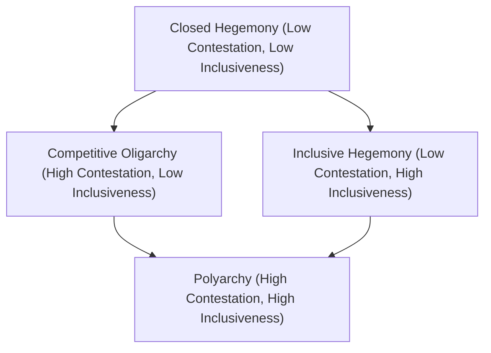

## Defining and Measuring Democracy

### Definitional Foundations

Democracy is a contested concept in political science — while there is broad agreement on core elements, scholars diverge significantly on how narrowly or expansively the term should be defined. W.B. Gallie's characterization of democracy as an "essentially contested concept" (1956) is frequently invoked to describe this persistent definitional disagreement.

**Key Points**

- At minimum, most definitions require some mechanism by which citizens select or influence those who govern
- Definitional disputes center on how much beyond basic elections should be included (civil liberties, rule of law, socioeconomic conditions, deliberative quality)
- The choice of definition has direct methodological consequences for measurement, since indices operationalize whatever definition underlies them

### Minimalist (Procedural) Definitions

#### Schumpeterian Definition

Joseph Schumpeter's *Capitalism, Socialism and Democracy* (1942) offered an influential minimalist definition: democracy is an institutional arrangement for arriving at political decisions in which individuals acquire the power to decide by means of a competitive struggle for the people's vote.

**Key Points**

- Focuses narrowly on **competitive elections** as the defining mechanism
- Explicitly rejects more substantive definitions tied to popular will or the "common good," which Schumpeter viewed as philosophically incoherent or empirically unworkable
- Influential in shaping subsequent procedural/minimalist measurement approaches

#### Dahl's Polyarchy

Robert Dahl's concept of **polyarchy** (*Polyarchy: Participation and Opposition*, 1971) refined the minimalist tradition by specifying institutional guarantees necessary for a "really existing" democracy, distinguishing it from an unattainable ideal of full popular sovereignty.

**Dahl's Institutional Guarantees for Polyarchy:**

| Guarantee | Description |
| --- | --- |
| Freedom to form and join organizations | Associational autonomy |
| Freedom of expression | Speech and press freedoms |
| Right to vote | Broad suffrage |
| Eligibility for public office | Right to compete for office |
| Right of political leaders to compete for support | Competitive elections |
| Alternative sources of information | Media pluralism |
| Free and fair elections | Genuine electoral contestation |
| Institutions for making government policies depend on votes | Elected officials actually govern |

Dahl further theorized polyarchy along two dimensions:

$$Polyarchy = f(Contestation, Inclusiveness)$$

Where **contestation** (or public opposition) refers to the degree of permissible political competition, and **inclusiveness** (or participation) refers to the proportion of the population entitled to participate. [Inference] This two-dimensional framework is a widely cited conceptual heuristic from Dahl's work rather than a literal mathematical function, used to illustrate that democratization can proceed along either or both dimensions independently.

### Substantive and Maximalist Definitions

#### Liberal Democracy

Extends the procedural core to include constraints on state power beyond elections themselves:

- Rule of law and constitutionalism
- Protection of civil liberties and minority rights
- Horizontal accountability (checks among branches of government, per Guillermo O'Donnell's concept)
- Independent judiciary

#### Deliberative Democracy

Associated with Jürgen Habermas and later Amy Gutmann and Dennis Thompson, this tradition emphasizes the quality of public reasoning and discourse leading to political decisions, not merely the existence of voting mechanisms.

#### Participatory Democracy

Emphasizes direct citizen involvement in decision-making beyond periodic elections (e.g., participatory budgeting, deliberative assemblies, referenda), drawing on theorists such as Carole Pateman.

#### Egalitarian/Social Democracy

Some scholars (e.g., in the tradition of T.H. Marshall's social citizenship theory) argue that meaningful democracy requires a baseline of socioeconomic equality, since extreme material inequality can undermine political equality in practice even where formal procedures exist.

**Key Points**

- Maximalist definitions increase conceptual richness but complicate measurement, since additional criteria (deliberative quality, socioeconomic equality) are harder to observe and code reliably than election outcomes
- [Inference] There is a recognized tradeoff in comparative democracy research between conceptual validity (capturing what "democracy" substantively means) and measurement reliability (being able to code cases consistently) — broader definitions tend to be richer but noisier to measure

### The Concept Formation Problem: "Traveling" and Stretching

Giovanni Sartori's methodological work (*Concept Misformation in Comparative Politics*, 1970) warned against **conceptual stretching** — applying a concept so broadly across cases that it loses meaningful content (e.g., labeling too many disparate regimes "democratic" dilutes analytical precision). Sartori proposed a "ladder of abstraction," where concepts trade off extension (number of cases covered) against intension (richness of defining attributes).

$$Extension \propto \frac{1}{Intension}$$

[Inference] This inverse relationship is a widely accepted conceptual principle in comparative methodology rather than a strict mathematical law; it illustrates the general tradeoff Sartori identified rather than a precisely quantifiable function.

### Major Democracy Measurement Projects

#### Polity Project (Polity5/Polity IV)

One of the longest-running datasets, coding regime authority characteristics on a **-10 (fully institutionalized autocracy) to +10 (fully institutionalized democracy)** combined "Polity Score."

**Key Points**

- Based on coding of executive recruitment competitiveness, constraints on executive authority, and political competition/participation regulation
- Widely used in quantitative cross-national research due to long historical time series
- [Inference] Critics have noted the index's heavy weighting toward executive constraints can produce counterintuitive scores for cases with strong executive checks but weak participation, though this critique is one of several methodological debates in the literature rather than a universally settled conclusion

#### Freedom House "Freedom in the World"

Produces annual scores on two dimensions — **Political Rights** and **Civil Liberties** — each rated on a 1–7 scale, which combine into overall status categories of "Free," "Partly Free," or "Not Free."

**Key Points**

- Widely cited in policy and media contexts due to accessible categorical outputs
- Criticized by some scholars for potential Western/liberal bias in coding criteria and for combining conceptually distinct dimensions (political rights and civil liberties) into aggregate categories
- [Unverified] Specific year-by-year country classifications change regularly; any cited classification should be checked against the current-year report rather than treated as static

#### Varieties of Democracy (V-Dem)

A large-scale, multidimensional project distinguishing among several conceptions of democracy rather than treating it as a single unified variable.

**V-Dem's Five High-Level Democracy Indices:**

| Index | Core Emphasis |
| --- | --- |
| Electoral Democracy | Free and fair, competitive elections (foundational to all other indices) |
| Liberal Democracy | Electoral democracy plus rule of law, judicial and legislative constraints on the executive, individual liberties |
| Participatory Democracy | Direct and associational forms of citizen participation beyond voting |
| Deliberative Democracy | Quality of public reasoning and justification underlying political decisions |
| Egalitarian Democracy | Equal distribution of resources and power needed for genuine political equality |

**Key Points**

- V-Dem uses large teams of country experts providing ratings that are then aggregated using measurement models (Bayesian item response theory) to produce point estimates with uncertainty intervals
- Explicitly designed to operationalize multiple theoretical traditions of democracy simultaneously rather than assuming a single correct definition
- [Inference] The multidimensional approach is generally regarded as a methodological advance for disaggregating "democracy" into theoretically distinct components, though it also increases complexity for researchers choosing which index best fits their specific research question

#### The Economist Intelligence Unit (EIU) Democracy Index

Ranks countries across five categories: electoral process and pluralism, functioning of government, political participation, political culture, and civil liberties, classifying regimes into four types: full democracies, flawed democracies, hybrid regimes, and authoritarian regimes.

#### Comparison Table of Major Indices

| Index | Scale/Output | Core Approach | Update Frequency |
| --- | --- | --- | --- |
| Polity5 | -10 to +10 composite score | Institutional authority characteristics | Annual (historical, extended periodically) |
| Freedom House | 1–7 per dimension; categorical status | Political rights and civil liberties | Annual |
| V-Dem | Multiple 0–1 indices with uncertainty estimates | Multidimensional, expert-coded | Annual |
| EIU Democracy Index | 0–10 composite; four regime categories | Five-category composite | Annual |

[Unverified] Exact current-year rankings, category thresholds, and specific country scores across these indices change annually and should be verified against the most recent published edition of each index rather than assumed from prior knowledge.

### Methodological Debates in Measurement

#### Dichotomous vs. Continuous Measurement

Adam Przeworski and colleagues (the DD/ACLP dataset, *Democracy and Development*, 2000) championed a **dichotomous** approach — classifying regimes strictly as democracy or non-democracy based on minimal procedural criteria (contested executive and legislative elections, de facto multi-party competition, alternation in power).

**Key Points**

- Proponents argue dichotomous coding avoids arbitrary weighting decisions inherent in continuous composite indices
- Critics argue dichotomous measures discard meaningful variation among both democracies and autocracies (e.g., treating a highly liberal democracy the same as a barely-qualifying electoral democracy)
- Continuous measures (Polity, V-Dem, EIU) capture gradation but require analysts to make explicit or implicit decisions about how to weight component dimensions

#### Aggregation Problems

Composite indices face the methodological challenge of combining multiple sub-indicators into single scores, raising questions about:

- Appropriate weighting of different dimensions (should electoral competitiveness count equally with judicial independence?)
- Whether dimensions are substitutable (can strong civil liberties compensate for weaker electoral competitiveness?) or must all reach minimum thresholds
- Sensitivity of overall rankings to specific aggregation methodology choices

#### Expert Coding vs. Objective Indicators

| Approach | Description | Strengths | Limitations |
| --- | --- | --- | --- |
| Expert-coded | Country specialists provide subjective ratings (V-Dem, Freedom House) | Captures nuanced, context-sensitive judgment | Potential coder bias, inter-coder reliability concerns |
| Objective/procedural | Observable facts (e.g., did an alternation in power occur?) | High replicability, transparent criteria | May miss substantive quality (fraud, intimidation not captured by formal outcome) |

### Hybrid Regimes and the "Gray Zone"

A substantial literature addresses regimes that combine formally democratic institutions (regular elections, multiple parties) with authoritarian practices (media control, judicial capture, electoral manipulation), challenging simple democracy/autocracy dichotomies.

**Key Terms:**

| Term | Originator/Association | Core Idea |
| --- | --- | --- |
| Competitive authoritarianism | Steven Levitsky and Lucan Way (2010) | Regimes where formal democratic institutions exist but incumbents systematically abuse state power to disadvantage opponents |
| Illiberal democracy | Fareed Zakaria (1997) | Regimes with reasonably free elections but weak constraints on executive power and civil liberties |
| Electoral authoritarianism | Andreas Schedler | Regimes holding elections that are not genuinely free or fair, used to provide a veneer of legitimacy |
| Defective democracy | Wolfgang Merkel | Democracies missing one or more components of a fully liberal democratic model (e.g., "illiberal," "delegative," "exclusive" subtypes) |

[Inference] The proliferation of these "diminished subtype" categories reflects a broader methodological response to the recognized limitations of binary democracy/autocracy classification, though scholars continue to debate the precise boundaries and utility of each subtype.

### Democratic Backsliding and Measurement Sensitivity

Contemporary scholarship (Nancy Bermeo, Larry Diamond, V-Dem's own annual reports) has focused on **democratic backsliding** — gradual erosion of democratic institutions and norms often occurring through legal or quasi-legal means rather than abrupt coups.

**Key Points**

- Backsliding poses a distinct measurement challenge because gradual, incremental erosion (e.g., judicial packing, gradual media consolidation, gerrymandering) may not trigger dramatic shifts in dichotomous classifications but is well-suited to detection by continuous, multidimensional indices like V-Dem
- [Unverified] Claims about a global "democratic recession" or specific aggregate trend figures depend on which index and time period are used; the overall direction is widely discussed in recent scholarship, but precise magnitude claims should be checked against current-year index reports rather than assumed to be fixed

### Illustrative Diagram: Dimensions of Democracy Measurement

<svg xmlns="http://www.w3.org/2000/svg" viewBox="0 0 700 420" font-family="Arial, sans-serif">
<text x="350" y="30" text-anchor="middle" font-size="18" font-weight="bold" fill="#1a1a2e">Layered Conceptions of Democracy (svg_diagram)</text>
<rect x="150" y="60" width="400" height="60" rx="10" fill="#a2d2ff" stroke="#1a1a2e" stroke-width="2" />
<text x="350" y="95" text-anchor="middle" font-size="14" font-weight="bold" fill="#1a1a2e">Electoral Democracy (Core/Minimal)</text>
<rect x="130" y="140" width="440" height="60" rx="10" fill="#bde0fe" stroke="#1a1a2e" stroke-width="2" />
<text x="350" y="175" text-anchor="middle" font-size="14" font-weight="bold" fill="#1a1a2e">+ Liberal Constraints (Rule of Law, Rights)</text>
<rect x="110" y="220" width="480" height="60" rx="10" fill="#cdb4db" stroke="#1a1a2e" stroke-width="2" />
<text x="350" y="255" text-anchor="middle" font-size="14" font-weight="bold" fill="#1a1a2e">+ Participatory / Deliberative Elements</text>
<rect x="90" y="300" width="520" height="60" rx="10" fill="#ffafcc" stroke="#1a1a2e" stroke-width="2" />
<text x="350" y="335" text-anchor="middle" font-size="14" font-weight="bold" fill="#1a1a2e">+ Egalitarian / Socioeconomic Conditions</text>

<text x="350" y="400" text-anchor="middle" font-size="12" fill="`#1a1a2e`">Each layer adds conceptual richness and measurement complexity</text>

</svg>

### Practical Illustration: Comparing Index Approaches for a Hypothetical Case

**Example**

Consider a hypothetical country that holds regular multiparty elections with genuine opposition participation, but where the judiciary is subject to significant executive influence and mainstream broadcast media is largely state-controlled. A dichotomous procedural coding (Przeworski-style) focused strictly on contested elections and alternation in power might classify this case as a "democracy" if elections are minimally competitive and alternation has occurred. A liberal democracy index (V-Dem's Liberal Democracy Index) would likely score this case considerably lower due to weak judicial constraints and limited media pluralism, illustrating how the same empirical case can receive substantially different classifications depending on which definitional tradition and corresponding index is applied.

### Conclusion

Defining and measuring democracy remains one of the most methodologically consequential debates in comparative political science, because the choice between minimalist (procedural) and maximalist (liberal, participatory, deliberative, egalitarian) definitions directly shapes empirical classification, cross-national comparison, and theory-testing. Contemporary measurement has moved toward increasingly disaggregated, multidimensional approaches (exemplified by V-Dem) that avoid conflating distinct components of democratic quality, while ongoing debates over dichotomous versus continuous coding, aggregation methodology, and the classification of hybrid regimes continue to shape how democracy is operationalized in empirical research.

**Related Topics**

- Robert Dahl's polyarchy framework and the contestation-inclusiveness dimensions
- Giovanni Sartori's concept formation methodology and conceptual stretching
- Competitive authoritarianism and hybrid regime typologies (Levitsky and Way, Schedler)
- Democratic backsliding and erosion pathways in contemporary democracies
- V-Dem methodology: expert coding and Bayesian measurement models
- Comparative democratization theory: transitions, consolidation, and reversal
- Historical waves of democratization (Huntington's "Third Wave")
- Electoral integrity and election observation methodology
- Liberal versus illiberal democracy debates
- Socioeconomic development and democracy: modernization theory (Lipset) and its critiques