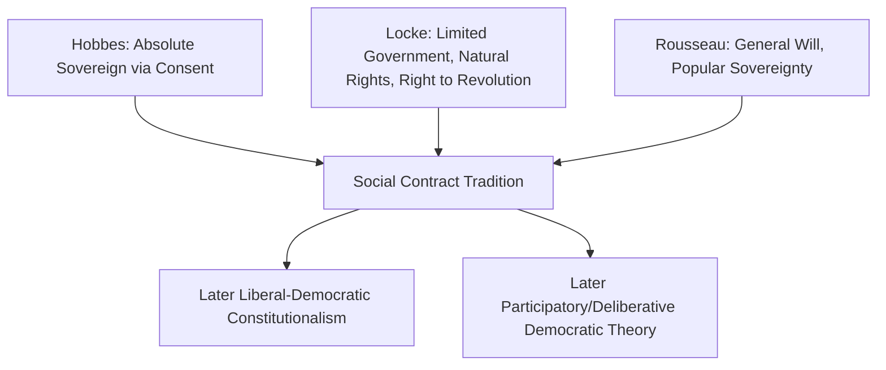

## Classical Theories of Democracy

### Definition and Scope

Classical theories of democracy encompass the foundational philosophical and political frameworks — from ancient Athens through the Enlightenment and into early modern liberal thought — that established the core normative justifications and institutional models later empirical and procedural theories would build upon, refine, or challenge.

**Key Points**

- "Classical" here refers broadly to pre-20th-century and early theoretical foundations, as distinguished from 20th-century empirical/procedural theories (e.g., Schumpeterian minimalism, pluralism) covered separately in democratic theory
- Classical theories are primarily **normative** — concerned with what democracy *should* be and why it is justified — rather than empirically descriptive of how existing regimes actually function
- Major branches include classical/direct democracy (Athenian model), social contract theory, classical liberal democracy, and classical republicanism

### Athenian Direct Democracy

#### Institutional Structure

Classical Athens (5th–4th century BCE) is the paradigmatic historical case of **direct democracy**, in which citizens participated personally in legislative and judicial functions rather than through elected representatives.

**Key Institutions:**

| Institution | Function |
| --- | --- |
| Ekklesia (Assembly) | The sovereign body of all eligible citizens, meeting regularly to debate and vote directly on laws and policy |
| Boule (Council of 500) | Prepared the agenda for the Assembly; members selected by lot (sortition) for one-year terms |
| Dikasteria (People's Courts) | Large citizen juries (hundreds of jurors) decided legal cases; jurors selected by lot |
| Sortition (kleroteria) | Random selection process used for most public offices, reflecting the belief that any citizen was capable of governing |

**Key Points**

- Citizenship was restrictive by modern standards: it excluded women, slaves, and resident foreigners (metics), meaning the "demos" who participated was a minority of the total population
- **Isegoria** (equal right to speak in the Assembly) and **isonomia** (equality before the law) were core normative principles
- Sortition (random selection) rather than election was the dominant method for filling most offices, reflecting a distinct conception of political equality — election was viewed by some ancient theorists (notably as later characterized by Aristotle) as inherently oligarchic, favoring the prominent and wealthy, whereas lot embodied genuine equality of opportunity to rule
- [Inference] The heavy reliance on sortition is often cited by contemporary deliberative democracy theorists as a historical precedent relevant to modern proposals for citizens' assemblies, though the ancient and modern contexts differ substantially in scale and social structure

#### Classical Critiques of Direct Democracy

**Plato's Critique** (*The Republic*, c. 375 BCE): Plato was deeply skeptical of democracy, arguing that political rule required specialized knowledge (analogous to other crafts) and that democracy risked placing power in the hands of the uninformed masses, susceptible to manipulation by demagogues. His preferred alternative was rule by philosopher-kings possessing genuine knowledge of the Good.

**Aristotle's Critique and Typology** (*Politics*, c. 350 BCE): Aristotle offered a more nuanced six-fold typology of constitutions, distinguishing "correct" forms (ruling in the common interest) from their "deviant" counterparts (ruling in the ruler's own interest):

| Number of Rulers | Correct Form | Deviant Form |
| --- | --- | --- |
| One | Monarchy | Tyranny |
| Few | Aristocracy | Oligarchy |
| Many | Polity (politeia) | Democracy |

**Key Points**

- For Aristotle, "democracy" specifically denoted the deviant/degenerate rule of the many poor in their own class interest, whereas "polity" represented the virtuous, common-interest-oriented rule of the many — a terminological distinction quite different from modern positive usage of "democracy"
- Aristotle favored a mixed constitution blending elements of oligarchy and democracy, anchored by a substantial middle class, as the most stable practical arrangement
- [Inference] This classical skepticism toward pure/unmixed democracy significantly influenced later republican and constitutional thought, which often sought to combine popular participation with institutional checks rather than adopting unmediated majority rule

### Social Contract Theory and the Basis of Political Authority

Social contract theorists addressed a different but related question: what justifies political authority at all, and under what conditions do citizens consent to be governed? While not all contract theorists were democrats, their frameworks became foundational to later democratic legitimacy claims.

#### Thomas Hobbes (*Leviathan*, 1651)

Hobbes argued that individuals in a hypothetical "state of nature" would face a "war of all against all" due to competition, diffidence, and desire for glory, making life "solitary, poor, nasty, brutish, and short." To escape this condition, individuals rationally consent to transfer their natural rights to a sovereign authority in exchange for security and order.

[Inference] Hobbes is generally not classified as a democratic theorist per se, since his framework could justify absolute monarchy as readily as any other sovereign form, but his contractarian logic — political authority derives from the consent of the governed — became a foundational premise for later democratic legitimacy arguments.

#### John Locke (*Two Treatises of Government*, 1689)

Locke offered a more optimistic state of nature (governed by natural law and pre-existing natural rights to life, liberty, and property) and argued that government exists specifically to protect these natural rights. Crucially, Locke argued that political authority remains conditional on the **consent of the governed**, and that citizens retain a right to revolution if government fails to protect their rights or violates the trust placed in it.

**Key Points**

- Locke's emphasis on natural rights, limited government, and popular consent profoundly shaped subsequent liberal-democratic constitutionalism, including the American founding
- Locke's framework is generally considered more directly foundational to liberal democracy than Hobbes's, given its emphasis on constraining rather than consolidating sovereign power

#### Jean-Jacques Rousseau (*The Social Contract*, 1762)

Rousseau introduced the concept of the **General Will** (*volonté générale*) — the collective, unified will of the political community oriented toward the common good, distinct from the mere sum of individual private wills (the "will of all").

$$GW \neq \sum_{i=1}^{n} W_i$$

Where $GW$ (General Will) is not simply the aggregation of individual private wills ($W_i$), but a qualitatively distinct expression of the community's shared common interest. [Inference] This is a conceptual illustration of Rousseau's distinction rather than a formula appearing in the original text, intended to clarify that Rousseau explicitly rejected simple preference-aggregation as equivalent to the General Will.

**Key Points**

- Rousseau argued true freedom consists in obedience to self-prescribed law arrived at through participation in determining the General Will — "forced to be free" is his famously paradoxical formulation for those who must be compelled to follow the General Will against their particular private interests
- Rousseau was skeptical of representative government, arguing sovereignty (the General Will) could not be legitimately delegated or represented — famously asserting that the English people were free only during elections and enslaved the rest of the time
- Rousseau's model is generally considered more compatible with small, participatory city-state democracy than with large modern nation-states, a tension later theorists had to address
- [Inference] Rousseau's participatory ideal is widely regarded as a key intellectual ancestor of later participatory and deliberative democratic theory, given his emphasis on active citizen involvement in self-legislation rather than passive consent

### Classical Liberal Democratic Theory

#### James Madison and the Federalist Papers

Madison's contributions (particularly *Federalist No. 10*, 1787) grappled directly with the problem of **factions** — groups of citizens united by shared interest or passion adverse to the rights of others or the permanent interests of the community.

**Key Points**

- Madison argued factions could not be eliminated without destroying liberty itself (the "cure" would be worse than the "disease"), so the solution must instead control their *effects*
- Madison favored a large, extended republic with representative government (rather than Rousseauian direct/pure democracy) precisely because a larger, more diverse society would contain so many competing factions that no single one could easily dominate
- Introduced institutional mechanisms — separation of powers, checks and balances, federalism — as structural safeguards against both majority tyranny and elite capture
- [Inference] Madison's framework is often described as reflecting a degree of skepticism toward unmediated popular majorities, prioritizing structural constraint and representative filtration over direct participatory democracy, consistent with broader founding-era concerns about "mob rule"

#### Alexis de Tocqueville (*Democracy in America*, 1835–1840)

Tocqueville's observational study of early American democracy identified both promising and concerning tendencies in mass democratic society.

**Key Points**

- Emphasized the role of voluntary associations as counterweights to both centralized state power and the atomizing, isolating tendencies of individualism (directly relevant to later civil society theory)
- Introduced the influential concept of the **"tyranny of the majority"** — the risk that democratic majorities could suppress minority views and individual liberty just as effectively as any autocrat, but with the added legitimacy conferred by majoritarian procedure
- Observed that democratic equality could paradoxically produce social conformity pressures ("soft despotism") even without formal coercion
- [Inference] Tocqueville's dual concern — celebrating democratic participation while warning of majoritarian excess — positioned him as an important bridge between Enlightenment optimism about popular rule and later 20th-century concerns about mass society and populism

#### John Stuart Mill (*Considerations on Representative Government*, 1861; *On Liberty*, 1859)

Mill defended representative democracy as generally superior to other government forms because it develops citizens' intellectual and moral faculties through participation, while also sharing Tocqueville's concern about majority tyranny.

**Key Points**

- Advocated for **proportional representation** to ensure minority viewpoints were not entirely excluded from representative bodies
- Controversially proposed **plural voting** — giving additional votes to more educated citizens — reflecting a tension in his thought between egalitarian participation and concern about the "tyranny of the uneducated majority"
- In *On Liberty*, articulated the **harm principle** — that individual liberty should only be restricted to prevent harm to others — as a check on both governmental and majoritarian social power over the individual
- [Inference] Mill's plural voting proposal is now widely regarded by contemporary scholars as in tension with the principle of political equality central to modern democratic theory, though it reflected a serious internal tension in Mill's own thought between participatory development and epistemic concerns about mass judgment, rather than being a marginal or offhand suggestion

### Classical Republicanism

Distinct from but overlapping with liberal contractarianism, the classical republican tradition (drawing on Roman sources, Machiavelli's *Discourses on Livy*, and later civic humanist thought) emphasizes:

**Key Points**

- **Liberty as non-domination**: freedom is understood not merely as absence of interference (the liberal conception) but as the absence of arbitrary power that *could* interfere, even if it does not actually do so — a distinction most fully developed in contemporary terms by Philip Pettit, building on this classical tradition
- **Civic virtue**: the health of a republic depends on citizens' willingness to prioritize the common good over narrow self-interest, requiring active civic participation and vigilance
- **Mixed government**: stability requires balancing different social forces/classes within constitutional structures (echoing Aristotle and Polybius) rather than relying on unchecked rule by any single group
- [Inference] Republican and liberal traditions are often treated as distinct but overlapping strands within classical democratic theory, with republicanism placing greater emphasis on active civic participation and virtue, while classical liberalism (Locke, later Mill) emphasizes individual rights and limited government as the primary safeguards of freedom

### Comparative Summary of Major Classical Theorists

| Theorist | Key Work | Core Contribution | Stance on Popular Rule |
| --- | --- | --- | --- |
| Plato | *The Republic* | Rule by philosopher-kings; critique of democracy | Highly skeptical |
| Aristotle | *Politics* | Constitutional typology; mixed government | Favored moderated "polity" over pure democracy |
| Hobbes | *Leviathan* | Social contract; absolute sovereign via consent | Not inherently democratic |
| Locke | *Two Treatises* | Natural rights; consent of the governed; right to revolution | Foundational to liberal constitutionalism |
| Rousseau | *The Social Contract* | General Will; popular sovereignty | Strongly participatory, skeptical of representation |
| Madison | *Federalist No. 10* | Factions; extended republic; checks and balances | Favored representative republic over direct democracy |
| Tocqueville | *Democracy in America* | Associational life; tyranny of the majority | Ambivalent: celebratory and cautionary |
| Mill | *On Liberty*; *Considerations on Representative Government* | Harm principle; proportional representation; plural voting | Supportive but epistemically cautious |

### Illustrative Diagram: Genealogy of Classical Democratic Thought

<svg xmlns="http://www.w3.org/2000/svg" viewBox="0 0 700 420" font-family="Arial, sans-serif">

<text x="350" y="30" text-anchor="middle" font-size="18" font-weight="bold" fill="#1a1a2e">Genealogy of Classical Democratic Theory (svg_diagram)</text>

<rect x="270" y="55" width="160" height="50" rx="8" fill="#a2d2ff" stroke="#1a1a2e" stroke-width="2" />

<text x="350" y="85" text-anchor="middle" font-size="13" font-weight="bold" fill="#1a1a2e">Athenian Democracy</text>

<rect x="60" y="140" width="160" height="50" rx="8" fill="#ffafcc" stroke="#1a1a2e" stroke-width="2" />

<text x="140" y="170" text-anchor="middle" font-size="13" font-weight="bold" fill="#1a1a2e">Plato / Aristotle</text>

<rect x="270" y="140" width="160" height="50" rx="8" fill="#bde0fe" stroke="#1a1a2e" stroke-width="2" />

<text x="350" y="170" text-anchor="middle" font-size="13" font-weight="bold" fill="#1a1a2e">Social Contract Theory</text>

<rect x="480" y="140" width="160" height="50" rx="8" fill="#cdb4db" stroke="#1a1a2e" stroke-width="2" />

<text x="560" y="170" text-anchor="middle" font-size="13" font-weight="bold" fill="#1a1a2e">Roman Republicanism</text>

<rect x="150" y="230" width="180" height="50" rx="8" fill="#ffc8dd" stroke="#1a1a2e" stroke-width="2" />

<text x="240" y="260" text-anchor="middle" font-size="13" font-weight="bold" fill="#1a1a2e">Locke: Liberal Rights</text>

<rect x="370" y="230" width="180" height="50" rx="8" fill="#ffc8dd" stroke="#1a1a2e" stroke-width="2" />

<text x="460" y="260" text-anchor="middle" font-size="13" font-weight="bold" fill="#1a1a2e">Rousseau: General Will</text>

<rect x="120" y="320" width="200" height="50" rx="8" fill="#a8dadc" stroke="#1a1a2e" stroke-width="2" />

<text x="220" y="350" text-anchor="middle" font-size="13" font-weight="bold" fill="#1a1a2e">Madison / Constitutionalism</text>

<rect x="380" y="320" width="200" height="50" rx="8" fill="#a8dadc" stroke="#1a1a2e" stroke-width="2" />

<text x="480" y="350" text-anchor="middle" font-size="13" font-weight="bold" fill="#1a1a2e">Tocqueville / Mill</text>

<line x1="350" y1="105" x2="140" y2="140" stroke="#1a1a2e" stroke-width="1.5" />

<line x1="350" y1="105" x2="350" y2="140" stroke="#1a1a2e" stroke-width="1.5" />

<line x1="350" y1="105" x2="560" y2="140" stroke="#1a1a2e" stroke-width="1.5" />

<line x1="350" y1="190" x2="240" y2="230" stroke="#1a1a2e" stroke-width="1.5" />

<line x1="350" y1="190" x2="460" y2="230" stroke="#1a1a2e" stroke-width="1.5" />

<line x1="240" y1="280" x2="220" y2="320" stroke="#1a1a2e" stroke-width="1.5" />

<line x1="460" y1="280" x2="480" y2="320" stroke="#1a1a2e" stroke-width="1.5" />

</svg>

### Legacy and Connection to Later Theory

**Key Points**

- Classical direct democracy (Athens) and Rousseauian popular sovereignty are frequently cited as intellectual ancestors of 20th/21st-century **participatory** and **deliberative** democratic theory
- Madison's institutional skepticism toward unmediated majorities directly informs contemporary **liberal democracy** measurement frameworks (e.g., emphasis on horizontal accountability and constraints on executive power)
- Tocqueville's associational emphasis connects directly to civil society theory and social capital scholarship (Putnam)
- Aristotle's and Madison's shared concern about factional/majoritarian excess prefigures later debates about **pluralism** versus majoritarianism in interest group theory
- [Inference] Most 20th-century democratic theory can be read as either extending, empirically testing, or reacting against these classical normative frameworks, making familiarity with the classical tradition foundational for understanding subsequent procedural, elite, pluralist, and deliberative theories of democracy

### Conclusion

Classical theories of democracy established the enduring normative vocabulary and core tensions that continue to structure democratic theory: participation versus representation, popular sovereignty versus constitutional constraint, equality versus epistemic concerns about mass judgment, and liberty as non-interference versus liberty as non-domination. From the direct, sortition-based Athenian model through social contract theory's justification of political authority to Madisonian institutional engineering and Tocquevillian/Millian liberal caution about majority power, these classical frameworks provide the conceptual foundation against which later empirical, procedural, and deliberative theories of democracy have been developed, tested, and contested.

**Related Topics**

- Modern minimalist/procedural democratic theory (Schumpeter, Dahl's polyarchy)
- Deliberative democracy theory (Habermas, Gutmann and Thompson) and its Rousseauian and Athenian roots
- Participatory democracy theory (Pateman) and contemporary citizens' assembly experiments
- Elite theory and democratic realism (Mosca, Pareto, Michels's "iron law of oligarchy")
- Pluralist theory of democracy (Dahl, Truman) and its relationship to Madisonian faction theory
- Civil society and associational theory (Tocqueville's legacy, Putnam's social capital)
- Constitutionalism, separation of powers, and horizontal accountability
- Republicanism and liberty as non-domination (Philip Pettit's contemporary neo-republicanism)
- Tyranny of the majority and constitutional protections for minority rights
- Comparative measurement of democracy (linking classical normative criteria to modern indices)