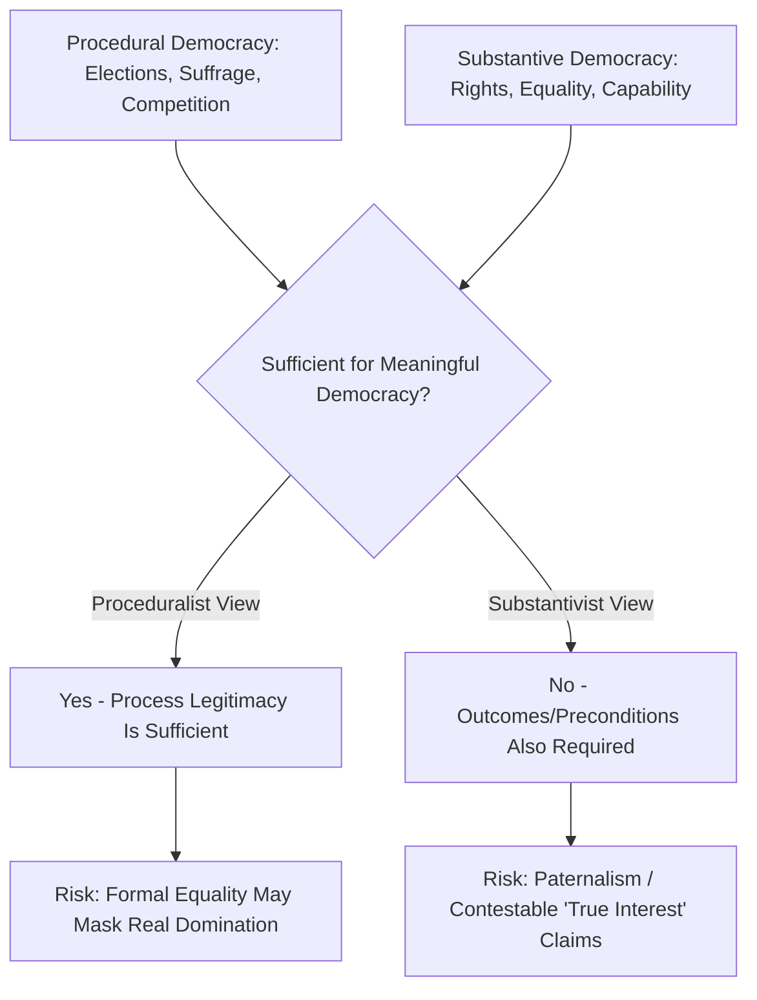

## Procedural and Substantive Democracy

### Definitional Distinction

The procedural/substantive distinction is one of the central organizing debates in democratic theory, addressing whether democracy should be defined purely by *how* decisions are made (procedural) or also by *what* those decisions produce or presuppose (substantive).

**Key Points**

- **Procedural democracy** defines democracy in terms of decision-making mechanisms: competitive elections, majority rule, universal suffrage, and formal political equality in the process of choosing leaders and policies
- **Substantive democracy** defines democracy additionally (or primarily) in terms of outcomes or preconditions: protection of rights, socioeconomic equality, rule of law, and the actual capacity of citizens to exercise meaningful political influence
- This distinction directly extends the minimalist/maximalist definitional debate covered under democracy measurement, but focuses specifically on the **process versus outcome** axis rather than breadth of definition alone
- Most real-world democratic theories combine elements of both, differing mainly in emphasis and threshold requirements

### Procedural Democracy: Core Framework

#### Schumpeterian Roots

Joseph Schumpeter's minimalist definition (*Capitalism, Socialism and Democracy*, 1942) is the paradigmatic procedural account: democracy is simply the institutional method by which individuals acquire decision-making power through competitive struggle for the people's vote.

**Key Points**

- Procedural democracy asks only: are elections free, fair, competitive, and regularly held? Is suffrage sufficiently broad? Can incumbents be removed through the process?
- It deliberately brackets questions about the *content* of policies produced, the *distribution* of resources in society, or the *quality* of public deliberation
- Adam Przeworski's dichotomous coding approach (regime is "democratic" if contested elections exist and alternation in power has occurred or is possible) exemplifies operationalized procedural minimalism

#### Rationale for Proceduralism

**Key Points**

- **Value pluralism defense**: in societies with deep disagreement about what constitutes the "good life" or correct substantive outcomes, procedural fairness offers a neutral mechanism for resolving disputes without requiring prior agreement on ends
- **Measurement tractability**: procedural criteria (was an election held, was there more than one competing party, did power change hands) are more readily observable and codeable than substantive outcomes like "meaningful political equality"
- **Avoiding the "true interests" problem**: substantive definitions risk allowing elites or theorists to declare a regime "truly democratic" or "not truly democratic" based on outcomes they favor, regardless of what citizens actually chose — a concern raised by critics of substantive definitions as potentially paternalistic or as providing cover for anti-democratic reasoning (historically invoked, for instance, by some Soviet-bloc regimes claiming to be "true" or "people's" democracies despite lacking competitive elections)

### Substantive Democracy: Core Framework

#### The Core Claim

Substantive theorists argue that formal procedural equality (one person, one vote) can mask deep inequalities in actual political influence and life outcomes, such that a regime meeting minimal procedural criteria may still fail to be meaningfully democratic in practice.

**Key Points**

- **Socioeconomic dimension**: T.H. Marshall's concept of **social citizenship** (*Citizenship and Social Class*, 1950) argued that civil and political rights are insufficient without accompanying social rights (education, welfare, minimum living standards) that make genuine citizenship participation possible
- **Rights-based dimension**: substantive accounts often require protection of civil liberties, minority rights, and rule of law as necessary components of democracy itself, not merely desirable add-ons (this overlaps significantly with "liberal democracy" as a concept)
- **Capability dimension**: drawing on Amartya Sen's and Martha Nussbaum's capabilities approach, some theorists argue democracy requires citizens to possess the actual capabilities (education, health, freedom from severe deprivation) needed to exercise political agency meaningfully, not merely the formal legal right to do so

#### Political Equality as Substantive Concern

**Key Points**

- Robert Dahl himself, despite his minimalist-leaning polyarchy framework, acknowledged in later work (*On Political Equality*, 2006) that severe economic inequality could undermine the substantive political equality polyarchy presupposes, illustrating that even proceduralist theorists often recognize substantive preconditions matter
- Critics of pure proceduralism point to phenomena such as large-scale campaign finance disparities, unequal access to media, and systemic voter suppression as examples where formally equal procedures (everyone has one vote) coexist with substantively unequal political influence
- [Inference] This tension illustrates why even scholars generally associated with procedural/minimalist traditions frequently incorporate some substantive concerns at the margins, suggesting the procedural/substantive distinction may function more as a spectrum of emphasis than a strict binary in much contemporary scholarship

### Comparative Table: Procedural vs. Substantive Emphasis

| Dimension | Procedural Democracy | Substantive Democracy |
| --- | --- | --- |
| Core question | How are decisions made? | What do decisions produce/presuppose? |
| Primary criteria | Free/fair elections, suffrage, competition | Rights protection, equality, rule of law, capability |
| Risk if absent | Elections captured, non-competitive, restricted suffrage | Formal equality masking real inequality/domination |
| Key theorists | Schumpeter, Przeworski, early Dahl | T.H. Marshall, Sen/Nussbaum (capabilities), later Dahl |
| Measurement approach | Dichotomous/procedural indices | Multidimensional indices (e.g., V-Dem egalitarian component) |
| Main critique received | Masks substantive inequality and domination | Risks paternalism, "true interests" problem, measurement difficulty |

### Formal Illustration of the Tension

A useful heuristic distinguishes formal political equality from effective political equality:

$$EPE = f(FPE, R)$$

Where **effective political equality** ($EPE$) is understood as a function of **formal political equality** ($FPE$, e.g., equal voting rights) and $R$, the distribution of resources, capabilities, and social conditions that enable citizens to actually exercise that formal equality. [Inference] This is a conceptual heuristic used to illustrate the substantivist critique of pure proceduralism, not a formula found in any single canonical text; it is intended to show why substantivists argue $FPE$ alone is an incomplete measure of genuine democratic equality.

### Rawlsian Contribution: Fair Value of Political Liberties

John Rawls's *A Theory of Justice* (1971) and later *Political Liberalism* (1993) provided an influential middle-ground contribution relevant to this debate through the concept of the **fair value of political liberties**.

**Key Points**

- Rawls distinguished between merely having a formal political liberty (e.g., the right to run for office or to speak) and its **fair value** — the actual worth of that liberty, which depends on one's position in the distribution of wealth and social advantage
- Rawls argued that just political institutions must ensure the fair value of political liberties is roughly equal across citizens, regardless of their social or economic position, which requires attention to background socioeconomic conditions rather than treating formal political rights alone as sufficient
- This position is often read as an important philosophical bridge between purely procedural liberalism and substantive egalitarian critiques, since Rawls remained committed to liberal proceduralism while insisting it required substantive socioeconomic underpinning

### Democratic Elitism as a Procedural-Adjacent Position

Related to but distinct from strict Schumpeterian proceduralism, **democratic elitist** theories (associated with Robert Michels, Gaetano Mosca, Vilfredo Pareto, and later empirically explored by scholars of political behavior) argue that meaningful mass participation in substantive policymaking is largely illusory in any large-scale society, since organizational and cognitive realities inevitably produce elite-dominated decision-making.

**Key Points**

- Michels's **"iron law of oligarchy"** (*Political Parties*, 1911) argued that even organizations explicitly committed to democratic, egalitarian principles (e.g., socialist parties, trade unions) inevitably develop entrenched leadership oligarchies due to organizational necessity and the division of labor between leaders and followers
- Democratic elitists tend to view procedural democracy's function as primarily enabling *competition among elites* for popular endorsement (echoing Schumpeter) rather than facilitating genuine mass participation in substantive governance
- [Inference] This perspective is often cited as a sobering empirical counterpoint to more substantivist and participatory theories that presume broad, meaningful citizen influence over political outcomes is realistically achievable at scale

### Deliberative and Participatory Democracy as Substantive Correctives

Substantive concerns about the adequacy of pure proceduralism have motivated two influential theoretical responses:

#### Deliberative Democracy

Associated with Jürgen Habermas and later Amy Gutmann and Dennis Thompson, deliberative democracy argues that legitimate democratic decisions require not merely aggregating pre-existing preferences through voting, but genuine public reasoning in which citizens exchange justifications and potentially revise their views.

**Key Points**

- Emphasizes the *quality* of the decision-making process (reasoned exchange, mutual justification, inclusiveness of discourse) as a substantive add-on to mere procedural vote-counting
- V-Dem's Deliberative Democracy Index operationalizes this dimension separately from electoral competitiveness

#### Participatory Democracy

Associated with Carole Pateman (*Participation and Democratic Theory*, 1970), this tradition argues that democracy should extend citizen involvement beyond periodic voting into workplaces, local governance, and other spheres of daily life, partly as a substantive corrective to the "thin" participation Schumpeterian proceduralism allows.

### Empirical and Measurement Implications

The procedural/substantive distinction has direct consequences for how democracy is operationalized (see also democracy measurement more broadly):

| Index/Approach | Procedural Emphasis | Substantive Elements Included |
| --- | --- | --- |
| Przeworski/ACLP dichotomous coding | Strong (near-exclusive) | Minimal |
| Polity5 | Strong | Limited (some executive constraint) |
| Freedom House | Moderate | Civil liberties dimension adds substantive weight |
| V-Dem Electoral Democracy Index | Strong | Minimal by design |
| V-Dem Liberal Democracy Index | Moderate | Rule of law, rights, horizontal accountability |
| V-Dem Egalitarian Democracy Index | Weak (foundational only) | Strong — resource/power distribution central |

[Inference] The V-Dem project's decision to construct multiple separate indices rather than one composite score is widely understood in the methodological literature as a direct institutional response to the recognized inadequacy of collapsing the procedural/substantive distinction into a single number.

### Illustrative Diagram: Spectrum of Democratic Conceptions

<svg xmlns="http://www.w3.org/2000/svg" viewBox="0 0 700 300" font-family="Arial, sans-serif">
<text x="350" y="30" text-anchor="middle" font-size="18" font-weight="bold" fill="#1a1a2e">Procedural-Substantive Spectrum (svg_diagram)</text>
<line x1="60" y1="150" x2="640" y2="150" stroke="#1a1a2e" stroke-width="3" />
<polygon points="640,150 625,143 625,157" fill="#1a1a2e" />
<circle cx="100" cy="150" r="8" fill="#a2d2ff" stroke="#1a1a2e" stroke-width="2" />
<text x="100" y="120" text-anchor="middle" font-size="12" font-weight="bold" fill="#1a1a2e">Schumpeter</text>
<text x="100" y="180" text-anchor="middle" font-size="11" fill="#1a1a2e">Pure Procedural</text>
<circle cx="250" cy="150" r="8" fill="#bde0fe" stroke="#1a1a2e" stroke-width="2" />
<text x="250" y="120" text-anchor="middle" font-size="12" font-weight="bold" fill="#1a1a2e">Dahl (Polyarchy)</text>
<text x="250" y="180" text-anchor="middle" font-size="11" fill="#1a1a2e">Procedural+</text>
<circle cx="400" cy="150" r="8" fill="#cdb4db" stroke="#1a1a2e" stroke-width="2" />
<text x="400" y="120" text-anchor="middle" font-size="12" font-weight="bold" fill="#1a1a2e">Rawls</text>
<text x="400" y="180" text-anchor="middle" font-size="11" fill="#1a1a2e">Fair Value of Liberties</text>
<circle cx="550" cy="150" r="8" fill="#ffafcc" stroke="#1a1a2e" stroke-width="2" />
<text x="550" y="120" text-anchor="middle" font-size="12" font-weight="bold" fill="#1a1a2e">Marshall / Sen</text>
<text x="550" y="180" text-anchor="middle" font-size="11" fill="#1a1a2e">Strong Substantive</text>

<text x="100" y="230" text-anchor="middle" font-size="11" fill="`#1a1a2e`">Process Only</text>

<text x="550" y="230" text-anchor="middle" font-size="11" fill="`#1a1a2e`">Outcomes/Preconditions Required</text>

</svg>

### Practical Illustration

**Example**

Consider a country that holds regular, competitive, fraud-free multiparty elections (satisfying core procedural criteria), but where extreme wealth concentration allows a small number of individuals to dominate campaign financing and mass media ownership, and where a substantial share of the population lacks basic education or lives in severe poverty limiting their practical capacity for political engagement. A strict proceduralist would classify this country as democratic based on electoral criteria alone. A substantivist (drawing on Marshall's social citizenship framework or Rawls's fair value of political liberties) would argue this case reveals a meaningful democratic deficit, since formal electoral equality coexists with substantively unequal capacity to influence political outcomes — illustrating precisely the analytical gap the procedural/substantive distinction is designed to capture.

### Critiques of Each Position

**Key Points**

- **Critiques of pure proceduralism**: accused of being too easily satisfied by "electoralism" — regimes that hold technically competitive elections while allowing severe underlying inequality, media capture, or intimidation to shape outcomes (related to competitive authoritarianism concerns raised in democracy measurement)
- **Critiques of strong substantivism**: accused of risking definitional overreach (Sartori's "conceptual stretching" concern) by incorporating so many outcome criteria that few or no real-world regimes qualify as fully "democratic," and of opening space for paternalistic claims about citizens' "true interests" that could be used to override actual popular choices
- [Inference] Most contemporary comparative democracy scholars appear to favor disaggregated, multidimensional measurement (rather than committing exclusively to either pole) precisely because it avoids forcing a single procedural-versus-substantive tradeoff into one score, though the underlying philosophical debate about which conception should count as "real" democracy remains unresolved and is unlikely to be settled by measurement innovation alone

### Conclusion

The procedural/substantive distinction captures a foundational and enduring tension in democratic theory: whether democracy is adequately defined by fair decision-making processes alone, or whether it necessarily requires attention to the material, legal, and social conditions that make genuine political equality possible in practice. Proceduralists prioritize measurement tractability, value-neutrality amid pluralism, and avoidance of paternalistic "true interest" claims; substantivists respond that formal procedural equality can mask deep and politically consequential inequalities in actual influence and capability. Contemporary comparative measurement has largely responded to this tension not by resolving it philosophically but by disaggregating democracy into multiple distinct indices, allowing researchers to examine procedural and substantive dimensions separately rather than forcing a single verdict.

**Related Topics**

- Defining and measuring democracy: minimalist versus maximalist definitional traditions
- Robert Dahl's polyarchy and later work on political equality
- John Rawls's theory of justice and the fair value of political liberties
- T.H. Marshall's social citizenship and the welfare state as democratic precondition
- Amartya Sen and Martha Nussbaum's capabilities approach applied to political participation
- Democratic elitism and Michels's iron law of oligarchy
- Deliberative democracy theory (Habermas, Gutmann and Thompson)
- Participatory democracy theory (Carole Pateman) and modern participatory budgeting experiments
- Competitive authoritarianism and "electoralism" as a procedural-democracy critique
- V-Dem's multidimensional measurement architecture and index disaggregation