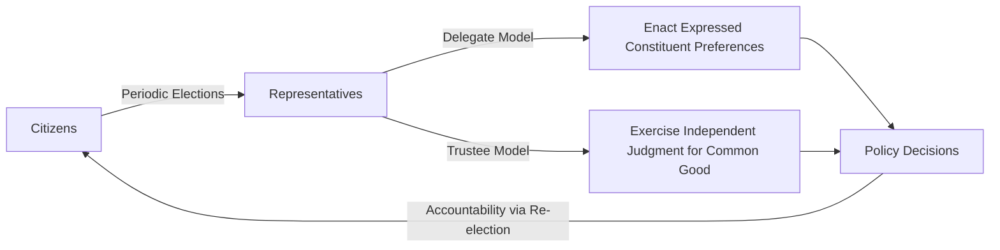
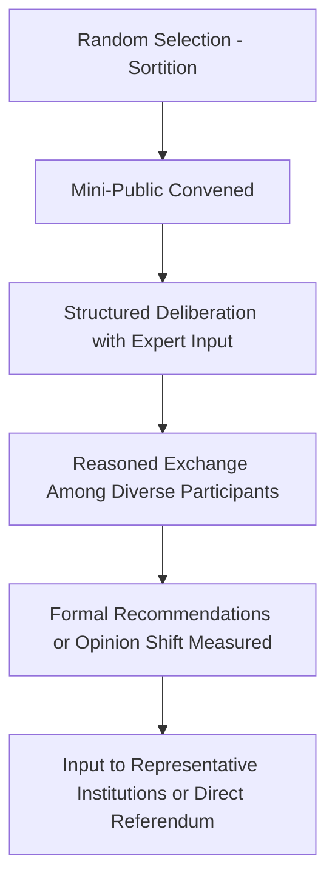

## Direct, Representative, and Deliberative Democracy

### Definitional Overview

Direct, representative, and deliberative democracy represent three distinct institutional and normative models for organizing collective self-governance, each answering differently the question of *who* participates in decision-making and *how* that participation is structured.

**Key Points**

- **Direct democracy**: citizens themselves make binding political decisions directly, without intermediary representatives
- **Representative democracy**: citizens elect officials who make binding decisions on their behalf
- **Deliberative democracy**: emphasizes the *quality* of reasoning and discourse preceding a decision, and can in principle be combined with either direct or representative institutional structures
- These models are not always mutually exclusive in practice; most contemporary democracies combine representative institutions with select direct-democracy mechanisms (referenda, initiatives) and, increasingly, deliberative innovations (citizens' assemblies)

### Direct Democracy

#### Historical and Conceptual Foundations

Direct democracy's paradigmatic historical case is Athenian democracy, in which citizens personally debated and voted on legislation in the Ekklesia rather than through elected representatives. Jean-Jacques Rousseau's theoretical defense of popular sovereignty (*The Social Contract*, 1762) provided the most influential early modern philosophical grounding, arguing that sovereignty — the General Will — could not be legitimately delegated or represented.

**Key Points**

- Rousseau's skepticism toward representation ("the moment a people gives itself representatives, it is no longer free") positioned direct participation as normatively superior to delegation
- Direct democracy is most institutionally feasible at small scale (city-states, cantons, local jurisdictions), a limitation Rousseau himself acknowledged
- [Inference] The scale problem — the practical difficulty of extending direct citizen decision-making to large, complex modern nation-states — is widely regarded as the central institutional constraint explaining why virtually no large modern state relies primarily on direct democracy for day-to-day governance

#### Modern Institutional Mechanisms

| Mechanism | Description | Example Context |
| --- | --- | --- |
| Referendum | A binding or advisory public vote on a specific policy question, often initiated by government | Brexit referendum (UK, 2016); numerous EU treaty referenda |
| Initiative | A process allowing citizens to propose legislation or constitutional amendments directly via petition and public vote | California's ballot initiative system (US) |
| Recall | A mechanism allowing citizens to remove an elected official from office before their term ends via direct vote | Recall elections at state/local level in parts of the United States |
| Landsgemeinde | Traditional Swiss cantonal open-air assembly where citizens vote by show of hands on legislation | Certain Swiss cantons (e.g., Glarus, Appenzell Innerrhoden) |
| Town meeting | New England tradition of direct citizen deliberation and voting on local budgets and ordinances | Town governance in parts of the northeastern United States |

**Key Points**

- Switzerland is frequently cited as the modern democracy with the most extensive institutionalized use of direct democracy at the national level, combining representative federal institutions with frequent binding referenda
- Direct democracy mechanisms are often used as *supplements* to representative government rather than wholesale substitutes, even in jurisdictions that use them extensively

#### Critiques of Direct Democracy

**Key Points**

- **Tyranny of the majority**: direct majority votes may inadequately protect minority rights, a concern raised by Tocqueville and Madison in different ways
- **Information and competence concerns**: voters may lack the specialized knowledge, time, or attention that legislative deliberation on complex technical policy requires — an argument echoing Plato's and Mill's epistemic reservations about mass judgment
- **Susceptibility to manipulation**: campaigns around referenda/initiatives can be shaped disproportionately by well-funded interest groups or by simplified, emotionally charged framing rather than careful policy analysis
- **Logrolling and coherence problems**: sequential single-issue votes may produce inconsistent overall policy outcomes that no single coherent majority actually endorses (a concern related to social choice theory and Arrow's Impossibility Theorem)
- [Inference] These critiques do not establish that direct democracy is categorically inferior to representative government, but they represent the recurring theoretical objections cited across the classical (Plato, Madison) and contemporary literature on direct democracy's institutional limitations

### Representative Democracy

#### Conceptual Foundations

Representative democracy addresses the scale problem inherent in direct democracy by delegating day-to-day decision-making to elected officials accountable to the electorate through periodic elections.

**Key Points**

- James Madison's *Federalist No. 10* provided the classic defense: representation "refines and enlarges the public views" by filtering them through a body of citizens whose wisdom may better discern the true interest of their country, while an extended republic makes it harder for any single faction to dominate
- Edmund Burke's 1774 "Speech to the Electors of Bristol" articulated an influential distinction in representative theory between the **delegate model** (representatives should directly enact constituents' expressed preferences) and the **trustee model** (representatives should exercise independent judgment about the public good, even against constituent preference)
- Hanna Pitkin's *The Concept of Representation* (1967) provided the foundational typology distinguishing multiple senses of representation

#### Pitkin's Typology of Representation

| Type | Description |
| --- | --- |
| Formalistic representation | Representation defined by the formal, institutional authorization process (how a representative gains and can lose authority) |
| Descriptive representation | The degree to which representatives resemble/mirror the demographic characteristics of the represented (race, gender, class, etc.) |
| Symbolic representation | How a representative is perceived to "stand for" the represented group in a symbolic or affective sense |
| Substantive representation | Acting in the interest of the represented, responsive to their preferences |

**Key Points**

- Descriptive and substantive representation are often analytically separated because descriptive similarity does not guarantee substantive responsiveness, though empirical research has explored conditions under which the two correlate
- [Inference] Contemporary debates over legislative diversity (e.g., gender quotas, minority-majority districting) frequently hinge on disagreements about whether descriptive representation is instrumentally valuable for achieving substantive representation, intrinsically valuable regardless of substantive outcomes, or both

#### Institutional Variants

| Electoral System | Representational Logic | Example |
| --- | --- | --- |
| First-past-the-post (plurality, single-member districts) | Geographic constituency representation; tends toward two-party systems (per Duverger's Law) | United Kingdom, United States (House) |
| Proportional representation (party-list) | Seats allocated in proportion to vote share; tends toward multiparty systems | Netherlands, Israel |
| Mixed-member proportional | Combines district-based and proportional list seats | Germany, New Zealand |
| Single transferable vote | Ranked-choice voting in multi-member districts | Ireland, Malta |

#### Critiques of Representative Democracy

**Key Points**

- **Principal-agent problems**: elected representatives (agents) may pursue their own interests (reelection, career advancement, donor relationships) rather than faithfully representing constituent (principal) interests, particularly given information asymmetries between elections
- **Elite capture and oligarchic drift**: Robert Michels's "iron law of oligarchy" (1911) argued that representative organizations, including democratic parties, inevitably develop entrenched leadership elites disconnected from rank-and-file membership
- **Responsiveness gaps**: empirical political science research (e.g., work associated with Martin Gilens and Benjamin Page in the U.S. context) has examined the degree to which policy outcomes track the preferences of average citizens versus economic elites and organized interests; [Unverified] specific quantitative findings on this question remain subject to ongoing methodological debate and should be checked against current literature rather than treated as settled consensus
- **Reduced ongoing participation**: critics (particularly participatory democracy theorists like Carole Pateman) argue representative democracy reduces citizen political engagement to the isolated act of voting, foreclosing the developmental and educative benefits of more active civic participation

### Deliberative Democracy

#### Conceptual Foundations

Deliberative democracy, most fully theorized by Jürgen Habermas (*Between Facts and Norms*, 1992) and further developed by Amy Gutmann and Dennis Thompson (*Democracy and Disagreement*, 1996), argues that democratic legitimacy derives not merely from aggregating pre-existing preferences (through voting, whether direct or representative) but from a process of genuine public reasoning in which citizens exchange justifications, consider opposing views, and potentially revise their positions.

**Key Points**

- Habermas's concept of the **public sphere** (*Öffentlichkeit*) provides the broader theoretical backdrop: a societal space of open, rational-critical discourse that legitimates or challenges political authority
- Deliberative legitimacy requires that decisions be justifiable to all those bound by them through reasons they could, in principle, accept — sometimes summarized as the requirement of **public reason** (a concept also central to Rawlsian political liberalism)
- Deliberative democracy is explicitly presented as a *supplement or corrective* to both pure aggregative voting (whether direct or representative) rather than a wholesale alternative institutional structure for making binding decisions at scale

#### Core Normative Criteria for Deliberation

| Criterion | Description |
| --- | --- |
| Reciprocity/reason-giving | Participants offer justifications others could reasonably accept, not mere assertions of preference or power |
| Publicity | Reasoning process is open and transparent, not conducted in secret |
| Inclusiveness | All those affected by a decision have meaningful opportunity to participate in deliberation |
| Accountability | Decision-makers must be able to justify decisions in deliberative terms |
| Provisionality | Deliberative conclusions remain open to revision in light of new arguments or evidence |

#### Institutional Innovations: Mini-Publics

Contemporary deliberative democracy theory has generated practical institutional experiments often called **mini-publics** — bodies of randomly selected (sortition-based) citizens convened to deliberate on specific policy questions.

| Format | Description | Notable Example |
| --- | --- | --- |
| Citizens' assembly | Larger randomly selected body deliberating over extended period, often producing formal recommendations | Irish Citizens' Assembly (constitutional issues including abortion, 2016–2018) |
| Deliberative poll | Random sample surveyed before and after structured deliberation to measure opinion change (James Fishkin's method) | Various national and local applications internationally |
| Citizens' jury | Smaller randomly selected panel examining a specific policy question in depth | Various local government applications |
| Planning cell | German model (Peter Dienel) of randomly selected citizen panels addressing local planning issues | Municipal planning processes in Germany |

**Key Points**

- These innovations directly revive the ancient Athenian principle of **sortition** as a mechanism for achieving representative, unbiased citizen input, distinct from both direct majority voting and elected representation
- [Inference] Advocates argue mini-publics can combine the legitimacy benefits of broad citizen involvement with the deliberative quality benefits of sustained, informed discussion, avoiding both the superficiality sometimes associated with mass referendum campaigns and the elite-capture concerns associated with purely representative bodies, though empirical research on their downstream policy impact and long-term institutionalization remains an active and evolving area of study

#### Critiques of Deliberative Democracy

**Key Points**

- **Feasibility at scale**: critics question whether genuine deliberative ideals (reciprocal reason-giving among all affected parties) can be meaningfully achieved beyond small, curated settings like mini-publics, given the scale of modern polities
- **Power and inequality in discourse**: critical theorists (drawing partly on feminist and postcolonial critiques, e.g., Iris Marion Young) argue that formally open deliberation can still be dominated by those with greater rhetorical skill, education, or social status, potentially reproducing rather than correcting substantive inequality
- **Consensus assumption critique**: agonistic democratic theorists (notably Chantal Mouffe) argue that deliberative democracy's emphasis on rational consensus underestimates or suppresses legitimate, irreducible political conflict and disagreement, which they argue should be channeled ("agonism") rather than resolved through idealized consensus-seeking
- **Elite/technocratic bias concern**: some critics worry deliberative processes structured around "reasoned" discourse may implicitly privilege the discursive styles and background knowledge of already-advantaged groups

### Comparative Summary

| Feature | Direct Democracy | Representative Democracy | Deliberative Democracy |
| --- | --- | --- | --- |
| Who decides | Citizens directly | Elected officials | Varies — quality of process is central, not who formally decides |
| Primary mechanism | Referendum, initiative, assembly vote | Periodic competitive elections | Structured reasoned discourse, often via mini-publics |
| Scale suitability | Best at small scale (city-state, canton) | Suited to large-scale modern states | Can be applied at various scales via mini-publics, but faces scale challenges for whole-polity application |
| Central risk | Majority tyranny, manipulation, incoherent policy | Principal-agent problems, elite capture | Discourse inequality, feasibility, suppression of legitimate conflict |
| Key theorists | Rousseau, Athenian practice | Madison, Burke, Pitkin | Habermas, Gutmann and Thompson, Fishkin |
| Relationship to other models | Can supplement representative systems (referenda) | Dominant model in large modern states | Can supplement either direct or representative systems |

### Illustrative Diagram: Interrelationship of the Three Models

<svg xmlns="http://www.w3.org/2000/svg" viewBox="0 0 700 400" font-family="Arial, sans-serif">
<text x="350" y="30" text-anchor="middle" font-size="18" font-weight="bold" fill="#1a1a2e">Three Models of Democratic Decision-Making (svg_diagram)</text>
<circle cx="220" cy="220" r="140" fill="#a2d2ff" fill-opacity="0.5" stroke="#1a1a2e" stroke-width="2" />
<text x="150" y="130" text-anchor="middle" font-size="15" font-weight="bold" fill="#1a1a2e">Direct</text>
<text x="150" y="148" text-anchor="middle" font-size="11" fill="#1a1a2e">(Referenda, Initiatives)</text>
<circle cx="480" cy="220" r="140" fill="#ffafcc" fill-opacity="0.5" stroke="#1a1a2e" stroke-width="2" />
<text x="550" y="130" text-anchor="middle" font-size="15" font-weight="bold" fill="#1a1a2e">Representative</text>
<text x="550" y="148" text-anchor="middle" font-size="11" fill="#1a1a2e">(Elections, Legislatures)</text>
<circle cx="350" cy="290" r="130" fill="#bde0fe" fill-opacity="0.6" stroke="#1a1a2e" stroke-width="2" />
<text x="350" y="360" text-anchor="middle" font-size="15" font-weight="bold" fill="#1a1a2e">Deliberative</text>
<text x="350" y="378" text-anchor="middle" font-size="11" fill="#1a1a2e">(Mini-Publics, Public Sphere)</text>

<text x="350" y="240" text-anchor="middle" font-size="12" font-weight="bold" fill="`#1a1a2e`">Combined</text>

<text x="350" y="256" text-anchor="middle" font-size="11" fill="`#1a1a2e`">(e.g., Citizens' Assembly</text>

<text x="350" y="270" text-anchor="middle" font-size="11" fill="`#1a1a2e`">Informing a Referendum)</text>

</svg>

### Hybrid Real-World Applications

**Example**

Ireland's process for addressing the constitutional prohibition on abortion illustrates a hybrid combining all three models: a randomly selected **Citizens' Assembly** (deliberative/sortition-based) deliberated extensively with expert testimony and produced recommendations; this fed into parliamentary consideration (**representative** institutions debating and drafting the specific referendum question); the final constitutional change was then decided through a binding national **referendum** (direct democracy) in 2018. This sequencing is frequently cited in comparative democratic theory as an example of how the three models can be institutionally combined to draw on the distinct legitimacy strengths of each — informed deliberation, representative refinement, and direct popular ratification — rather than treated as mutually exclusive alternatives.

### Conclusion

Direct, representative, and deliberative democracy address distinct but interrelated questions about how collective political decisions should be made and legitimated. Direct democracy maximizes citizen decision-making authority but faces significant scale and competence-related challenges; representative democracy addresses the scale problem through delegation but introduces principal-agent and elite-capture risks; deliberative democracy shifts the evaluative focus from *who* decides to the *quality of reasoning* behind decisions, offering both a normative standard and, through innovations like mini-publics, practical institutional supplements to the other two models. Contemporary democratic practice increasingly combines all three — using representative institutions as the primary governing structure, direct mechanisms for high-salience or constitutional questions, and deliberative innovations to improve the quality of both.

**Related Topics**

- Rousseau's General Will and the philosophical case against representation
- Hanna Pitkin's typology of representation and descriptive versus substantive representation debates
- Electoral systems and their representational logics (proportional representation, first-past-the-post, mixed systems)
- Robert Michels's iron law of oligarchy and elite theory
- Habermas's public sphere theory and the concept of public reason
- Citizens' assemblies and sortition-based mini-publics as democratic innovations
- Chantal Mouffe's agonistic democracy as a critique of deliberative consensus
- Social choice theory and Arrow's Impossibility Theorem as applied to direct democracy's aggregation problems
- Swiss direct democracy institutions as a comparative case study
- Participatory democracy theory (Carole Pateman) and its relationship to deliberative innovations