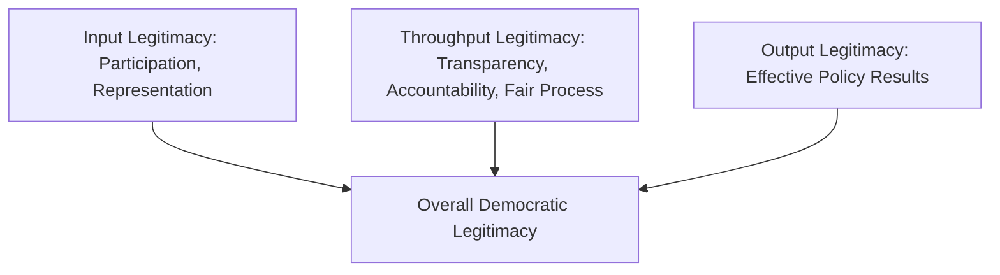
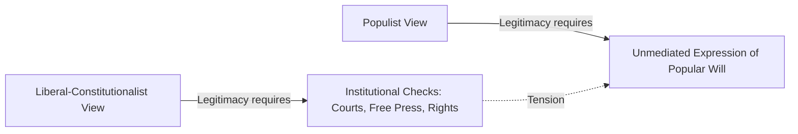

## Democratic Legitimacy

### Definition and Conceptual Scope

Democratic legitimacy concerns the normative and empirical question of what makes democratic political authority rightful — why citizens have genuine reason to accept and comply with decisions made through democratic processes, even when they personally disagree with a particular outcome.

**Key Points**

- Legitimacy is distinct from mere legality (conformity with existing law) and from mere effectiveness (a regime's capacity to enforce compliance through coercion)
- Legitimacy addresses the **normative justification** for political authority, while related empirical work in political sociology examines legitimacy **beliefs** — whether citizens actually regard authority as rightful, regardless of whether it philosophically deserves to be
- The concept sits at the intersection of normative political theory (what confers legitimacy) and empirical political science (how legitimacy beliefs are measured and what sustains or erodes them)

### Max Weber's Foundational Typology

Max Weber's classic sociological typology (*Economy and Society*, 1922) identified three ideal-typical sources of legitimate authority, providing the foundational vocabulary for subsequent legitimacy scholarship.

| Type | Basis of Legitimacy | Example |
| --- | --- | --- |
| Traditional authority | Sanctity of long-established custom and inherited status | Hereditary monarchy |
| Charismatic authority | Exceptional personal qualities attributed to a leader | Revolutionary or messianic leadership |
| Legal-rational authority | Belief in the legality of enacted rules and the right of those elevated under such rules to issue commands | Modern bureaucratic states, including democracies |

**Key Points**

- Modern democracies are generally understood as paradigmatic cases of **legal-rational authority**, where legitimacy derives from adherence to constitutionally and legally established procedures rather than personal or traditional claims
- [Inference] Weber's typology is widely used as a starting analytical framework in comparative politics, though most real political systems combine elements of multiple types (e.g., a democratically elected leader with strong charismatic appeal) rather than existing as pure types

### Input, Output, and Throughput Legitimacy

A widely used contemporary framework, most systematically developed by Fritz Scharpf (*Governing in Europe*, 1999) and later extended by Vivien Schmidt, distinguishes three analytically separate bases of democratic legitimacy.

| Dimension | Core Question | Focus |
| --- | --- | --- |
| Input legitimacy | Does the process reflect the will of the people? | Participation, representation, responsiveness to citizen preferences |
| Output legitimacy | Does the decision produce effective, beneficial results? | Policy effectiveness, problem-solving capacity |
| Throughput legitimacy | Is the decision-making process itself of good quality? | Transparency, accountability, procedural fairness, inclusiveness of the process |

$$Legitimacy = f(Input, Throughput, Output)$$

[Inference] This functional notation is a pedagogical simplification used to convey that legitimacy is generally treated in this literature as multidimensional rather than reducible to a single source; Scharpf's original framework was presented analytically/verbally rather than as a formal mathematical function, and the three dimensions are not necessarily additive or substitutable in any precise, measurable way.

**Key Points**

- Input legitimacy corresponds closely to procedural democratic theory (elections, participation, representation)
- Output legitimacy corresponds to substantive/performance-based justifications (does the government deliver economic growth, security, effective public services?)
- Throughput legitimacy was added later (Schmidt, 2013) to capture concerns about *process quality* independent of both input responsiveness and output effectiveness — e.g., whether decision-making is transparent and accountable even when it produces good outcomes and reflects popular will
- This framework has been extensively applied to debates about the European Union's legitimacy, given its recognized "democratic deficit" in input terms but claims to output legitimacy through effective problem-solving

### Normative Theories of Democratic Legitimacy

#### Consent-Based Theories

Rooted in social contract theory (Locke, Rousseau), consent-based accounts hold that political authority is legitimate insofar as it derives from the actual or hypothetical consent of those governed.

**Key Points**

- **Explicit consent** (e.g., naturalization oaths) applies to only a small subset of citizens in most states, creating the classic problem of explaining why native-born citizens who never explicitly consented are nonetheless bound
- **Tacit consent** theories (suggested by Locke) argue that continued residence, use of public goods, or participation in political processes (e.g., voting) implies consent, though critics note this stretches the concept of "consent" considerably, since emigration is often not a realistic option
- **Hypothetical consent** theories (associated with contractarian thought more broadly, later refined by Rawls) ask what rational agents would consent to under fair hypothetical conditions, shifting the justificatory burden from actual historical consent to reasonable hypothetical agreement

#### Rawlsian Public Reason

John Rawls's *Political Liberalism* (1993) argued that legitimate exercises of political power in a pluralistic society must be justifiable through **public reason** — reasons that citizens holding different comprehensive moral, religious, or philosophical views could reasonably be expected to accept, rather than reasons drawn from any single comprehensive doctrine.

**Key Points**

- This addresses legitimacy in societies characterized by reasonable pluralism, where citizens will never converge on a single comprehensive worldview
- Legitimacy, for Rawls, does not require actual unanimous agreement on outcomes, but requires that the *basic structure* of political institutions be justifiable in terms citizens can reasonably accept regardless of their particular comprehensive views

#### Habermasian Discourse Theory of Legitimacy

Jürgen Habermas's discourse-theoretic account (*Between Facts and Norms*, 1992) holds that laws and political decisions are legitimate only insofar as they could, in principle, be agreed to by all those affected in an ideal, undistorted process of rational deliberation — closely connecting legitimacy to the deliberative democracy tradition.

**Key Points**

- Legitimacy is fundamentally proceduralized in Habermas's account: it is not the *content* of a decision that confers legitimacy, but the *quality of the discursive process* through which the decision was reached
- This account directly underpins Scharpf and Schmidt's later "throughput legitimacy" concept

#### Proceduralist vs. Substantive/Epistemic Theories of Legitimacy

A parallel debate to the procedural/substantive democracy distinction applies specifically to legitimacy:

| Theory Type | Core Claim | Key Association |
| --- | --- | --- |
| Pure proceduralism | Legitimacy derives entirely from following the correct decision procedure, regardless of outcome | Some readings of Schumpeterian minimalism |
| Epistemic/instrumentalist theories | Democratic procedures are legitimate partly *because* they tend to produce good or correct outcomes (e.g., via the Condorcet Jury Theorem's aggregation logic) | David Estlund's "epistemic proceduralism" |
| Substantive/outcome-based theories | Legitimacy depends significantly on whether outcomes meet independent standards of justice, rights protection, or the common good | Various rights-based and substantive democratic theories |

**Key Points**

- David Estlund's *Democratic Authority* (2008) developed **epistemic proceduralism** as a middle position: democratic procedures are valuable and legitimating partly because of their comparative epistemic reliability at tracking correct or reasonable outcomes, not merely because they reflect popular will as an end in itself
- The Condorcet Jury Theorem — a mathematical result showing that under certain conditions, majority voting among individuals each more likely than not to be correct becomes increasingly reliable as group size grows — is frequently invoked (with caveats about its restrictive assumptions) as formal support for epistemic democratic theories

$$P(majority\ correct) \to 1 \text{ as } n \to \infty, \text{ if } p > 0.5$$

Where $p$ is each voter's individual probability of choosing the correct option and $n$ is the number of voters. [Inference] This is the standard simplified statement of the Condorcet Jury Theorem's asymptotic result; the theorem's practical applicability to real political judgments is contested, since its core assumptions — independent voting, a binary correct/incorrect choice, and each voter's competence exceeding random chance — are strong idealizations that may not hold in many real-world political contexts.

### Empirical Political Science: Legitimacy Beliefs and Political Trust

Separate from normative philosophical debate, empirical political science studies **legitimacy beliefs** — the degree to which citizens actually regard political authority and institutions as rightful.

**Key Points**

- **Diffuse support** versus **specific support**, a distinction developed by David Easton (*A Systems Analysis of Political Life*, 1965): diffuse support refers to generalized attachment to the political system and its core institutions, persisting independent of particular outcomes, while specific support refers to satisfaction with particular incumbents, policies, or immediate outcomes
- Diffuse support is generally considered the more consequential measure of underlying regime legitimacy, since specific support (approval of the current government's performance) naturally fluctuates without necessarily threatening the broader legitimacy of democratic institutions themselves
- Comparative surveys (e.g., World Values Survey, Eurobarometer, regional barometers such as Afrobarometer and Latinobarómetro) regularly measure political trust and institutional confidence as proxies for legitimacy beliefs
- [Unverified] Specific cross-national trends in political trust or legitimacy beliefs (e.g., claims about a general global decline in trust in democratic institutions) depend heavily on which survey wave, country set, and time period are examined; such claims should be checked against current survey data rather than assumed to hold universally or to be a fixed trend

### Legitimacy Crises and Erosion

**Key Points**

- A **legitimacy crisis** occurs when a substantial portion of the population, or key elite actors, no longer regard existing political authority or institutions as rightful, potentially threatening regime stability even absent immediate active rebellion
- Perceived **electoral fraud or manipulation** is among the most direct and empirically documented triggers of acute legitimacy crises, as it undermines the core input-legitimacy claim that authority derives from genuine popular choice
- **Corruption** undermines legitimacy along multiple dimensions simultaneously: it erodes input legitimacy (elite capture distorting the popular will), throughput legitimacy (opaque, unaccountable process), and output legitimacy (resources diverted from effective public service delivery)
- **Perceived unresponsiveness** — a sense that formal democratic procedures no longer translate into government actually reflecting citizen preferences — has been widely discussed in the political science literature on contemporary democratic malaise and populist mobilization, though [Inference] the precise causal weight of unresponsiveness relative to other factors (economic dislocation, identity-based grievances, media fragmentation) in driving recent democratic discontent remains an actively contested empirical question rather than a settled finding

### Populism and Competing Legitimacy Claims

Contemporary populist movements frequently articulate an alternative legitimacy claim that directly challenges liberal-representative institutional legitimacy.

**Key Points**

- Populist rhetoric (as analyzed by scholars such as Cas Mudde and Jan-Werner Müller) often invokes a claim to represent the singular, authentic "will of the people" against a corrupt or self-serving elite, implicitly delegitimizing institutional checks (courts, independent media, bureaucratic agencies) as obstacles to genuine popular sovereignty rather than as legitimate throughput/procedural safeguards
- This creates direct tension with liberal-democratic accounts of legitimacy that treat institutional constraints (judicial review, minority rights protections, press freedom) as *constitutive* of legitimate democratic authority rather than as illegitimate interference with popular will
- [Inference] This tension is widely discussed in contemporary democratic theory as reflecting a deeper disagreement about whether legitimacy is grounded primarily in majoritarian input (unconstrained popular will) or in liberal-constitutionalist throughput/output safeguards (rights protection, institutional checks), rather than a dispute that can be resolved by appeal to any single uncontested definition of legitimacy

### International and Supranational Legitimacy

Legitimacy debates extend beyond the nation-state to international and supranational governance bodies, most prominently the European Union.

**Key Points**

- The EU's frequently discussed **"democratic deficit"** centers on concerns about weak direct input legitimacy at the supranational level (limited direct citizen control over the European Commission, complex multi-level accountability chains) despite the European Parliament's direct election
- Scharpf's input/output framework was developed substantially in response to debates over whether the EU could compensate for weaker input legitimacy through strong output legitimacy (effective economic and regulatory outcomes)
- [Inference] This debate illustrates how the input/output/throughput framework extends beyond domestic democratic theory to questions of legitimate governance at supranational and international levels, though scholars continue to disagree about how directly domestic democratic legitimacy criteria should be applied to non-state or multi-state governance structures

### Illustrative Diagram: Sources of Democratic Legitimacy

<svg xmlns="http://www.w3.org/2000/svg" viewBox="0 0 700 420" font-family="Arial, sans-serif">
<text x="350" y="30" text-anchor="middle" font-size="18" font-weight="bold" fill="#1a1a2e">Composite Model of Democratic Legitimacy (svg_diagram)</text>
<rect x="40" y="70" width="180" height="80" rx="10" fill="#a2d2ff" stroke="#1a1a2e" stroke-width="2" />
<text x="130" y="100" text-anchor="middle" font-size="13" font-weight="bold" fill="#1a1a2e">Input</text>
<text x="130" y="118" text-anchor="middle" font-size="11" fill="#1a1a2e">Elections, Voice,</text>
<text x="130" y="134" text-anchor="middle" font-size="11" fill="#1a1a2e">Representation</text>
<rect x="260" y="70" width="180" height="80" rx="10" fill="#bde0fe" stroke="#1a1a2e" stroke-width="2" />
<text x="350" y="100" text-anchor="middle" font-size="13" font-weight="bold" fill="#1a1a2e">Throughput</text>
<text x="350" y="118" text-anchor="middle" font-size="11" fill="#1a1a2e">Transparency,</text>
<text x="350" y="134" text-anchor="middle" font-size="11" fill="#1a1a2e">Accountability</text>
<rect x="480" y="70" width="180" height="80" rx="10" fill="#cdb4db" stroke="#1a1a2e" stroke-width="2" />
<text x="570" y="100" text-anchor="middle" font-size="13" font-weight="bold" fill="#1a1a2e">Output</text>
<text x="570" y="118" text-anchor="middle" font-size="11" fill="#1a1a2e">Effective Policy,</text>
<text x="570" y="134" text-anchor="middle" font-size="11" fill="#1a1a2e">Problem-Solving</text>
<line x1="130" y1="150" x2="300" y2="230" stroke="#1a1a2e" stroke-width="1.5" />
<line x1="350" y1="150" x2="350" y2="230" stroke="#1a1a2e" stroke-width="1.5" />
<line x1="570" y1="150" x2="400" y2="230" stroke="#1a1a2e" stroke-width="1.5" />
<rect x="230" y="230" width="240" height="70" rx="10" fill="#ffafcc" stroke="#1a1a2e" stroke-width="2" />
<text x="350" y="260" text-anchor="middle" font-size="14" font-weight="bold" fill="#1a1a2e">Overall Legitimacy</text>
<text x="350" y="278" text-anchor="middle" font-size="11" fill="#1a1a2e">(Normative + Empirical Belief)</text>
<line x1="350" y1="300" x2="350" y2="340" stroke="#1a1a2e" stroke-width="1.5" />
<text x="350" y="365" text-anchor="middle" font-size="12" font-weight="bold" fill="#1a1a2e">Diffuse Support (Easton)</text>
<text x="350" y="385" text-anchor="middle" font-size="11" fill="#1a1a2e">vs. Specific Support</text>
</svg>

### Practical Illustration

**Example**

Consider a national government that wins a competitive, internationally certified election (strong input legitimacy) but subsequently governs through opaque executive decrees bypassing normal legislative deliberation (weak throughput legitimacy), while nonetheless achieving strong economic growth and effective public service delivery (strong output legitimacy). Applying the Scharpf/Schmidt framework, this case illustrates how the three legitimacy dimensions can diverge: a government could face growing legitimacy challenges specifically around process/transparency concerns even while its electoral mandate and policy performance remain comparatively strong — helping explain why citizens might simultaneously approve of a government's competence while expressing declining trust in its governing process.

### Conclusion

Democratic legitimacy is a multidimensional concept spanning normative philosophical justification (why democratic authority is rightful) and empirical political sociology (whether citizens actually believe it to be so). Weber's classical typology, the input-throughput-output framework, and competing consent-based, deliberative, and epistemic theories each illuminate different sources of legitimating authority, while contemporary debates over populism, institutional trust, and supranational governance demonstrate that legitimacy remains an actively contested rather than settled feature of democratic political systems. Understanding legitimacy as genuinely multidimensional — rather than reducible to electoral mandate alone — helps explain why democratic governments can simultaneously hold clear electoral mandates while facing significant and consequential legitimacy challenges along other dimensions.

**Related Topics**

- Max Weber's typology of authority: traditional, charismatic, legal-rational
- Fritz Scharpf and Vivien Schmidt's input-output-throughput legitimacy framework
- David Easton's diffuse versus specific support distinction in political systems theory
- Habermasian discourse theory and its connection to deliberative democracy
- David Estlund's epistemic proceduralism and the Condorcet Jury Theorem
- Populism and competing conceptions of popular sovereignty (Mudde, Müller)
- The European Union's democratic deficit debate
- Political trust and comparative survey research (World Values Survey, Eurobarometer, regional barometers)
- Rawlsian public reason and political liberalism
- Democratic backsliding and the erosion of institutional legitimacy