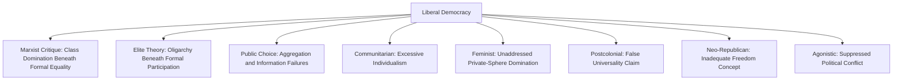

## Critiques of Liberal Democracy

### Definitional Scope

Liberal democracy combines competitive electoral institutions with constitutional constraints on state power — rule of law, protected civil liberties, minority rights, and horizontal accountability among branches of government. Critiques of liberal democracy span the ideological spectrum, challenging its philosophical premises, institutional design, and real-world performance from left, right, and non-Western perspectives.

**Key Points**

- Critiques can be usefully grouped by their target: some challenge liberal democracy's **philosophical foundations** (individualism, neutrality claims), others its **institutional mechanics** (representation, elite capture), and others its **substantive performance** (inequality, exclusion, cultural bias)
- Not all critiques are anti-democratic; many critics (e.g., participatory and deliberative theorists) seek to reform or deepen democracy rather than reject it
- Distinguishing critiques of "liberalism," critiques of "democracy," and critiques of their specific combination is analytically important, since some theorists object to the liberal constraints on popular sovereignty while others object to the majoritarian elements constraining individual rights

### Marxist and Materialist Critiques

#### Formal vs. Substantive Freedom

Marxist theory argues that liberal democracy's formal political equality (one person, one vote, equal legal rights) coexists with and legitimates substantive economic inequality rooted in capitalist class relations.

**Key Points**

- Karl Marx's critique (developed across various works, including *On the Jewish Question*, 1843) distinguished **political emancipation** (formal legal and political equality) from **human emancipation** (genuine social and economic equality), arguing liberal rights address only the former while leaving capitalist exploitation intact
- The state, in classical Marxist analysis, is understood not as a neutral arbiter above class conflict but as an instrument that ultimately serves the interests of the dominant economic class, even when formally democratic
- Antonio Gramsci's concept of **hegemony** (*Prison Notebooks*) extended this critique by arguing that liberal-democratic civil society itself (media, education, cultural institutions) manufactures consent for capitalist class relations, making formally free political participation compatible with underlying class domination
- [Inference] Contemporary Marxist-influenced critiques often focus specifically on how campaign finance, corporate media ownership, and lobbying by concentrated capital produce systematic policy bias favoring business interests even within formally competitive democratic systems, echoing but empirically updating the classical critique

#### The Capitalist State Debate

Later Marxist political theory (notably the Miliband-Poulantzas debate of the 1970s) explored *how* the state serves capitalist class interests — whether through direct instrumental control by capitalist-class personnel (Ralph Miliband's emphasis) or through the state's **structural** position within capitalism, which constrains policy options regardless of which personnel occupy office (Nicos Poulantzas's emphasis).

### Elite Theory and Democratic Realism

#### The Iron Law of Oligarchy

Robert Michels's *Political Parties* (1911) argued, based on study of European socialist parties and trade unions, that all large organizations — including those explicitly committed to internal democracy — inevitably develop entrenched leadership oligarchies due to organizational necessity, the division of labor between leaders and followers, and leaders' cumulative advantages in resources, information, and organizational skill.

**Key Points**

- Michels's argument, if generalized, implies that mass democratic participation in any large-scale political organization (including liberal-democratic states themselves) is structurally undermined regardless of formal democratic procedures
- Gaetano Mosca and Vilfredo Pareto's parallel elite theories argued that all political systems, including democracies, are actually governed by organized minorities ("the political class" or "the elite") rather than genuinely by "the people," differing mainly in how elites are selected and circulated rather than in whether elite rule occurs at all
- [Inference] Elite theory is often read as a sobering empirical challenge to normative democratic theory's participatory ideals, suggesting a persistent gap between democratic aspiration and organizational reality, though critics note elite theory may understate genuine variation in responsiveness and accountability across different institutional arrangements

### Public Choice and Rational Choice Critiques

#### Median Voter Problems and Rational Ignorance

Public choice theory (associated with James Buchanan, Gordon Tullock, and Anthony Downs) applies economic reasoning to democratic institutions, identifying structural weaknesses in how liberal-democratic mechanisms aggregate preferences.

**Key Points**

- **Rational ignorance** (Downs, *An Economic Theory of Democracy*, 1957): since any single voter's probability of affecting an electoral outcome is vanishingly small, it is individually rational for voters to remain poorly informed about policy details, potentially undermining the informational quality of democratic mandates
- **Concentrated benefits, diffuse costs**: policies that benefit small, organized groups at the broader public's diffuse expense are systematically more likely to be enacted, since concentrated beneficiaries face lower collective action costs (per Olson's logic) than the diffuse public bearing the costs
- **Regulatory capture**: agencies created to regulate an industry in the public interest may over time become captured by the interests they are meant to regulate, given asymmetric resources, information, and sustained engagement
- [Inference] Public choice critiques are generally understood as targeting the practical mechanics of democratic policymaking (interest group influence, voter information problems) rather than rejecting democratic legitimacy in principle, positioning this critique as reformist (emphasizing constitutional constraints on discretionary power) rather than revolutionary in most of its influential formulations

#### Social Choice Theory: Arrow's Impossibility Theorem

Kenneth Arrow's Impossibility Theorem (*Social Choice and Individual Values*, 1951) provided a formal mathematical result with significant implications for liberal-democratic aggregation mechanisms.

**Key Points**

- Arrow proved that no voting/preference-aggregation system can simultaneously satisfy a specified set of seemingly reasonable fairness conditions (including unrestricted domain, non-dictatorship, Pareto efficiency, and independence of irrelevant alternatives) when three or more options are being ranked
- This result implies that any democratic voting mechanism (majority rule, ranked-choice systems, etc.) will necessarily violate at least one desirable fairness criterion under certain preference configurations
- [Inference] Arrow's theorem is widely cited as demonstrating there is no perfectly "fair" or fully coherent method of aggregating individual preferences into a single social choice, which has been used both to critique any specific democratic voting mechanism as arbitrary in some circumstances and, more modestly, to highlight the genuine technical difficulty of preference aggregation rather than to reject democratic decision-making as such

### Communitarian Critiques

#### Excessive Individualism

Communitarian theorists (Michael Sandel, Alasdair MacIntyre, Charles Taylor, Michael Walzer) critique liberal democracy's foundational assumption of the **unencumbered self** — an individual with pre-political rights and preferences existing prior to and independent of social attachments.

**Key Points**

- Michael Sandel's critique of Rawlsian liberalism (*Liberalism and the Limits of Justice*, 1982) argues that liberal theory's abstraction of the individual from constitutive communal attachments (family, tradition, religious community) misrepresents actual human moral psychology and undermines the thick communal bonds necessary for genuine civic solidarity
- Communitarians argue liberal democracy's procedural neutrality among competing conceptions of the good life can produce social atomization, weakening the shared moral vocabulary needed to sustain robust civic community
- Alasdair MacIntyre's *After Virtue* (1981) argued modern liberal societies have lost a coherent shared framework of virtue and moral tradition, reducing political discourse to the assertion of incommensurable individual preferences ("emotivism")
- [Inference] Communitarian critiques generally seek to supplement or rebalance liberal democracy with stronger attention to communal belonging and shared civic tradition, rather than to replace democratic governance altogether, positioning most communitarian thought as a corrective rather than a rejection of democracy per se

### Feminist Critiques

#### The Public-Private Divide

Feminist political theorists (Carole Pateman, Susan Moller Okin, Iris Marion Young) have critiqued liberal democracy's foundational distinction between a public political sphere (subject to rights and democratic accountability) and a private domestic sphere (traditionally exempt from such scrutiny).

**Key Points**

- Carole Pateman's *The Sexual Contract* (1988) argued that classical social contract theory's founding narrative obscures an underlying **"sexual contract"** — the subordination of women within the private sphere that the public contract of citizenship presupposes but does not address, meaning formal liberal-democratic citizenship rights were historically built on and continue to coexist with unaddressed gendered domination in private life
- Susan Moller Okin's *Justice, Gender, and the Family* (1989) argued that Rawlsian and other liberal theories of justice inconsistently exempt the family from principles of justice applied elsewhere, despite the family being a primary site where gendered inequality is produced and reproduced
- Iris Marion Young's *Justice and the Politics of Difference* (1990) critiqued liberal democracy's ideal of impartial, universal citizenship for failing to accommodate genuine social group difference, arguing that formally neutral procedures can perpetuate the exclusion of marginalized groups whose distinct perspectives and needs are not adequately represented
- [Inference] Feminist critiques of liberal democracy are diverse in their proposed remedies, ranging from extending liberal rights more consistently into the private sphere to more fundamentally reconceptualizing citizenship and representation to accommodate structural group difference, rather than converging on a single alternative model

### Postcolonial and Non-Western Critiques

#### Liberal Democracy as a Historically Particular, Not Universal, Model

Postcolonial theorists challenge the presentation of liberal democracy as a culturally neutral or universally applicable model, arguing it emerged from specific European historical experience and has often been imposed or exported in ways that disregard local political traditions and structural legacies of colonialism.

**Key Points**

- Critics point to the historical role of liberal-democratic states in colonial domination, noting the tension between liberal universalist rhetoric of rights and equality and the historical exclusion of colonized peoples from those same rights
- Some scholars (e.g., in the "Asian values" debate of the 1990s, associated with figures such as Lee Kuan Yew) argued that liberal democracy's emphasis on individual rights conflicts with communally oriented Confucian or other non-Western value traditions, though this argument has itself been extensively critiqued as potentially serving to justify authoritarian governance rather than reflecting a genuine cultural consensus
- Democratization scholars have separately examined how liberal-democratic institutional models transplanted into post-colonial states without corresponding social, economic, and institutional foundations have sometimes produced unstable or merely formal ("facade") democratic institutions
- [Inference] This body of critique is heterogeneous, ranging from genuine calls for culturally adapted democratic institutions and rejection of a one-size-fits-all export model, to arguments that have been used more instrumentally to justify authoritarian governance — distinguishing between these different strands is analytically important and contested within the literature itself

### Republican and Neo-Republican Critiques

Drawing on classical republicanism, contemporary neo-republican theorists (notably Philip Pettit) critique liberal democracy's conception of freedom as mere **non-interference**, arguing for an alternative conception of freedom as **non-domination**.

**Key Points**

- Liberal freedom is typically understood as the absence of actual interference with one's choices; Pettit's republican alternative holds that one can be unfree even absent actual interference if one remains subject to another's arbitrary power that *could* interfere at will (e.g., an employee dependent on an arbitrary employer's goodwill is unfree in the republican sense even if the employer never actually exercises that power)
- This reframing implies liberal democracy may under-protect freedom in contexts of structural dependency (economic, domestic, or social) that fall short of direct legal interference but nonetheless constitute domination
- [Inference] Neo-republican critique is generally presented as a philosophical refinement or expansion of liberal-democratic freedom rather than a wholesale rejection, proposing additional institutional safeguards (e.g., against arbitrary private power) compatible with, rather than opposed to, core democratic and constitutional structures

### Right-Wing and Traditionalist Critiques

**Key Points**

- Some traditionalist and nationalist critiques argue liberal democracy's emphasis on individual autonomy, pluralism, and procedural neutrality corrodes shared national identity, religious tradition, and social cohesion
- Contemporary "post-liberal" and national-conservative critiques (various strands, without a single unified theorist) argue liberal proceduralism should be subordinated to substantive commitments regarding national culture, family structure, or religious tradition
- Carl Schmitt's early-20th-century critique (*The Crisis of Parliamentary Democracy*, 1923) argued that liberal parliamentarism's commitment to open-ended discussion and compromise is fundamentally incompatible with the existential nature of genuine political decision, which Schmitt argued requires a sovereign capable of decisive action, including the capacity to identify a political "enemy" — a critique later associated with broader skepticism toward liberal proceduralism among some illiberal and authoritarian-leaning thinkers
- [Inference] Right-leaning critiques of liberal democracy are highly heterogeneous, ranging from mainstream conservative concerns about excessive judicial activism or bureaucratic overreach (which typically accept core liberal-democratic legitimacy) to more radical rejections of liberal constitutionalism itself (as in Schmitt's case), and should not be treated as a single coherent position

### Agonistic Democratic Critique

Chantal Mouffe's agonistic democratic theory (*The Democratic Paradox*, 2000) critiques both liberal proceduralism and deliberative democracy's emphasis on rational consensus, arguing that liberal democracy inadequately theorizes the ineliminable role of political conflict and antagonism.

**Key Points**

- Mouffe argues genuine political life is characterized by fundamental, potentially irreconcilable value conflicts ("the political"), and that liberal democracy's aspiration toward rational consensus or neutral procedure misrepresents and potentially suppresses this reality
- Her proposed alternative, **agonism**, seeks to transform antagonistic conflict between enemies into a legitimate contest between adversaries who accept each other's right to hold opposing views within shared democratic institutions, rather than seeking to eliminate conflict through either liberal proceduralism or deliberative consensus
- [Inference] Agonistic theory is generally read as advocating for reformed democratic institutions that better accommodate legitimate value pluralism and conflict, rather than rejecting democratic governance itself

### Comparative Summary of Major Critique Traditions

| Tradition | Primary Target | Core Claim | Key Theorists |
| --- | --- | --- | --- |
| Marxist | Economic foundations | Formal equality masks capitalist class domination | Marx, Gramsci, Poulantzas |
| Elite theory | Participatory claims | Real power remains with organized minorities regardless of formal procedure | Michels, Mosca, Pareto |
| Public choice/rational choice | Institutional mechanics | Voter ignorance, concentrated interests, and aggregation paradoxes undermine democratic outcomes | Downs, Buchanan, Arrow |
| Communitarian | Individualist premises | Excessive individualism erodes communal bonds needed for civic life | Sandel, MacIntyre, Taylor |
| Feminist | Public-private divide | Formal citizenship rights coexist with unaddressed gendered domination | Pateman, Okin, Young |
| Postcolonial | Universality claims | Liberal democracy is a historically particular, not universal, model | Various; contested "Asian values" debate |
| Neo-republican | Conception of freedom | Non-interference inadequately captures freedom from arbitrary domination | Pettit |
| Traditionalist/Schmittian | Proceduralism itself | Liberal proceduralism cannot handle genuine existential political decision | Schmitt; various contemporary post-liberal thinkers |
| Agonistic | Consensus orientation | Liberal and deliberative models suppress legitimate political antagonism | Mouffe |

### Illustrative Diagram: Locating Critiques by Target and Orientation

<svg xmlns="http://www.w3.org/2000/svg" viewBox="0 0 700 420" font-family="Arial, sans-serif">
<text x="350" y="30" text-anchor="middle" font-size="17" font-weight="bold" fill="#1a1a2e">Mapping Critiques of Liberal Democracy (svg_diagram)</text>
<line x1="60" y1="220" x2="640" y2="220" stroke="#1a1a2e" stroke-width="2" />
<line x1="350" y1="60" x2="350" y2="380" stroke="#1a1a2e" stroke-width="2" />

<text x="350" y="50" text-anchor="middle" font-size="12" font-weight="bold" fill="`#1a1a2e`">Reformist</text>

<text x="350" y="400" text-anchor="middle" font-size="12" font-weight="bold" fill="`#1a1a2e`">Radical/Rejectionist</text>

<text x="70" y="215" text-anchor="start" font-size="12" font-weight="bold" fill="`#1a1a2e`">Left</text>

<text x="630" y="215" text-anchor="end" font-size="12" font-weight="bold" fill="`#1a1a2e`">Right</text>

<circle cx="230" cy="140" r="7" fill="#a2d2ff" stroke="#1a1a2e" stroke-width="1.5" />
<text x="230" y="120" text-anchor="middle" font-size="11" fill="#1a1a2e">Feminist (Okin)</text>
<circle cx="180" cy="300" r="7" fill="#ffafcc" stroke="#1a1a2e" stroke-width="1.5" />
<text x="180" y="325" text-anchor="middle" font-size="11" fill="#1a1a2e">Marxist</text>
<circle cx="470" cy="140" r="7" fill="#bde0fe" stroke="#1a1a2e" stroke-width="1.5" />
<text x="470" y="120" text-anchor="middle" font-size="11" fill="#1a1a2e">Public Choice</text>
<circle cx="500" cy="300" r="7" fill="#cdb4db" stroke="#1a1a2e" stroke-width="1.5" />
<text x="500" y="325" text-anchor="middle" font-size="11" fill="#1a1a2e">Schmittian</text>
<circle cx="350" cy="160" r="7" fill="#ffc8dd" stroke="#1a1a2e" stroke-width="1.5" />
<text x="350" y="145" text-anchor="middle" font-size="11" fill="#1a1a2e">Communitarian</text>
<circle cx="350" cy="270" r="7" fill="#a8dadc" stroke="#1a1a2e" stroke-width="1.5" />
<text x="350" y="290" text-anchor="middle" font-size="11" fill="#1a1a2e">Agonistic (Mouffe)</text>
</svg>

### Assessing the Critiques Collectively

**Key Points**

- Most critiques target specific dimensions of liberal democracy (its individualist philosophy, its aggregation mechanics, its public-private boundary, its universality claims) rather than democratic governance as such, and many explicitly aim to deepen or reform rather than abolish democratic institutions
- A minority of critiques (Schmittian decisionism, certain traditionalist and authoritarian-adjacent positions) more fundamentally challenge liberal proceduralism's compatibility with legitimate political rule
- [Inference] The sheer diversity and mutual incompatibility of these critique traditions (Marxist and public-choice critiques, for example, diagnose nearly opposite problems and prescribe opposite remedies) suggests no single "critique of liberal democracy" exists; rather, liberal democracy is contested from genuinely incompatible normative starting points, which is itself sometimes cited as evidence of liberal democracy's comparative institutional flexibility in accommodating pluralistic disagreement, though critics would dispute that this flexibility fully answers their specific objections

### Conclusion

Critiques of liberal democracy emerge from remarkably diverse theoretical starting points — Marxist material analysis, elite-theoretical realism, public-choice institutional economics, communitarian moral philosophy, feminist analysis of the public-private divide, postcolonial challenges to universalist claims, neo-republican reconceptions of freedom, and both traditionalist and agonistic challenges to liberal proceduralism itself. While most of these critiques function as calls for reform, deepening, or reconceptualization of democratic practice rather than outright rejection, they collectively illuminate persistent tensions within liberal democracy: between formal and substantive equality, between individual rights and communal belonging, between procedural neutrality and legitimate political conflict, and between claims to universal applicability and genuine cultural and historical particularity.

**Related Topics**

- Marxist theory of the state and Gramscian hegemony (see also civil society's political role)
- Robert Michels's iron law of oligarchy and elite theory of democracy
- Public choice theory, rational ignorance, and Arrow's Impossibility Theorem
- Communitarianism versus liberalism debate (Sandel, Rawls, MacIntyre)
- Feminist political theory: Pateman's sexual contract, Okin, and Young's politics of difference
- Postcolonial theory and the "Asian values" debate in comparative democratization
- Philip Pettit's neo-republicanism and freedom as non-domination
- Carl Schmitt's critique of parliamentary liberalism and decisionism
- Chantal Mouffe's agonistic democracy
- Procedural and substantive democracy (directly related definitional debate)