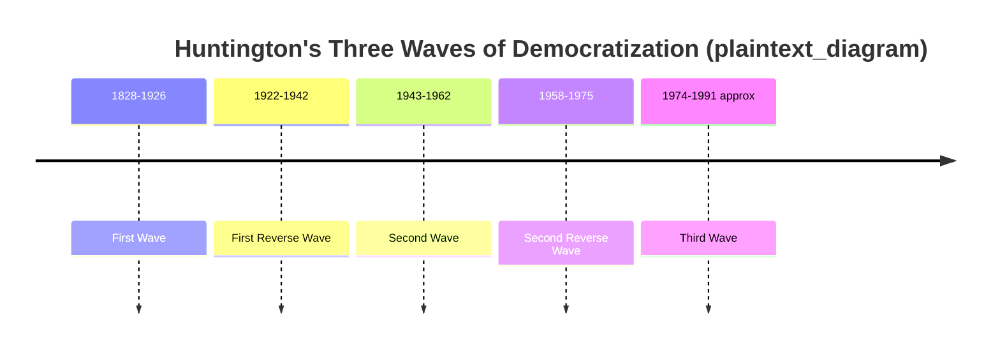
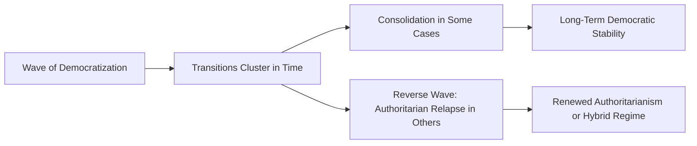

## Waves of Democratization

### Definition and Conceptual Origins

The "waves of democratization" framework describes historically clustered, temporally bounded periods in which multiple countries transition from non-democratic to democratic regimes in relatively close succession, often followed by counter-periods of reversal. The concept was most systematically developed by Samuel P. Huntington in *The Third Wave: Democratization in the Late Twentieth Century* (1991).

**Key Points**

- Huntington defined a **wave of democratization** as a group of transitions from non-democratic to democratic regimes that occur within a specified period of time and significantly outnumber transitions in the opposite direction during that period
- Huntington identified three historical waves, each followed by a **reverse wave** in which some newly democratized states relapsed into authoritarianism
- The framework has been extensively applied, extended, and critiqued in subsequent comparative democratization scholarship, including debates about whether a "fourth wave" occurred after 1991 and whether a contemporary "reverse wave" or "democratic recession" is underway

### Huntington's Three Waves

#### First Wave (approximately 1828–1926)

**Key Points**

- Rooted in the long-term expansion of suffrage and parliamentary government beginning with early 19th-century American and Western European democratization
- Huntington associated the wave's beginning with the gradual extension of suffrage in the United States (dating from around 1828, associated with Jacksonian-era suffrage expansion) and its extension through Western Europe
- The wave crested following World War I, as the collapse of the Austro-Hungarian, German, Ottoman, and Russian empires produced a number of new parliamentary states in Central and Eastern Europe
- **First reverse wave** (approximately 1922–1942): the rise of fascism in Italy (1922), Nazism in Germany (1933), and various authoritarian and military takeovers across Europe and Latin America reversed many of these gains, culminating in the authoritarian and totalitarian regimes that contributed to World War II

#### Second Wave (approximately 1943–1962)

**Key Points**

- Catalyzed by Allied victory in World War II, which discredited fascism and imposed democratic institutions on defeated Axis powers (West Germany, Italy, Japan) under Allied occupation
- Accompanied by decolonization, as newly independent states in Asia and Africa (e.g., India in 1947) adopted formally democratic constitutions
- **Second reverse wave** (approximately 1958–1975): many newly independent post-colonial states experienced military coups or one-party consolidation shortly after independence; Latin America also saw a wave of military takeovers during this period (e.g., Brazil 1964, Argentina, Chile 1973)

#### Third Wave (beginning 1974)

**Key Points**

- Huntington dated the beginning of the Third Wave to Portugal's Carnation Revolution (1974), which ended the authoritarian Estado Novo regime
- Spread through Southern Europe (Greece 1974, Spain following Franco's death in 1975), then through Latin America during the 1980s (Argentina, Brazil, Chile, and others transitioning from military rule)
- Extended to East Asia and parts of Sub-Saharan Africa in the mid-to-late 1980s (e.g., the Philippines' People Power Revolution, 1986)
- Reached its most dramatic phase with the collapse of Soviet-bloc communism (1989–1991), including the fall of the Berlin Wall (1989) and the dissolution of the Soviet Union (1991), producing a wave of new or restored democracies across Central and Eastern Europe
- [Unverified] Whether the Third Wave has definitively ended, and if so precisely when, remains debated among scholars; Huntington's original analysis was written in 1991 near the wave's apparent peak, and subsequent scholarship has continued to reassess its scope and endpoint as more recent events unfolded

### Huntington's Explanatory Factors for the Third Wave

Huntington identified several interacting causal factors contributing to the Third Wave's spread:

| Factor | Description |
| --- | --- |
| Legitimacy problems of authoritarianism | Declining ideological legitimacy of authoritarian rule, especially after performance failures |
| Global economic growth | Rising education levels and urban middle classes associated with economic development, echoing modernization theory |
| Catholic Church policy shift | The Church's turn toward supporting human rights and opposition to authoritarian rule following the Second Vatican Council (1962–1965), significant in heavily Catholic Southern Europe and Latin America |
| Changes in international actors' policies | Shifts in U.S. foreign policy (e.g., under the Carter administration's human rights emphasis) and European Community conditionality tied to democratic governance |
| Demonstration effects / "snowballing" | Early transitions (e.g., Portugal, Spain) provided models and encouragement that diffused to other countries via media and transnational networks |

[Inference] Huntington's own account emphasized these factors as interacting and mutually reinforcing rather than any single cause being sufficient on its own, and subsequent scholarship has continued to debate the relative causal weight of domestic structural factors (economic development, civil society strength) versus international/diffusion factors in explaining the Third Wave's timing and geographic pattern.

### Diffusion and Demonstration Effects

**Key Points**

- The "snowballing" or **demonstration effect** concept holds that successful democratic transitions in one country increase the perceived feasibility and legitimacy of similar transitions elsewhere, particularly among geographically or culturally proximate states
- This mechanism closely parallels the "diffusion" mechanism identified in contentious politics scholarship (McAdam, Tarrow, and Tilly), suggesting continuity between democratization theory and broader theories of transnational political contention
- The rapid succession of Eastern European transitions in 1989 is frequently cited as a paradigmatic case of demonstration/diffusion effects, as the relatively low-cost collapse of one Soviet-bloc regime after another appeared to embolden opposition movements elsewhere in the region

### Critiques and Extensions of the Waves Framework

#### Conceptual and Methodological Critiques

**Key Points**

- Critics have questioned whether "waves" represent a genuinely distinct causal phenomenon or are simply a retrospective, somewhat arbitrary periodization imposed on a more continuous and heterogeneous set of individual national transitions, each with its own domestic causal logic
- The framework has also been critiqued for potentially overstating the coherence of "reverse waves," since the specific causal mechanisms behind different countries' authoritarian relapses within a given "reverse wave" period (e.g., 1960s Latin American coups versus contemporaneous developments elsewhere) may differ substantially rather than reflecting a single unified process
- [Inference] These critiques do not necessarily reject the empirical observation of temporal clustering in transitions, but they caution against treating "waves" as evidence of a single unified causal mechanism operating uniformly across very different national contexts

#### Fourth Wave Debate

Some scholars have proposed that events following the Third Wave's apparent peak constitute a distinct **fourth wave**, though there is no scholarly consensus on this classification.

**Key Points**

- Candidate episodes proposed by various scholars as possible fourth-wave instances include post-Soviet "color revolutions" (e.g., Georgia's Rose Revolution 2003, Ukraine's Orange Revolution 2004) and the Arab Spring (2010–2011)
- [Unverified] The "fourth wave" label remains contested in the scholarly literature; some scholars treat these episodes as a continuation or late tail of the Third Wave, others as a genuinely distinct wave, and outcomes in several Arab Spring cases (notably Egypt's and Libya's subsequent trajectories) have led many scholars to question how much sustained democratization actually resulted from this period, so any specific classification should be treated as an ongoing scholarly debate rather than settled fact

### Contemporary Reverse Wave / Democratic Recession Debate

A substantial body of recent scholarship (Larry Diamond's concept of a "democratic recession," beginning roughly in the mid-2000s; various V-Dem annual reports) has examined whether the world is currently experiencing a fourth reverse wave.

**Key Points**

- Diamond and others have pointed to trends including democratic backsliding in previously consolidating democracies (e.g., Hungary, Turkey, various cases discussed in comparative literature), stalled or reversed transitions in some post-Arab Spring states, and rising authoritarian assertiveness by major powers
- [Unverified] Precise claims about the global scope, magnitude, and turning point of any contemporary "reverse wave" vary depending on which measurement index (V-Dem, Freedom House, Polity) and time period are used; such claims should be checked against the most current index reports rather than treated as a fixed, universally agreed-upon trend, since scholars continue to debate both the extent and the underlying causes of recent democratic setbacks
- This debate connects directly to broader literature on democratic backsliding and to methodological debates in democracy measurement about detecting gradual erosion versus abrupt regime breakdown

### Regional Patterns Across the Waves

| Region | Notable Wave Association | Illustrative Cases |
| --- | --- | --- |
| Western Europe | First Wave | UK suffrage expansion, French Third Republic |
| Central/Eastern Europe (interwar) | First Wave, then First Reverse Wave | Post-WWI parliamentary states, later fascist/authoritarian takeovers |
| Occupied Axis Powers | Second Wave | West Germany, Italy, Japan post-1945 |
| Newly Independent Post-Colonial States | Second Wave, then Second Reverse Wave | India (1947, sustained); many African states (independence followed by coups/one-party rule) |
| Latin America | Second Reverse Wave, then Third Wave | Military rule (1960s–70s) followed by transitions (1980s) |
| Southern Europe | Third Wave (early) | Portugal (1974), Greece (1974), Spain (1975) |
| East Asia | Third Wave | Philippines (1986), South Korea (1987), Taiwan (late 1980s–1990s) |
| Sub-Saharan Africa | Third Wave (partial) | Various transitions in early 1990s, with mixed consolidation outcomes |
| Post-Soviet Space | Third Wave, later contested "Fourth Wave" candidates | USSR successor states (1991); later color revolutions |
| Middle East/North Africa | Contested "Fourth Wave" candidate | Arab Spring (2010–2011), highly mixed and largely reversed outcomes |

### Relationship to Modernization Theory

**Key Points**

- Huntington's wave framework interacts with but is analytically distinct from **modernization theory** (Seymour Martin Lipset's foundational 1959 argument that economic development — rising income, education, and urbanization — makes democracy more likely and more stable)
- Modernization theory offers a structural, longer-term explanation for *why* particular countries become more likely to democratize or sustain democracy, while the waves framework focuses on the *temporal clustering and diffusion* of transitions across countries, which is not fully reducible to each country's individual level of economic development
- [Inference] Scholars generally treat modernization theory and the waves/diffusion framework as complementary rather than competing explanations: structural economic conditions may make a country more "ripe" for democratization, while international diffusion and demonstration effects can help explain the specific timing and clustering of when transitions actually occur

### Illustrative Diagram: The Waves Pattern Over Time

<svg xmlns="http://www.w3.org/2000/svg" viewBox="0 0 700 350" font-family="Arial, sans-serif">
<text x="350" y="30" text-anchor="middle" font-size="17" font-weight="bold" fill="#1a1a2e">Global Democratization Waves (svg_diagram)</text>
<line x1="60" y1="290" x2="660" y2="290" stroke="#1a1a2e" stroke-width="2" />
<text x="360" y="315" text-anchor="middle" font-size="11" fill="#1a1a2e">Time (1820s to Present)</text>
<polyline points="60,270 150,150 220,250 300,260 380,100 440,240 520,60 600,180 660,190" fill="none" stroke="#1a1a2e" stroke-width="2.5" />

<text x="100" y="140" text-anchor="middle" font-size="10" fill="`#1a1a2e`">First Wave</text>

<text x="220" y="270" text-anchor="middle" font-size="10" fill="`#1a1a2e`">1st Reverse</text>

<text x="380" y="90" text-anchor="middle" font-size="10" fill="`#1a1a2e`">Second Wave</text>

<text x="440" y="260" text-anchor="middle" font-size="10" fill="`#1a1a2e`">2nd Reverse</text>

<text x="520" y="50" text-anchor="middle" font-size="10" fill="`#1a1a2e`">Third Wave</text>

<text x="600" y="200" text-anchor="middle" font-size="10" fill="`#1a1a2e`">Contested Recession/4th Wave?</text>

<text x="60" y="200" text-anchor="middle" font-size="10" fill="`#1a1a2e`" transform="rotate(-90, 40, 200)">More Democracies</text>

</svg>

### Practical Illustration

**Example**

Portugal's 1974 Carnation Revolution — a largely bloodless military coup that overthrew the authoritarian Estado Novo regime and led to competitive elections by 1976 — is frequently used by Huntington and subsequent scholars as the paradigmatic starting point of the Third Wave. Its relatively rapid and peaceful character, combined with subsequent Spanish and Greek transitions in the same period, illustrates the "demonstration effect" mechanism: successful, relatively low-cost transitions in geographically and culturally proximate states appeared to reduce perceived risk and increase perceived feasibility for opposition movements and reformist elites elsewhere in Southern Europe.

### Conclusion

The waves of democratization framework, developed most systematically by Samuel Huntington, provides an influential lens for understanding the historically clustered and temporally patterned character of global democratic transitions — and their periodic reversals. While the framework has proven durable and widely applied, it remains subject to ongoing methodological critique regarding the coherence of "waves" as a unified causal category, and continued scholarly debate about whether recent decades constitute a genuine "fourth wave," a "democratic recession," or simply the continued heterogeneous unfolding of individual national trajectories that resist neat historical periodization. The framework's enduring value lies less in precise dating of wave boundaries than in highlighting the real diffusion, demonstration, and international dimensions that shape when and how democratization tends to occur.

**Related Topics**

- Samuel Huntington's *The Third Wave* and its explanatory factors
- Modernization theory and the relationship between economic development and democracy (Seymour Martin Lipset)
- Democratic backsliding and the contemporary "democratic recession" debate (Larry Diamond)
- Diffusion and demonstration effects in transnational political change
- Transitions from authoritarian rule: pacted versus ruptured transitions (O'Donnell and Schmitter)
- The Arab Spring and debates over a possible "fourth wave"
- Post-communist transitions in Central and Eastern Europe
- Defining and measuring democracy (indices used to empirically identify wave boundaries)
- Regime types and hybrid regimes as intermediate outcomes of incomplete democratization
- Democratic consolidation theory (Linz and Stepan)