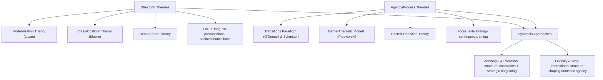

## Theories of Democratic Transition

### Definition and Scope

Theories of democratic transition constitute a body of comparative-politics scholarship explaining how, why, and under what conditions authoritarian regimes give way to democratic ones. The field emerged primarily from the "third wave" of democratization (Huntington's term for the global spread of democracy from 1974 onward, beginning with Portugal's Carnation Revolution) and seeks to answer three interlocking questions: what causes breakdown of authoritarian rule, what determines the path and mode of transition, and what factors explain whether the resulting democracy consolidates or reverts to authoritarianism.

The field is generally divided into two broad theoretical traditions: **structural theories**, which emphasize long-run socioeconomic and historical preconditions, and **agency/process theories** (often called the "transitology" or "transitions paradigm"), which emphasize the strategic choices and interactions of political elites during the transition itself.

### Structural Approaches

#### Modernization Theory

Modernization theory, associated with Seymour Martin Lipset's 1959 work, argues that democracy is causally linked to socioeconomic development. Lipset's core claim: "the more well-to-do a nation, the greater the chances that it will sustain democracy."

Key causal mechanisms proposed:

- Rising per capita income creates a large, moderate middle class that demands political inclusion and moderates class conflict
- Urbanization and education produce citizens with the civic skills and tolerance necessary for democratic participation
- Economic development reduces the zero-sum nature of politics, making compromise between elites and masses more feasible
- Literacy and mass communication enable informed political participation

[Inference] Modernization theory is often stated as a probabilistic association rather than deterministic causation in contemporary scholarship, since numerous wealthy non-democracies (Gulf monarchies) and poor democracies (India) constitute exceptions.

**Empirical Refinement — Przeworski and Limongi (1997):** Reanalyzing cross-national data, Adam Przeworski and Fernando Limongi found that development does not make transitions *to* democracy more likely, but it does make existing democracies dramatically more likely to *survive*. Their finding: democracies with per capita income above approximately $6,000 (1985 PPP dollars) almost never revert to authoritarianism, while poorer democracies are highly fragile. This reframed modernization theory from an "endogenous" theory (development causes democratization) to an "exogenous" theory (development causes democratic survival once democracy occurs for other reasons).

#### Barrington Moore's Class-Coalition Theory

In *Social Origins of Dictatorship and Democracy* (1966), Moore argued that the class coalitions formed during the transition from agrarian to industrial society determine the political outcome. His famous dictum: "No bourgeoisie, no democracy."

Three historical pathways identified:

1. **Bourgeois-democratic route**: commercialized agriculture plus a strong independent bourgeoisie (England, France, United States) → liberal democracy
2. **Reactionary/fascist route**: weak bourgeoisie allied with a labor-repressive landed elite (Germany, Japan) → fascism
3. **Communist route**: peasant-based revolution against a weak landed class and weak bourgeoisie (Russia, China) → communist dictatorship

#### Rentier State / Resource Curse Theory

This structural theory explains authoritarian durability rather than transition per se, but is essential to the field. States with revenue derived predominantly from natural resource rents (oil, gas, minerals) rather than taxation of citizens exhibit lower democratization rates because:

- Low taxation reduces demand for representation ("no taxation, no representation" in reverse)
- Rent revenue funds patronage networks and repressive apparatuses independent of citizen consent
- Resource wealth can fund social spending that dampens democratic pressure ("spending effect")

[Unverified] The magnitude and even the direction of the oil-authoritarianism correlation has been contested in the empirical literature (Haber and Menaldo's 2011 "rentier curse" critique found no robust historical relationship once country fixed effects were applied), so this should be treated as a debated rather than settled causal claim.

### Agency-Based / Transitions Paradigm

#### O'Donnell and Schmitter's Framework

Guillermo O'Donnell and Philippe Schmitter's *Transitions from Authoritarian Rule* (1986) shifted the field's center of gravity toward elite strategic interaction, arguing that structural preconditions are insufficient to explain the timing and mode of transitions. Their framework introduces a critical actor typology:

- **Hardliners** (in the regime): favor continued authoritarian rule, resist liberalization
- **Softliners/reformers** (in the regime): favor controlled liberalization to preserve some regime interests
- **Moderates** (in the opposition): favor negotiated transition, willing to guarantee outgoing elites' interests
- **Radicals** (in the opposition): favor complete rupture and accountability for past abuses

The central dynamic is a **split within the authoritarian coalition** between hardliners and softliners, typically triggered by a legitimacy crisis or elite disagreement over how to manage dissent. Softliners then seek alliance with moderate opposition figures to manage a controlled transition, often through pacts.

#### Modes of Transition

The literature commonly identifies four to five paths, distinguished by which actors drive the process:

| Mode | Driving Actor(s) | Example |
| --- | --- | --- |
| Transition through **transformation/reform** | Regime elites (from above) | Spain (1975–78), Hungary (partial) |
| Transition through **replacement/rupture** | Opposition/mass mobilization (from below) | Romania (1989), Philippines (1986) |
| Transition through **transplacement/pact** | Negotiated between regime softliners and opposition moderates | Poland (Round Table, 1989), South Africa (1990–94) |
| **Foreign imposition** | External military/political intervention | West Germany, Japan (post-1945) |
| **Collapse** | Sudden regime implosion without negotiated settlement | East Germany (1989), Argentina (1983, post-Falklands) |

#### Pacted Transitions

A **pact** is an explicit agreement between contending elites specifying rules for the exercise of power based on mutual guarantees for the vital interests of those entering into it. Pacts often include:

- Amnesty provisions shielding outgoing authoritarian elites from prosecution
- Guaranteed institutional roles (e.g., reserved military seats, as in Chile's 1980 constitution)
- Electoral thresholds or veto points protecting minority elite interests

[Inference] Pacted transitions are generally associated with lower short-term instability but can constrain the depth of subsequent democratic and transitional-justice reforms, a tension frequently discussed under the heading of the "torturer problem" (O'Donnell and Schmitter's phrase for the dilemma of whether to prosecute former regime agents).

### Game-Theoretic Models

#### Przeworski's Strategic Model

Przeworski (1991) formalized the transition as a game between hardliners, reformers, moderates, and radicals, modeling liberalization as a process that regime reformers initiate believing they can control it, but which frequently escapes their control once civil society mobilizes ("the opening").

Key concept — **the dictatorship's dilemma**: liberalization requires tolerating some opposition activity to gain legitimacy, but any opening creates space that radical opposition forces can exploit to escalate demands beyond what reformers intended to concede.

#### Acemoglu and Robinson's Median Voter / Redistribution Model

Daron Acemoglu and James Robinson's *Economic Origins of Dictatorship and Democracy* (2006) models democratization as a response to distributional conflict between elites and the poor majority. Core logic:

$$U^p(\theta) = \delta y^p + (1-\delta)(y^p - \tau(y^p - \bar{y}))$$

Where the poor majority's utility depends on a redistributive tax rate $\tau$ set by whichever class holds political power. The elite, fearing revolution when they cannot credibly commit to future redistribution under continued authoritarian rule, may extend the franchise as a costly but credible commitment device — because democracy durably shifts de jure political power to the majority, making promises of redistribution credible in a way that temporary concessions under dictatorship cannot be.

Democratization occurs when:

- The threat of revolution is high (making repression costly relative to concession)
- Elites cannot credibly commit to redistribution any other way
- The cost of repression is high relative to the cost of conceding political power

[Inference] This model has been criticized for underspecifying non-economic motives for elite concession (e.g., international pressure, ideological commitment, military defection), so it should be read as one causal channel among several rather than a complete account.

### International and Diffusion Factors

#### Levitsky and Way — Linkage and Leverage

Steven Levitsky and Lucan Way's *Competitive Authoritarianism* (2010) argues that international factors shape transition outcomes through two distinct mechanisms:

- **Linkage**: the density of a country's economic, political, social, and organizational ties to the West (trade, migration, elite networks, civil society connections). High linkage countries face sustained, high-cost pressure toward democratization because domestic constituencies with Western ties amplify external democratic norms.
- **Leverage**: a target government's vulnerability to external democratizing pressure (military/economic dependence, size, cohesion of the state). High leverage without high linkage produces unstable results, since pressure can be applied but lacks a durable domestic transmission mechanism.

#### Diffusion / Demonstration Effects

Transitions frequently cluster in time and region ("waves" and "clusters"), attributed to:

- **Emulation**: opposition movements adopting successful tactics observed elsewhere (e.g., the spread of nonviolent "electoral revolution" tactics from Serbia's Bulldozer Revolution to Georgia's Rose Revolution to Ukraine's Orange Revolution)
- **Regional normative pressure**: regional organizations (EU accession conditionality, OAS Democratic Charter) raising the cost of authoritarian backsliding
- **Information cascades**: authoritarian breakdown in one country revealing information about regime vulnerability that emboldens opposition elsewhere (commonly cited for the rapid 1989 Eastern European cascade)

### Structure and Agency Debate

A recurring methodological tension in the field concerns the relative explanatory weight of structure versus agency:

Carles Boix and Susan Stokes (2003) attempted to reconcile the two traditions by arguing that structural conditions (income, inequality) determine the *probability* that agency-driven bargaining will succeed in producing democracy, rather than treating structure and agency as competing explanations.

### Illustrative Example: Applying the Frameworks to a Case

**Example — Poland's 1989 Round Table Transition:**

- **Structural precondition**: Poland's per capita income and urbanization were mid-range for the region, partially consistent with modernization theory but insufficient alone to explain timing
- **Elite split**: General Jaruzelski's government split between hardliners resisting concessions and reformers seeking to co-opt Solidarity to manage a fiscal and legitimacy crisis
- **Mode of transition**: Transplacement/pact — the Round Table Talks (February–April 1989) produced negotiated semi-free elections, with 35% of Sejm seats openly contested
- **International factor**: Reduced Soviet willingness to intervene militarily (later termed the abandonment of the Brezhnev Doctrine) removed the external leverage that had suppressed prior uprisings in 1956, 1968, and 1980–81
- **Outcome**: Solidarity's near-sweep of contested seats triggered a rapid, unplanned collapse of Communist authority beyond what either side's negotiators anticipated — illustrating Przeworski's "dictatorship's dilemma" empirically

### Illustrative Diagram: O'Donnell-Schmitter Actor Typology (svg_diagram)

<svg xmlns="http://www.w3.org/2000/svg" viewBox="0 0 720 380">
<rect x="0" y="0" width="720" height="380" fill="#ffffff" />
<text x="360" y="25" font-family="Arial, sans-serif" font-size="16" font-weight="bold" text-anchor="middle" fill="#1a1a1a">O'Donnell-Schmitter Actor Typology (svg_diagram)</text>
<rect x="30" y="60" width="300" height="140" rx="8" fill="#f0f4f8" stroke="#3b5998" stroke-width="2" />
<text x="180" y="85" font-family="Arial, sans-serif" font-size="14" font-weight="bold" text-anchor="middle" fill="#1a1a1a">Authoritarian Regime</text>
<rect x="50" y="100" width="120" height="80" rx="6" fill="#d9534f" fill-opacity="0.15" stroke="#d9534f" stroke-width="1.5" />
<text x="110" y="130" font-family="Arial, sans-serif" font-size="13" font-weight="bold" text-anchor="middle" fill="#a83232">Hardliners</text>
<text x="110" y="150" font-family="Arial, sans-serif" font-size="10" text-anchor="middle" fill="#333">Resist</text>
<text x="110" y="164" font-family="Arial, sans-serif" font-size="10" text-anchor="middle" fill="#333">liberalization</text>
<rect x="190" y="100" width="120" height="80" rx="6" fill="#f0ad4e" fill-opacity="0.2" stroke="#f0ad4e" stroke-width="1.5" />
<text x="250" y="130" font-family="Arial, sans-serif" font-size="13" font-weight="bold" text-anchor="middle" fill="#a67016">Softliners</text>
<text x="250" y="150" font-family="Arial, sans-serif" font-size="10" text-anchor="middle" fill="#333">Seek controlled</text>
<text x="250" y="164" font-family="Arial, sans-serif" font-size="10" text-anchor="middle" fill="#333">opening</text>
<rect x="390" y="60" width="300" height="140" rx="8" fill="#f0f4f8" stroke="#3b5998" stroke-width="2" />
<text x="540" y="85" font-family="Arial, sans-serif" font-size="14" font-weight="bold" text-anchor="middle" fill="#1a1a1a">Opposition</text>
<rect x="410" y="100" width="120" height="80" rx="6" fill="#5cb85c" fill-opacity="0.2" stroke="#5cb85c" stroke-width="1.5" />
<text x="470" y="130" font-family="Arial, sans-serif" font-size="13" font-weight="bold" text-anchor="middle" fill="#2d6b2d">Moderates</text>
<text x="470" y="150" font-family="Arial, sans-serif" font-size="10" text-anchor="middle" fill="#333">Favor pact,</text>
<text x="470" y="164" font-family="Arial, sans-serif" font-size="10" text-anchor="middle" fill="#333">guarantees</text>
<rect x="550" y="100" width="120" height="80" rx="6" fill="#5bc0de" fill-opacity="0.2" stroke="#5bc0de" stroke-width="1.5" />
<text x="610" y="130" font-family="Arial, sans-serif" font-size="13" font-weight="bold" text-anchor="middle" fill="#1f6674">Radicals</text>
<text x="610" y="150" font-family="Arial, sans-serif" font-size="10" text-anchor="middle" fill="#333">Demand full</text>
<text x="610" y="164" font-family="Arial, sans-serif" font-size="10" text-anchor="middle" fill="#333">rupture</text>
<line x1="250" y1="180" x2="470" y2="210" stroke="#666" stroke-width="2" marker-end="url(#arrow)" />
<text x="360" y="235" font-family="Arial, sans-serif" font-size="12" font-style="italic" text-anchor="middle" fill="#444">Negotiated alliance → PACT</text>
<rect x="210" y="270" width="300" height="70" rx="8" fill="#eef7ee" stroke="#5cb85c" stroke-width="2" />
<text x="360" y="295" font-family="Arial, sans-serif" font-size="13" font-weight="bold" text-anchor="middle" fill="#2d6b2d">Negotiated Transition Outcome</text>
<text x="360" y="315" font-family="Arial, sans-serif" font-size="10" text-anchor="middle" fill="#333">Amnesty, reserved seats, phased elections</text>
<line x1="180" y1="200" x2="300" y2="270" stroke="#999" stroke-width="1.5" stroke-dasharray="4,3" />
<line x1="540" y1="200" x2="420" y2="270" stroke="#999" stroke-width="1.5" stroke-dasharray="4,3" />
</svg>

### Critiques and Limitations of the Field

- **Teleological bias**: Early transitology implicitly assumed liberalization moves toward consolidated democracy; the proliferation of "hybrid regimes" and durable competitive authoritarianism since the 1990s undermined this assumption, prompting Thomas Carothers's influential 2002 critique, "The End of the Transition Paradigm."
- **Overgeneralization from Southern Europe/Latin America cases**: The founding transitology literature drew heavily on a small set of cases (Spain, Portugal, Greece, Argentina, Brazil), raising external validity concerns when applied to post-Soviet or Middle Eastern contexts with different state structures and civil society traditions.
- **Underspecified role of the military**: Many models treat "the regime" as unitary; more recent scholarship (e.g., work on coup-proofing and military factionalism) shows that intra-military cohesion is often a superior predictor of transition outcomes than elite pacting alone. [Inference] This suggests the field has moved toward disaggregating "hardliner/softliner" categories into more granular institutional actors (officer corps, security services, ruling party apparatus) in contemporary research.

### Related Topics

- Modes of Democratic Consolidation
- Hybrid Regimes and Competitive Authoritarianism
- Transitional Justice and the "Torturer Problem"
- The Third Wave of Democratization (Huntington)
- Authoritarian Regime Breakdown and Coup-Proofing
- Democratic Backsliding and Reverse Waves
- Electoral Authoritarianism
- Civil-Military Relations in Transition Contexts
- International Democracy Promotion and Conditionality