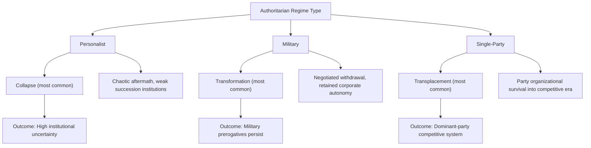

## Pathways from Authoritarian Rule

### Definition and Scope

"Pathways from authoritarian rule" refers to the classificatory and causal literature on the distinct routes by which authoritarian regimes end, distinguished by which actors initiate and control the process (regime elites, mass opposition, negotiated coalitions, external powers, or regime collapse), and by the sequencing of liberalization, breakdown, and founding elections. This topic overlaps with but is analytically distinct from "Theories of Democratic Transition": theories explain *why* transitions occur, while pathways typology explains *how* they unfold procedurally and what downstream consequences the chosen pathway has for regime type and durability.

The foundational typology derives from Juan Linz and Alfred Stepan's *Problems of Democratic Transition and Consolidation* (1996) and Samuel Huntington's *The Third Wave* (1991), later refined by Barbara Geddes's regime-type-conditional framework and Levitsky and Way's work on regime durability.

### Huntington's Threefold Typology

Huntington classified third-wave transitions into three modal pathways based on who held the initiative:

#### Transformation

Regime elites themselves lead the process of change, initiating liberalization from a position of relative strength.

Characteristics:

- Regime leadership calculates that controlled reform preserves more of its interests than continued rigid authoritarianism
- Typically driven by a reformist faction gaining ascendance over hardliners within the ruling coalition
- Reform is sequenced and paced by the incumbent regime, which retains substantial agenda-setting power throughout
- Examples: Spain under Adolfo Suárez (1975–78), Taiwan under the Kuomintang (late 1980s), Brazil's *abertura* under the military (1974–85), Hungary's negotiated reform (1988–89)

[Inference] Transformation pathways are frequently associated with greater continuity of pre-transition elites in post-transition institutions, since the incumbent regime retains bargaining leverage over the rules of the new system.

#### Replacement

Opposition groups defeat the incumbent regime, which collapses or is overthrown, typically through mass mobilization, armed insurrection, or abrupt elite abandonment.

Characteristics:

- Regime hardliners typically retain control until very late, offering no substantive concessions, so a sudden, discontinuous break occurs rather than a phased handover
- Often accompanied by violence, revolutionary rhetoric, or rapid removal of the incumbent leadership
- The old regime's institutions and personnel are frequently purged or dismantled rather than incorporated
- Examples: Romania (December 1989, violent overthrow of Ceaușescu), Philippines (1986 People Power Revolution against Marcos), Portugal (1974 Carnation Revolution, military coup against the Estado Novo), East Germany (1989 mass protest and regime collapse)

#### Transplacement

Change results from joint action by government and opposition groups, typically through explicit or tacit negotiation, producing a negotiated exit in which neither side fully dictates terms.

Characteristics:

- Requires rough parity of power between regime softliners and opposition moderates such that neither can impose a unilateral solution
- Frequently institutionalized through round-table talks or formal pacts
- Both radical opposition factions and regime hardliners are typically marginalized in favor of moderate-softliner coalition
- Examples: Poland (1989 Round Table Talks), South Africa (1990–94 CODESA negotiations), Czechoslovakia's Velvet Revolution (1989), Uruguay (1984 Naval Club Pact), Chile (1988–90 plebiscite-based transition)

### Comparative Table of Pathway Characteristics

| Dimension | Transformation | Replacement | Transplacement |
| --- | --- | --- | --- |
| Initiating actor | Regime elites | Mass opposition | Joint regime-opposition negotiation |
| Regime hardliner role | Marginalized internally by reformers | Retains power until collapse | Marginalized via pact |
| Violence level | Typically low | Often high | Typically low |
| Continuity of old elites | High | Low | Moderate (via pact guarantees) |
| Speed | Gradual, phased | Rapid, discontinuous | Moderate, negotiated timetable |
| Institutional legacy risk | Reserved domains, veto players | Institutional vacuum, instability | Negotiated veto points, amnesty clauses |

### Geddes's Regime-Type-Conditional Pathways

Barbara Geddes's influential contribution (1999, extended in Geddes, Wright, and Frantz's later work) argues that the *pathway available* is structurally conditioned by the *type* of authoritarian regime, because different regime types distribute power differently among elites:

#### Personalist Regimes

Power is concentrated in a single leader (and inner circle) rather than institutionalized in a party or military hierarchy.

- Transitions from personalist rule are disproportionately likely to occur via **collapse** rather than negotiated exit, because the leader's removal (death, exile, defeat) often leaves no institutionalized successor structure to negotiate with
- Frequently accompanied by chaotic aftermaths, since state institutions were built around personal loyalty rather than durable bureaucratic structures
- Examples: Marcos (Philippines), Mobutu (Zaire), Ceaușescu (Romania)

#### Military Regimes

Power is held by the officer corps as an institution, typically justified by claims to restore order or manage crisis.

- Militaries frequently initiate withdrawal via **transformation**, because officers have an institutional interest in preserving the military's corporate integrity and often prefer to return to the barracks once civilian legitimacy crises threaten military cohesion
- The military retains bargaining leverage to negotiate amnesty and continued budgetary autonomy in the successor regime
- Examples: Brazil, Argentina (though the 1982 Falklands defeat produced a faster collapse-like exit), Chile

#### Single-Party Regimes

Power is institutionalized in a ruling party apparatus with mechanisms for internal succession and elite co-optation.

- Single-party regimes are the most likely regime type to survive liberalization attempts or negotiate a **transplacement** that preserves significant party influence, because the party retains organizational infrastructure (patronage networks, local cadres) that can be redeployed in competitive elections
- Examples: Mexico's PRI (gradual transformation through the 1990s), Taiwan's KMT, Poland's PZPR (transplacement)

[Inference] Geddes's framework is probabilistic rather than deterministic; regime type shapes the *distribution of likely pathways* rather than rigidly determining outcomes, and hybrid regime types (personalist-military, party-military) complicate clean categorization.

### Sequencing Debate: Elections First vs. Institutions First

A distinct pathway-relevant debate concerns the *sequencing* of liberalization relative to institutional design:

- **Fareed Zakaria's critique** ("The Rise of Illiberal Democracy," 1997) argues that pathways which rush to hold founding elections before establishing constitutional constraints (independent judiciary, rule of law, protected civil liberties) risk producing "illiberal democracies" — elected governments that erode liberal constraints once in power.
- **Thomas Carothers's sequencing critique** extends this, arguing that the "gradualist" prescription (build institutions first, then hold elections) can itself become a pretext for incumbents to indefinitely delay democratization.
- [Speculation] Whether institutional sequencing meaningfully alters long-run democratic quality independent of other factors (elite bargaining power, international pressure) remains actively contested in the sequencing literature, since natural experiments isolating sequencing from confounding structural factors are difficult to construct.

### Illustrative Example: Contrasting Pathways in the Same Region (1989 Eastern Europe)

**Example:**

- **Poland** — Transplacement: PZPR (ruling party) negotiated Round Table Talks with Solidarity, producing semi-free elections and a phased handover
- **Czechoslovakia** — Replacement (near-bloodless): the Velvet Revolution saw rapid opposition-led mass mobilization (Civic Forum) overwhelm a regime that had made minimal prior concessions, forcing quick capitulation within weeks
- **Romania** — Replacement (violent): Ceaușescu's personalist regime made zero concessions until a sudden, violent uprising and his execution collapsed the regime almost overnight
- **Hungary** — Transformation: reformist wing of the Hungarian Socialist Workers' Party initiated liberalization from within, including inter-party negotiated constitutional amendments, before opposition parties had fully organized

This single-region, single-year comparison illustrates Geddes's regime-type argument: Poland and Hungary (single-party regimes with internal reform factions) transitioned via transformation/transplacement, while Romania (a personalist regime under Ceaușescu) transitioned via violent collapse.

### Illustrative Diagram: Pathway Decision Tree by Elite Power Balance (svg_diagram)

<svg xmlns="http://www.w3.org/2000/svg" viewBox="0 0 740 400">
<rect x="0" y="0" width="740" height="400" fill="#ffffff" />
<text x="370" y="25" font-family="Arial, sans-serif" font-size="16" font-weight="bold" text-anchor="middle" fill="#1a1a1a">Pathway Selection by Elite Power Balance (svg_diagram)</text>
<rect x="290" y="50" width="160" height="50" rx="8" fill="#e8e8f0" stroke="#4a4a7a" stroke-width="2" />
<text x="370" y="80" font-family="Arial, sans-serif" font-size="13" font-weight="bold" text-anchor="middle" fill="#1a1a1a">Regime Weakens</text>
<line x1="370" y1="100" x2="150" y2="150" stroke="#666" stroke-width="1.5" />
<line x1="370" y1="100" x2="370" y2="150" stroke="#666" stroke-width="1.5" />
<line x1="370" y1="100" x2="590" y2="150" stroke="#666" stroke-width="1.5" />
<rect x="50" y="150" width="200" height="60" rx="8" fill="#d9edf7" stroke="#31708f" stroke-width="2" />
<text x="150" y="175" font-family="Arial, sans-serif" font-size="12" font-weight="bold" text-anchor="middle" fill="#1a1a1a">Regime retains dominant power</text>
<text x="150" y="195" font-family="Arial, sans-serif" font-size="10" text-anchor="middle" fill="#333">Elite-led reform</text>
<rect x="270" y="150" width="200" height="60" rx="8" fill="#fcf8e3" stroke="#8a6d3b" stroke-width="2" />
<text x="370" y="175" font-family="Arial, sans-serif" font-size="12" font-weight="bold" text-anchor="middle" fill="#1a1a1a">Rough parity of power</text>
<text x="370" y="195" font-family="Arial, sans-serif" font-size="10" text-anchor="middle" fill="#333">Neither side can impose terms</text>
<rect x="490" y="150" width="200" height="60" rx="8" fill="#f2dede" stroke="#a94442" stroke-width="2" />
<text x="590" y="175" font-family="Arial, sans-serif" font-size="12" font-weight="bold" text-anchor="middle" fill="#1a1a1a">Opposition/mass power dominant</text>
<text x="590" y="195" font-family="Arial, sans-serif" font-size="10" text-anchor="middle" fill="#333">Regime capitulates or falls</text>
<line x1="150" y1="210" x2="150" y2="250" stroke="#666" stroke-width="1.5" marker-end="url(#arrow2)" />
<line x1="370" y1="210" x2="370" y2="250" stroke="#666" stroke-width="1.5" marker-end="url(#arrow2)" />
<line x1="590" y1="210" x2="590" y2="250" stroke="#666" stroke-width="1.5" marker-end="url(#arrow2)" />
<rect x="60" y="255" width="180" height="60" rx="8" fill="#31708f" fill-opacity="0.15" stroke="#31708f" stroke-width="2" />
<text x="150" y="285" font-family="Arial, sans-serif" font-size="14" font-weight="bold" text-anchor="middle" fill="#1a1a1a">TRANSFORMATION</text>
<text x="150" y="302" font-family="Arial, sans-serif" font-size="10" text-anchor="middle" fill="#333">e.g., Spain, Brazil</text>
<rect x="280" y="255" width="180" height="60" rx="8" fill="#8a6d3b" fill-opacity="0.15" stroke="#8a6d3b" stroke-width="2" />
<text x="370" y="285" font-family="Arial, sans-serif" font-size="14" font-weight="bold" text-anchor="middle" fill="#1a1a1a">TRANSPLACEMENT</text>
<text x="370" y="302" font-family="Arial, sans-serif" font-size="10" text-anchor="middle" fill="#333">e.g., Poland, South Africa</text>
<rect x="500" y="255" width="180" height="60" rx="8" fill="#a94442" fill-opacity="0.15" stroke="#a94442" stroke-width="2" />
<text x="590" y="285" font-family="Arial, sans-serif" font-size="14" font-weight="bold" text-anchor="middle" fill="#1a1a1a">REPLACEMENT</text>
<text x="590" y="302" font-family="Arial, sans-serif" font-size="10" text-anchor="middle" fill="#333">e.g., Romania, Philippines</text>

<text x="370" y="360" font-family="Arial, sans-serif" font-size="11" font-style="italic" text-anchor="middle" fill="#555">Pathway choice correlates with, but is not solely determined by, elite power distribution</text>

</svg>

### Consequences of Pathway Choice for Consolidation

Empirical literature associates pathway type with downstream consolidation risk, though causal identification remains contested:

- **Transformation** pathways risk leaving "authoritarian enclaves" or reserved domains of unaccountable power (military prerogatives, judicial appointments controlled by outgoing elites) that constrain the new democracy's quality — Chile's 1980 constitution (retained until 2005 reforms) is a frequently cited case
- **Replacement** pathways risk a legitimacy and capacity vacuum if opposition forces lack governing experience or if revolutionary coalitions fragment once the common enemy (the old regime) is removed
- **Transplacement** pathways risk "frozen" pact terms that become difficult to revise even after the immediate crisis conditions that justified the compromise have passed, a phenomenon linked to the concept of institutional "lock-in"

[Inference] No pathway type shows a robust, universally replicated statistical advantage for long-run democratic survival once other confounders (economic development, regional diffusion, international linkage) are controlled for, so pathway type is best understood as shaping the *character* of the resulting democracy rather than unconditionally predicting its *survival*.

### Related Topics

- Theories of Democratic Transition
- Regime Typologies (Personalist, Military, Single-Party, Monarchic)
- Pacted Transitions and the Torturer Problem
- Democratic Consolidation and Its Indicators
- Authoritarian Enclaves and Reserved Domains
- Founding Elections and Constitutional Sequencing
- Third Wave and Reverse Wave Dynamics
- Elite Settlements and Elite Continuity After Transition