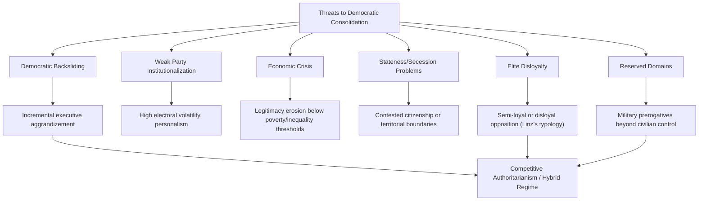

## Democratic Consolidation

### Definition and Scope

Democratic consolidation refers to the process by which a newly established democracy becomes stable, resilient, and self-sustaining, such that democratic procedures become "the only game in town" — the phrase most closely associated with Juan Linz and Alfred Stepan's definitional framework. A consolidated democracy is one where no significant political actor seriously contemplates seizing power outside democratic channels, and where all actors accept that political conflict will be resolved through established democratic institutions.

Consolidation is analytically distinct from *transition* (the initial change of regime type): transition can occur rapidly (weeks or months), while consolidation is understood as a longer-run process of institutionalization, attitudinal change, and behavioral habituation that may take a generation or more, and is never fully guaranteed to succeed.

### Linz and Stepan's Three-Dimensional Framework

Linz and Stepan (1996) propose that consolidation must be assessed across three interlocking dimensions:

#### Behavioral Dimension

No significant national, social, economic, political, or institutional actor spends significant resources attempting to achieve goals by creating a non-democratic regime or by seceding from the state.

Indicators:

- Absence of coup attempts or coup plotting by military factions
- Absence of armed insurgency aimed at regime overthrow
- Elite acceptance of electoral defeat without resort to extra-constitutional means

#### Attitudinal Dimension

Even when confronting severe political and economic crises, the overwhelming majority of the population believes that democratic procedures are the most appropriate way to govern collective life, and support for anti-system alternatives is minimal.

Indicators:

- Survey data (e.g., Latinobarómetro, Afrobarometer, World Values Survey) measuring diffuse support for democracy as a system of government, distinguished from satisfaction with any particular government's performance
- Low popular support for military intervention or one-party rule as alternatives

#### Constitutional Dimension

All actors in the polity become habituated to the fact that political conflict is resolved according to established laws, procedures, and institutions, and governmental and nongovernmental forces alike subject themselves to the specific laws, procedures, and institutions sanctioned by the new democratic process.

Indicators:

- Peaceful, rule-bound transfers of power following electoral defeat
- Absence of "reserved domains" where nonelected actors (military, monarchy, clergy) hold veto power immune from democratic accountability
- Judicial and legislative bodies actually constraining executive action in practice, not merely on paper

[Inference] The three dimensions are frequently only partially aligned in practice — a polity may show strong behavioral consolidation (no coup attempts) while lacking attitudinal consolidation (widespread public cynicism toward democratic legitimacy), which is one reason consolidation is best treated as a multidimensional and gradient concept rather than a binary threshold.

### The "Two Turnover Test"

Samuel Huntington's operational heuristic proposes that a democracy can be considered consolidated once it has experienced two peaceful transfers of power via election, including transfer from the incumbent party/coalition to the opposition, and then back again (or between rotating power blocs).

Rationale: the first turnover demonstrates the incumbent will cede power upon electoral defeat; the second demonstrates the newly elected opposition will *also* cede power in turn, establishing genuine reciprocal acceptance of the rules rather than a one-off transition.

[Inference] The two-turnover test is a widely cited heuristic rather than a rigorously validated predictive threshold; critics note it can be satisfied by regimes that later backslide (e.g., competitive authoritarian cases where turnovers occurred but the deeper attitudinal/constitutional dimensions remained weak), so it functions better as a necessary rather than sufficient indicator.

### Structural and Institutional Preconditions

#### Stateness Problem

Linz and Stepan argue that a precondition logically prior to democratic consolidation is the resolution of the "stateness problem": there must be broad agreement on the boundaries of the political community and on who the legitimate citizenry is, before democratic consolidation can proceed. Contested statehood, secessionist claims, or unresolved national identity questions (e.g., post-Soviet states with large ethnic-Russian minorities, or Yugoslavia's disintegration) undermine consolidation prospects independent of institutional design.

#### Institutionalization of Political Parties

A robust party system — parties with stable social bases, programmatic (rather than purely clientelist) linkages to voters, and predictable patterns of inter-party competition — is widely identified as central to consolidation, since parties aggregate demands and provide channels for peaceful alternation in power. Weakly institutionalized party systems (frequent party collapse, personalistic vehicles, extreme electoral volatility) are associated with lower consolidation prospects, notably in parts of Latin America and post-communist Europe.

#### Civil Society

A dense associational life (independent media, trade unions, professional associations, NGOs) is theorized to support consolidation by providing a check on state power, socializing citizens into participatory norms, and creating channels of accountability outside formal state institutions. [Inference] The causal weight of civil society relative to formal institutions (courts, electoral commissions) in producing consolidation remains debated, since correlational studies cannot easily separate civil society's independent effect from its role as a byproduct of prior economic development.

#### Economic Performance

Consolidation research draws heavily on Przeworski and Limongi's (1997) finding, discussed under transition theory, that democracies above roughly $6,000 per capita income (1985 PPP) exhibit extremely low reversion rates — this finding is frequently cited within consolidation literature as evidence that economic performance functions as a consolidation-sustaining factor even though it does not reliably predict transition onset.

### Threats to Consolidation

#### Linz's Loyalty Typology

Juan Linz's earlier work on democratic breakdown (*The Breakdown of Democratic Regimes*, 1978) identifies a spectrum of elite commitment relevant to consolidation risk:

- **Loyal actors**: unconditionally committed to resolving conflict through legal, democratic means regardless of outcome
- **Semi-loyal actors**: nominally accept democratic legitimacy but are willing to tolerate, excuse, or tacitly encourage disloyal actors' anti-system actions when politically convenient
- **Disloyal actors**: actively seek to overthrow or subvert the democratic system

[Inference] Linz's framework suggests that semi-loyal elites are often more consequential for consolidation failure than overtly disloyal actors, because their tacit tolerance of anti-system behavior legitimizes and enables it while providing plausible deniability.

#### Democratic Backsliding (Contemporary Extension)

Since roughly the 2010s, the literature increasingly focuses on **backsliding** — the incremental, often legally packaged erosion of democratic institutions by elected incumbents (as opposed to sudden coups) — as the dominant threat to consolidated or semi-consolidated democracies. Nancy Bermeo's concept of "executive aggrandizement" describes how elected leaders weaken checks (judicial independence, media freedom, electoral commission autonomy) through incremental, technically legal means, making backsliding harder to detect and resist than classical coups. [Unverified] Whether backsliding constitutes a fundamentally distinct causal phenomenon from classical breakdown, or is better modeled as a slow-motion variant of the same underlying elite-defection dynamics Linz described, remains an active debate in the literature.

### Consolidology vs. Skeptical Critiques

Guillermo O'Donnell's influential critique ("Illusions About Consolidation," 1996) argued that the consolidation paradigm imported inappropriate assumptions from advanced Western democracies, and proposed the alternative concept of **"delegative democracy"** — a form of democracy that meets minimal procedural criteria (competitive elections) but lacks robust horizontal accountability (checks between institutions), instead concentrating extensive discretionary power in an elected executive who claims to personally embody the national interest.

O'Donnell's critique suggests some regimes may reach a stable equilibrium that is neither "consolidating toward" liberal democracy nor "backsliding toward" authoritarianism, but rather represents a durable, distinct hybrid form — challenging the linear, teleological assumption embedded in earlier consolidation scholarship (a critique that parallels Thomas Carothers's parallel critique of transition theory).

### Illustrative Example: Contrasting Consolidation Trajectories

**Example:**

- **Spain** (post-1975 transition): Widely cited as a consolidation success — passed the two-turnover test with the 1982 PSOE victory and 1996 PP victory; the 1981 attempted coup (23-F) was defeated by King Juan Carlos's public intervention and swift elite condemnation, itself often cited as a consolidating moment demonstrating behavioral commitment
- **Thailand**: Illustrates consolidation failure/reversal — multiple democratic periods interrupted by military coups (2006, 2014), reflecting weak behavioral consolidation (military retains coup capacity and willingness) despite periods of electoral competition
- **Hungary** (post-2010): Frequently cited in the backsliding literature as a case of an initially consolidating democracy (post-1989 transition, EU accession in 2004) undergoing executive aggrandizement under Viktor Orbán's Fidesz government — illustrating that consolidation assessments made at one point in time (e.g., post-EU-accession optimism) are not irreversible guarantees. [Inference] The Hungarian case is frequently used to argue that formal EU membership conditionality is insufficient to guarantee durable consolidation, since backsliding occurred under continued EU membership rather than being prevented by it.

### Illustrative Diagram: Consolidation as Multidimensional Convergence (svg_diagram)

<svg xmlns="http://www.w3.org/2000/svg" viewBox="0 0 700 420">
<rect x="0" y="0" width="700" height="420" fill="#ffffff" />
<text x="350" y="25" font-family="Arial, sans-serif" font-size="16" font-weight="bold" text-anchor="middle" fill="#1a1a1a">Three Dimensions of Consolidation (svg_diagram)</text>
<circle cx="250" cy="180" r="110" fill="#3b5998" fill-opacity="0.18" stroke="#3b5998" stroke-width="2" />
<circle cx="450" cy="180" r="110" fill="#5cb85c" fill-opacity="0.18" stroke="#5cb85c" stroke-width="2" />
<circle cx="350" cy="320" r="110" fill="#d9534f" fill-opacity="0.18" stroke="#d9534f" stroke-width="2" />

<text x="200" y="130" font-family="Arial, sans-serif" font-size="13" font-weight="bold" text-anchor="middle" fill="`#1a1a1a`">Behavioral</text>

<text x="200" y="148" font-family="Arial, sans-serif" font-size="10" text-anchor="middle" fill="#333">No coup attempts,</text>

<text x="200" y="162" font-family="Arial, sans-serif" font-size="10" text-anchor="middle" fill="#333">no secession bids</text>

<text x="500" y="130" font-family="Arial, sans-serif" font-size="13" font-weight="bold" text-anchor="middle" fill="`#1a1a1a`">Attitudinal</text>

<text x="500" y="148" font-family="Arial, sans-serif" font-size="10" text-anchor="middle" fill="#333">Mass belief democracy</text>

<text x="500" y="162" font-family="Arial, sans-serif" font-size="10" text-anchor="middle" fill="#333">is the only legitimate system</text>

<text x="350" y="365" font-family="Arial, sans-serif" font-size="13" font-weight="bold" text-anchor="middle" fill="`#1a1a1a`">Constitutional</text>

<text x="350" y="383" font-family="Arial, sans-serif" font-size="10" text-anchor="middle" fill="#333">Conflict resolved via</text>

<text x="350" y="397" font-family="Arial, sans-serif" font-size="10" text-anchor="middle" fill="#333">established law and process</text>

<text x="350" y="230" font-family="Arial, sans-serif" font-size="14" font-weight="bold" text-anchor="middle" fill="`#1a1a1a`">Consolidated</text>

<text x="350" y="248" font-family="Arial, sans-serif" font-size="14" font-weight="bold" text-anchor="middle" fill="`#1a1a1a`">Democracy</text>

<text x="350" y="266" font-family="Arial, sans-serif" font-size="10" font-style="italic" text-anchor="middle" fill="#333">("only game in town")</text>

</svg>

### Related Topics

- Theories of Democratic Transition
- Pathways from Authoritarian Rule
- Democratic Backsliding and Executive Aggrandizement
- Delegative Democracy (O'Donnell)
- Hybrid Regimes and Competitive Authoritarianism
- Party System Institutionalization
- Civil Society and Democratic Accountability
- Semi-Loyalty and Elite Behavior in Democratic Breakdown