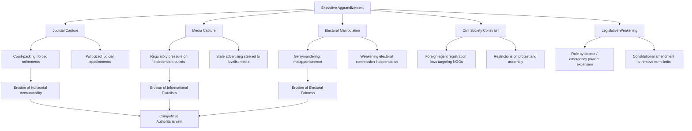

## Democratic Backsliding and Erosion

### Definition and Scope

Democratic backsliding refers to the incremental deterioration of democratic institutions, norms, and practices within a state that continues to hold elections and formally retains a democratic constitutional framework. Unlike classical democratic breakdown (military coups, sudden constitutional suspension), backsliding is characterized by gradualism, legal camouflage, and initiation by incumbents who were themselves democratically elected — making it substantially harder to identify in real time and to resist through conventional constitutional mechanisms designed to prevent overt seizures of power.

The concept has become the dominant analytical frame in democratization studies since roughly the mid-2010s, supplanting earlier optimism from the "third wave"/consolidation paradigm as scholars observed reversals in states previously considered consolidated or consolidating (Hungary, Poland, Turkey, and contested cases including the United States and India).

### Nancy Bermeo's Typology of Backsliding

Nancy Bermeo's influential article "On Democratic Backsliding" (2016) distinguishes backsliding from classical breakdown by identifying six distinct sub-types, several of which are largely obsolete forms giving way to newer, subtler mechanisms:

#### Classical/Overt Forms (Declining in Prevalence)

- **Open-ended incumbent takeover**: a sudden, decisive seizure of power by an incumbent who refuses to hold or honor elections
- **Coup d'état**: military or elite seizure of power, the classical form of breakdown
- **Election-day vote fraud**: outright fabrication or manipulation of vote counts on election day itself

#### Contemporary/Subtle Forms (Increasingly Prevalent)

- **Executive aggrandizement**: elected executives incrementally weakening checks on their power (judiciary, media, electoral bodies, legislature) through nominally legal means — identified by Bermeo as the dominant mode of backsliding in the contemporary period
- **Strategic harassment and manipulation of voters, media, and the opposition**: using state resources, regulatory power, or legal instruments (defamation suits, selective tax audits, broadcast license revocation) to disadvantage opposition and critical media without banning them outright
- **Promissory coups**: military interventions justified by an explicit promise to restore "true" democracy or hold new elections, distinguishing them rhetorically from classical coups even though the mechanism (extra-constitutional seizure) is identical

[Inference] Bermeo's framework implies that the empirical decline of classical coups and outright fraud, combined with the rise of executive aggrandizement, reflects strategic adaptation by would-be autocrats to an international environment where overt breakdown carries higher reputational and diplomatic costs than incremental erosion.

### Mechanisms of Executive Aggrandizement

Levitsky and Ziblatt's *How Democracies Die* (2018) proposes complementary behavioral early-warning indicators (adapted from Linz's earlier loyalty typology) for identifying authoritarian-leaning politicians before they gain full power:

- Rejection of (or weak commitment to) democratic rules of the game
- Denial of the legitimacy of political opponents
- Toleration or encouragement of violence
- Readiness to curtail civil liberties of opponents, including media

[Inference] These indicators are explicitly framed by the authors as diagnostic warning signs rather than deterministic predictors, since not every leader displaying such traits successfully or fully executes backsliding — institutional and societal "guardrails" can interrupt the process at multiple points.

### Structural Enablers and Institutional Guardrails

#### Formal vs. Informal Guardrails

Levitsky and Ziblatt distinguish between formal constitutional constraints (written checks and balances) and unwritten norms that traditionally reinforced them:

- **Mutual toleration**: the norm that competing parties accept each other as legitimate rivals rather than existential enemies
- **Institutional forbearance**: the norm of not exercising the full letter of one's legal powers, even when technically permissible, to avoid escalatory institutional warfare

[Inference] The theory implies that formal constitutional rules alone are insufficient to prevent backsliding if the informal norms sustaining forbearance erode, since written constraints typically contain enough ambiguity or emergency-power provisions to be exploited once actors abandon self-restraint.

#### Polarization as an Enabling Condition

Affective and pernicious polarization — where political opponents are perceived as existential threats rather than legitimate rivals — is widely identified in the literature as a key enabling condition for backsliding, because polarized electorates and legislators become more willing to tolerate norm violations by their own side if they perceive the opposing side as an existential threat that justifies extraordinary measures.

#### Populism as a Vehicle

Backsliding is frequently, though not universally, associated with populist mobilization strategies that claim to represent an authentic, unified "people" against a corrupt elite or dangerous "other," providing rhetorical justification for dismantling institutions (courts, independent press, opposition parties) framed as obstacles to the popular will rather than legitimate checks. [Unverified] Whether populism is a necessary vehicle for backsliding or merely one of several available justificatory frames (nationalist, religious, security-based) remains contested, since backsliding cases exist that rely more heavily on other legitimating discourses (e.g., counter-terrorism framing).

### Measurement Approaches

Given backsliding's incremental and often legally ambiguous character, measurement relies heavily on expert-coded indices tracking institutional quality over time rather than binary regime classification:

- **V-Dem (Varieties of Democracy)**: produces disaggregated indices (Liberal Democracy Index, Polyarchy) tracking judicial constraints, media freedom, and civil society space annually, enabling detection of gradual decline
- **Freedom House**: annual scores on political rights and civil liberties, widely used but criticized for coarser granularity relative to V-Dem's disaggregated approach
- **Polity5**: tracks executive constraints as a component of its composite democracy score

[Inference] The reliance on expert coding across these indices introduces some risk of measurement subjectivity and inter-coder disagreement, particularly for borderline or rapidly changing cases, which is one reason researchers frequently cross-validate findings across multiple indices rather than relying on a single source.

### Illustrative Example: Hungary as a Backsliding Case Study

**Example:**

- **2010**: Viktor Orbán's Fidesz wins a two-thirds supermajority, enabling unilateral constitutional amendment without opposition consent
- **2011–2013**: New constitution adopted; Constitutional Court's jurisdiction narrowed; retirement age for judges lowered, enabling replacement of sitting judges with loyalists (judicial capture mechanism)
- **2010s ongoing**: Media ownership increasingly consolidated under government-aligned business figures; state advertising revenue steered toward friendly outlets (media capture mechanism)
- **Electoral system redesign**: redistricting and electoral rule changes increased the seat bonus for the plurality winner, entrenching Fidesz's parliamentary dominance beyond its vote share (electoral manipulation mechanism)
- **Result**: V-Dem reclassified Hungary from "liberal democracy" to "electoral autocracy" during the 2010s — frequently cited as the first EU member state to be so classified, illustrating that formal EU membership and prior consolidation assessments did not prevent backsliding

This case is widely used pedagogically because it demonstrates Bermeo's "executive aggrandizement" mechanism operating through nominally legal channels (constitutional amendment via supermajority, judicial retirement law, electoral redistricting) rather than through any single unconstitutional act.

### Illustrative Diagram: Backsliding as Incremental Trajectory vs. Classical Breakdown (svg_diagram)

<svg xmlns="http://www.w3.org/2000/svg" viewBox="0 0 720 380">
<rect x="0" y="0" width="720" height="380" fill="#ffffff" />
<text x="360" y="25" font-family="Arial, sans-serif" font-size="16" font-weight="bold" text-anchor="middle" fill="#1a1a1a">Backsliding Trajectory vs. Classical Breakdown (svg_diagram)</text>
<line x1="60" y1="320" x2="680" y2="320" stroke="#333" stroke-width="1.5" />
<line x1="60" y1="320" x2="60" y2="60" stroke="#333" stroke-width="1.5" />
<text x="370" y="350" font-family="Arial, sans-serif" font-size="11" text-anchor="middle" fill="#333">Time</text>
<text x="30" y="190" font-family="Arial, sans-serif" font-size="11" text-anchor="middle" fill="#333" transform="rotate(-90 30 190)">Democratic Quality</text>
<path d="M 60,100 L 250,100 L 260,300 L 680,300" fill="none" stroke="#d9534f" stroke-width="2.5" />
<text x="500" y="290" font-family="Arial, sans-serif" font-size="11" font-weight="bold" fill="#a83232">Classical Breakdown (coup)</text>
<circle cx="255" cy="200" r="4" fill="#d9534f" />
<text x="270" y="195" font-family="Arial, sans-serif" font-size="10" fill="#a83232">Sudden rupture</text>
<path d="M 60,120 Q 200,125 300,150 Q 420,180 500,220 Q 600,255 680,275" fill="none" stroke="#f0ad4e" stroke-width="2.5" />
<text x="450" y="140" font-family="Arial, sans-serif" font-size="11" font-weight="bold" fill="#a67016">Backsliding (executive aggrandizement)</text>
<line x1="60" y1="80" x2="680" y2="80" stroke="#5cb85c" stroke-width="1" stroke-dasharray="5,3" />
<text x="600" y="72" font-family="Arial, sans-serif" font-size="10" fill="#2d6b2d">Consolidated Democracy Threshold</text>
</svg>

### Contested Debates in the Backsliding Literature

- **Is backsliding reversible?** Some scholars (e.g., work building on O'Donnell's delegative democracy concept) argue backsliding regimes can stabilize into durable competitive-authoritarian equilibria rather than continuing linear decline toward closed autocracy or reverting to democracy; others emphasize cases of successful reversal (e.g., alternation removing backsliding incumbents through elections, as debated regarding Poland's 2023 election).
- **Backsliding vs. normal democratic contestation**: A methodological critique holds that labeling ordinary partisan policy disputes or legitimate institutional reform as "backsliding" risks conflating democratic backsliding with mere political disagreement the observer dislikes; scholars using V-Dem-style measures attempt to address this by focusing specifically on changes to the *rules of the political game* (courts, elections, media pluralism) rather than substantive policy outputs.
- [Speculation] Whether the current wave of backsliding cases represents a discrete historical episode analogous to interwar democratic breakdowns, or a longer-term structural feature of contemporary democracy under conditions of polarization and information fragmentation, cannot be conclusively assessed without further temporal distance from the ongoing cases.

### Related Topics

- Democratic Consolidation
- Theories of Democratic Transition
- Pathways from Authoritarian Rule
- Competitive Authoritarianism and Hybrid Regimes
- Populism and Democratic Erosion
- Polarization and Democratic Stability
- Judicial Independence and Court-Packing
- Measuring Democracy (V-Dem, Freedom House, Polity5)