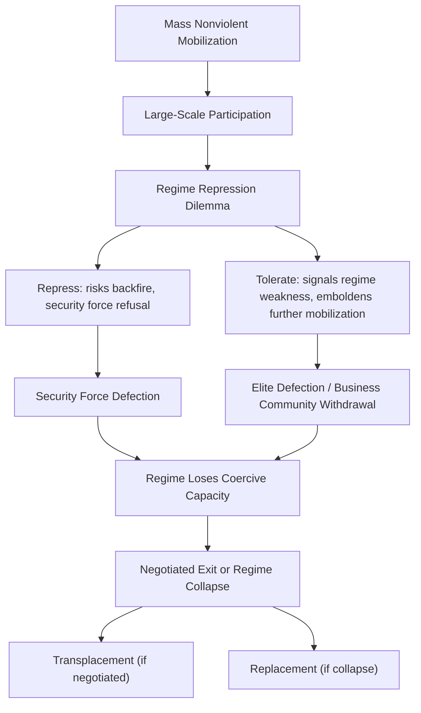

## Civil Resistance and Nonviolent Transitions

### Definition and Scope

Civil resistance (also termed nonviolent struggle or nonviolent civil resistance) refers to a method of political conflict in which unarmed civilian populations use tactics of protest, noncooperation, and defiance — without threatening or using violence — to challenge an opponent's power, often with the aim of overthrowing authoritarian rule, resisting occupation, or securing rights. Within democratization studies, this subfield examines why and under what conditions nonviolent mass mobilization succeeds in producing regime transitions, and how the *method* chosen (violent insurgency versus nonviolent resistance) causally shapes both the likelihood of success and the character of the resulting political order.

The field draws on a much older normative and strategic tradition (Gandhi, Gene Sharp's foundational strategic theorizing) but was substantially transformed into a quantitative, comparative-politics research program by Erica Chenoweth and Maria Stephan's *Why Civil Resistance Works* (2011).

### Gene Sharp's Strategic Theory of Nonviolent Action

Gene Sharp's foundational contribution, particularly *The Politics of Nonviolent Action* (1973), reconceptualized nonviolent resistance not as a moral position but as a pragmatic technique of exercising power, grounded in a specific theory of political power:

#### Consent Theory of Power

Sharp's core theoretical claim is that political power is not a fixed possession of rulers but is derived from, and dependent upon, the cooperation and obedience of the ruled — including bureaucrats, soldiers, police, and ordinary citizens. Regime power therefore rests on multiple "pillars of support" (the military, police, civil service, business community, media, religious institutions, and the general public), and withdrawal of cooperation from these pillars can incapacitate even seemingly powerful regimes.

[Inference] This consent-based theory implies a strategic, rather than purely moral, rationale for nonviolent tactics: if power depends on cooperation, then organized noncooperation is a viable mechanism for undermining a regime independent of any normative commitment to pacifism, which distinguishes strategic nonviolence from principled/religious nonviolence traditions (e.g., some readings of Gandhian satyagraha).

#### The 198 Methods

Sharp catalogued 198 specific methods of nonviolent action, grouped into three broad categories:

- **Protest and persuasion**: symbolic acts (marches, vigils, petitions) intended to demonstrate opposition and shift public opinion
- **Noncooperation**: withdrawal of social, economic, or political cooperation (strikes, boycotts, civil disobedience, tax refusal)
- **Nonviolent intervention**: more disruptive direct actions (sit-ins, blockades, parallel government structures) that directly interfere with the functioning of the opponent's institutions

### Chenoweth and Stephan's Empirical Findings

Chenoweth and Stephan compiled the **NAVCO (Nonviolent and Violent Campaigns and Outcomes)** dataset, covering major resistance campaigns from 1900 to 2006, to test comparatively whether nonviolent or violent methods are more effective at achieving maximalist goals (regime change, territorial independence, or secession).

Central finding: nonviolent campaigns succeeded in achieving their stated goals in roughly 53% of cases, compared with roughly 26% for violent campaigns, over the period studied.

#### Causal Mechanisms Proposed

- **Participation advantage**: nonviolent campaigns face a dramatically lower barrier to participation (no requirement for physical fitness, weapons training, or willingness to risk lethal violence), enabling mobilization of much larger and more diverse cross-sections of the population — including women, children, the elderly, and people with disabilities
- **Security force defection**: mass, visibly nonviolent campaigns make it harder for regime security forces to justify violent repression, and repression against unarmed civilians risks triggering defections among police and military personnel who may refuse orders to fire on peaceful crowds ("backfire" or "political jiu-jitsu" dynamics, a term originating with Sharp)
- **International and domestic legitimacy**: nonviolent movements tend to attract broader international sympathy and diplomatic support, and are less easily framed by the regime as a security threat justifying harsh crackdown, relative to armed insurgency
- **The "3.5% rule"**: Chenoweth's later, widely cited (and more tentative) empirical observation that no nonviolent campaign that achieved active participation from at least 3.5% of a country's population failed to achieve its stated goal within the dataset studied

[Inference] The 3.5% figure is best understood as a descriptive regularity observed within a specific historical dataset rather than a proven causal threshold universally applicable to future campaigns, since achieving that participation level may itself be correlated with other success-conducive conditions (regime weakness, elite splits) rather than independently causing success.

### Mechanisms of Regime Defection

### Distinguishing Civil Resistance from Related Concepts

| Concept | Key Distinction from Civil Resistance |
| --- | --- |
| Armed insurgency/guerrilla warfare | Relies on threat or use of lethal violence against regime forces |
| Principled/religious pacifism | Grounded in moral or spiritual commitment to nonviolence as an end in itself, not primarily a strategic calculation |
| Electoral opposition | Operates within existing regime-sanctioned electoral channels rather than through extra-institutional mass mobilization |
| Riot/spontaneous unrest | Typically unorganized, lacks strategic planning, unclear objectives, and often includes property destruction or violence |

[Inference] In practice, many historical campaigns display mixed tactical repertoires (predominantly nonviolent with episodes of violent flanking action), and Chenoweth and Stephan's coding methodology classifies campaigns based on the *primary* or *dominant* tactic used by the mass movement rather than requiring strict tactical purity, which is a methodological choice that has drawn some criticism regarding classification boundary cases.

### Outcomes for Post-Transition Democratic Quality

A significant secondary finding in the literature concerns not just whether nonviolent campaigns succeed in removing the incumbent regime, but what political order results afterward:

- Nonviolent transitions are associated with a substantially higher likelihood of producing a democratic outcome in the years following regime change, compared with violent transitions, which are more frequently followed by civil war recurrence, renewed authoritarianism, or state fragmentation
- Proposed mechanism: nonviolent campaigns' reliance on broad-based civic coalition-building and negotiation skills tends to produce more inclusive post-transition institutions and habituates participants to bargaining and compromise, whereas victorious armed factions often translate wartime hierarchical/coercive organizational structures directly into post-transition governance
- [Speculation] Whether this correlation reflects nonviolent method choice causally producing better democratic outcomes, or whether both nonviolent tactical choice and favorable democratic outcomes are jointly caused by prior societal characteristics (e.g., pre-existing civic associational density, elite cohesion), remains a subject of ongoing methodological debate regarding selection effects in this literature.

### Illustrative Example: Comparative Cases

**Example:**

- **Philippines, 1986 (People Power Revolution)**: Mass nonviolent mobilization following the disputed snap election against Ferdinand Marcos; defection of Defense Minister Juan Ponce Enrile and key military units, combined with Cardinal Sin's public call for citizens to protect defecting soldiers, produced a rapid, largely bloodless collapse of the regime — an archetypal case of security-force defection following nonviolent mass mobilization
- **Serbia, 2000 (Bulldozer Revolution)**: The Otpor! student movement's sustained nonviolent campaign against Slobodan Milošević, using humor, decentralized organization, and explicit strategic study of Sharp's writings, culminated in mass protests after a disputed election and the defection of police units ordered to disperse crowds — later serving as an internationally emulated tactical template (Georgia's Rose Revolution, Ukraine's Orange Revolution)
- **Syria, 2011 onward**: Frequently cited as a contrasting case where an initially substantially nonviolent uprising transitioned into armed insurgency and civil war following harsh regime repression and the absence of significant security-force defection at scale, illustrating the theorized risks associated with the shift from nonviolent to violent tactics (loss of the participation advantage, loss of the moral/legitimacy asymmetry, and the regime's greater relative advantage in conventional armed conflict)

### Illustrative Diagram: Participation Barrier — Nonviolent vs. Violent Campaigns (svg_diagram)

<svg xmlns="http://www.w3.org/2000/svg" viewBox="0 0 700 380">
<rect x="0" y="0" width="700" height="380" fill="#ffffff" />
<text x="350" y="25" font-family="Arial, sans-serif" font-size="16" font-weight="bold" text-anchor="middle" fill="#1a1a1a">Participation Barrier Comparison (svg_diagram)</text>
<rect x="60" y="60" width="260" height="270" rx="8" fill="#eef7ee" stroke="#5cb85c" stroke-width="2" />
<text x="190" y="90" font-family="Arial, sans-serif" font-size="14" font-weight="bold" text-anchor="middle" fill="#2d6b2d">Nonviolent Campaign</text>
<text x="190" y="120" font-family="Arial, sans-serif" font-size="11" text-anchor="middle" fill="#333">Low physical barrier</text>
<text x="190" y="140" font-family="Arial, sans-serif" font-size="11" text-anchor="middle" fill="#333">Broad demographic reach</text>
<text x="190" y="160" font-family="Arial, sans-serif" font-size="11" text-anchor="middle" fill="#333">(elderly, women, children)</text>
<circle cx="120" cy="200" r="8" fill="#5cb85c" />
<circle cx="150" cy="215" r="8" fill="#5cb85c" />
<circle cx="180" cy="195" r="8" fill="#5cb85c" />
<circle cx="210" cy="220" r="8" fill="#5cb85c" />
<circle cx="240" cy="200" r="8" fill="#5cb85c" />
<circle cx="270" cy="215" r="8" fill="#5cb85c" />
<circle cx="135" cy="240" r="8" fill="#5cb85c" />
<circle cx="165" cy="255" r="8" fill="#5cb85c" />
<circle cx="195" cy="240" r="8" fill="#5cb85c" />
<circle cx="225" cy="255" r="8" fill="#5cb85c" />
<circle cx="255" cy="240" r="8" fill="#5cb85c" />

<text x="190" y="300" font-family="Arial, sans-serif" font-size="12" font-weight="bold" text-anchor="middle" fill="`#2d6b2d`">Higher mass participation</text>

<text x="190" y="318" font-family="Arial, sans-serif" font-size="11" text-anchor="middle" fill="#333">→ historically ~53% success rate</text>

<rect x="380" y="60" width="260" height="270" rx="8" fill="#f2dede" stroke="#a94442" stroke-width="2" />
<text x="510" y="90" font-family="Arial, sans-serif" font-size="14" font-weight="bold" text-anchor="middle" fill="#a83232">Violent Campaign</text>
<text x="510" y="120" font-family="Arial, sans-serif" font-size="11" text-anchor="middle" fill="#333">High physical/skill barrier</text>
<text x="510" y="140" font-family="Arial, sans-serif" font-size="11" text-anchor="middle" fill="#333">Narrower demographic reach</text>
<text x="510" y="160" font-family="Arial, sans-serif" font-size="11" text-anchor="middle" fill="#333">(combat-capable recruits)</text>
<circle cx="470" cy="210" r="8" fill="#a94442" />
<circle cx="510" cy="225" r="8" fill="#a94442" />
<circle cx="550" cy="210" r="8" fill="#a94442" />
<circle cx="490" cy="250" r="8" fill="#a94442" />
<circle cx="530" cy="250" r="8" fill="#a94442" />

<text x="510" y="300" font-family="Arial, sans-serif" font-size="12" font-weight="bold" text-anchor="middle" fill="`#a83232`">Lower mass participation</text>

<text x="510" y="318" font-family="Arial, sans-serif" font-size="11" text-anchor="middle" fill="#333">→ historically ~26% success rate</text>

</svg>

### Critiques and Limitations

- **Selection effects**: Because the choice between violent and nonviolent tactics is not randomly assigned, critics note that opposition movements may select nonviolent tactics precisely in contexts where the regime is already comparatively weaker or more internally divided, which would inflate the apparent success rate of nonviolent methods independent of any causal effect of the tactic itself
- **Repression sensitivity**: The theory's predictions are heavily conditioned on the regime's willingness and capacity to exercise restraint or suffer reputational costs from repression; highly insulated authoritarian regimes with strong external patrons (reducing sensitivity to international legitimacy costs) may be less susceptible to the backfire dynamic central to the theory
- **Coding and classification disputes**: Scholars have raised methodological questions about NAVCO's classification of mixed campaigns and about the appropriate operational definition of "success" (which can range from narrow leadership removal to full democratic transformation), affecting cross-study comparability
- [Unverified] The generalizability of pre-2011 findings to the contemporary digital-mobilization era (social media-driven leaderless movements, discussed in Zeynep Tufekci's subsequent critique in *Twitter and Tear Gas*) is actively contested, with some scholars arguing that digitally organized movements may achieve rapid mobilization but lack the organizational capacity for sustained strategic coordination and negotiation that characterized earlier, more hierarchically organized nonviolent campaigns

### Related Topics

- Theories of Democratic Transition
- Pathways from Authoritarian Rule
- Security Force Defection and Coup-Proofing
- Diffusion and Demonstration Effects in Democratization
- Gene Sharp's 198 Methods of Nonviolent Action
- Post-Conflict Institution-Building
- Digital Mobilization and Leaderless Movements
- Democratic Consolidation