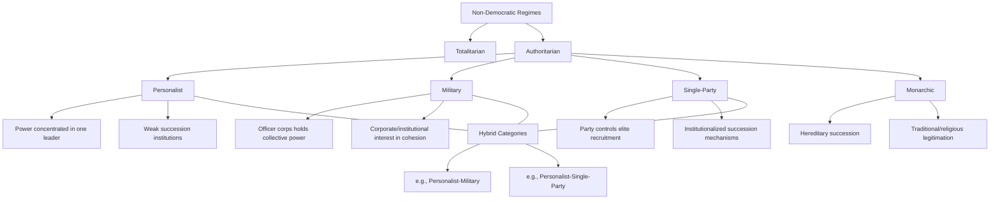

## Classifying Authoritarian Regimes

### Definition and Scope

Classifying authoritarian regimes refers to the comparative-politics subfield concerned with developing typologies that differentiate non-democratic regimes according to their institutional structure, the composition of the ruling coalition, and the mechanisms by which power is acquired, exercised, and transferred. Unlike earlier Cold War-era approaches that often treated "authoritarianism" as a single residual category defined negatively (simply "not democracy"), the contemporary literature — substantially shaped by Barbara Geddes's work — treats authoritarian regime type as an independent variable with distinct causal implications for regime durability, succession crises, conflict propensity, and pathways of breakdown.

This topic is foundational to the broader chapter on authoritarianism and hybrid regimes because regime type classification is the analytical prerequisite for explaining variation in authoritarian durability, institutional design, and susceptibility to different modes of transition (as covered under "Pathways from Authoritarian Rule").

### Juan Linz's Foundational Distinction: Authoritarianism vs. Totalitarianism

Juan Linz's earlier work (*Totalitarian and Authoritarian Regimes*, 2000, building on his 1964 essay) established the foundational conceptual distinction between two broad non-democratic regime families, based on the scope of state control over society:

#### Totalitarian Regimes

- Pursue an official, comprehensive ideology that seeks to remake society and human nature according to a utopian vision
- Maintain a single mass party, typically fused with the state apparatus, that penetrates and mobilizes nearly all social organizations
- Exercise near-total control over the economy, media, and civil society, tolerating minimal independent associational life
- Employ systematic, often terroristic repression extending beyond active political opponents to broad categories of the population
- Examples: Stalinist Soviet Union, Nazi Germany, Maoist China during the Cultural Revolution

#### Authoritarian Regimes

- Lack an elaborate guiding ideology, relying instead on a "distinctive mentality" (Linz's term) — a set of loosely articulated attitudes rather than a systematic doctrinal program
- Tolerate limited political and social pluralism, permitting some independent institutions (business associations, churches, semi-autonomous local governance) provided they do not challenge the regime's core political monopoly
- Exhibit "low mobilization" — do not require sustained mass political participation or ideological enthusiasm from the population, tolerating apathy or private withdrawal from politics
- Power is typically exercised by a leader or small group operating within poorly defined but real limits
- Examples: Franco's Spain, most military regimes in Latin America, many Middle Eastern monarchies

[Inference] This totalitarian/authoritarian distinction remains foundational but is now widely treated as identifying two poles on a continuum of state penetration into society rather than a strict binary, since many regimes (contemporary China under the CCP, for instance) exhibit characteristics that blend elements of both categories depending on the domain examined (economic liberalization alongside continued political and informational control).

### Barbara Geddes's Institutional Typology

Barbara Geddes's influential contribution (1999; substantially extended with Joseph Wright and Erica Frantz in *How Dictatorships Work*, 2018) reoriented the field around a coalition-based, institutional classification scheme, arguing that the *composition of the group that controls access to power* is the key variable determining a regime's behavior and durability.

#### Personalist Regimes

- A single individual, rather than an institution (party or military), monopolizes control over policy decisions, key appointments, and the security apparatus
- The leader typically rose through a party or military organization but subsequently marginalizes or purges that organization's independent influence, concentrating power in personal loyalists (often family members or informal networks)
- Succession is highly institutionally uncertain, since no formalized mechanism outside the leader's personal will typically exists
- Examples: Mobutu Sese Seko (Zaire), Saddam Hussein (Iraq), Idi Amin (Uganda), Turkmenistan under Saparmurat Niyazov

#### Military Regimes

- Power is held collectively by the officer corps as an institution, typically through a ruling junta, with policy decisions and leadership succession made through internal military hierarchy and consultation
- Military regimes typically justify their rule through claims of restoring order, preventing chaos, or responding to a national security crisis, framing their rule as a temporary custodial function
- The military's institutional interest in preserving its corporate cohesion and reputation creates incentives distinct from those of personalist or single-party rulers
- Examples: Argentina's military juntas (1976–83), Brazil (1964–85), Myanmar under the Tatmadaw

#### Single-Party Regimes

- Power is institutionalized within a ruling party organization that controls candidate selection, resource distribution, and elite recruitment, typically through nominally competitive or entirely non-competitive party-controlled elections
- The party apparatus provides mechanisms for co-opting societal elites, distributing patronage, and managing elite succession through internal party procedures rather than personal loyalty alone
- Examples: Mexico's PRI (pre-2000), the Chinese Communist Party, Taiwan's KMT (pre-democratization), Tanzania's CCM

#### Monarchic Regimes

- Political authority is vested in a royal family through hereditary succession rules, often legitimated through traditional, religious, or dynastic claims
- Frequently combine hereditary rule with limited co-optive institutions (consultative councils, extended-family power-sharing arrangements)
- Examples: Saudi Arabia, Jordan, Morocco, the Gulf monarchies

#### Hybrid/Mixed Categories

Geddes, Wright, and Frantz's extended coding scheme explicitly recognizes that many real-world cases combine institutional features of more than one ideal type:

- **Personalist-military hybrids**: a military-origin leader personalizes control while retaining some military institutional features (e.g., early Gaddafi-era Libya)
- **Personalist-single-party hybrids**: a dominant leader personalizes control within an ostensibly institutionalized party structure (e.g., some interpretations of contemporary Russia under United Russia)

### Regime Type and Durability: Empirical Findings

A central motivating finding in Geddes's research program concerns systematic variation in average regime lifespan and breakdown mode by type:

| Regime Type | Relative Durability (Geddes-era findings) | Predominant Breakdown Mode |
| --- | --- | --- |
| Single-Party | Highest average durability | Negotiated transformation/transplacement |
| Military | Lowest average durability | Transformation (voluntary return to barracks) |
| Personalist | Moderate but volatile; often abrupt | Collapse |
| Monarchic | Historically durable where institutionalized | Varies; often gradual liberalization or external shock |

[Inference] The comparatively higher durability of single-party regimes is generally attributed to their superior capacity for elite co-optation and internal conflict management through institutionalized power-sharing and succession norms, while personalist regimes' volatility is attributed to the absence of institutionalized mechanisms for resolving succession crises, making them highly dependent on the survival and continued dominance of a single individual.

### Alternative Typological Approaches

#### Wahman, Teorell, and Hadenius: Six-Category Scheme

An alternative influential coding scheme (used in some large-N datasets) expands the categorization to distinguish: monarchies, military regimes, no-party regimes, one-party regimes, multi-party (limited/dominant-party) regimes, and democracies, adding a distinct "no-party" category for regimes that rule without even a formal single ruling party structure (common in some personalist or military contexts lacking party institutionalization).

#### Regime-Type vs. Regime-Characteristic Approaches

[Unverified] There is an ongoing methodological debate regarding whether authoritarian regimes are best classified using discrete, mutually exclusive typological categories (Geddes-style) or via continuous, multidimensional characteristic scores (e.g., separately scoring the degree of party institutionalization, military involvement, and personalization on independent scales) — the latter approach, associated with some more recent scholarship, argues that discrete categories obscure meaningful within-category variation and force analytically awkward classification choices for genuinely hybrid cases.

### Illustrative Example: Applying the Typology

**Example — Classifying Contemporary Cases:**

- **Egypt under Abdel Fattah el-Sisi**: Best classified as a **military-personalist hybrid** — Sisi's rise through the military high command and continued reliance on military-linked economic and security institutions reflects the military regime type, while the increasing concentration of decision-making authority in Sisi personally (constitutional amendments extending his tenure, marginalization of potential internal military rivals) reflects personalization dynamics layered atop the military institutional base
- **China under Xi Jinping**: Frequently discussed as a **single-party regime undergoing personalization** — the CCP retains substantial institutional infrastructure for elite recruitment and local governance (consistent with the single-party type), but the 2018 removal of presidential term limits and the concentration of authority in Xi personally (relative to the more collective leadership norms under predecessors) is widely cited as evidence of a shift along the personalization dimension within an institutionally single-party structure
- **Saudi Arabia under Mohammed bin Salman**: Illustrates tension within the **monarchic** category — traditional hereditary succession structures persist, but MBS's consolidation of power (bypassing normal succession seniority norms, purging rival princes) has been characterized by some scholars as personalization occurring within a nominally monarchic institutional frame

### Illustrative Diagram: Regime Type Positioning on Institutionalization Dimensions (svg_diagram)

<svg xmlns="http://www.w3.org/2000/svg" viewBox="0 0 700 420">
<rect x="0" y="0" width="700" height="420" fill="#ffffff" />
<text x="350" y="25" font-family="Arial, sans-serif" font-size="16" font-weight="bold" text-anchor="middle" fill="#1a1a1a">Regime Types on Two Institutional Dimensions (svg_diagram)</text>
<line x1="80" y1="360" x2="640" y2="360" stroke="#333" stroke-width="1.5" />
<line x1="80" y1="360" x2="80" y2="60" stroke="#333" stroke-width="1.5" />
<text x="360" y="390" font-family="Arial, sans-serif" font-size="12" text-anchor="middle" fill="#333">Degree of Personalization →</text>
<text x="45" y="210" font-family="Arial, sans-serif" font-size="12" text-anchor="middle" fill="#333" transform="rotate(-90 45 210)">Institutional Constraint on Leader →</text>
<circle cx="200" cy="120" r="45" fill="#3b5998" fill-opacity="0.25" stroke="#3b5998" stroke-width="2" />
<text x="200" y="115" font-family="Arial, sans-serif" font-size="12" font-weight="bold" text-anchor="middle" fill="#1a1a1a">Single-Party</text>
<text x="200" y="130" font-family="Arial, sans-serif" font-size="10" text-anchor="middle" fill="#333">(institutionalized)</text>
<circle cx="220" cy="200" r="45" fill="#5cb85c" fill-opacity="0.25" stroke="#5cb85c" stroke-width="2" />
<text x="220" y="195" font-family="Arial, sans-serif" font-size="12" font-weight="bold" text-anchor="middle" fill="#1a1a1a">Military</text>
<text x="220" y="210" font-family="Arial, sans-serif" font-size="10" text-anchor="middle" fill="#333">(corporate)</text>
<circle cx="190" cy="280" r="45" fill="#8a6d3b" fill-opacity="0.25" stroke="#8a6d3b" stroke-width="2" />
<text x="190" y="275" font-family="Arial, sans-serif" font-size="12" font-weight="bold" text-anchor="middle" fill="#1a1a1a">Monarchic</text>
<text x="190" y="290" font-family="Arial, sans-serif" font-size="10" text-anchor="middle" fill="#333">(traditional)</text>
<circle cx="520" cy="320" r="55" fill="#d9534f" fill-opacity="0.25" stroke="#d9534f" stroke-width="2" />
<text x="520" y="315" font-family="Arial, sans-serif" font-size="12" font-weight="bold" text-anchor="middle" fill="#1a1a1a">Personalist</text>
<text x="520" y="330" font-family="Arial, sans-serif" font-size="10" text-anchor="middle" fill="#333">(low institutional constraint)</text>
<circle cx="420" cy="180" r="35" fill="#999999" fill-opacity="0.2" stroke="#666" stroke-width="1.5" stroke-dasharray="4,3" />
<text x="420" y="178" font-family="Arial, sans-serif" font-size="10" text-anchor="middle" fill="#333">Personalized</text>
<text x="420" y="192" font-family="Arial, sans-serif" font-size="10" text-anchor="middle" fill="#333">single-party</text>
</svg>

### Methodological Critiques and Limitations

- **Boundary and coding disputes**: Assigning a single discrete category to real-world regimes that blend features often requires judgment calls, and different datasets (Geddes-Wright-Frantz, Wahman-Teorell-Hadenius, Cheibub-Gandhi-Vreeland) sometimes disagree on individual case classifications, complicating cross-study comparison
- **Temporal instability of classification**: Regimes can migrate between types over their lifespan (a single-party regime undergoing personalization, as with contemporary China), raising questions about whether classification should apply to regime-years, regime-spells, or entire regime lifespans
- **Under-theorization of civilian non-party autocracies**: Some scholars argue existing typologies underspecify certain historically important categories, such as electorally-based dominant-party competitive authoritarian regimes that blur the personalist/single-party boundary while retaining genuinely contested (if unfair) multiparty elections
- [Inference] Because regime classification functions as a foundational independent variable across a large share of authoritarianism research (predicting conflict propensity, economic policy, transition pathway, and international behavior), disagreements over classification methodology have downstream consequences for the replicability and comparability of findings across the broader literature, which is part of why the field has moved toward multidimensional coding as a complement to discrete typologies rather than a wholesale replacement.

### Related Topics

- Pathways from Authoritarian Rule
- Personalist Rule and Succession Crises
- Competitive Authoritarianism and Hybrid Regimes
- Authoritarian Durability and Coup-Proofing
- Single-Party Dominance and Elite Co-optation
- Military Regimes and Civil-Military Relations
- Measuring Democracy and Autocracy (V-Dem, Polity, Geddes-Wright-Frantz datasets)
- Totalitarianism: Historical and Theoretical Foundations