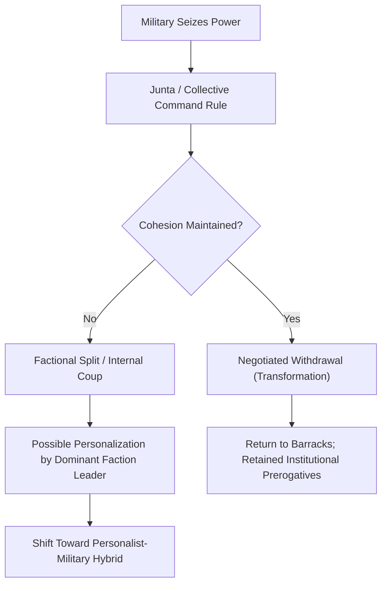

## Personalist, Military, and Single-Party Rule

### Definition and Scope

This topic examines in depth the three core authoritarian regime types identified in Barbara Geddes's institutional typology — personalist, military, and single-party rule — with focus on their internal governance logics, elite management strategies, succession dynamics, and characteristic vulnerabilities. Whereas "Classifying Authoritarian Regimes" establishes the typological framework and durability comparisons at a general level, this item examines the internal institutional mechanics of each regime type: how each manages the fundamental authoritarian dilemma of balancing loyalty against competence among subordinates, and how each structures succession.

### The Authoritarian Control Dilemma

A unifying analytical framework across all three regime types is what Milan Svolik (*The Politics of Authoritarian Rule*, 2012) terms the dictator's **twin problems**:

- **The problem of authoritarian control**: how the ruling elite manages the threat of a popular uprising or opposition challenge from below
- **The problem of authoritarian power-sharing**: how the ruler manages the threat of displacement by regime insiders (a coup, a palace purge, an internal power struggle) from above

[Inference] Svolik's framework implies that authoritarian institutions (parties, militaries, personalist patronage networks) are best understood as differing solutions to the power-sharing problem specifically, since historically the modal threat to an authoritarian ruler's survival has come from regime insiders rather than from mass uprising, making the internal management of the ruling coalition the central design problem each regime type addresses differently.

### Personalist Rule

#### Core Governance Logic

Personalist regimes concentrate policy authority, key appointments, and control over the security apparatus in a single individual, who typically rises through a party or military organization but then systematically weakens that organization's autonomous capacity to constrain or remove him.

#### Mechanisms of Personalization

- **Coup-proofing through counterbalancing**: creation of multiple, overlapping security services (presidential guards, parallel intelligence agencies, ethnic or clan-based militias) that monitor and check one another, preventing any single institution from accumulating enough unified coercive capacity to stage a coup
- **Purges and loyalty-based promotion**: systematic removal of competent but potentially independent-minded officers or officials, replaced by individuals selected primarily for personal loyalty (often kinship, ethnic, or regional ties to the leader) rather than competence
- **Personalized patronage networks**: distribution of state resources through informal, leader-controlled channels rather than institutionalized bureaucratic processes, making elite material welfare directly contingent on continued proximity to and favor with the leader
- **Cult of personality**: propaganda apparatus built around the leader's individual image rather than an institutional or party ideology

[Inference] Coup-proofing measures that enhance a personalist leader's short-run security against internal displacement (fragmented, competing security services) simultaneously and predictably degrade the regime's military effectiveness and administrative competence, since resources and personnel are selected for loyalty rather than skill — a widely noted trade-off in the coup-proofing literature.

#### Succession Dynamics

Personalist regimes exhibit the weakest institutionalized succession mechanisms among the three types, because formal succession rules would themselves constitute an institutional constraint on the leader that personalization processes are designed to eliminate. Succession crises are frequently associated with:

- Elevated risk of violent power struggles among rival family members, security chiefs, or informal factions upon the leader's death or incapacitation
- Attempted dynastic succession (transferring power to a son or relative) as an informal substitute for institutionalized succession — examples include Hafez al-Assad to Bashar al-Assad (Syria), Kim dynasty (North Korea)
- Higher likelihood of abrupt regime collapse rather than negotiated transition, consistent with Geddes's finding on personalist regime breakdown modes

### Military Rule

#### Core Governance Logic

Military regimes are governed through the institutional hierarchy of the armed forces, typically via a ruling junta that makes decisions through internal military consultation, rather than through concentrated individual authority or a civilian party apparatus.

#### Distinctive Institutional Features

- **Corporate interest in institutional cohesion**: officers share a professional interest in preserving the military's internal unity, chain of command, and reputation as a national institution, which creates incentives distinct from either personalist or single-party logics
- **Frequently self-limiting mandate**: military regimes often explicitly frame their rule as a temporary custodial intervention (to restore order, combat a security threat, or prevent civil war), which — unlike personalist or single-party regimes — creates internal normative and organizational pressure toward eventual withdrawal, since prolonged direct rule risks politicizing the officer corps and undermining unit cohesion along political lines
- **Collective/consultative decision-making**: policy typically emerges from negotiation within the junta or high command rather than individual fiat, though variation exists (some military regimes personalize around a single dominant general, blurring into the personalist-military hybrid category)

#### Succession and Withdrawal Dynamics

- Internal succession, when the ruling junta remains cohesive, typically follows military rank and seniority norms rather than being wholly arbitrary
- Military regimes are disproportionately likely (per Geddes's findings) to exit via negotiated transformation — a voluntary, phased "return to the barracks" — because officers retain the institutional option of receding to a purely military role while negotiating amnesty and continued budgetary/operational autonomy for the armed forces as an institution
- **Risk of factional splintering**: internal military rule can fracture along generational, ideological, or service-branch lines, producing intra-junta coup attempts (a "coup within a coup") that are distinct from, but related to, the classical coup literature on civilian-regime overthrow

### Single-Party Rule

#### Core Governance Logic

Single-party regimes institutionalize political authority within a ruling party organization that controls candidate selection, resource distribution, and elite career advancement, typically through formal party structures (congresses, central committees, politburos) that provide regularized channels for elite deliberation and succession.

#### Mechanisms of Elite Co-optation

- **Career incentive structures**: the party offers a predictable, merit-and-loyalty-based career ladder (local party posts → regional positions → national leadership), giving ambitious individuals a stake in the survival and continued functioning of the party system itself, rather than in any single individual leader
- **Institutionalized power-sharing bodies**: politburos, central committees, and party congresses provide forums for collective elite deliberation, negotiation, and — critically — non-violent resolution of internal disputes, reducing reliance on purges or violence to manage elite conflict
- **Broad-based patronage distribution**: party membership and local cadre networks extend the regime's reach into society, providing channels for co-opting local elites (business figures, community leaders) into the ruling coalition
- **Selectorate expansion**: unlike personalist regimes' narrow, informal loyalty networks, single-party regimes typically maintain a larger, more institutionally defined "selectorate" (the group whose support is necessary to remain in power), which some scholars argue makes rulers more responsive to a broader elite coalition's interests

#### Succession Dynamics

- Single-party regimes generally exhibit the most institutionalized succession mechanisms among authoritarian regime types, using formal party procedures (congresses, term limits, designated successor grooming) to manage leadership transition
- [Inference] This institutionalized succession capacity is widely credited as the primary mechanism underlying single-party regimes' comparatively higher measured durability, since it reduces the elite uncertainty and factional violence risk that often accompanies personalist or military succession crises
- **Personalization risk**: single-party institutions can nonetheless be eroded from within if a dominant leader accumulates sufficient authority to bypass or override collective party norms (e.g., removal of term limits, marginalization of the politburo's collective deliberative function), producing a hybrid personalized single-party regime

### Comparative Summary Table

| Dimension | Personalist | Military | Single-Party |
| --- | --- | --- | --- |
| Locus of authority | Individual leader | Officer corps/junta | Party apparatus |
| Elite selection criterion | Personal loyalty | Military rank/seniority | Party career performance + loyalty |
| Succession mechanism | Weak/informal, often dynastic | Rank-based, junta consultation | Institutionalized (congresses, term rules) |
| Coup-proofing strategy | Counterbalancing security services | Institutional cohesion norms | Party penetration of security apparatus |
| Typical breakdown mode | Collapse | Transformation | Transplacement/negotiated reform |
| Relative durability | Moderate, volatile | Lowest average | Highest average |

### Illustrative Example: Institutional Trajectories

**Example:**

- **North Korea**: Archetypal personalist regime with formalized dynastic succession (Kim Il-sung → Kim Jong-il → Kim Jong-un) — notably, this case illustrates that dynastic transfer can function as an informal substitute providing some succession predictability despite lacking institutionalized party-based mechanisms, though scholars note the underlying Korean Workers' Party retains some institutional features that complicate a purely personalist classification
- **Myanmar (Tatmadaw)**: Illustrates military regime dynamics — the armed forces have repeatedly cycled between direct junta rule (1962–2011, 2021–present) and negotiated partial withdrawal to a hybrid civilian-military arrangement (2011–2021), consistent with the military regime's characteristic institutional preference for retaining a path back to a purely military role rather than fully personalizing power in a single general
- **Vietnam under the Communist Party of Vietnam**: Illustrates single-party institutionalized succession — collective Politburo leadership and formalized National Congress procedures have managed multiple leadership transitions without the succession crises characteristic of personalist regimes, frequently cited as a case where party institutionalization has proven more resistant to personalization than in comparable single-party cases (contrasted with China's post-2018 trajectory)

### Illustrative Diagram: Elite Management Strategy by Regime Type (svg_diagram)

<svg xmlns="http://www.w3.org/2000/svg" viewBox="0 0 720 400">
<rect x="0" y="0" width="720" height="400" fill="#ffffff" />
<text x="360" y="25" font-family="Arial, sans-serif" font-size="16" font-weight="bold" text-anchor="middle" fill="#1a1a1a">Elite Management Strategies (svg_diagram)</text>
<rect x="30" y="60" width="200" height="300" rx="8" fill="#f2dede" stroke="#a94442" stroke-width="2" />
<text x="130" y="90" font-family="Arial, sans-serif" font-size="13" font-weight="bold" text-anchor="middle" fill="#a83232">Personalist</text>
<text x="130" y="120" font-family="Arial, sans-serif" font-size="10" text-anchor="middle" fill="#333">Loyalty-based</text>
<text x="130" y="135" font-family="Arial, sans-serif" font-size="10" text-anchor="middle" fill="#333">promotion</text>
<text x="130" y="165" font-family="Arial, sans-serif" font-size="10" text-anchor="middle" fill="#333">Counterbalanced</text>
<text x="130" y="180" font-family="Arial, sans-serif" font-size="10" text-anchor="middle" fill="#333">security services</text>
<text x="130" y="210" font-family="Arial, sans-serif" font-size="10" text-anchor="middle" fill="#333">Informal/dynastic</text>
<text x="130" y="225" font-family="Arial, sans-serif" font-size="10" text-anchor="middle" fill="#333">succession</text>
<text x="130" y="270" font-family="Arial, sans-serif" font-size="11" font-weight="bold" text-anchor="middle" fill="#a83232">Volatile,</text>
<text x="130" y="286" font-family="Arial, sans-serif" font-size="11" font-weight="bold" text-anchor="middle" fill="#a83232">collapse-prone</text>
<rect x="260" y="60" width="200" height="300" rx="8" fill="#eef7ee" stroke="#5cb85c" stroke-width="2" />
<text x="360" y="90" font-family="Arial, sans-serif" font-size="13" font-weight="bold" text-anchor="middle" fill="#2d6b2d">Military</text>
<text x="360" y="120" font-family="Arial, sans-serif" font-size="10" text-anchor="middle" fill="#333">Rank/seniority-</text>
<text x="360" y="135" font-family="Arial, sans-serif" font-size="10" text-anchor="middle" fill="#333">based hierarchy</text>
<text x="360" y="165" font-family="Arial, sans-serif" font-size="10" text-anchor="middle" fill="#333">Corporate cohesion</text>
<text x="360" y="180" font-family="Arial, sans-serif" font-size="10" text-anchor="middle" fill="#333">norms</text>
<text x="360" y="210" font-family="Arial, sans-serif" font-size="10" text-anchor="middle" fill="#333">Junta consultation</text>
<text x="360" y="225" font-family="Arial, sans-serif" font-size="10" text-anchor="middle" fill="#333">for succession</text>
<text x="360" y="270" font-family="Arial, sans-serif" font-size="11" font-weight="bold" text-anchor="middle" fill="#2d6b2d">Prone to</text>
<text x="360" y="286" font-family="Arial, sans-serif" font-size="11" font-weight="bold" text-anchor="middle" fill="#2d6b2d">negotiated exit</text>
<rect x="490" y="60" width="200" height="300" rx="8" fill="#d9edf7" stroke="#31708f" stroke-width="2" />
<text x="590" y="90" font-family="Arial, sans-serif" font-size="13" font-weight="bold" text-anchor="middle" fill="#1f5f7a">Single-Party</text>
<text x="590" y="120" font-family="Arial, sans-serif" font-size="10" text-anchor="middle" fill="#333">Career-ladder</text>
<text x="590" y="135" font-family="Arial, sans-serif" font-size="10" text-anchor="middle" fill="#333">incentive structure</text>
<text x="590" y="165" font-family="Arial, sans-serif" font-size="10" text-anchor="middle" fill="#333">Party penetration</text>
<text x="590" y="180" font-family="Arial, sans-serif" font-size="10" text-anchor="middle" fill="#333">of security forces</text>
<text x="590" y="210" font-family="Arial, sans-serif" font-size="10" text-anchor="middle" fill="#333">Congress/committee-</text>
<text x="590" y="225" font-family="Arial, sans-serif" font-size="10" text-anchor="middle" fill="#333">based succession</text>
<text x="590" y="270" font-family="Arial, sans-serif" font-size="11" font-weight="bold" text-anchor="middle" fill="#1f5f7a">Highest average</text>
<text x="590" y="286" font-family="Arial, sans-serif" font-size="11" font-weight="bold" text-anchor="middle" fill="#1f5f7a">durability</text>
</svg>

### Cross-Type Interaction and Boundary Cases

[Inference] Because coup-proofing, elite co-optation, and succession management represent generalizable institutional problems that any authoritarian ruler must solve regardless of formal regime label, real-world regimes frequently combine mechanisms characteristic of more than one ideal type — for instance, a single-party regime may simultaneously employ counterbalanced security services (a personalist-style coup-proofing tactic) while retaining formal party congresses (a single-party institutional feature) — which is why scholars increasingly treat "personalization," "militarization," and "party institutionalization" as separate, gradient dimensions that can co-occur within a single regime rather than as mutually exclusive labels.

### Related Topics

- Classifying Authoritarian Regimes
- Authoritarian Durability and Coup-Proofing
- Succession Crises in Non-Democratic Regimes
- Svolik's Theory of Authoritarian Power-Sharing
- Competitive Authoritarianism and Hybrid Regimes
- Civil-Military Relations Under Authoritarian Rule
- Elite Co-optation and the Selectorate Theory of Politics
- Pathways from Authoritarian Rule