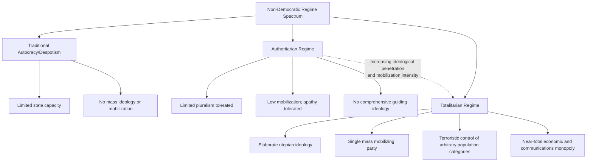

## Totalitarianism

### Definition and Scope

Totalitarianism refers to a distinctive form of non-democratic rule characterized by the state's pursuit of comprehensive, near-total control over political, social, economic, and even private/psychological life, guided by an official transformative ideology and enforced through a mobilizing single mass party and systematic terror. The concept was developed primarily to analyze mid-twentieth-century regimes — Stalinist Soviet Union and Nazi Germany foremost among them — that scholars argued represented a qualitatively distinct phenomenon from earlier forms of autocracy, monarchy, or conventional military dictatorship, rather than merely an intensified version of traditional authoritarian rule.

Within the "Authoritarianism and Hybrid Regimes" chapter, totalitarianism functions as an analytically important boundary case: it establishes the far pole of state penetration into society against which the more common, less totalizing forms of contemporary authoritarian rule (personalist, military, single-party, discussed elsewhere in this chapter) are typically contrasted.

### Hannah Arendt's Theoretical Foundation

Hannah Arendt's *The Origins of Totalitarianism* (1951) provided the foundational theoretical account, arguing that totalitarianism was a genuinely novel political phenomenon of the twentieth century rather than an extreme variant of historical tyranny, rooted in mass society, atomization, and the erosion of traditional social bonds and class structures.

Key Arendtian concepts:

- **Atomization**: totalitarian movements emerge from and further produce a mass of isolated, atomized individuals lacking stable social ties (class, community, religious institutions), rendering them susceptible to ideological mobilization and total identification with the movement
- **The totalitarian movement vs. the totalitarian state**: Arendt distinguished the dynamic, ever-mobilizing party movement (which requires constant expansion and enemy-identification to sustain itself) from static state bureaucracy, arguing totalitarian regimes deliberately maintain overlapping, redundant institutions (party organs duplicating state ministries) to prevent the movement's revolutionary energy from calcifying into a stable bureaucratic order
- **Ideology and terror as constitutive, not merely instrumental**: Arendt argued that terror under totalitarianism is not merely a tool for eliminating specific political opponents (as in ordinary authoritarian repression) but becomes an end in itself, targeting arbitrarily defined categories of people (based on ideologically defined "objective enemies" — class enemies, racial enemies) regardless of individual actions or loyalty, precisely to demonstrate and reinforce the ideology's claim to explain and control all of history and nature
- **The banality of evil**: Arendt's later, related concept (from *Eichmann in Jerusalem*, 1963) describing how totalitarian systems could produce atrocity through ordinary bureaucratic conformism and thoughtlessness rather than requiring exceptional individual malice from most participants

[Inference] Arendt's emphasis on atomization as a precondition for totalitarianism implies a structural, sociological account of totalitarian emergence (tied to modernity, industrialization, and the breakdown of traditional intermediate social structures) rather than an account centered primarily on individual leader pathology or purely coercive state capacity, distinguishing her approach from later, more institutionally focused Cold War political science treatments.

### Friedrich and Brzezinski's Six-Point Syndrome

Carl Friedrich and Zbigniew Brzezinski's *Totalitarian Dictatorship and Autocracy* (1956) offered the most influential operational, checklist-style definition used in comparative political science, identifying six interrelated characteristics ("syndrome") that jointly and distinctively characterize totalitarian systems:

1. **An elaborate guiding ideology**: a comprehensive doctrine covering all aspects of human existence, to which the population is expected to adhere, at least outwardly
2. **A single mass party**: typically led by a single leader ("dictator"), hierarchically organized, either superior to or intertwined with the government bureaucracy
3. **A system of terroristic police control**: utilizing both physical and psychic means, directed not only against demonstrable "enemies" of the regime but against arbitrarily selected classes of the population
4. **A technologically conditioned near-complete monopoly of control of all means of effective mass communication** (press, radio, film)
5. **A similarly technologically conditioned near-complete monopoly of control of all means of effective armed combat**
6. **Central control and direction of the entire economy** through bureaucratic coordination of formerly independent economic units

[Inference] The Friedrich-Brzezinski framework's emphasis on modern technology (mass communication, weapons monopolies) as a *precondition* for totalitarian control implies that the model is historically bounded to the twentieth century and later, since earlier despotisms lacked the technical infrastructure needed to achieve the comprehensive surveillance and mobilization capacity the framework specifies — a point later scholars have revisited given digital surveillance technology's implications for contemporary authoritarian control capacity.

### Totalitarianism vs. Authoritarianism: Linz's Refinement

Juan Linz's later comparative work (discussed more fully under "Classifying Authoritarian Regimes") sharpened the totalitarian/authoritarian boundary along several dimensions, treating them as differing not merely in degree but in underlying logic:

| Dimension | Totalitarian | Authoritarian |
| --- | --- | --- |
| Ideology | Elaborate, utopian, comprehensive | Absent or vaguely articulated "mentality" |
| Pluralism | None tolerated; total penetration of society | Limited pluralism tolerated in non-political spheres |
| Mobilization | High; sustained mass participation required | Low; apathy/private withdrawal tolerated |
| Leadership | Charismatic or ideologically-legitimated | Often bureaucratic, technocratic, or traditional |
| Scope of control | Comprehensive, including private/psychological life | Focused primarily on political behavior |

[Inference] This distinction implies that many regimes commonly (and sometimes loosely) labeled "totalitarian" in popular discourse are more accurately classified as personalist or single-party authoritarian regimes under the stricter comparative-politics definition, since they may exhibit high repression and a dominant party without necessarily achieving the "total" ideological penetration, sustained mass mobilization, and comprehensive economic-social control the totalitarian model specifies.

### Canonical Historical Cases

#### Stalinist Soviet Union

- Guiding ideology: Marxism-Leninism, later Stalinism, positing a comprehensive historical-materialist theory of societal transformation toward communism
- Single mass party: the Communist Party of the Soviet Union, structurally intertwined with state organs at every level
- Terror: the Great Purge (1936–38) and broader Gulag forced-labor camp system targeted not only political opponents but broad, often arbitrarily defined categories ("kulaks," "wreckers," various national minorities subjected to mass deportation)
- Economic control: comprehensive Five-Year Plans imposing centralized state direction over industrial output, agricultural collectivization, and resource allocation

#### Nazi Germany

- Guiding ideology: National Socialist racial ideology, positing a comprehensive biological-racial theory of history and society requiring territorial expansion ("Lebensraum") and racial purification
- Single mass party: the NSDAP, which progressively fused with and superseded traditional state bureaucratic structures (illustrating Arendt's point about deliberately overlapping party/state institutions)
- Terror: systematic persecution extending to the industrialized genocide of the Holocaust, targeting racially defined categories regardless of individual political behavior — frequently cited as the paradigmatic illustration of Arendt's "objective enemy" concept
- Economic control: extensive state direction of the economy toward rearmament and war preparation, though (unlike the Soviet case) private ownership was formally retained under heavy state coordination

#### Maoist China (Cultural Revolution Period)

- Guiding ideology: Maoist interpretation of Marxism-Leninism, emphasizing continuous revolution and class struggle
- Mass mobilization: the Cultural Revolution (1966–76) is frequently cited as an unusually intense episode of totalitarian-style mass mobilization, deploying Red Guard youth movements to attack "counter-revolutionary" elements including within the party apparatus itself
- [Inference] The Cultural Revolution period is sometimes treated as exhibiting more totalitarian characteristics (mass mobilization, ideological terror, assault even on the party's own institutional structure) than either earlier or later periods of Chinese Communist rule, illustrating that totalitarian intensity can vary significantly even within a single regime's lifespan rather than remaining a fixed, static property of the state.

### Illustrative Example: Applying the Six-Point Syndrome

**Example — Testing a Hypothetical Contemporary Case Against the Friedrich-Brzezinski Criteria:**

Consider evaluating whether a hypothetical intensely repressive but non-ideological personalist dictatorship should be classified as totalitarian:

1. Elaborate ideology? — If absent (rule justified merely by personal charisma or security necessity rather than comprehensive doctrine), this criterion fails
2. Single mass party requiring active participation? — If the ruling party exists mainly to distribute patronage rather than to mobilize sustained ideological enthusiasm, this criterion is only weakly satisfied
3. Terror against arbitrary population categories? — Even severe repression targeted specifically at political opponents (rather than arbitrarily defined "objective enemy" categories) does not fully satisfy this criterion as originally specified

   4–6. Communications, arms, and economic monopoly? — May be technically present but instrumentally deployed rather than embedded within a comprehensive ideological project

**Conclusion of the Example**: Such a regime would be more accurately classified as an intensely repressive personalist authoritarian regime rather than totalitarian under the strict Friedrich-Brzezinski/Linz framework, illustrating why contemporary comparative political science reserves "totalitarian" for a narrower historical set of cases than everyday political discourse often implies, and why terms like "authoritarian," "personalist dictatorship," or "totalitarian-leaning" are frequently preferred for contemporary highly repressive but non-ideologically-comprehensive regimes.

### Illustrative Diagram: The Six-Point Totalitarian Syndrome (svg_diagram)

<svg xmlns="http://www.w3.org/2000/svg" viewBox="0 0 700 460">
<rect x="0" y="0" width="700" height="460" fill="#ffffff" />
<text x="350" y="25" font-family="Arial, sans-serif" font-size="16" font-weight="bold" text-anchor="middle" fill="#1a1a1a">Friedrich-Brzezinski Six-Point Syndrome (svg_diagram)</text>
<circle cx="350" cy="250" r="70" fill="#6a1b1b" fill-opacity="0.15" stroke="#6a1b1b" stroke-width="2" />
<text x="350" y="245" font-family="Arial, sans-serif" font-size="13" font-weight="bold" text-anchor="middle" fill="#1a1a1a">Totalitarian</text>
<text x="350" y="262" font-family="Arial, sans-serif" font-size="13" font-weight="bold" text-anchor="middle" fill="#1a1a1a">Regime</text>
<rect x="270" y="50" width="160" height="45" rx="6" fill="#d9534f" fill-opacity="0.2" stroke="#d9534f" stroke-width="1.5" />
<text x="350" y="77" font-family="Arial, sans-serif" font-size="11" text-anchor="middle" fill="#1a1a1a">1. Elaborate Ideology</text>
<line x1="350" y1="95" x2="350" y2="180" stroke="#999" stroke-width="1.2" />
<rect x="500" y="120" width="170" height="45" rx="6" fill="#d9534f" fill-opacity="0.2" stroke="#d9534f" stroke-width="1.5" />
<text x="585" y="147" font-family="Arial, sans-serif" font-size="11" text-anchor="middle" fill="#1a1a1a">2. Single Mass Party</text>
<line x1="500" y1="145" x2="418" y2="220" stroke="#999" stroke-width="1.2" />
<rect x="500" y="300" width="170" height="45" rx="6" fill="#d9534f" fill-opacity="0.2" stroke="#d9534f" stroke-width="1.5" />
<text x="585" y="327" font-family="Arial, sans-serif" font-size="11" text-anchor="middle" fill="#1a1a1a">3. Terroristic Police</text>
<line x1="500" y1="322" x2="418" y2="280" stroke="#999" stroke-width="1.2" />
<rect x="270" y="365" width="160" height="45" rx="6" fill="#d9534f" fill-opacity="0.2" stroke="#d9534f" stroke-width="1.5" />
<text x="350" y="387" font-family="Arial, sans-serif" font-size="10" text-anchor="middle" fill="#1a1a1a">4. Media Monopoly</text>
<text x="350" y="400" font-family="Arial, sans-serif" font-size="10" text-anchor="middle" fill="#1a1a1a">(communications)</text>
<line x1="350" y1="365" x2="350" y2="320" stroke="#999" stroke-width="1.2" />
<rect x="30" y="300" width="170" height="45" rx="6" fill="#d9534f" fill-opacity="0.2" stroke="#d9534f" stroke-width="1.5" />
<text x="115" y="327" font-family="Arial, sans-serif" font-size="10" text-anchor="middle" fill="#1a1a1a">5. Weapons Monopoly</text>
<line x1="200" y1="322" x2="282" y2="280" stroke="#999" stroke-width="1.2" />
<rect x="30" y="120" width="170" height="45" rx="6" fill="#d9534f" fill-opacity="0.2" stroke="#d9534f" stroke-width="1.5" />
<text x="115" y="147" font-family="Arial, sans-serif" font-size="10" text-anchor="middle" fill="#1a1a1a">6. Central Economic Control</text>
<line x1="200" y1="145" x2="282" y2="220" stroke="#999" stroke-width="1.2" />

<text x="350" y="440" font-family="Arial, sans-serif" font-size="11" font-style="italic" text-anchor="middle" fill="#555">All six criteria jointly required to distinguish totalitarian from ordinary authoritarian rule</text>

</svg>

### Critiques and Contemporary Relevance

- **Cold War political function critique**: Some scholars (particularly from revisionist historiography) have argued that the totalitarian model was partly shaped by Cold War political imperatives — deliberately equating Nazi and Soviet regimes to support a unified anti-communist analytical framework — and may have overstated the degree of actual top-down control these regimes achieved relative to messier bureaucratic infighting, local variation, and limits on regime penetration that later archival research revealed
- **Empirical overreach concern**: Later historical research (particularly post-Soviet archive access from the 1990s onward) suggested that even paradigmatic totalitarian regimes achieved less complete societal penetration and central coordination in practice than the model's "total" framing implies, with significant local corruption, bureaucratic resistance, and informal negotiation occurring beneath the surface of official total control
- **Applicability to contemporary digital-authoritarian cases**: [Speculation] Some contemporary scholars debate whether advanced digital surveillance and social-credit-style monitoring systems (associated with some analyses of contemporary China) represent a potential technological revival of totalitarian-scale societal penetration unavailable to twentieth-century regimes, though this remains a contested and actively developing area of scholarship rather than a settled classification, and mainstream comparative politics typically continues to classify such cases as intensified single-party authoritarianism rather than totalitarianism under the strict Linz/Friedrich-Brzezinski criteria (given the absence of the sustained mass ideological mobilization and comprehensive terror against arbitrarily defined population categories that the classical model specifies).

### Related Topics

- Classifying Authoritarian Regimes
- Personalist, Military, and Single-Party Rule
- Hannah Arendt and the Origins of Totalitarianism
- Ideology and Political Mobilization Under Authoritarian Rule
- State Surveillance and Digital Authoritarianism
- Genocide and Mass Atrocity Under Authoritarian Regimes
- Cold War Comparative Politics and Regime Theory
- Authoritarian Durability and Coup-Proofing