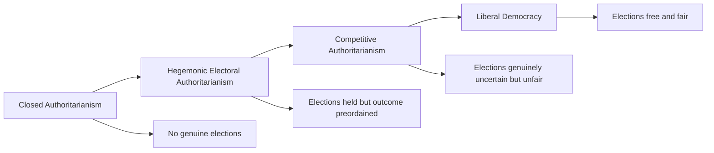

## Competitive Authoritarianism

### Definition and Scope

Competitive authoritarianism refers to a hybrid regime type in which formal democratic institutions — regular multiparty elections, a nominally independent judiciary, an at least partially free press — exist and function as the principal means of gaining power, but incumbents systematically abuse state resources, deny the opposition adequate media access, harass opposition candidates and their supporters, and manipulate electoral results to create an uneven playing field that decisively favors their continued rule. The term was developed and popularized by Steven Levitsky and Lucan Way, most fully in *Competitive Authoritarianism: Hybrid Regimes After the Cold War* (2010), building on their earlier joint article (2002).

The concept fills a critical gap in the post-Cold War comparative politics literature: it distinguishes regimes that hold genuinely contested (if unfair) elections from both fully closed authoritarian regimes (single-party or personalist regimes without meaningful electoral contestation) and consolidated liberal democracies, addressing the empirical proliferation of "hybrid" cases that the earlier binary democracy/authoritarianism framework struggled to classify.

### Distinguishing Competitive Authoritarianism from Adjacent Concepts

#### vs. Fully Closed Authoritarianism

Competitive authoritarian regimes hold elections that are genuinely contested — opposition parties can organize, campaign, and sometimes win legislative seats or even, occasionally, executive office — distinguishing them from closed regimes where elections either do not occur or are entirely non-competitive (single-candidate plebiscites, banned opposition parties).

#### vs. Liberal Democracy

The defining distinction is the systematic and persistent nature of the uneven playing field: incumbent abuse of state resources, media bias, and harassment of opponents are not occasional violations of democratic norms (which occur even in consolidated democracies) but rather a structural, ongoing feature of how the regime maintains power, such that opposition victory, while possible, remains substantially more difficult than under fair competitive conditions.

#### vs. Electoral Authoritarianism (Andreas Schedler's Related Concept)

Andreas Schedler's overlapping concept of "electoral authoritarianism" describes a broader category of regimes that hold elections without meeting minimum democratic standards, encompassing both competitive authoritarian cases (where elections are meaningfully uncertain despite unfairness) and more tightly controlled "hegemonic" electoral authoritarian cases (where the ruling party's victory is essentially preordained despite superficial multiparty competition). [Inference] Levitsky and Way's competitive authoritarianism can be understood as occupying the more genuinely uncertain end of Schedler's broader electoral authoritarian spectrum, since the defining feature of competitive authoritarianism specifically is that incumbents *could* lose despite their structural advantages, whereas hegemonic electoral authoritarian regimes typically face negligible genuine uncertainty about the outcome.

### Four Arenas of Democratic Contestation

Levitsky and Way's framework identifies four key institutional arenas in which the incumbent's uneven advantage manifests, arguing that competitive authoritarianism can be diagnosed by examining incumbent abuse across these domains:

1. **The electoral arena**: manipulation of the electoral process itself — biased electoral commissions, gerrymandering, voter list manipulation, and occasionally outright fraud, though (unlike closed regimes) not to the point of eliminating genuine uncertainty entirely
2. **The legislative arena**: incumbent efforts to marginalize or bypass the legislature's oversight function, including through supermajorities used to rewrite rules unilaterally, or through co-optation/intimidation of individual legislators
3. **The judicial arena**: packing, intimidating, or otherwise compromising judicial independence to prevent courts from serving as an effective check on executive overreach or as a venue for opposition redress
4. **The media arena**: using regulatory power, selective state advertising, tax audits, or ownership pressure to suppress critical media coverage while amplifying pro-government messaging, without necessarily banning independent media outright

[Inference] A regime need not maximally abuse all four arenas simultaneously to qualify as competitive authoritarian; the framework implies a matter of degree and pattern across arenas rather than a strict checklist requiring uniform abuse across every domain, since real-world cases show considerable variation in which specific arenas incumbents choose to prioritize based on local institutional vulnerabilities and international constraints.

### Linkage and Leverage: Explaining Regime Trajectory

A central explanatory contribution of Levitsky and Way's framework concerns why some competitive authoritarian regimes democratize over time while others stabilize as durable hybrid regimes or revert toward closed authoritarianism. They propose two key international variables:

#### Leverage

A target government's vulnerability to external democratizing pressure — a function of the country's economic and military dependence on Western powers, its relative size and power, and the cohesion of its state and coercive apparatus. High-leverage states are more susceptible to external pressure (sanctions, conditionality, diplomatic isolation) in response to electoral fraud or repression.

#### Linkage

The density of a country's economic, political, social, and organizational ties to the West — trade and investment flows, migration and diaspora networks, participation in Western-led international organizations, and cross-border civil society and elite ties. High linkage is theorized to matter more than leverage alone because it creates durable, self-sustaining domestic constituencies (business elites dependent on Western trade, diaspora populations, internationally networked civil society organizations) that continuously transmit and amplify external democratic norms and pressure, independent of any single instance of direct Western diplomatic intervention.

#### The Interaction Effect

| Linkage | Leverage | Predicted Trajectory |
| --- | --- | --- |
| High | High or Low | Democratization more likely, sustained by high linkage's durable domestic transmission mechanisms |
| Low | High | Unstable — external pressure can force liberalization episodes, but lacking durable domestic linkage, gains are prone to reversal once external pressure eases |
| Low | Low | Regime stability (durable competitive authoritarianism or reversion to closed authoritarianism) most likely, since neither external pressure nor domestic linkage constrains incumbent abuse |

[Inference] The linkage-leverage framework implies that geographic proximity to established democracies, rather than the sheer application of diplomatic or economic pressure alone, is a stronger predictor of eventual democratization, which is consistent with the framework's application to explain, for instance, the more consistent democratizing trajectory of post-communist states with strong EU accession prospects (high linkage) compared with post-Soviet states in Central Asia with weaker Western ties (low linkage) despite both facing comparable Western democracy-promotion rhetoric.

### Domestic Sources of Regime Stability

Beyond international factors, Levitsky and Way and subsequent scholarship identify domestic organizational variables shaping competitive authoritarian regime durability:

- **Ruling party strength and cohesion**: regimes built around a well-organized, ideologically or historically rooted ruling party (with deep grassroots patronage networks and a shared revolutionary or nationalist legacy) tend to prove more durable than those relying on a loosely organized "electoral vehicle" built around a single personality
- **State coercive capacity**: the cohesion and loyalty of the security apparatus determines the regime's capacity to repress opposition challenges or manage contested electoral outcomes without triggering the kind of security-force defection associated with successful opposition mobilization (see "Civil Resistance and Nonviolent Transitions")
- **Organizational scope**: regimes with organizational infrastructure extending deeply into society (through party branches, patronage networks, or corporatist labor/business linkages) are better positioned to mobilize electoral support and co-opt potential opposition figures than regimes lacking such societal penetration

### Illustrative Diagram: Levitsky-Way Framework Overview (svg_diagram)

<svg xmlns="http://www.w3.org/2000/svg" viewBox="0 0 720 420">
<rect x="0" y="0" width="720" height="420" fill="#ffffff" />
<text x="360" y="25" font-family="Arial, sans-serif" font-size="16" font-weight="bold" text-anchor="middle" fill="#1a1a1a">Linkage-Leverage Framework (svg_diagram)</text>
<line x1="100" y1="360" x2="640" y2="360" stroke="#333" stroke-width="1.5" />
<line x1="100" y1="360" x2="100" y2="60" stroke="#333" stroke-width="1.5" />
<text x="370" y="390" font-family="Arial, sans-serif" font-size="12" text-anchor="middle" fill="#333">Linkage to the West →</text>
<text x="65" y="210" font-family="Arial, sans-serif" font-size="12" text-anchor="middle" fill="#333" transform="rotate(-90 65 210)">Leverage (Vulnerability) →</text>
<rect x="360" y="70" width="260" height="120" fill="#5cb85c" fill-opacity="0.2" stroke="#5cb85c" stroke-width="1.5" />
<text x="490" y="120" font-family="Arial, sans-serif" font-size="12" font-weight="bold" text-anchor="middle" fill="#2d6b2d">High Linkage / High Leverage</text>
<text x="490" y="140" font-family="Arial, sans-serif" font-size="10" text-anchor="middle" fill="#333">Democratization most likely</text>
<text x="490" y="155" font-family="Arial, sans-serif" font-size="10" text-anchor="middle" fill="#333">(e.g., Central/Eastern Europe)</text>
<rect x="360" y="200" width="260" height="150" fill="#5cb85c" fill-opacity="0.12" stroke="#5cb85c" stroke-width="1.5" />
<text x="490" y="240" font-family="Arial, sans-serif" font-size="12" font-weight="bold" text-anchor="middle" fill="#2d6b2d">High Linkage / Low Leverage</text>
<text x="490" y="260" font-family="Arial, sans-serif" font-size="10" text-anchor="middle" fill="#333">Democratization likely via</text>
<text x="490" y="275" font-family="Arial, sans-serif" font-size="10" text-anchor="middle" fill="#333">durable societal linkage</text>
<rect x="100" y="70" width="260" height="120" fill="#f0ad4e" fill-opacity="0.2" stroke="#f0ad4e" stroke-width="1.5" />
<text x="230" y="120" font-family="Arial, sans-serif" font-size="12" font-weight="bold" text-anchor="middle" fill="#a67016">Low Linkage / High Leverage</text>
<text x="230" y="140" font-family="Arial, sans-serif" font-size="10" text-anchor="middle" fill="#333">Unstable, reversible</text>
<text x="230" y="155" font-family="Arial, sans-serif" font-size="10" text-anchor="middle" fill="#333">liberalization episodes</text>
<rect x="100" y="200" width="260" height="150" fill="#d9534f" fill-opacity="0.2" stroke="#d9534f" stroke-width="1.5" />
<text x="230" y="250" font-family="Arial, sans-serif" font-size="12" font-weight="bold" text-anchor="middle" fill="#a83232">Low Linkage / Low Leverage</text>
<text x="230" y="270" font-family="Arial, sans-serif" font-size="10" text-anchor="middle" fill="#333">Durable competitive</text>
<text x="230" y="285" font-family="Arial, sans-serif" font-size="10" text-anchor="middle" fill="#333">authoritarianism</text>
<text x="230" y="300" font-family="Arial, sans-serif" font-size="10" text-anchor="middle" fill="#333">(e.g., parts of Central Asia)</text>
</svg>

### Illustrative Example: Comparative Cases

**Example:**

- **Russia under Putin**: Frequently cited as a paradigmatic case of durable competitive authoritarianism combined with low linkage and, over time, declining leverage — elections continue to occur with nominal opposition participation, but systematic media control (state dominance of major television networks), legislative supermajorities enabling constitutional changes (including 2020 amendments resetting presidential term counts), and judicial deference to the executive collectively constrain genuine electoral uncertainty
- **Ukraine (pre-2014 and evolving)**: Illustrates the linkage-leverage interaction's predictive value — Ukraine's stronger societal and economic linkage to the West (compared with Russia or Central Asian cases) is cited by Levitsky and Way as contributing to greater electoral volatility and eventual alternation in power (including the 2004 Orange Revolution and 2014 Euromaidan events), consistent with the theory's prediction that higher linkage constrains incumbent consolidation even where leverage alone might be limited
- **Malaysia under the Barisan Nasional coalition (pre-2018)**: Illustrates a long-durable competitive authoritarian equilibrium — sustained single-coalition dominance for over six decades through gerrymandering, media control, and selective use of internal security legislation against opposition figures, while nonetheless maintaining genuinely contested multiparty elections, until an opposition coalition achieved a historic electoral upset in 2018, illustrating that even long-entrenched competitive authoritarian regimes retain genuine, if constrained, electoral uncertainty distinguishing them from closed authoritarian systems

### Critiques and Debates

- **Boundary vagueness**: Critics note that the distinction between "systematic and persistent" incumbent abuse (qualifying as competitive authoritarian) and the more routine democratic imperfections present even in consolidated democracies (gerrymandering, media bias, campaign finance advantages) is a matter of degree rather than a bright line, creating classification disputes for borderline cases
- **Static vs. dynamic classification tension**: Because competitive authoritarian regimes can democratize, stabilize, or revert toward closed authoritarianism over time (as illustrated by the backsliding literature's overlapping concern with reverse movement from consolidated democracy toward competitive authoritarianism), some scholars argue the category is better treated as a point on a continuous trajectory rather than a stable equilibrium type
- **Overlap with the backsliding literature**: [Inference] Competitive authoritarianism and democratic backsliding describe closely related phenomena from different directions — backsliding scholarship (Bermeo, Levitsky and Ziblatt) traces the process by which a democracy degrades toward this hybrid condition, while the competitive authoritarianism literature more often analyzes such regimes as a starting or steady-state condition following a non-democratic transition — and some scholars argue future research should more explicitly integrate the two literatures' causal mechanisms rather than treating them as fully separate research programs.
- [Unverified] Whether the linkage-leverage framework's explanatory power, largely developed from post-Cold War cases concentrated in Eastern Europe, Latin America, Africa, and the former Soviet Union, generalizes with equal force to regions with different historical relationships to Western powers (parts of Asia and the Middle East) remains a subject of ongoing comparative testing rather than settled consensus.

### Related Topics

- Classifying Authoritarian Regimes
- Democratic Backsliding and Erosion
- Electoral Authoritarianism (Schedler)
- Hybrid Regimes and Delegative Democracy (O'Donnell)
- Linkage and Leverage in International Democracy Promotion
- Personalist, Military, and Single-Party Rule
- Media Capture and Information Control
- Party Institutionalization and Regime Durability