## Authoritarian Resilience and Durability

### Definition and Scope

Authoritarian resilience and durability refers to the comparative-politics research program explaining why some authoritarian regimes survive for decades while others collapse quickly, focusing on the institutional, economic, coercive, and international mechanisms that enable non-democratic rulers to manage threats from both regime insiders (elite defection, coup attempts) and outsiders (mass uprising, opposition mobilization). This subfield synthesizes and extends themes introduced under "Classifying Authoritarian Regimes" and "Personalist, Military, and Single-Party Rule," shifting focus from typological classification to the specific causal mechanisms — institutional, distributive, coercive, and international — that account for variation in regime survival time.

The field gained particular analytical urgency following the apparent stalling of the "third wave" of democratization from the 1990s onward and the persistence of durable authoritarian regimes (China, the Gulf monarchies, several post-Soviet states, and Middle Eastern regimes that survived the 2011 Arab uprisings) that resisted democratization pressures that transitions and consolidation scholars had expected to prove more universally decisive.

### Svolik's Framework: The Twin Problems of Authoritarian Rule

Milan Svolik's *The Politics of Authoritarian Rule* (2012) provides a foundational game-theoretic account structuring much subsequent resilience research around two analytically distinct survival threats:

#### The Problem of Authoritarian Control

Managing the risk of mass opposition or popular uprising from outside the ruling coalition — addressed primarily through repression, co-optation of societal groups, and selective distribution of economic benefits to maintain sufficient mass quiescence or active support.

#### The Problem of Authoritarian Power-Sharing

Managing the risk of displacement by regime insiders — historically the more frequent pathway to authoritarian leader removal — addressed through institutional mechanisms (parties, legislatures, juntas) that credibly commit the ruler to sharing power and spoils with the elite coalition, reducing insiders' incentive to defect or stage a coup.

[Inference] Svolik's finding that insider threats have historically been more consequential than mass uprisings for authoritarian leader removal implies that resilience strategies focused primarily on managing elite power-sharing (institutionalized parties, credible commitment mechanisms) may be more central to long-run regime survival than repression capacity alone, which is a key reason the durability literature places heavy emphasis on ruling-party institutionalization as a resilience mechanism.

### Institutional Mechanisms of Resilience

#### Ruling Party Institutionalization

As established under the single-party regime type, a well-institutionalized ruling party serves multiple resilience functions simultaneously:

- **Credible power-sharing commitment**: formal party structures (politburos, central committees, congresses) constrain the leader's ability to arbitrarily exclude elite factions from power and spoils, reducing insiders' incentive to preemptively defect or coup
- **Elite co-optation and career incentives**: a predictable internal career ladder gives ambitious individuals a stake in the party's continued survival, converting potential rivals into invested stakeholders
- **Succession management**: institutionalized procedures for leadership transition (term limits, designated succession processes) reduce the destabilizing uncertainty that often accompanies personalist succession crises

#### Legislatures and Courts Under Authoritarian Rule

A substantial body of research (Jennifer Gandhi's *Political Institutions Under Dictatorship*, 2008, is a key contribution) demonstrates that nominally democratic institutions — legislatures, courts, even multiparty elections — serve important resilience functions even when they do not constrain the ruler in the manner theorized for genuine democracies:

- **Legislatures as co-optation venues**: authoritarian legislatures provide seats and resources that can be distributed to potential opposition figures or societal elites, converting them into stakeholders with a material interest in the regime's survival rather than leaving them as excluded, potentially destabilizing outsiders
- **Elections as information-gathering mechanisms**: even tightly controlled or unfair elections can provide the ruling elite with useful information about local-level opposition strength, popular grievances, or the loyalty of local officials, information that is otherwise difficult for authoritarian rulers to obtain given citizens' incentive to conceal genuine preferences from a repressive state
- **Courts as limited-commitment devices**: authoritarian courts, while not fully independent, can provide the regime with a mechanism for enforcing commercial contracts and property rights among elite factions or foreign investors, supporting economic performance-based legitimacy without extending genuine political constraint to the ruler

```mermaid
flowchart TD
    A["Authoritarian Resilience Mechanisms"] --> B["Institutional"]
    A --> C["Economic/Distributive"]
    A --> D["Coercive"]
    A --> E["International"]
    A --> F["Ideational/Legitimation"]

    B --> B1["Ruling party institutionalization"]
    B --> B2["Co-optive legislatures and courts"]
    B --> B3["Managed elections as information tools"]

    C --> C1["Resource rents (rentier state)"]
    C --> C2["Patronage distribution networks"]
    C --> C3["Performance-based legitimacy"]

    D --> D1["Coup-proofing via counterbalancing"]
    D --> D2["Domestic surveillance capacity"]
    D --> D3["Digital repression technologies"]

    E --> E1["Authoritarian diffusion and mutual support"]
    E --> E2["Low linkage to democratizing pressure"]

    F --> F1["Nationalist or religious legitimation"]
    F --> F2["Performance/technocratic legitimacy claims"]
```

### Economic and Distributive Mechanisms

#### Rentier State Effects

As introduced under "Theories of Democratic Transition," resource-rent-dependent states (oil, gas, mineral exporters) exhibit distinctive resilience advantages:

- Low reliance on direct taxation of citizens reduces the "no taxation without representation" pressure historically linked to demands for political accountability
- Rent revenue funds extensive patronage networks and generous public spending programs, potentially substituting material benefits for political voice ("the spending effect")
- Resource wealth can directly fund coercive and surveillance capacity independent of a broader productive tax base

[Inference] As noted under transition theory, the magnitude and even direction of the oil-authoritarianism-resilience relationship remains genuinely contested empirically (per Haber and Menaldo's critique), so rentier effects should be treated as one plausible resilience-enhancing mechanism among several rather than a definitively established universal law.

#### Performance Legitimacy

Some durable authoritarian regimes, most prominently contemporary China, are argued to sustain popular acquiescence substantially through sustained economic growth and rising living standards, functioning as an alternative, non-electoral legitimation strategy — sometimes termed "performance legitimacy" or "output legitimacy" in contrast to the "input legitimacy" derived from democratic electoral consent. [Unverified] The durability and resilience of performance-based legitimacy under conditions of economic slowdown remains a genuinely open empirical and theoretical question, since the strategy's sustainability is contingent on continued economic performance that may not be indefinitely guaranteed, and scholars disagree on how such regimes would respond politically to a sustained downturn.

### Coercive and Technological Mechanisms

#### Coup-Proofing Strategies

As detailed under personalist rule mechanisms, coup-proofing techniques — creating multiple overlapping and mutually monitoring security services, promoting based on loyalty (often ethnic or kinship ties) rather than competence, and physically separating military units from capital cities — enhance regime survival against insider threats at the often-noted cost of reduced military operational effectiveness.

#### Digital Authoritarianism and Surveillance Technology

Contemporary resilience scholarship increasingly emphasizes the role of digital surveillance, internet censorship infrastructure, and social media monitoring as a technologically enabled extension of classical repressive capacity:

- **Preventive/predictive surveillance**: use of digital monitoring (communications interception, facial recognition, financial transaction tracking) to identify and preempt dissent before it can organize at scale, rather than relying solely on reactive repression after unrest emerges
- **Censorship and information control**: sophisticated internet filtering and platform regulation (exemplified by China's "Great Firewall" infrastructure) that limits information flow without necessarily requiring the total, high-cost communications monopoly the classical totalitarian model specified
- **Automated propaganda and information manipulation**: coordinated inauthentic online activity and algorithmic content promotion used to shape public discourse and drown out dissenting narratives

[Speculation] Whether digital authoritarian tools represent a qualitatively distinct and more durable resilience mechanism than earlier surveillance technologies, or merely a more efficient and lower-cost version of long-standing repressive functions, remains actively debated in the emerging digital authoritarianism literature, given the relatively short time horizon over which these tools have been deployed at scale and the resulting difficulty of assessing their long-run causal effect on regime survival independent of other contemporaneous resilience factors.

### International and Diffusion Mechanisms

#### Authoritarian Learning and Mutual Support

Recent scholarship (building on and complementing the linkage-leverage framework discussed under competitive authoritarianism) identifies horizontal diffusion among authoritarian regimes as a distinct resilience-enhancing mechanism:

- **Tactical learning**: authoritarian regimes observe and adapt one another's successful repressive and legitimation techniques (electoral manipulation methods, NGO restriction laws, digital censorship approaches)
- **Material and diplomatic mutual support**: regional authoritarian powers (Russia, China, Gulf states in various contexts) provide financial assistance, diplomatic cover at international bodies, and occasionally direct security assistance to allied authoritarian regimes facing domestic unrest or external pressure, partially insulating them from the Western-linkage-dependent pressures central to the Levitsky-Way framework
- **Counter-democracy-promotion norms**: coordinated diplomatic and legal pushback against Western democracy-promotion activity, including the spread of "foreign agent" and NGO-restriction legislation across multiple authoritarian jurisdictions

### Illustrative Example: Comparative Resilience Cases

**Example:**

- **China under the CCP**: Frequently cited as combining multiple resilience mechanisms simultaneously — a highly institutionalized single-party structure (though undergoing some personalization under Xi Jinping, as discussed under regime classification), sustained performance legitimacy through decades of economic growth, extensive and technologically sophisticated digital surveillance and censorship infrastructure, and (particularly since the 2010s) growing diplomatic and economic support for allied authoritarian regimes abroad — illustrating a case drawing on institutional, economic, coercive, and international resilience mechanisms in combination
- **Gulf monarchies (e.g., Saudi Arabia, UAE)**: Illustrate a distinct resilience profile emphasizing rentier-state distributive mechanisms (extensive public sector employment and subsidies funded by oil rents) combined with traditional/religious legitimation and, notably, largely surviving the 2011 Arab uprisings' wave of mass mobilization that toppled several personalist regimes elsewhere in the region — a pattern some scholars attribute partly to the rentier state's capacity to fund immediate, visible concessionary spending in response to unrest
- **Post-Soviet Central Asian states (e.g., Uzbekistan, Tajikistan)**: Illustrate resilience combining low Western linkage (per the Levitsky-Way framework), personalist and hybrid personalist-single-party institutional structures, and regional authoritarian mutual support networks (particularly with Russia and increasingly China) that reduce exposure to Western democratization pressure

### Illustrative Diagram: Cumulative Resilience Model (svg_diagram)

<svg xmlns="http://www.w3.org/2000/svg" viewBox="0 0 700 400">
<rect x="0" y="0" width="700" height="400" fill="#ffffff" />
<text x="350" y="25" font-family="Arial, sans-serif" font-size="16" font-weight="bold" text-anchor="middle" fill="#1a1a1a">Cumulative Resilience Stack (svg_diagram)</text>
<rect x="150" y="320" width="400" height="50" fill="#3b5998" fill-opacity="0.25" stroke="#3b5998" stroke-width="1.5" />
<text x="350" y="350" font-family="Arial, sans-serif" font-size="12" font-weight="bold" text-anchor="middle" fill="#1a1a1a">Institutional Power-Sharing (party, legislature)</text>
<rect x="150" y="265" width="400" height="50" fill="#5cb85c" fill-opacity="0.25" stroke="#5cb85c" stroke-width="1.5" />
<text x="350" y="295" font-family="Arial, sans-serif" font-size="12" font-weight="bold" text-anchor="middle" fill="#1a1a1a">Economic/Distributive Legitimation</text>
<rect x="150" y="210" width="400" height="50" fill="#f0ad4e" fill-opacity="0.25" stroke="#f0ad4e" stroke-width="1.5" />
<text x="350" y="240" font-family="Arial, sans-serif" font-size="12" font-weight="bold" text-anchor="middle" fill="#1a1a1a">Coercive/Surveillance Capacity</text>
<rect x="150" y="155" width="400" height="50" fill="#d9534f" fill-opacity="0.25" stroke="#d9534f" stroke-width="1.5" />
<text x="350" y="185" font-family="Arial, sans-serif" font-size="12" font-weight="bold" text-anchor="middle" fill="#1a1a1a">International Insulation/Support</text>
<rect x="150" y="100" width="400" height="50" fill="#8a6d3b" fill-opacity="0.25" stroke="#8a6d3b" stroke-width="1.5" />
<text x="350" y="130" font-family="Arial, sans-serif" font-size="12" font-weight="bold" text-anchor="middle" fill="#1a1a1a">Ideational/Performance Legitimacy</text>

<text x="350" y="80" font-family="Arial, sans-serif" font-size="11" font-style="italic" text-anchor="middle" fill="#555">Regimes combining multiple layers exhibit greater empirical durability</text>

<line x1="140" y1="100" x2="140" y2="370" stroke="#333" stroke-width="1.5" />

<text x="110" y="240" font-family="Arial, sans-serif" font-size="10" text-anchor="middle" fill="#333" transform="rotate(-90 110 240)">Cumulative resilience</text>

</svg>

### Critiques and Limitations

- **Overdetermination risk**: Because resilience scholarship has identified a large and expanding list of contributing mechanisms (institutional, economic, coercive, international, ideational), critics note a risk of post-hoc overdetermination — nearly any surviving regime can be retrospectively explained by selectively emphasizing whichever mechanisms it happens to exhibit, making genuinely falsifiable, ex ante predictions about which currently-existing regimes will prove durable more difficult to generate
- **Survivorship bias in case selection**: Much resilience research focuses on explaining why currently durable regimes have survived, which risks underweighting cases where similar mechanisms (rentier wealth, coup-proofing, party institutions) were present but the regime nonetheless collapsed, potentially overstating the causal power of the identified mechanisms
- **Tension with the backsliding/hybrid regime literature**: [Inference] Resilience research's focus on explaining authoritarian regime survival exists in some analytical tension with the backsliding literature's focus on democratic regimes moving toward authoritarian-like conditions, and integrating the two research programs' causal mechanisms into a unified account of regime dynamics across the full democratic-authoritarian spectrum remains an active area of theoretical development rather than a fully resolved synthesis.
- [Unverified] The relative causal weight of digital authoritarian tools versus older, more established resilience mechanisms (party institutionalization, rentier distribution) in explaining contemporary regime survival has not been definitively established given the technology's recency, and claims about digital surveillance's transformative resilience effect should be treated with appropriate epistemic caution pending further longitudinal research.

### Related Topics

- Classifying Authoritarian Regimes
- Personalist, Military, and Single-Party Rule
- Competitive Authoritarianism
- Svolik's Theory of Authoritarian Power-Sharing
- Rentier State Theory and the Resource Curse
- Digital Authoritarianism and Surveillance Technology
- Authoritarian Diffusion and International Support Networks
- Democratic Backsliding and Erosion