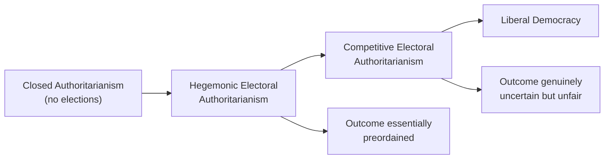

## Electoral Authoritarianism

### Definition and Scope

Electoral authoritarianism refers to a broad category of non-democratic regimes that hold regular multiparty elections for principal offices while failing to meet the minimum substantive standards required to qualify as democratic — including genuine uncertainty of outcome, meaningful ballot access for the opposition, and freedom from systematic coercion or fraud. The concept was most systematically developed by Andreas Schedler, particularly in *Electoral Authoritarianism: The Dynamics of Unfree Competition* (2006) and his subsequent work on "the menu of manipulation," and functions as an umbrella category encompassing both genuinely uncertain hybrid cases (closely overlapping with Levitsky and Way's "competitive authoritarianism") and more tightly controlled "hegemonic" cases where electoral outcomes are essentially preordained.

Within this chapter, electoral authoritarianism provides the broadest conceptual umbrella for regimes that combine formal electoral institutions with authoritarian substance, situating competitive authoritarianism (covered separately) as one identifiable subtype along a wider spectrum of electorally-legitimated non-democratic rule.

### Schedler's Continuum: Hegemonic vs. Competitive Electoral Authoritarianism

Schedler's framework distinguishes two poles along the electoral authoritarian spectrum, differentiated primarily by the degree of genuine uncertainty regarding electoral outcomes:

#### Hegemonic Electoral Authoritarianism

- The ruling party's victory is essentially guaranteed in advance through such an overwhelming combination of manipulation tools that genuine uncertainty is effectively eliminated
- Opposition parties may be permitted to exist and even contest seats, but structural barriers (media exclusion, resource asymmetry, gerrymandering, harassment) are severe enough that opposition victory is not a realistic possibility under normal circumstances
- Elections primarily serve legitimation, information-gathering, and elite co-optation functions (as discussed under authoritarian resilience) rather than genuine channels of potential power transfer
- Examples: Mexico under the PRI for much of the twentieth century (prior to its gradual liberalization), Singapore under the People's Action Party, many Central Asian post-Soviet states

#### Competitive Electoral Authoritarianism

- Genuine uncertainty persists regarding electoral outcomes, despite the incumbent's systematic structural advantages, such that opposition victory — while difficult — remains a realistic possibility
- This subtype corresponds closely to Levitsky and Way's "competitive authoritarianism" concept (covered in a dedicated item in this chapter), and the two terms are often used interchangeably in the literature, though Schedler's typology situates it as one point along a broader electoral authoritarian continuum rather than as a freestanding category
- Examples: Russia (particularly in earlier Putin-era years before further consolidation), Malaysia under Barisan Nasional (pre-2018), Zimbabwe under ZANU-PF (varying over time)

[Inference] Because the hegemonic/competitive distinction is fundamentally about the degree of genuine electoral uncertainty rather than a sharp categorical boundary, individual regimes can migrate along this continuum over time as manipulation intensity increases or decreases, making static classification of borderline cases inherently provisional rather than fixed.

### The Menu of Manipulation

Schedler's central analytical contribution is the "menu of manipulation" — a systematic inventory of the distinct tools authoritarian incumbents deploy to shape electoral processes and outcomes without eliminating the electoral form itself. The menu is typically organized around seven sequential decision points in the electoral process, at each of which the incumbent can intervene to reduce genuine competitiveness:

1. **Scope of power**: restricting which offices are actually subject to competitive election (e.g., holding elections for a legislature with limited real authority while an unelected executive, monarch, or military council retains substantive power)
2. **Formation of alternatives**: restricting opposition party formation and registration through onerous legal requirements, selective enforcement, or outright bans on specific parties
3. **Voter access to alternatives**: limiting citizens' ability to learn about or access opposition alternatives, primarily through media control and restrictions on opposition campaigning
4. **Voter access to the ballot**: manipulating voter registration rolls, imposing discriminatory eligibility requirements, or creating administrative obstacles to voting for specific populations
5. **Voter choice**: employing vote-buying, intimidation, or coercion to directly influence how citizens cast their ballots once at the polling station
6. **Aggregation of votes into seats**: manipulating the translation of votes into seats through gerrymandering, malapportionment, or biased electoral formulas that systematically favor the incumbent regardless of the raw vote share
7. **Consequences of the vote**: annulling, overturning, or otherwise nullifying inconvenient results after the fact, or through post-election co-optation/coercion of elected opposition figures

[Inference] The sequential structure of the menu implies that incumbents can achieve equivalent levels of effective control through very different combinations of tools — heavy manipulation early in the process (e.g., banning key opposition parties from forming) can substitute for manipulation at later stages (e.g., outright fraud), meaning that the *presence* of clean vote-counting on election day does not by itself indicate a fair election if manipulation was concentrated earlier in the sequence.

### Comparative Table of Manipulation Mechanisms

| Sequence Point | Manipulation Tool | Illustrative Mechanism |
| --- | --- | --- |
| Scope of power | Reserved domains | Unelected upper chamber, monarchic veto |
| Formation of alternatives | Party registration barriers | Excessive signature/membership thresholds |
| Voter access to alternatives | Media exclusion | State broadcast monopoly, campaign blackouts |
| Voter access to ballot | Registration manipulation | Selective purging of opposition-leaning voter rolls |
| Voter choice | Coercion/clientelism | Vote-buying, employer intimidation |
| Vote aggregation | Malapportionment | District boundaries favoring rural incumbent strongholds |
| Consequences of the vote | Post-election annulment | Judicial invalidation of opposition wins on technical grounds |

### Functions of Elections Under Authoritarian Rule

Building on themes introduced under authoritarian resilience, the electoral authoritarianism literature (particularly Jennifer Gandhi and Ellen Lust-Okar's contributions) identifies several distinct functions elections serve for authoritarian incumbents beyond simple legitimation:

- **Information-gathering**: elections, even manipulated ones, reveal useful information to the regime about the geographic and social distribution of dissent, local official competence, and popular grievance intensity, information that citizens have strong incentive to conceal from a repressive state through other channels
- **Elite co-optation and patronage distribution**: legislative seats and local offices won through controlled elections provide a currency for rewarding loyal supporters and co-opting potentially threatening local elites, converting them into invested stakeholders
- **International legitimation**: holding elections, even flawed ones, can help regimes claim a degree of international legitimacy and potentially reduce diplomatic isolation or sanctions pressure, particularly with less scrutinizing external actors
- **Managing succession and intra-elite competition**: internal party or factional elections can provide a controlled arena for managing competition among regime elites without escalating into violent power struggles

### Illustrative Example: Applying the Menu of Manipulation

**Example — Diagnosing Manipulation Strategy Across Two Hypothetical Regimes:**

Consider two electoral authoritarian regimes achieving similarly non-competitive outcomes through different points on the menu:

- **Regime A** concentrates manipulation early: it bans the largest opposition party outright (formation of alternatives) and maintains a state broadcast monopoly with no opposition access (voter access to alternatives), but permits relatively clean vote-counting and does not engage in overt ballot-stuffing on election day
- **Regime B** permits genuinely open party formation and reasonably balanced media access, but relies heavily on severe gerrymandering (vote aggregation) and, when opposition wins unexpectedly in key districts, judicial annulment of results on procedural technicalities (consequences of the vote)

**Analytical implication**: Both regimes achieve non-competitive practical outcomes despite superficially different "election day" appearances — Regime A might appear more clearly authoritarian to a casual observer focused on party bans and media control, while Regime B might superficially appear more competitive (multiple genuine parties, real campaigning) despite ultimately producing similarly non-competitive results through later-stage manipulation. This illustrates why election-day observation alone is analytically insufficient and why Schedler's full-sequence menu framework is necessary to accurately classify regime type.

### Illustrative Diagram: The Seven-Point Menu of Manipulation (svg_diagram)

<svg xmlns="http://www.w3.org/2000/svg" viewBox="0 0 740 340">
<rect x="0" y="0" width="740" height="340" fill="#ffffff" />
<text x="370" y="25" font-family="Arial, sans-serif" font-size="16" font-weight="bold" text-anchor="middle" fill="#1a1a1a">Schedler's Menu of Manipulation (svg_diagram)</text>
<line x1="40" y1="180" x2="700" y2="180" stroke="#999" stroke-width="2" />
<circle cx="80" cy="180" r="8" fill="#3b5998" />
<text x="80" y="150" font-family="Arial, sans-serif" font-size="9" text-anchor="middle" fill="#1a1a1a">1. Scope of</text>
<text x="80" y="163" font-family="Arial, sans-serif" font-size="9" text-anchor="middle" fill="#1a1a1a">Power</text>
<text x="80" y="210" font-family="Arial, sans-serif" font-size="8" text-anchor="middle" fill="#555">Reserved</text>
<text x="80" y="222" font-family="Arial, sans-serif" font-size="8" text-anchor="middle" fill="#555">domains</text>
<circle cx="185" cy="180" r="8" fill="#5cb85c" />
<text x="185" y="150" font-family="Arial, sans-serif" font-size="9" text-anchor="middle" fill="#1a1a1a">2. Formation of</text>
<text x="185" y="163" font-family="Arial, sans-serif" font-size="9" text-anchor="middle" fill="#1a1a1a">Alternatives</text>
<text x="185" y="210" font-family="Arial, sans-serif" font-size="8" text-anchor="middle" fill="#555">Party bans/</text>
<text x="185" y="222" font-family="Arial, sans-serif" font-size="8" text-anchor="middle" fill="#555">barriers</text>
<circle cx="290" cy="180" r="8" fill="#f0ad4e" />
<text x="290" y="150" font-family="Arial, sans-serif" font-size="9" text-anchor="middle" fill="#1a1a1a">3. Voter Access</text>
<text x="290" y="163" font-family="Arial, sans-serif" font-size="9" text-anchor="middle" fill="#1a1a1a">to Alternatives</text>
<text x="290" y="210" font-family="Arial, sans-serif" font-size="8" text-anchor="middle" fill="#555">Media</text>
<text x="290" y="222" font-family="Arial, sans-serif" font-size="8" text-anchor="middle" fill="#555">exclusion</text>
<circle cx="395" cy="180" r="8" fill="#d9534f" />
<text x="395" y="150" font-family="Arial, sans-serif" font-size="9" text-anchor="middle" fill="#1a1a1a">4. Voter Access</text>
<text x="395" y="163" font-family="Arial, sans-serif" font-size="9" text-anchor="middle" fill="#1a1a1a">to Ballot</text>
<text x="395" y="210" font-family="Arial, sans-serif" font-size="8" text-anchor="middle" fill="#555">Registration</text>
<text x="395" y="222" font-family="Arial, sans-serif" font-size="8" text-anchor="middle" fill="#555">purges</text>
<circle cx="500" cy="180" r="8" fill="#8a6d3b" />
<text x="500" y="150" font-family="Arial, sans-serif" font-size="9" text-anchor="middle" fill="#1a1a1a">5. Voter</text>
<text x="500" y="163" font-family="Arial, sans-serif" font-size="9" text-anchor="middle" fill="#1a1a1a">Choice</text>
<text x="500" y="210" font-family="Arial, sans-serif" font-size="8" text-anchor="middle" fill="#555">Vote-buying,</text>
<text x="500" y="222" font-family="Arial, sans-serif" font-size="8" text-anchor="middle" fill="#555">coercion</text>
<circle cx="605" cy="180" r="8" fill="#31708f" />
<text x="605" y="150" font-family="Arial, sans-serif" font-size="9" text-anchor="middle" fill="#1a1a1a">6. Vote</text>
<text x="605" y="163" font-family="Arial, sans-serif" font-size="9" text-anchor="middle" fill="#1a1a1a">Aggregation</text>
<text x="605" y="210" font-family="Arial, sans-serif" font-size="8" text-anchor="middle" fill="#555">Gerrymandering</text>
<circle cx="670" cy="180" r="8" fill="#6a1b1b" />
<text x="670" y="150" font-family="Arial, sans-serif" font-size="9" text-anchor="middle" fill="#1a1a1a">7. Vote</text>
<text x="670" y="163" font-family="Arial, sans-serif" font-size="9" text-anchor="middle" fill="#1a1a1a">Consequences</text>
<text x="670" y="210" font-family="Arial, sans-serif" font-size="8" text-anchor="middle" fill="#555">Annulment</text>

<text x="370" y="280" font-family="Arial, sans-serif" font-size="11" font-style="italic" text-anchor="middle" fill="#555">Manipulation at any point can substitute for manipulation at another</text>

<text x="370" y="298" font-family="Arial, sans-serif" font-size="11" font-style="italic" text-anchor="middle" fill="#555">to achieve equivalent non-competitive outcomes</text>

</svg>

### Illustrative Example: Comparative Cases Across the Spectrum

**Example:**

- **Singapore under the People's Action Party**: Widely classified as hegemonic electoral authoritarian — opposition parties are legally permitted and occasionally win individual seats, but defamation litigation against opposition figures, constituency redistricting, and government-linked media dominance have historically constrained the PAP's electoral vulnerability to a degree that genuine turnover has never occurred since independence, illustrating heavy reliance on manipulation concentrated at the "voter access to alternatives" and "vote aggregation" points on Schedler's menu
- **Zimbabwe under ZANU-PF**: Illustrates variation over time along the hegemonic-competitive spectrum — periods of severe, often violent suppression of opposition access (particularly around the contested 2008 elections) reflect movement toward the hegemonic pole, while other periods have shown somewhat greater genuine uncertainty, illustrating that a single regime's position on the spectrum is not fixed but can shift with changing manipulation intensity
- **Iran**: Illustrates the "scope of power" manipulation mechanism distinctly — competitive, sometimes genuinely uncertain elections occur for the presidency and parliament, but the unelected Guardian Council's candidate vetting power and the Supreme Leader's overriding authority over major state functions mean that electoral competition operates within a scope of power that is itself tightly circumscribed by non-elected religious-political institutions

### Critiques and Limitations

- **Overlap and terminological proliferation**: The electoral authoritarianism literature exists alongside closely related and sometimes interchangeably used terms (competitive authoritarianism, hybrid regime, illiberal democracy, delegative democracy), and critics note that the proliferation of overlapping typological labels across different scholarly traditions can create classification confusion and complicate cross-study comparison
- **Difficulty operationalizing "genuine uncertainty"**: Distinguishing hegemonic from competitive electoral authoritarianism requires assessing counterfactual electoral uncertainty, which is inherently difficult to measure directly and is often inferred retrospectively from whether opposition ever actually won, introducing potential circularity in classification
- **Menu framework's descriptive vs. predictive limits**: [Inference] While the menu of manipulation provides a valuable descriptive taxonomy of manipulation tools, it is less well developed as a predictive framework for explaining *why* particular regimes choose particular combinations of tools from the menu rather than others, an area that overlaps with but is not fully resolved by the separate authoritarian resilience literature's attention to institutional and coercive capacity constraints.
- [Unverified] Whether digital-era manipulation tools (algorithmic content suppression, coordinated online harassment campaigns, digital voter surveillance) represent a fundamentally new addition to the menu or are better understood as digital variants of pre-existing manipulation categories (voter access to alternatives, voter choice) remains an open question given the relative recency of systematic research on this dimension.

### Related Topics

- Competitive Authoritarianism
- Classifying Authoritarian Regimes
- Authoritarian Resilience and Durability
- Elections Under Dictatorship (Gandhi, Lust-Okar)
- Democratic Backsliding and Erosion
- Delegative Democracy (O'Donnell)
- Media Capture and Information Control
- Measuring Democracy (V-Dem, Freedom House, Polity5)