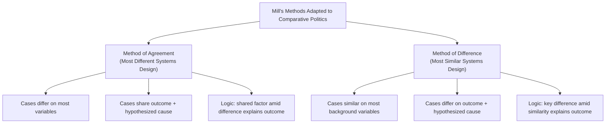

## The Comparative Method

### Definition and Scope

The comparative method refers to the family of systematic research strategies used in political science to explain political phenomena by examining similarities and differences across a limited number of cases (countries, regions, institutions, or historical episodes), typically deployed when the number of cases is too small for standard statistical (large-N) techniques but too numerous or complex for a single in-depth case study to yield generalizable causal inference. The foundational methodological statement is Arend Lijphart's "Comparative Politics and the Comparative Method" (1971), which formalized the comparative method as one of four basic scientific methods available to political scientists — alongside the experimental, statistical, and case study methods — and established the logical criteria still used to design comparative research.

Within the "Approaches to Comparative Politics" chapter, the comparative method functions as the methodological foundation underlying the substantive theories covered elsewhere (transition theory, regime typologies, authoritarian resilience), since virtually all of that theorizing was developed and tested through some variant of the comparative logic detailed here.

### Lijphart's Four Methods Framework

Lijphart situates the comparative method within a broader typology of available scientific approaches, distinguished primarily by their capacity to control for confounding variables:

| Method | Case Number | Control Mechanism | Typical Strength |
| --- | --- | --- | --- |
| Experimental | Variable, often small | Random assignment to treatment/control | Strongest causal inference, but often infeasible for macro-political phenomena |
| Statistical (large-N) | Large | Statistical control (regression, matching) | Strong generalizability, weaker on causal mechanism detail |
| Comparative | Small-to-medium | Case selection design, controlled comparison | Balances depth and generalizability; weaker statistical control |
| Case study | Single (N=1) | None (or within-case process tracing) | Rich causal-mechanism detail; weak generalizability |

[Inference] Lijphart's explicit framing of the comparative method as "second best" to the statistical method — used specifically because the number of cases is too small for reliable statistical control, rather than because comparativists prefer weaker methods — implies that a persistent methodological tension in the field concerns whether to treat small-N comparative findings as genuinely causal claims or as more modest, illustrative, hypothesis-generating exercises pending larger-sample confirmation.

### Mill's Methods of Agreement and Difference

The logical foundation of most comparative method techniques derives from John Stuart Mill's *A System of Logic* (1843), adapted from natural science inference to political and social phenomena:

#### Method of Agreement (Most Similar Systems variant inverted)

If two or more instances of a phenomenon under investigation share only one circumstance in common, that circumstance is likely the cause (or effect) of the phenomenon. Applied to political science: select cases that differ substantially on most background characteristics but share the outcome of interest and a hypothesized common causal factor, then argue that the shared factor explains the shared outcome despite the surrounding heterogeneity.

#### Method of Difference (Most Similar Systems Design)

If an instance in which the phenomenon occurs and an instance in which it does not occur share every circumstance in common except one, that one difference is likely the cause (or effect) of the phenomenon. Applied to political science: select cases that are similar across most background characteristics (region, colonial history, economic development level) but differ on the outcome of interest and on the hypothesized causal factor, then argue that the one key difference explains the divergent outcome.

[Inference] Mill himself was skeptical about applying these methods to social phenomena, given the practical near-impossibility of finding cases that truly share "every circumstance" except one (the "many variables, small N" problem discussed below), so contemporary comparativists typically treat Mill's methods as an idealized logical framework to approximate through careful case selection rather than as a literally achievable experimental-style control.

### Most Similar Systems Design (MSSD) vs. Most Different Systems Design (MDSD)

Building directly on Mill's logic, Przeworski and Teune's *The Logic of Comparative Social Inquiry* (1970) formalized the two dominant comparative research designs used in the field:

#### Most Similar Systems Design

Researchers select cases that are similar across a wide range of potentially confounding background characteristics (region, culture, colonial history, level of economic development, religious tradition) but differ on the outcome of interest, in order to isolate the specific factor(s) responsible for the divergent outcome by "holding constant" the shared background characteristics.

- Strength: reduces the plausibility that unmeasured background differences explain the outcome, since cases are deliberately chosen for their broad similarity
- Weakness: even carefully matched "most similar" cases inevitably differ on numerous unmeasured dimensions beyond the researcher's chosen variables, since real countries are never truly identical except for one factor — a persistent limitation known as the "many variables, small N" problem (discussed below)
- Typical application: comparing neighboring countries within the same region sharing colonial heritage, language family, or economic development trajectory (e.g., comparing Scandinavian welfare states, or comparing former Soviet republics)

#### Most Different Systems Design

Researchers select cases that differ substantially across most background characteristics but share both the outcome of interest and (it is hypothesized) a common causal factor, in order to demonstrate that the shared factor operates independently of, and despite, the surrounding heterogeneity.

- Strength: if a shared outcome and shared causal factor persist despite vast underlying differences between cases, this provides relatively strong evidence that the shared factor genuinely drives the outcome, since it is unlikely that the numerous other differences between cases coincidentally produced the same result
- Weakness: identifying a genuinely shared, precisely defined causal factor across highly heterogeneous cases can be analytically difficult, and there is a risk of overgeneralizing from a small number of superficially similar patterns across dissimilar contexts
- Typical application: comparing revolutionary outcomes or regime transitions across geographically and culturally disparate countries (e.g., examining why civil resistance succeeded in the Philippines, Serbia, and Ukraine despite vastly different regional, religious, and economic contexts) to isolate a hypothesized universal causal mechanism

### The "Many Variables, Small N" Problem

Lijphart's own methodological writing identifies the central structural weakness of the comparative method: comparative political research typically examines a limited number of cases (often single digits to low double digits) while attempting to account for a very large number of potentially relevant explanatory variables, producing a severe degrees-of-freedom problem that makes it difficult to statistically or logically rule out rival explanations with confidence.

Lijphart proposed four partial remedies, each with limitations:

1. **Increase the number of cases**: expand from comparative to statistical (large-N) analysis where feasible, though this may sacrifice depth of case knowledge and contextual understanding
2. **Reduce the "property space"**: focus theoretically on a smaller number of key variables, combining conceptually related variables into more parsimonious composite concepts
3. **Focus on "comparable cases"**: select cases that are similar in as many characteristics as possible other than those directly relevant to the research question (the MSSD logic described above)
4. **Focus on the "key" cases**: concentrate analytical attention on cases that are theoretically most revealing or "crucial" for adjudicating between competing explanations, even if the overall case count remains small

[Inference] None of these four remedies fully resolves the underlying degrees-of-freedom problem; each merely shifts the trade-off differently (between generalizability, depth, and analytical parsimony), which is why the comparative method is best understood as a family of pragmatic compromises for studying macro-political phenomena where genuine experimental or fully-controlled statistical analysis is infeasible, rather than as a method capable of definitively resolving causal inference to the same standard as controlled experimentation.

### Process Tracing as a Complementary Technique

Contemporary comparative methodology (particularly as systematized by Alexander George and Andrew Bennett's *Case Studies and Theory Development in the Social Sciences*, 2005) increasingly emphasizes **process tracing** as a complementary within-case technique addressing some of the comparative method's cross-case inferential limitations:

- Rather than relying solely on cross-case covariation between hypothesized causes and outcomes, process tracing examines the detailed causal chain or mechanism *within* a single case, using sequential evidence (documents, interviews, timing of events) to assess whether the hypothesized causal process actually operated as theorized
- Process tracing can help distinguish genuine causation from mere correlation in small-N settings by identifying whether the specific causal mechanism linking the hypothesized cause to the outcome is empirically observable in the detailed historical record, rather than relying purely on cross-case pattern matching
- [Inference] Process tracing is often described as complementary to, rather than a substitute for, cross-case comparative designs (MSSD/MDSD), since cross-case comparison identifies which factors are plausibly associated with an outcome across cases, while process tracing provides within-case evidence for whether the hypothesized mechanism actually connects cause to effect in the manner theorized.

### Illustrative Example: Applying MSSD to Democratic Transition Research

**Example — Comparing Iberian Transitions Using Most Similar Systems Design:**

Consider a hypothetical MSSD comparison of Spain and Portugal's transitions from authoritarian rule in the mid-1970s:

- **Shared background characteristics** (held roughly constant): Iberian Peninsula geography, Catholic religious tradition, Romance language family, broadly comparable levels of economic development at the time of transition, both emerging from long-standing right-authoritarian regimes (Franco, Estado Novo)
- **Key point of difference**: Spain's transition proceeded via elite-led transformation (Suárez-led reform from within the regime), while Portugal's transition proceeded via military-led replacement (the Carnation Revolution, a coup by junior officers followed by a more turbulent revolutionary period)
- **Analytical inference under MSSD logic**: because the two cases share so many background similarities, the divergent transition pathway is more plausibly attributable to the specific difference in elite configuration and military cohesion between the two cases (Franco's regime retained a more institutionalized reformist civilian political class, while the Portuguese regime's crisis was more directly precipitated by military dissatisfaction over the costly colonial wars) rather than to broader regional, cultural, or economic factors that both cases shared

**Methodological caveat**: Even in this carefully matched pair, the two cases still differ in numerous unmeasured ways (specific personalities involved, precise economic conditions, differing colonial burdens), illustrating the persistent "many variables, small N" limitation even in a well-designed MSSD comparison.

### Illustrative Diagram: MSSD vs. MDSD Logic Compared (svg_diagram)

<svg xmlns="http://www.w3.org/2000/svg" viewBox="0 0 720 380">
<rect x="0" y="0" width="720" height="380" fill="#ffffff" />
<text x="360" y="25" font-family="Arial, sans-serif" font-size="16" font-weight="bold" text-anchor="middle" fill="#1a1a1a">MSSD vs. MDSD Comparative Logic (svg_diagram)</text>
<rect x="30" y="60" width="310" height="290" rx="8" fill="#d9edf7" stroke="#31708f" stroke-width="2" />
<text x="185" y="90" font-family="Arial, sans-serif" font-size="13" font-weight="bold" text-anchor="middle" fill="#1a1a1a">Most Similar Systems Design</text>
<rect x="55" y="110" width="110" height="90" rx="6" fill="#ffffff" stroke="#31708f" stroke-width="1.5" />
<text x="110" y="130" font-family="Arial, sans-serif" font-size="10" font-weight="bold" text-anchor="middle" fill="#1a1a1a">Case A</text>
<text x="110" y="148" font-family="Arial, sans-serif" font-size="9" text-anchor="middle" fill="#333">Similar context</text>
<text x="110" y="162" font-family="Arial, sans-serif" font-size="9" text-anchor="middle" fill="#333">Factor X present</text>
<text x="110" y="180" font-family="Arial, sans-serif" font-size="9" font-weight="bold" text-anchor="middle" fill="#a83232">Outcome: Yes</text>
<rect x="200" y="110" width="110" height="90" rx="6" fill="#ffffff" stroke="#31708f" stroke-width="1.5" />
<text x="255" y="130" font-family="Arial, sans-serif" font-size="10" font-weight="bold" text-anchor="middle" fill="#1a1a1a">Case B</text>
<text x="255" y="148" font-family="Arial, sans-serif" font-size="9" text-anchor="middle" fill="#333">Similar context</text>
<text x="255" y="162" font-family="Arial, sans-serif" font-size="9" text-anchor="middle" fill="#333">Factor X absent</text>
<text x="255" y="180" font-family="Arial, sans-serif" font-size="9" font-weight="bold" text-anchor="middle" fill="#2d6b2d">Outcome: No</text>

<text x="185" y="235" font-family="Arial, sans-serif" font-size="10" text-anchor="middle" fill="#333">Shared background held constant;</text>

<text x="185" y="250" font-family="Arial, sans-serif" font-size="10" text-anchor="middle" fill="#333">difference in Factor X and outcome</text>

<text x="185" y="270" font-family="Arial, sans-serif" font-size="11" font-weight="bold" text-anchor="middle" fill="`#1a1a1a`">→ Factor X plausibly causal</text>

<rect x="380" y="60" width="310" height="290" rx="8" fill="#fcf8e3" stroke="#8a6d3b" stroke-width="2" />
<text x="535" y="90" font-family="Arial, sans-serif" font-size="13" font-weight="bold" text-anchor="middle" fill="#1a1a1a">Most Different Systems Design</text>
<rect x="405" y="110" width="110" height="90" rx="6" fill="#ffffff" stroke="#8a6d3b" stroke-width="1.5" />
<text x="460" y="130" font-family="Arial, sans-serif" font-size="10" font-weight="bold" text-anchor="middle" fill="#1a1a1a">Case C</text>
<text x="460" y="148" font-family="Arial, sans-serif" font-size="9" text-anchor="middle" fill="#333">Very different context</text>
<text x="460" y="162" font-family="Arial, sans-serif" font-size="9" text-anchor="middle" fill="#333">Factor X present</text>
<text x="460" y="180" font-family="Arial, sans-serif" font-size="9" font-weight="bold" text-anchor="middle" fill="#a83232">Outcome: Yes</text>
<rect x="550" y="110" width="110" height="90" rx="6" fill="#ffffff" stroke="#8a6d3b" stroke-width="1.5" />
<text x="605" y="130" font-family="Arial, sans-serif" font-size="10" font-weight="bold" text-anchor="middle" fill="#1a1a1a">Case D</text>
<text x="605" y="148" font-family="Arial, sans-serif" font-size="9" text-anchor="middle" fill="#333">Very different context</text>
<text x="605" y="162" font-family="Arial, sans-serif" font-size="9" text-anchor="middle" fill="#333">Factor X present</text>
<text x="605" y="180" font-family="Arial, sans-serif" font-size="9" font-weight="bold" text-anchor="middle" fill="#a83232">Outcome: Yes</text>

<text x="535" y="235" font-family="Arial, sans-serif" font-size="10" text-anchor="middle" fill="#333">Background varies widely;</text>

<text x="535" y="250" font-family="Arial, sans-serif" font-size="10" text-anchor="middle" fill="#333">Factor X and outcome shared</text>

<text x="535" y="270" font-family="Arial, sans-serif" font-size="11" font-weight="bold" text-anchor="middle" fill="`#1a1a1a`">→ Factor X robust across contexts</text>

</svg>

### Critiques and Limitations

- **Case selection bias**: Selecting cases on the dependent variable (choosing only cases where the outcome of interest occurred) is a well-documented methodological error in comparative research, since it can produce spurious findings by failing to examine variation in the outcome — a critique substantially developed by Barbara Geddes in her own methodological writing on regime-type research, ironically also a major substantive contributor to the classification literature covered elsewhere in this course
- **Conceptual stretching**: Applying the same conceptual categories (e.g., "democracy," "civil society," "revolution") across highly heterogeneous cases in MDSD-style research risks what Giovanni Sartori termed "conceptual stretching" — diluting a concept's meaning to the point of vagueness in order to make it applicable across dissimilar contexts, undermining the analytical precision the comparison was meant to achieve
- **Endogeneity and reverse causation**: Small-N comparative designs, lacking the temporal or instrumental variation sometimes available in large-N statistical or experimental designs, are often poorly equipped to rule out reverse causation (the outcome causing the hypothesized explanatory factor, rather than vice versa) or confounding by an unmeasured third variable
- [Inference] These persistent limitations are part of why contemporary comparative political science increasingly advocates methodological pluralism — combining comparative case selection logic with process tracing, and where feasible triangulating small-N comparative findings against large-N statistical evidence — rather than treating any single method, including the classical comparative method, as sufficient on its own for robust causal inference in macro-political research.

### Related Topics

- Case Study Methods in Political Science
- Process Tracing and Causal Mechanisms
- Concept Formation and Conceptual Stretching (Sartori)
- Case Selection Bias and Selecting on the Dependent Variable
- Statistical Methods in Comparative Politics
- Theories of Democratic Transition
- Classifying Authoritarian Regimes
- Qualitative Comparative Analysis (QCA)