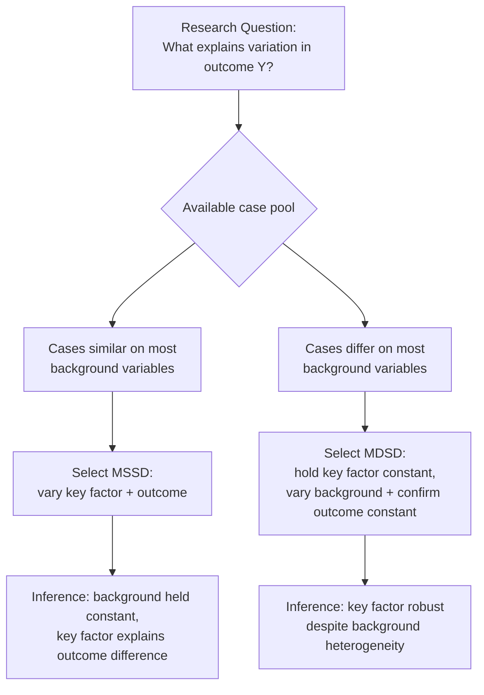

## Most Similar and Most Different Systems Designs

### Definition and Scope

Most Similar Systems Design (MSSD) and Most Different Systems Design (MDSD) are the two canonical case-selection strategies within the comparative method, formalized by Adam Przeworski and Henry Teune in *The Logic of Comparative Social Inquiry* (1970) as operationalizations of John Stuart Mill's methods of difference and agreement respectively (see "The Comparative Method" for the broader methodological context). While the previous item introduced these designs at a general level, this item examines their internal logic, formal structure, selection criteria, and comparative strengths and weaknesses in depth, since the choice between MSSD and MDSD represents one of the most consequential research design decisions a comparativist makes and substantially shapes what kind of causal claims a study can credibly support.

### Formal Logical Structure

#### Most Similar Systems Design

MSSD selects cases that are matched on a broad set of background ("control") variables believed to be potentially confounding, while varying on the key explanatory variable of theoretical interest and the outcome variable. The underlying logic treats the matched background variables as if experimentally "held constant," isolating the relationship between the explanatory variable and the outcome.

Formally, for cases $i$ and $j$:

$$X_1^i \neq X_1^j, \quad X_2^i = X_2^j, \; X_3^i = X_3^j, \ldots, X_k^i = X_k^j, \quad Y^i \neq Y^j$$

Where $X_1$ is the key explanatory variable of interest, $X_2$ through $X_k$ are control variables matched across cases, and $Y$ is the outcome. The design licenses the inference that $X_1$ plausibly explains the divergence in $Y$, since all other measured background factors are held constant.

#### Most Different Systems Design

MDSD selects cases that differ substantially across most background variables, but share both the key explanatory variable and the outcome. The logic here treats the very heterogeneity of the cases as strengthening the inference: if the same causal factor produces the same outcome despite vast underlying differences, this reduces the plausibility that some unmeasured shared background factor is actually responsible.

Formally:

$$X_1^i = X_1^j, \quad X_2^i \neq X_2^j, \ldots, X_k^i \neq X_k^j, \quad Y^i = Y^j$$

The design licenses the inference that $X_1$ operates as a genuinely robust cause of $Y$, independent of the surrounding contextual variation.

### Detailed Comparison of Strengths and Weaknesses

| Dimension | Most Similar Systems Design | Most Different Systems Design |
| --- | --- | --- |
| Case selection logic | Match background, vary outcome | Match outcome + cause, vary background |
| Typical case pool | Regionally/historically clustered cases | Geographically/culturally dispersed cases |
| Primary strength | Reduces plausibility of confounding by shared background factors | Demonstrates robustness of causal factor across heterogeneous contexts |
| Primary weakness | "Many variables, small N" problem — true matching on all but one variable is rarely achievable | Difficulty precisely defining/measuring a causal factor consistently across very different contexts |
| Risk of conceptual stretching | Lower (cases share context, so concepts travel more naturally) | Higher (Sartori's concern — concepts may need dilution to apply across dissimilar settings) |
| Best suited for | Explaining why similar cases diverge | Explaining why dissimilar cases converge |

[Inference] Because MSSD and MDSD address different inferential risks (confounding by background similarity versus lack of generalizability across contexts), the two designs are often best understood as complementary rather than competing strategies — a research program that first identifies a candidate causal factor through MDSD (establishing that it operates across diverse contexts) and then refines the precise causal mechanism through MSSD (isolating exactly how the factor operates among closely matched cases) can potentially offset each design's individual weaknesses, though few individual studies attempt both simultaneously given resource and scope constraints.

### The Persistent "Many Variables, Small N" Challenge

Both designs remain vulnerable to the fundamental degrees-of-freedom problem inherent to small-N comparative research (introduced under "The Comparative Method"), though the problem manifests somewhat differently in each:

- **In MSSD**: even carefully selected "most similar" cases (e.g., neighboring countries sharing colonial history, language, and religion) inevitably differ on numerous unmeasured dimensions beyond the researcher's chosen control variables — specific historical contingencies, individual leader characteristics, or idiosyncratic events — any of which could plausibly account for the outcome divergence instead of, or alongside, the hypothesized key factor
- **In MDSD**: the requirement that cases share *both* the causal factor and the outcome, despite vast background differences, is demanding to satisfy with a large enough number of cases to make the pattern convincing rather than coincidental; with very few cases, an MDSD finding risks resting on what could be an accidental parallel rather than a genuine causal regularity

[Inference] Neither design fully escapes this challenge because both remain, at root, observational (non-experimental) small-N methods; the value of explicitly choosing between MSSD and MDSD lies primarily in making the researcher's implicit case-selection assumptions and inferential logic transparent and contestable, rather than in genuinely replicating the confound-eliminating power of true experimental random assignment.

### Application Domains Within Democratization and Regime Studies

The MSSD/MDSD distinction has been extensively applied within the substantive literatures covered elsewhere in this course:

- **MSSD applications**: comparative studies of neighboring post-communist states with shared Soviet institutional legacy but divergent democratization trajectories (e.g., comparing Baltic states with other former Soviet republics); comparisons of Latin American military regimes sharing broadly similar economic development levels and colonial Iberian heritage but differing transition pathways (Argentina vs. Chile vs. Brazil)
- **MDSD applications**: Chenoweth and Stephan's *Why Civil Resistance Works* dataset implicitly draws on MDSD-style logic by demonstrating that nonviolent civil resistance's success advantage holds across geographically, culturally, and economically extremely diverse cases (Philippines, Serbia, Iran, various African contexts); similarly, Levitsky and Way's linkage-leverage framework is tested across regions as different as post-Soviet Eurasia, Sub-Saharan Africa, and Latin America to demonstrate the framework's cross-regional robustness

### Illustrative Example: Contrasting the Two Designs on the Same Substantive Question

**Example — Explaining Successful Democratic Transitions Using Both Designs:**

Suppose a researcher wants to test the hypothesis that "elite pacting" (negotiated transition agreements) explains successful democratization.

- **MSSD approach**: Compare Poland and Czechoslovakia — both post-communist, both in Central Europe, both emerging from similarly institutionalized single-party regimes with comparable Soviet-imposed economic structures, both transitioning in 1989. Poland pursued explicit elite pacting (the Round Table Talks) while Czechoslovakia's Velvet Revolution involved less formal, more rapid negotiation. If democratization quality diverges between the two, the researcher can more confidently attribute the difference to the degree of formal pacting, since so much regional and historical background is held constant.
- **MDSD approach**: Compare Poland (Central Europe, post-communist, elite pact), South Africa (Sub-Saharan Africa, post-apartheid settler-colonial context, elite pact via CODESA), and Chile (Latin America, post-military-junta, negotiated plebiscite transition). These cases differ enormously in region, colonial history, economic structure, and religious/cultural context, yet all three feature negotiated elite pacting and all three produced reasonably durable democratic outcomes. If this pattern holds despite the vast contextual differences, it strengthens the claim that elite pacting itself — rather than any regionally specific factor — is the operative causal mechanism.

**Combined inference**: Using both designs in sequence (as in this hypothetical) allows the researcher to argue both that pacting matters *specifically* (via the MSSD comparison controlling for regional confounds) and that it matters *generally*, across highly disparate settings (via the MDSD comparison demonstrating cross-regional robustness) — though as noted above, few single studies actually execute both designs with full rigor given the substantial case-knowledge demands of each.

### Illustrative Diagram: Design Selection Decision Guide (svg_diagram)

<svg xmlns="http://www.w3.org/2000/svg" viewBox="0 0 700 360">
<rect x="0" y="0" width="700" height="360" fill="#ffffff" />
<text x="350" y="25" font-family="Arial, sans-serif" font-size="16" font-weight="bold" text-anchor="middle" fill="#1a1a1a">Choosing Between MSSD and MDSD (svg_diagram)</text>
<rect x="270" y="45" width="160" height="50" rx="8" fill="#e8e8f0" stroke="#4a4a7a" stroke-width="2" />
<text x="350" y="75" font-family="Arial, sans-serif" font-size="12" font-weight="bold" text-anchor="middle" fill="#1a1a1a">What is your goal?</text>
<line x1="300" y1="95" x2="150" y2="140" stroke="#666" stroke-width="1.5" />
<line x1="400" y1="95" x2="550" y2="140" stroke="#666" stroke-width="1.5" />
<rect x="50" y="140" width="220" height="80" rx="8" fill="#d9edf7" stroke="#31708f" stroke-width="2" />
<text x="160" y="165" font-family="Arial, sans-serif" font-size="12" font-weight="bold" text-anchor="middle" fill="#1a1a1a">Explain divergence</text>
<text x="160" y="180" font-family="Arial, sans-serif" font-size="12" font-weight="bold" text-anchor="middle" fill="#1a1a1a">among similar cases</text>
<text x="160" y="200" font-family="Arial, sans-serif" font-size="11" text-anchor="middle" fill="#1f5f7a">→ Use MSSD</text>
<rect x="430" y="140" width="220" height="80" rx="8" fill="#fcf8e3" stroke="#8a6d3b" stroke-width="2" />
<text x="540" y="165" font-family="Arial, sans-serif" font-size="12" font-weight="bold" text-anchor="middle" fill="#1a1a1a">Confirm robustness</text>
<text x="540" y="180" font-family="Arial, sans-serif" font-size="12" font-weight="bold" text-anchor="middle" fill="#1a1a1a">across diverse cases</text>
<text x="540" y="200" font-family="Arial, sans-serif" font-size="11" text-anchor="middle" fill="#6b5427">→ Use MDSD</text>
<line x1="160" y1="220" x2="160" y2="260" stroke="#666" stroke-width="1.5" />
<line x1="540" y1="220" x2="540" y2="260" stroke="#666" stroke-width="1.5" />
<rect x="50" y="260" width="220" height="70" rx="8" fill="#eef7ee" stroke="#5cb85c" stroke-width="1.5" />
<text x="160" y="285" font-family="Arial, sans-serif" font-size="10" text-anchor="middle" fill="#333">Risk: residual unmeasured</text>
<text x="160" y="300" font-family="Arial, sans-serif" font-size="10" text-anchor="middle" fill="#333">differences (many-vars/small-N)</text>
<rect x="430" y="260" width="220" height="70" rx="8" fill="#eef7ee" stroke="#5cb85c" stroke-width="1.5" />
<text x="540" y="285" font-family="Arial, sans-serif" font-size="10" text-anchor="middle" fill="#333">Risk: conceptual stretching</text>
<text x="540" y="300" font-family="Arial, sans-serif" font-size="10" text-anchor="middle" fill="#333">across dissimilar contexts</text>
</svg>

### Critiques and Contemporary Refinements

- **Neither design achieves true experimental control**: Both MSSD and MDSD remain observational designs relying on the researcher's judgment about which background variables are relevant to match or vary, and unmeasured or unanticipated confounders can undermine either design's inferential claims regardless of how carefully cases are selected
- **Selection on the independent rather than dependent variable**: Methodologists (following Geddes's critique referenced under "The Comparative Method") caution that both designs, if applied carelessly, can inadvertently select cases in ways that bias inference — for instance, choosing "most similar" cases specifically because the researcher already suspects they will support the hypothesis, rather than through a principled, hypothesis-blind matching procedure
- **David Collier and James Mahoney's refinements**: subsequent methodological work has proposed hybrid and sequential elaborations of the basic MSSD/MDSD framework, including diachronic (within-case, over-time) comparison as a way to leverage additional variation without requiring an entirely new cross-national case, partially mitigating the small-N constraint by treating the same case at different time points as providing additional comparative leverage
- [Unverified] Whether formal set-theoretic techniques such as Qualitative Comparative Analysis (QCA), which allow for more systematic handling of multiple conjunctural causation across a moderate number of cases, should be considered an extension of, or a genuinely distinct alternative to, the classical MSSD/MDSD framework remains a matter of some methodological debate, with different scholars situating QCA differently relative to the Millian tradition underlying both designs.

### Related Topics

- The Comparative Method
- Process Tracing and Causal Mechanisms
- Qualitative Comparative Analysis (QCA)
- Concept Formation and Conceptual Stretching (Sartori)
- Case Selection Bias and Selecting on the Dependent Variable
- Diachronic and Within-Case Comparison
- Theories of Democratic Transition
- Civil Resistance and Nonviolent Transitions