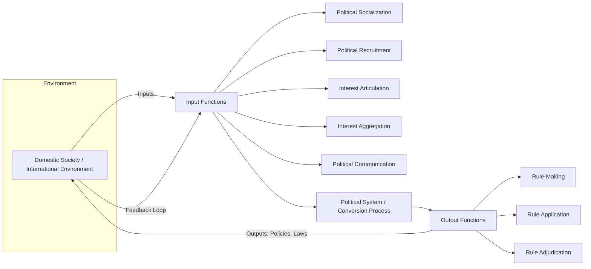

## Structural-Functionalism in Comparative Politics

### Definition and Intellectual Origins

Structural-functionalism is a theoretical approach in comparative politics that analyzes political systems by identifying the **structures** (institutions, organizations, and patterned behaviors) that perform necessary **functions** for a political system's survival, adaptation, and reproduction. Rather than comparing states solely by formal institutions (as classical institutionalism did), structural-functionalists ask what functions must be performed in any political system — regardless of regime type — and which structures perform them in a given case.

The approach emerged from structural-functionalist sociology, particularly the work of Talcott Parsons, and was adapted to political science primarily by **Gabriel Almond** and **G. Bingham Powell** in the 1960s, most notably in *Comparative Politics: A Developmental Approach* (1966). It arose partly as a corrective to earlier comparative politics, which was criticized as parochial (focused on Western Europe and North America), formalistic (focused on legal-constitutional structures), and static (ignoring change and development).

### Core Theoretical Premises

- **Systems thinking**: Political systems are treated as open systems that interact with their environment, receiving inputs and producing outputs, analogous to David Easton's systems theory of politics.
- **Functional universalism**: All political systems, regardless of level of development or regime type, must perform certain functions to persist — the specific structures performing them vary, but the functions themselves are held to be universal.
- **Structural differentiation**: As societies modernize, structures become more specialized and differentiated from one another (e.g., religious, economic, and political structures separate out from a single diffuse institution).
- **Cultural embeddedness**: Political structures operate within a **political culture** — the pattern of individual attitudes and orientations toward politics — which shapes how functions are actually performed in practice.

### Almond and Powell's Functional Categories

Almond's framework divides political functions into two broad levels: **input functions** (society-to-system) and **output functions** (system-to-society), later expanded with system-maintenance functions.

**Input Functions**

| Function | Description | Typical Structures |
| --- | --- | --- |
| Political socialization | Transmission of political attitudes/values across generations | Family, schools, media, religious institutions |
| Political recruitment | Selection of individuals for political roles | Parties, bureaucracies, electoral systems |
| Interest articulation | Expression of group demands to the political system | Interest groups, social movements, lobbies |
| Interest aggregation | Combining articulated interests into policy alternatives | Political parties, coalitions |
| Political communication | Flow of information through the system | Media, parties, informal networks |

**Output Functions**

| Function | Description | Typical Structures |
| --- | --- | --- |
| Rule-making | Formulation of authoritative rules (legislation) | Legislatures, executives with decree power |
| Rule application | Implementation and enforcement of rules | Bureaucracies, executive agencies |
| Rule adjudication | Interpretation of rules in specific disputes | Courts, tribunals |

**Key Points**:

- The same function can be performed by different structures across systems — e.g., interest articulation may occur through formal interest groups in pluralist democracies, through patron-client networks in some developing states, or through state-corporatist bodies in others.
- A single structure can perform multiple functions simultaneously (a political party may aggregate interests, recruit candidates, and socialize members all at once) — a concept Almond termed **structural multifunctionality**.
- This structure-function distinction was central to enabling genuinely cross-regime comparison: rather than asking "does this state have a legislature," the analyst asks "how is the rule-making function performed here," permitting comparison between, for instance, a parliamentary legislature and a one-party state's central committee.

### Political Culture and the Three Orientations

Almond and Sidney Verba's companion work, *The Civic Culture* (1963), operationalized political culture through citizen **orientations** toward the political system, cross-classified into a typology:

- **Cognitive orientation**: Knowledge and beliefs about the political system
- **Affective orientation**: Feelings toward the system (attachment, rejection, indifference)
- **Evaluative orientation**: Judgments and opinions about the system

These orientations combine into three ideal-typical political culture categories:

- **Parochial culture**: Little awareness of or orientation toward the national political system; common in traditional, undifferentiated societies
- **Subject culture**: Awareness of the system's outputs (laws, policies) but passive orientation toward inputs (little sense of participation)
- **Participant culture**: Active orientation toward both inputs and outputs; citizens see themselves as potential participants in the political process

Almond and Verba argued that a **"civic culture"** — a mixture predominantly participant but retaining elements of subject and parochial orientations — was empirically associated with stable democratic governance, based on survey research conducted in the US, UK, Germany, Italy, and Mexico.

### System-Level Functions (Developmental Framework)

In later work, Almond expanded the framework to include **capabilities** (a system's performance relative to its environment and other systems) and **system functions** necessary for adaptation and survival:

- **Extractive capability**: Ability to draw resources (revenue, personnel) from the environment
- **Regulative capability**: Ability to control behavior of individuals and groups
- **Distributive capability**: Ability to allocate goods, services, and honors
- **Symbolic capability**: Ability to generate legitimating symbols and effectively communicate them
- **Responsive capability**: Ability to respond to demands from within the system

This extension was designed partly to address development and modernization, connecting structural-functionalism to broader **modernization theory** debates of the 1960s.

### Diagram: Structural-Functionalist Systems Model

### Example: Comparing Interest Articulation Across Regime Types

**Example**: Consider how the function of interest articulation is performed in three different systems.

- **Pluralist democracy (e.g., United States)**: Interest articulation occurs through a dense ecology of formally organized interest groups, lobbying firms, and political action committees that compete relatively openly to influence rule-makers.
- **Corporatist system (e.g., historical Austria or Sweden's Rehn-Meidner era)**: A small number of officially recognized peak associations (major labor federations, employer confederations) are incorporated into formal bargaining structures with the state, aggregating interests through negotiated institutional channels rather than open competition.
- **Single-party authoritarian system**: Interest articulation may occur informally through personal networks, factions within the ruling party, or officially sanctioned "mass organizations" that channel demands upward while limiting autonomous organization.

Applying the structural-functionalist lens allows the analyst to compare these very different institutional configurations on the common analytical dimension of *how the same underlying function gets performed*, rather than being limited to comparing only systems with superficially similar institutions.

### Relationship to Modernization Theory

Structural-functionalism became closely associated with **modernization theory**, which held that political development involved increasing **structural differentiation** (specialized institutions emerging for specialized functions) and **cultural secularization** (rational-legal orientations replacing traditional/religious ones), often implicitly using Western liberal democracies as the developmental endpoint. Samuel Huntington's *Political Order in Changing Societies* (1968) both drew upon and critiqued this framework, arguing that development could outpace institutionalization, producing instability rather than orderly progress toward democracy — a critique of teleological readings of structural-functionalism from within the broader tradition.

### Major Critiques

- **Ethnocentrism / normative bias**: Critics (e.g., dependency theorists, world-systems scholars) argued the framework implicitly treated Western liberal-democratic structures as the functional benchmark, framing non-Western political arrangements as underdeveloped rather than differently organized.
- **Conservative bias toward equilibrium**: Because the approach emphasizes how systems maintain themselves and adapt, critics argued it under-theorizes conflict, revolution, and radical structural change, treating stability as a baseline and instability as pathological or a "failure" of function.
- **Vagueness and unfalsifiability**: The claim that "some structure must perform each function" is broad enough that almost any observed arrangement can be redescribed as functionally adequate after the fact, raising concerns about the framework's explanatory (as opposed to descriptive/classificatory) power. [Inference] This critique, associated with scholars like Robert Merton (functionalism's "post hoc" problem) and later rational-choice critics, remains one of the most cited limitations in graduate methodology discussions of the approach.
- **Insufficient attention to power and class**: Marxist and critical theorists argued that the approach's emphasis on system-maintenance obscures underlying power asymmetries and class conflict that shape which structures perform which functions, and for whose benefit.
- **Teleological association with modernization**: Even where Almond himself was cautious, the broader modernization-theory package attached to structural-functionalism implied a linear developmental trajectory later challenged by evidence of diverse, non-linear paths of political change (e.g., "hybrid regimes," durable authoritarianism).

### Legacy and Contemporary Relevance

Despite these critiques, structural-functionalism's lasting contributions to comparative politics include:

- Popularizing genuinely **cross-regime comparison** based on function rather than formal institutional labels, a methodological move that persists in institutionalist and functionalist strands of contemporary comparative politics
- Establishing **political culture** as a legitimate and measurable object of comparative analysis, a lineage traceable through later work on social capital (Robert Putnam) and civic engagement
- Contributing foundational vocabulary — inputs/outputs, political socialization, interest articulation/aggregation — that remains standard terminology in comparative politics textbooks
- Influencing subsequent **new institutionalism** (particularly historical and sociological institutionalism), which retained interest in how institutions perform functions while addressing some critiques around power, path dependency, and change

[Inference] Most contemporary comparative politics scholarship no longer self-identifies as "structural-functionalist," having been largely superseded by rational-choice institutionalism, historical institutionalism, and other frameworks from the 1980s onward; however, the functional-comparative logic (comparing how different structures perform equivalent functions) persists as an implicit methodological legacy across the subfield.

### Related Topics

- David Easton's Systems Theory of Politics
- Modernization Theory and Political Development
- Political Culture Theory (Almond and Verba's Civic Culture)
- New Institutionalism (Historical, Rational-Choice, Sociological)
- Corporatism vs. Pluralism in Interest Group Politics
- Samuel Huntington's Critique of Political Order and Decay
- Dependency Theory and World-Systems Critiques of Modernization
- Comparative Method and Case Selection in Political Science