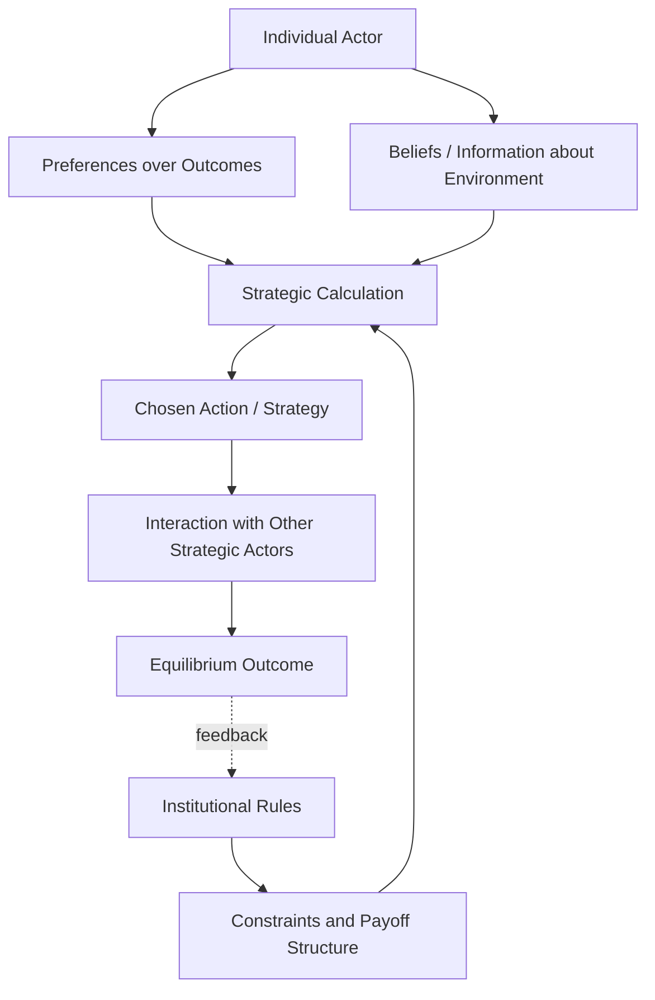

## Rational Choice Approaches

### Definition and Core Premises

Rational choice approaches in comparative politics apply microeconomic-style reasoning to political behavior, modeling political actors (voters, legislators, parties, bureaucrats, states) as purposive agents who select actions to maximize expected utility given their preferences, available information, and institutional constraints. Rather than beginning with historical structures or cultural values, rational choice starts from individual-level assumptions and builds explanations of collective political outcomes through **methodological individualism**.

Core assumptions typically include:

- **Preference ordering**: Actors have transitive, stable preferences over outcomes
- **Utility maximization**: Actors choose the option that best satisfies their preferences given constraints
- **Strategic interaction**: Actors anticipate others' choices and adjust their own behavior accordingly (formalized through game theory)
- **Institutions as constraints/incentive structures**: Institutions shape outcomes not by determining behavior directly but by structuring the payoffs and information available to strategic actors

[Inference] Rational choice is frequently described as a "thin" theory of rationality — it does not require that actors' goals be selfish or materialist, only that they pursue their goals consistently — though critics argue that empirical applications often smuggle in substantive assumptions (e.g., vote/office/policy-maximization) that go beyond the formally "thin" premise.

### Intellectual Origins

- **Anthony Downs**, *An Economic Theory of Democracy* (1957): Modeled political parties as vote-maximizing actors and voters as utility-maximizers who abstain unless expected benefits from voting exceed costs, producing the influential **Downsian median voter model** and the "paradox of voting" (rational actors should abstain given near-zero probability of being decisive).
- **Mancur Olson**, *The Logic of Collective Action* (1965): Challenged the assumption that shared group interest automatically produces collective mobilization, showing that rational self-interested individuals will **free-ride** on collective goods unless selective incentives or coercion are introduced — a foundational critique of naive pluralist group theory.
- **William Riker**, credited with founding the "Rochester school" of positive political theory, applied game-theoretic and social choice reasoning to coalition formation (*The Theory of Political Coalitions*, 1962) and legislative behavior.
- **Kenneth Arrow**'s *Social Choice and Individual Values* (1951) supplied foundational social choice theory (Arrow's Impossibility Theorem) that underpins much of the formal apparatus used in rational choice political science.

### Key Analytical Tools

**Game Theory**

Rational choice comparative politics relies heavily on formal game-theoretic models to analyze strategic interaction among political actors.

- **Key Points**:
  - **Non-cooperative game theory** models situations where actors cannot make binding agreements, requiring analysis of credible strategies (e.g., legislative bargaining, deterrence)
  - **Nash equilibrium** is the standard solution concept: a set of strategies where no actor can improve their payoff by unilaterally deviating, given others' strategies
  - **Repeated games** and the **folk theorem** explain how cooperation can be sustained without external enforcement when interactions recur (relevant to explaining international cooperation, coalition stability, and norms of political conduct)
  - **Signaling games** model how actors with private information (a challenger's true strength, a government's resolve) can credibly communicate through costly signals

**Spatial (Median Voter) Models**

Building on Downs and Duncan Black's median voter theorem, spatial models represent policy positions as points in a (typically one- or multi-dimensional) space, with voters' preferences represented as ideal points and utility declining with distance from their ideal point.

$$U_i(x) = -|x - x_i|$$

where $U_i(x)$ is voter $i$'s utility from policy $x$ and $x_i$ is voter $i$'s ideal point.

- Under single-peaked preferences and a single policy dimension, the median voter theorem predicts that majority-rule outcomes converge on the median voter's ideal point.
- [Inference] Multidimensional extensions (e.g., the McKelvey chaos theorem) demonstrate that without institutional constraints (agenda control, germaneness rules), majority rule in more than one dimension can cycle indefinitely among alternatives, which is frequently cited as a key motivation for the "structure-induced equilibrium" research program (Kenneth Shepsle) explaining why real legislatures avoid this theoretical instability through committee systems and procedural rules.

**Principal-Agent Models**

Used extensively to analyze delegation relationships central to comparative institutional analysis — voters delegating to legislators, legislatures delegating to executives/bureaucracies, and international principals delegating to international organizations.

- **Adverse selection**: The principal cannot fully observe the agent's type (competence, preferences) before delegation
- **Moral hazard**: The principal cannot fully observe the agent's effort or actions after delegation
- **Agency slack/shirking**: Divergence between agent behavior and principal preferences due to information asymmetries
- Applied comparatively to explain variation in bureaucratic autonomy, central bank independence, and legislative oversight design across political systems

**Veto Player Theory**

George Tsebelis's framework (*Veto Players: How Political Institutions Work*, 2002) analyzes policy stability as a function of the number of **veto players** (individual or collective actors whose agreement is required for policy change), their ideological distance from one another, and their internal cohesion.

- More veto players, greater ideological distance between them, and lower internal cohesion each independently increase policy stability (the size of the "winset" of alternatives that can defeat the status quo shrinks)
- Widely applied comparatively to explain why some systems (e.g., US with separated powers and bicameralism) exhibit greater policy inertia than others (e.g., UK Westminster systems with unified government)

### Diagram: Rational Choice Explanatory Logic

### Example: Applying Rational Choice to Coalition Formation

**Example**: Consider a parliamentary system with three parties (A, B, C) and no single-party majority, where a governing coalition must control more than 50% of seats.

- **Office-seeking model (Riker's minimum winning coalition)**: Predicts that rational, vote/office-maximizing party leaders will form the *smallest possible* coalition that still commands a majority, since adding unnecessary partners dilutes the spoils of office (cabinet portfolios) among more actors.
- **Policy-seeking model**: Predicts coalitions will form among *ideologically adjacent* parties (minimal connected winning coalitions), since parties are assumed to care about policy outcomes, not just office, and prefer partners with compatible preferences even at the cost of a larger-than-minimal coalition.
- **Empirical refinement**: Comparative coalition studies (e.g., work building on Michael Laver and Norman Schofield) found that actual coalitions frequently deviate from strict size-minimization, motivating hybrid models incorporating both office and policy motivations, along with institutional factors like formateur advantages and pre-electoral pacts.

This illustrates how rational choice generates precise, falsifiable, *competing* predictions that can then be empirically tested against comparative cross-national coalition data — a methodological signature of the approach.

### Rational Choice Institutionalism

A major branch applying rational choice specifically to the comparative study of institutions, treating institutions as **equilibrium outcomes** of strategic interaction (rather than exogenous structures) that in turn stabilize expectations and reduce transaction costs.

- Associated with scholars including Kenneth Shepsle, Barry Weingast, and Douglass North (the latter primarily in economics/economic history)
- Explains institutional persistence through **self-enforcing equilibria**: institutions persist because relevant actors find it individually rational to continue complying, given expectations about others' compliance, not merely because of formal legal authority
- Applied to explain phenomena including federalism as a credible commitment device (Weingast's "market-preserving federalism"), electoral system origins as strategic choices by incumbent parties (work building on Boix), and constitutional design as bargaining outcomes among founding-era political coalitions

### Rational Choice and Democratization/Authoritarianism

- **Selectorate theory** (Bueno de Mesquita, Smith, Siverson, Morrow, *The Logic of Political Survival*, 2003) models leader survival as a function of the size of the **selectorate** (those with a formal say in selecting the leader) relative to the **winning coalition** (those whose support the leader actually needs to remain in power), explaining comparatively why small-coalition systems (many autocracies) rely on private goods/patronage while large-coalition systems (most democracies) rely more on public goods provision.
- **Modernization and redistribution models** (Boix; Acemoglu and Robinson) model democratization as a strategic response by elites to the threat of revolution or social unrest, where extending the franchise functions as a credible commitment to future redistribution that averts costlier outright conflict. [Inference] These formal models generated substantial comparative-historical testing (including critiques from scholars like Ansell and Samuels, who argue asset-holding elites, not just fear of redistribution, better explain some democratization episodes), illustrating rational choice's characteristic cycle of formal-model-generation followed by empirical contestation.

### Major Critiques

- **Unrealistic informational and cognitive assumptions**: Critics (particularly from behavioral economics and psychology) argue the assumption of consistent, fully rational utility-maximization ignores well-documented cognitive biases, bounded rationality, and heuristics that shape actual political decision-making (associated with Herbert Simon's concept of "bounded rationality" and later behavioral political economy).
- **Indeterminacy and "just-so" story problem**: Critics (notably Donald Green and Ian Shapiro, *Pathologies of Rational Choice Theory*, 1994) argued that many rational choice explanations are constructed post hoc to fit known outcomes, with insufficiently falsifiable ex ante predictions, and that the field's empirical track record of genuinely novel, confirmed predictions is thinner than its formal sophistication suggests.
- **Neglect of norms, identity, and culture**: Constructivist and culturalist critics argue rational choice treats preferences as exogenously fixed and given, rather than examining how identity, ideology, and socialization shape which preferences actors hold in the first place — a critique central to the broader "rationalist versus constructivist/culturalist" debate in comparative politics and international relations.
- **Aggregation and collective action problems within the theory itself**: The "paradox of voting" (why do rational actors vote at all, given near-zero probability of being pivotal) remains only partially resolved within pure rational choice frameworks, often requiring auxiliary assumptions (expressive voting, civic duty as a utility term) that critics view as ad hoc additions undermining parsimony.

### Rational Choice vs. Alternative Approaches (Comparative Summary)

| Dimension | Rational Choice | Structural-Functionalism | Historical Institutionalism |
| --- | --- | --- | --- |
| Unit of analysis | Individual strategic actor | Systemic functions/structures | Institutions as products of critical junctures |
| Explanatory logic | Deductive, formal modeling | Functional necessity | Path dependence, sequencing |
| Treatment of institutions | Endogenous equilibria/constraints | Structures performing functions | Exogenous constraints shaped by history |
| Preferences | Assumed exogenous and fixed | Embedded in political culture | Shaped by historical legacies |
| Primary critique received | Unrealistic assumptions, indeterminacy | Vagueness, conservative bias | Difficulty specifying causal mechanisms precisely |

### Contemporary Applications and Synthesis

[Inference] Since the 1990s, much of comparative politics has moved toward **analytic eclecticism** or explicit synthesis rather than treating rational choice as a standalone paradigm — combining formal rational choice models with historical-institutionalist attention to sequencing and context (as in Weingast's and North's work on institutions), or incorporating behavioral and psychological realism into strategic models (behavioral game theory). Rational choice's most durable legacy is arguably methodological: the requirement of specifying actors' preferences, information, and strategic environment explicitly enough to generate testable predictions, a standard now widely adopted even by scholars who reject strict rational-actor assumptions.

### Related Topics

- Median Voter Theorem and Spatial Voting Models
- Game Theory Foundations for Political Science
- Collective Action Problems and Free-Riding
- Veto Player Theory and Policy Stability
- Selectorate Theory and Authoritarian Survival
- Rational Choice Institutionalism vs. Historical Institutionalism
- Social Choice Theory and Arrow's Impossibility Theorem
- Behavioral Political Economy and Bounded Rationality Critiques
- Coalition Formation Theory in Parliamentary Systems