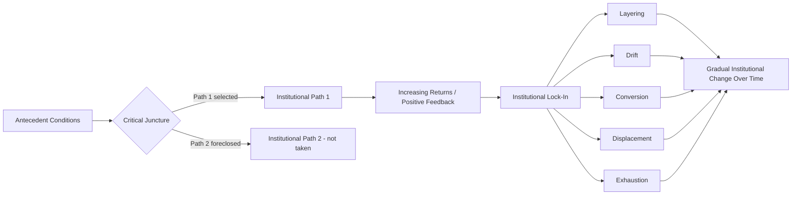

## Historical Institutionalism

### Definition and Core Premises

Historical institutionalism (HI) is a comparative politics approach that explains political outcomes by examining how institutions — formal rules, procedures, and organizational structures — emerge from and are shaped by specific historical sequences, and how, once established, they structure subsequent political development in ways that are difficult to reverse. Unlike rational choice institutionalism, which treats institutions primarily as equilibria of ongoing strategic interaction, HI emphasizes that institutions are products of **particular historical moments** and exert influence over time through mechanisms of **path dependence**, often producing outcomes that appear suboptimal or "locked in" relative to what a purely rational redesign might produce today.

HI emerged largely in the 1980s–1990s as part of the broader "new institutionalism" movement in political science, associated with scholars including Theda Skocpol, Peter Hall, Kathleen Thelen, Sven Steinmo, and Paul Pierson, often self-consciously positioned as a middle path between structural-functionalism's excessive abstraction and rational choice's excessive focus on ahistorical strategic equilibria.

### Core Analytical Concepts

**Path Dependence**

The central organizing concept of HI: once an institutional choice is made, it becomes progressively more difficult to reverse, not necessarily because it remains the most efficient option, but because of self-reinforcing dynamics.

- **Key Points**:
  - **Increasing returns**: Each step down a particular institutional path raises the relative benefits of continuing along that path and the costs of switching to an alternative (a concept borrowed from economist Brian Arthur's work on technological lock-in, e.g., the QWERTY keyboard case)
  - **Lock-in**: Over time, alternative paths that were once viable become effectively foreclosed, even if a "better" alternative exists in principle
  - Paul Pierson's *Politics in Time* (2004) systematized the application of path dependence to political science, distinguishing it from simple historical inertia by emphasizing the specific mechanism of **increasing returns/positive feedback**

$$P(\text{continue path } X \mid \text{time } t) \text{ increases as a function of prior investment in } X$$

**Critical Junctures**

Relatively short periods of contingency and heightened agency during which institutional paths are set, followed by longer periods of relative stability ("path dependence" proper).

- Associated foundationally with Giovanni Sartori and Seymour Martin Lipset/Stein Rokkan's work on European party system formation, and later systematized by Ruth Berins Collier and David Collier (*Shaping the Political Arena*, 1991) in the Latin American labor incorporation context
- During a critical juncture, structural constraints loosen relative to normal politics, giving individual and collective actors greater latitude to select among institutional alternatives that will subsequently become self-reinforcing
- [Inference] A recurring methodological challenge in HI scholarship is distinguishing genuine critical junctures (periods of real contingency) from periods that merely appear pivotal in hindsight (a version of the broader "retrospective determinism" problem in historical explanation)

**Sequencing**

The order in which events, reforms, or institutional developments occur is held to have independent causal significance — the same components introduced in a different order can produce substantially different outcomes.

- Distinguishes HI sharply from ahistorical or purely structural approaches that treat outcomes as a function of contemporaneous variables alone
- Examples: comparative welfare state scholarship (Skocpol) showing how the timing of bureaucratic state-building relative to democratization shaped subsequent welfare state architecture differently in the US versus continental Europe

### Mechanisms of Institutional Change Within HI

Later-generation HI scholarship (particularly Kathleen Thelen and Wolfgang Streeck's *Beyond Continuity*, 2005; James Mahoney and Thelen's *Explaining Institutional Change*, 2010) addressed a major early critique — that HI over-emphasized stability and struggled to explain gradual change — by developing a typology of incremental change mechanisms:

| Mechanism | Description | Illustrative Pattern |
| --- | --- | --- |
| Layering | New rules/institutions added alongside old ones without removing them, gradually shifting the institution's overall function | Adding private pension pillars alongside existing public pension systems |
| Drift | Institutional rules remain formally unchanged, but their impact shifts as the external environment changes around them | Fixed nominal welfare benefits eroding in real value amid inflation without formal policy change |
| Conversion | Existing institutions are redirected to serve new goals or new actors without formal rule change | Repurposing an institution originally designed for one constituency to serve a different one |
| Displacement | New institutional logics gradually replace old ones, often introduced at the margins before eventually supplanting the dominant arrangement | New regulatory models slowly displacing legacy regulatory bodies |
| Exhaustion | Institutions gradually break down due to internal contradictions or withdrawal of support, without active replacement | Gradual attrition of an institution's enforcement capacity over time |

This framework directly addressed the criticism that classical HI, with its heavy emphasis on critical junctures and path dependence, implied long stretches of stasis punctuated only by rare, dramatic ruptures — an empirically thin account of the incremental, often submerged ways institutions actually change in practice.

### Diagram: Path Dependence and Critical Junctures

### Example: Comparative Welfare State Development

**Example**: Historical institutionalism is frequently illustrated through comparative welfare state formation.

- **United States**: Theda Skocpol's work (*Protecting Soldiers and Mothers*, 1992) argues that the early, patronage-oriented, and fragmented character of 19th-century US federal bureaucracy — a legacy of Civil War veterans' pension politics and weak central administrative capacity relative to European counterparts — shaped a **path-dependent trajectory** toward a fragmented, means-tested, and comparatively limited welfare state, even as social needs evolved dramatically over the 20th century.
- **Germany**: Bismarck's late-19th-century social insurance reforms (1880s), introduced partly as a strategic response to socialist mobilization, established a **corporatist, contribution-based social insurance model** (rather than a universal, tax-funded model) that proved remarkably durable, shaping the structure of the German welfare state through subsequent regime changes (Weimar, Nazi, postwar Federal Republic) despite dramatic shifts in surrounding political conditions.
- **Sweden**: Early alliance between agrarian and labor political forces (the "red-green coalition" of the 1930s) at a formative critical juncture shaped a path toward the comparatively universal, tax-funded **social-democratic welfare regime** later associated with Gøsta Esping-Andersen's typology.

This illustrates HI's central claim: near-identical contemporary social and economic pressures (industrialization, aging populations, labor mobilization) produced substantially different institutional outcomes across cases because of divergent historical sequences and early institutional choices that became self-reinforcing.

### Esping-Andersen's Welfare Regime Typology (HI-Adjacent Application)

Gøsta Esping-Andersen's *The Three Worlds of Welfare Capitalism* (1990) is frequently taught alongside HI as an application of path-dependent institutional analysis to comparative welfare states, classifying regimes into:

- **Liberal regimes** (US, UK, Canada, Australia): Means-tested assistance, modest universal transfers, market-oriented welfare provision
- **Conservative/corporatist regimes** (Germany, France, Italy, Austria): Status-preserving, contribution-based social insurance tied to occupational categories, often shaped by Catholic social doctrine and corporatist historical legacies
- **Social-democratic regimes** (Sweden, Denmark, Norway): Universal, generous, tax-funded benefits aimed at decommodification and gender-egalitarian labor market participation

### Relationship to Other New Institutionalisms

| Dimension | Historical Institutionalism | Rational Choice Institutionalism | Sociological Institutionalism |
| --- | --- | --- | --- |
| Origin of institutions | Contingent historical choices at critical junctures | Strategic equilibria among self-interested actors | Culturally legitimated scripts, norms, and "logics of appropriateness" |
| Mechanism of persistence | Path dependence / increasing returns | Self-enforcing equilibrium (rational incentive to comply) | Cultural embeddedness, legitimacy, isomorphism |
| Treatment of actors | Actors with bounded, historically-shaped preferences and power | Fully strategic, forward-looking rational actors | Actors embedded in and shaped by cultural/normative environments |
| Explanation of change | Critical junctures, and gradual mechanisms (layering, drift, conversion, displacement) | Renegotiation when the equilibrium is no longer incentive-compatible | Diffusion of new norms/scripts, isomorphic pressure |

[Inference] These three "new institutionalisms" (following Peter Hall and Rosemary Taylor's influential 1996 taxonomy, "Political Science and the Three New Institutionalisms") are often treated in textbooks as analytically distinct, but much contemporary scholarship blends elements of more than one — for example, using rational choice microfoundations to explain actor behavior within a historically contingent institutional structure.

### Major Critiques

- **Difficulty specifying precise causal mechanisms**: Critics (including rational choice scholars) argue that "path dependence" and "critical junctures" can function as redescriptions of observed historical sequences rather than genuinely predictive, falsifiable causal mechanisms, echoing broader concerns about explanatory power in narrative-historical approaches.
- **Conservative/stability bias (early generation)**: Classical HI was criticized for over-predicting institutional stasis and under-theorizing incremental change, a critique substantially addressed by the Mahoney-Thelen gradual-change typology but still noted as a historical limitation of the approach's first generation.
- **Boundary problems in defining "critical junctures"**: Since the concept can be applied retrospectively to almost any turning point, scholars including Giovanni Capoccia and R. Daniel Kelemen (2007) have worked to tighten the definition (requiring genuine contingency, a compressed causal window, and demonstrable causal weight relative to the resulting path), but disagreement about operationalization persists across the literature.
- **Relative neglect of agency and ideas**: Some scholars (e.g., Vivien Schmidt's "discursive institutionalism") argue classical HI under-theorizes the role of ideas, discourse, and persuasion in both establishing and altering institutional paths, proposing discursive institutionalism as a complementary "fourth" new institutionalism.

### Contemporary Relevance and Applications

HI remains a dominant framework in several major comparative politics research programs:

- **Comparative political economy**: Varieties of Capitalism scholarship (Peter Hall and David Soskice, 2001) distinguishing **Liberal Market Economies** and **Coordinated Market Economies** draws directly on HI logic, explaining persistent cross-national institutional divergence in firm behavior, labor relations, and innovation systems through path-dependent complementarities among institutions.
- **State formation and state capacity**: Comparative-historical analyses of why some states developed strong bureaucratic capacity (Charles Tilly's war-making thesis; Francis Fukuyama's state-building scholarship) rely heavily on critical-juncture and sequencing logic.
- **Democratization and regime trajectories**: Explaining divergent post-communist or post-colonial trajectories through the lens of founding-era institutional choices and their long-run path-dependent consequences.

### Related Topics

- Path Dependence and Increasing Returns (Brian Arthur, Paul Pierson)
- Critical Junctures Framework (Collier and Collier; Capoccia and Kelemen)
- Varieties of Capitalism (Hall and Soskice)
- Esping-Andersen's Welfare Regime Typology
- Rational Choice Institutionalism (comparative contrast)
- Sociological Institutionalism and Organizational Isomorphism
- Gradual Institutional Change (Mahoney and Thelen: Layering, Drift, Conversion, Displacement)
- State Formation and Bureaucratic Capacity in Comparative Perspective
- Discursive Institutionalism and the Role of Ideas