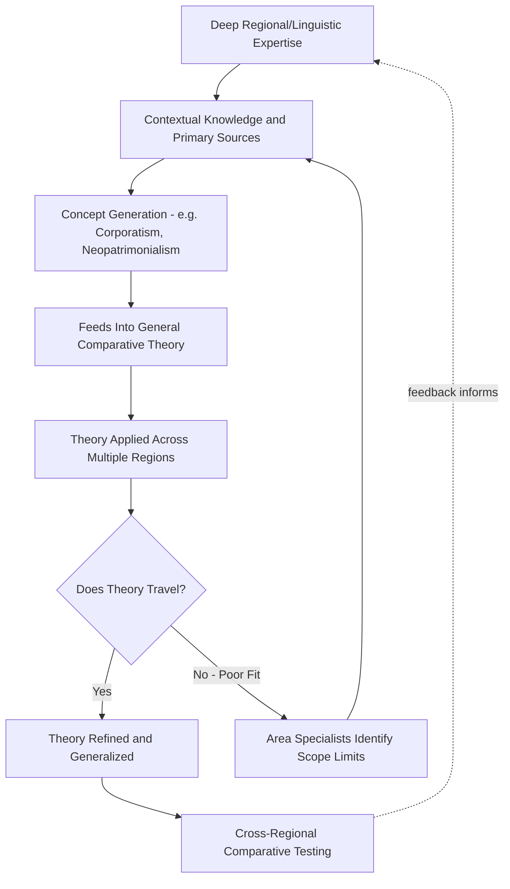

## Area Studies and Regional Expertise

### Definition and Scope

Area studies is an approach to comparative politics organized around deep, contextually grounded knowledge of a specific country, region, or cultural-linguistic zone (e.g., Latin American studies, Middle East studies, Sovietology/post-Soviet studies, East Asian studies, African studies), typically combining political science with history, anthropology, sociology, linguistics, and literary/cultural analysis. Rather than beginning from a general theoretical framework applied across many cases, area studies scholarship prioritizes **thick description**, local languages, historical particularity, and immersion in a region's political, social, and cultural context as the basis for understanding political phenomena.

Area studies stands in a long-running methodological tension with the more explicitly theory-driven, generalizing approaches covered elsewhere in comparative politics (structural-functionalism, rational choice, historical institutionalism), often framed as the "area studies versus rational choice/formal theory" debate that structured much disciplinary self-reflection from the 1990s onward.

### Historical Origins and Development

- **Cold War institutional origins**: Area studies programs expanded dramatically in US universities following the National Defense Education Act (1958), passed partly in response to Sputnik and Cold War strategic competition, funding language training and regional expertise (Soviet/Russian studies, Middle East studies, East Asian studies) considered strategically necessary.
- **Ford Foundation and philanthropic funding**: Substantial early funding for area studies centers came from major foundations seeking to build American expertise on regions of strategic and developmental interest, particularly in the postwar decolonization period.
- **Disciplinary location**: Area studies developed both as a set of interdisciplinary university centers (Title VI National Resource Centers in the US) and as a scholarly orientation within political science itself, producing scholars whose primary identity was regional (a "Latin Americanist," a "Sovietologist," an "Africanist") as much as methodological.

[Inference] The intellectual justification for area studies shifted over time from an initially strategic/policy-relevance rationale (Cold War expertise needs) toward a more purely scholarly rationale (contextual and interpretive rigor, critique of universalizing theory) as area studies scholars increasingly engaged critically with the discipline's theoretical mainstream from the 1970s onward.

### Core Methodological Commitments

**Language Competence and Immersion**

Area studies scholarship typically requires advanced proficiency in the relevant regional language(s), enabling access to primary sources, local media, archives, and direct fieldwork engagement unavailable to researchers relying solely on translated or secondary materials.

**Contextual and Historical Depth**

- **Key Points**:
  - Emphasis on understanding political phenomena within their specific historical, cultural, and institutional context rather than as instances of general theoretical categories
  - Skepticism toward concepts developed in one regional context (often Western Europe/North America) being applied uncritically to other regions without adaptation
  - Heavy reliance on archival research, ethnography, extended fieldwork, and close reading of primary sources in the original language

**Single-Case or Small-N Focus**

Area studies scholarship frequently produces deep single-country or small-region studies rather than large-N cross-national comparison, prioritizing **contextual validity** over generalizability across many cases.

### The Area Studies vs. Rational Choice/Formal Theory Debate

This methodological controversy, prominent especially in the 1990s (crystallized partly around debates following the end of the Cold War and critiques of Sovietological failure to anticipate the USSR's collapse), pitted:

| Dimension | Area Studies Position | Formal/Rational Choice Position |
| --- | --- | --- |
| Primary goal | Contextual understanding, interpretive depth | Generalizable, falsifiable causal explanation |
| View of theory | Theory should emerge from and be constrained by regional knowledge | Theory should be applied and tested systematically across cases |
| Risk emphasized | Formal theory imposing ill-fitting universal categories onto distinct contexts ("concept stretching") | Area studies producing idiosyncratic, non-cumulative, non-generalizable knowledge |
| Methodological orientation | Qualitative, interpretive, historical, ethnographic | Formal modeling, quantitative testing, large-N comparison |

Robert Bates's provocative 1996 essay in the American Political Science Association's comparative politics newsletter ("Area Studies and the Discipline") argued that area studies had become methodologically isolated from the discipline's theoretical and empirical advances, sparking a sustained and often sharp exchange. [Inference] This debate is frequently characterized in retrospect as having pushed both camps toward productive adaptation — area specialists increasingly engaging with formal and quantitative methods, and formal theorists increasingly recognizing the value of deep contextual knowledge for correctly specifying models and interpreting results — though disciplinary tensions over relative prestige and resource allocation between the approaches persist in some departments.

### Sovietology as a Cautionary Case Study

**Example**: The field of Sovietology (Soviet studies) is frequently invoked in methodological debates as a cautionary case.

- Sovietology developed substantial regional and linguistic expertise on the USSR's political institutions, ideology, and elite politics (Kremlinology, the close reading of official statements and personnel changes to infer internal power dynamics)
- The field was widely criticized, particularly after 1991, for failing to anticipate or adequately explain the Soviet Union's relatively rapid collapse
- [Inference] Post-hoc assessments of this failure vary: some scholars (echoing the Bates critique) attributed it to area studies' insularity from comparative theoretical frameworks (e.g., theories of institutional fragility, legitimacy crises, or economic stagnation dynamics developed elsewhere in comparative politics); others countered that the most contextually embedded area specialists had in fact identified serious internal strains well before 1991, while more theory-driven, quantitatively-oriented forecasting approaches performed no better and in some cases worse, making this case a genuinely contested rather than one-sided lesson

### Contributions of Area Studies to Comparative Theory

Despite methodological tensions, area studies scholarship has substantially shaped comparative political theory, including:

- **Concept generation from regional cases**: Many now-standard comparative concepts originated from deep regional scholarship before being generalized — e.g., "corporatism" theorized substantially through Latin American and Southern European cases (Philippe Schmitter), "patrimonialism" and "neopatrimonialism" developed through African and Middle Eastern regional scholarship, "competitive authoritarianism" (Steven Levitsky and Lucan Way) developed through close study of post-Cold War hybrid regimes across multiple regions
- **Correcting universalizing bias**: Regional expertise has repeatedly identified where general theories (often implicitly modeled on Western European or North American cases) fail to travel — e.g., critiques of modernization theory's applicability to postcolonial state trajectories, or critiques of Western-derived civil society concepts when applied to non-Western associational patterns
- **Case selection and scope conditions**: Deep regional knowledge is frequently indispensable for correctly selecting comparable cases and specifying the scope conditions under which a general theory is expected to hold — a methodological contribution recognized even by scholars otherwise committed to more generalizing approaches

### Diagram: Area Studies in Relation to Theory-Driven Approaches

### Contemporary Synthesis: Analytic Eclecticism and Mixed Methods

Much current comparative politics scholarship explicitly attempts to bridge area studies and generalizing approaches rather than treating them as mutually exclusive:

- **Nested analysis** (Evan Lieberman, 2005): Combines large-N statistical analysis to identify general patterns with small-N, area-informed case studies to probe causal mechanisms and address model misspecification, using each method to check and inform the other
- **Analytic eclecticism** (Peter Katzenstein and Rudra Sil): Explicitly advocates combining insights from multiple research traditions (rational choice, historical-institutionalist, area-studies/interpretive) pragmatically around specific empirical puzzles rather than adhering to a single paradigm
- **Regional comparative subfields**: Much contemporary work operates as genuinely regional comparative politics — comparing across cases *within* a region (e.g., comparative Latin American politics, comparative Middle East politics) — combining area expertise with systematic cross-case comparison, occupying a middle ground between pure area studies and fully general cross-regional theory

[Inference] Graduate training in comparative politics at most research universities today typically requires both a methods/theory core and substantial regional specialization (including language study), reflecting an institutionalized synthesis of the two traditions rather than a resolution in favor of either side of the earlier debate.

### Related Topics

- Concept Formation and Concept Stretching in Comparative Politics (Sartori)
- Competitive Authoritarianism and Hybrid Regimes (Levitsky and Way)
- Neopatrimonialism and Informal Institutions
- Nested Analysis and Mixed-Methods Research Design
- Analytic Eclecticism (Katzenstein and Sil)
- Case Selection Logic in Small-N Comparative Research
- Corporatism and Regional Origins of Comparative Concepts
- Sovietology and the Study of Authoritarian Regime Collapse