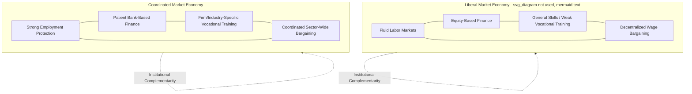

## Varieties of Capitalism

### Definition and Theoretical Foundations

The Varieties of Capitalism (VoC) framework, introduced by Peter Hall and David Soskice in *Varieties of Capitalism: The Institutional Foundations of Comparative Advantage* (2001), is a firm-centered approach to comparative political economy that explains persistent cross-national differences in economic institutions by analyzing how firms resolve coordination problems with other economic actors — employees, suppliers, investors, and each other. Rather than treating market economies as converging toward a single efficient model under globalization pressure, VoC argues that distinct national institutional configurations generate durable **comparative institutional advantages** in different types of economic activity.

The framework builds on historical institutionalism's emphasis on path dependence and institutional complementarity while incorporating rational choice microfoundations at the level of the firm, positioning itself explicitly as a synthesis of these two "new institutionalisms" applied to political economy.

### Core Analytical Framework: Firms and Coordination Problems

VoC's central move is to treat the **firm**, not the state or class actors, as the primary unit of analysis, asking how firms address five key coordination problems:

- **Industrial relations**: Coordinating wage-setting and working conditions with labor
- **Vocational training and education**: Securing workers with appropriate skills
- **Corporate governance**: Securing finance and satisfying investors/owners
- **Inter-firm relations**: Coordinating with suppliers, clients, and competitors (technology transfer, standard-setting)
- **Employee relations (within the firm)**: Securing employee cooperation and encouraging appropriate effort levels
- **Key Points**:
  - Firms rely on both formal institutions and informal norms/conventions to solve these coordination problems
  - How each problem is resolved is not independent across domains — institutional arrangements in one sphere (e.g., finance) tend to reinforce and depend on arrangements in others (e.g., labor relations), a property termed **institutional complementarity**
  - Complementarities generate systemic path dependence: a change in one institutional domain that is not matched by corresponding changes elsewhere often produces friction rather than improved performance, discouraging piecemeal reform

### The Two Ideal-Typical Models

**Liberal Market Economies (LMEs)**

Firms coordinate primarily through **competitive market relations and formal contracting**, with prices set by supply and demand serving as the principal coordination mechanism.

- **Key Points**:
  - Fluid labor markets with relatively weak employment protection, enabling easy hiring/firing
  - Finance raised primarily through equity markets and public capital markets, with dispersed shareholding and emphasis on short-term profitability signals (share price)
  - General, portable skills emphasized over firm/industry-specific vocational training, since workers are expected to move across firms and sectors
  - Weakly coordinated, often decentralized wage bargaining
  - Comparative institutional advantage in **radical innovation**: rapid reallocation of capital and labor toward new, high-risk ventures, strong venture capital ecosystems, favorable for disruptive technological change
  - Examples: United States, United Kingdom, Canada, Australia, Ireland, New Zealand

**Coordinated Market Economies (CMEs)**

Firms coordinate primarily through **non-market relationships**: strategic interaction, network monitoring, and collaborative arrangements with other economic actors, often mediated by strong business associations, unions, and cross-shareholding networks.

- **Key Points**:
  - Stronger employment protection and longer-term employment relationships, encouraging firm-specific and industry-specific human capital investment
  - Finance raised substantially through "patient capital" — long-term relationships with banks or cross-shareholding networks less driven by short-term share price movements
  - Extensive vocational training systems (often apprenticeship-based) generating deep industry- and firm-specific skills
  - Coordinated, often sector- or economy-wide wage bargaining through strong employer associations and unions
  - Comparative institutional advantage in **incremental innovation**: continuous, high-quality improvement of existing product lines, particularly suited to complex, high-precision manufacturing
  - Examples: Germany, Japan, Austria, Switzerland, Sweden, Netherlands (with some scholars treating Nordic cases as a related but distinct subtype)

[Inference] Hall and Soskice explicitly present LME and CME as **ideal types** on a continuum, acknowledging that many economies (notably Southern European and Mediterranean cases such as France, Italy, and Spain) do not fit cleanly into either category — a gap subsequent scholarship has addressed through additional subtypes.

### Diagram: Institutional Complementarity Across Spheres

### Comparative Advantage in Innovation: The Core Claim

**Example**: Consider how LME and CME institutional configurations shape which industries a national economy tends to excel in.

- **United States (LME)**: Fluid labor markets allow rapid reallocation of engineers and scientists toward promising new ventures; deep venture capital and equity markets tolerate high failure rates in exchange for occasional breakthrough returns; weak employment protection lowers the cost of firm entry and exit. This institutional configuration is argued to produce comparative advantage in **radical innovation** sectors — biotechnology, software, semiconductors — where breakthrough, first-mover innovation matters more than incremental refinement.
- **Germany (CME)**: Long-term employment relationships and extensive apprenticeship-based vocational training generate deep, firm-specific technical expertise among the workforce; patient bank finance allows firms to invest in long-payoff-horizon projects without short-term shareholder pressure; strong works councils and coordinated bargaining secure worker buy-in for continuous process improvement. This configuration is argued to produce comparative advantage in **incremental innovation** sectors — precision machinery, specialty chemicals, premium automobiles — where continuous quality refinement of established product categories matters more than radical breakthroughs.

This example illustrates VoC's central causal claim: national institutional configurations are not simply more or less efficient in the aggregate, but generate **differentiated comparative advantage** across industry types, explaining persistent cross-national specialization patterns that survive despite globalization pressure toward institutional convergence.

### Extensions and Subtypes Beyond the LME/CME Dichotomy

Subsequent scholarship extended the original two-category framework to address cases that fit poorly within it:

- **Mixed Market Economies (MMEs)**: Proposed to describe Southern European cases (France, Italy, Spain, Portugal, Greece) exhibiting a mix of LME- and CME-type features combined with a historically larger role for state intervention/dirigisme (associated with work building on Bob Hancké, Martin Rhodes, and Mark Thatcher)
- **Dependent Market Economies (DMEs)**: Proposed by Dorothee Bohle and Béla Greskovits to describe Central and Eastern European post-communist economies, characterized by heavy reliance on foreign direct investment and multinational corporate subsidiaries rather than either domestic equity markets (LME) or domestic patient-capital networks (CME)
- **State-influenced/hierarchical market economies**: Applied to describe East Asian developmental states (e.g., South Korea under earlier developmental-state institutional arrangements) and Latin American cases where the state plays a more direct coordinating role than either the LME or CME ideal type anticipates

### Comparison Table: Institutional Domains Across Types

| Domain | LME (e.g., US, UK) | CME (e.g., Germany, Japan) |
| --- | --- | --- |
| Labor market flexibility | High | Low-to-moderate |
| Employment protection | Weak | Strong |
| Skill formation | General, portable | Firm/industry-specific, vocational |
| Corporate finance | Equity markets, dispersed shareholders | Bank-based, patient capital, cross-shareholding |
| Wage bargaining | Decentralized/firm-level | Coordinated/sectoral |
| Innovation comparative advantage | Radical innovation | Incremental innovation |
| Inter-firm relations | Arm's-length, contractual | Network-based, collaborative |

### Major Critiques

- **Excessive dichotomization**: Critics argue the LME/CME binary, even with later subtype extensions, still forces considerable institutional diversity into a limited typology, potentially obscuring meaningful within-category variation (e.g., treating Japan and Germany as both "CME" despite substantial differences in corporate governance and labor relations).
- **Firm-centrism and neglect of politics/class conflict**: Critics from a more political-economy/power-resources tradition (building on Gøsta Esping-Andersen and earlier power-resources theorists) argue VoC's focus on firms' functional coordination needs underplays distributive conflict, class power, and the political agency of labor movements in shaping institutions — treating institutions as efficient functional solutions rather than contested outcomes of political struggle.
- **Gender-blindness**: Feminist political economy critiques (e.g., work associated with Ann Shola Orloff and others) argue the original framework paid insufficient attention to gendered labor market segmentation and the unpaid/care economy, which interacts significantly with both LME and CME institutional configurations but is largely absent from the original 2001 formulation.
- **Static bias and difficulty explaining change**: Similar to critiques of classical historical institutionalism, VoC was initially criticized for over-predicting institutional stability via complementarity, with subsequent scholarship (paralleling Mahoney and Thelen's gradual-change typology) needed to explain observed liberalization trends even within nominally coordinated economies (e.g., German labor market reforms of the 2000s, the Hartz reforms).
- **Applicability outside advanced industrial economies**: The framework was developed primarily to explain variation among OECD advanced industrial democracies; its applicability to developing, post-communist, or East Asian developmental-state economies required substantial adaptation (as reflected in the DME and state-influenced subtypes above), and some scholars question whether the core logic transfers well beyond its original empirical scope.

### Contemporary Relevance

VoC remains one of the most cited frameworks in comparative political economy and has generated a large empirical research program examining:

- How economies respond differently to common shocks (the 2008 financial crisis, COVID-19 economic disruption) based on their institutional configuration
- The politics of welfare state and labor market reform, using institutional complementarity to explain why reforms in one domain create pressure for corresponding adjustment elsewhere
- Firm-level strategy and multinational corporate location decisions, using VoC logic to explain why certain industries cluster in certain national institutional environments

[Inference] While the strict LME/CME dichotomy is less often applied without qualification in current scholarship, VoC's core methodological contribution — treating national political economies as systems of complementary institutions generating differentiated comparative advantage, rather than points on a single efficiency continuum — remains foundational to how comparative political economy is taught and researched.

### Related Topics

- Institutional Complementarity and Systemic Path Dependence
- Esping-Andersen's Welfare Regime Typology (comparative overlap with LME/CME)
- Historical Institutionalism (methodological foundation of VoC)
- Corporate Governance Systems in Comparative Perspective
- Vocational Training Systems and Skill Formation Regimes
- Dependent Market Economies (Bohle and Greskovits) and Post-Communist Political Economy
- Developmental State Theory and East Asian Political Economy
- Labor Market Liberalization and the Politics of Welfare State Reform