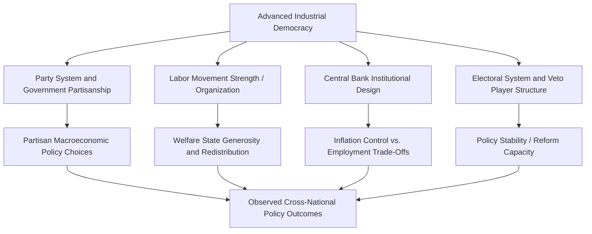

## Political Economy of Advanced Industrial Democracies

### Definition and Scope

The political economy of advanced industrial democracies examines how political institutions, partisan competition, and organized economic interests interact to shape economic policy outcomes — growth strategies, distributive policy, labor market regulation, and macroeconomic management — in the mature capitalist democracies of North America, Western Europe, and parts of East Asia and Oceania (broadly, OECD member states). This field sits adjacent to, and substantially overlaps with, the Varieties of Capitalism framework, but places greater emphasis on **partisan politics, electoral competition, and the state's macroeconomic policy choices** rather than firm-level coordination problems alone.

The field draws on multiple theoretical traditions — power-resources theory, partisan theory of macroeconomic policy, historical institutionalism, and rational choice political economy — to explain why advanced democracies, despite broadly similar levels of economic development, exhibit persistent and substantial variation in inequality, welfare provision, labor market institutions, and macroeconomic policy stance.

### Power Resources Theory

Developed primarily by Walter Korpi and Gøsta Esping-Andersen, power resources theory (PRT) explains cross-national welfare state variation as a function of the relative organizational and political strength of labor versus capital, mediated through democratic political competition.

- **Key Points**:
  - Strong, encompassing labor movements (high union density, centralized union confederations) combined with durable left-party incumbency are argued to produce more generous, universal, redistributive welfare states
  - Weaker or more fragmented labor movements, combined with more frequent center-right governance, are argued to produce more residual, means-tested welfare arrangements
  - The **"power resources" of labor** include formal organizational strength (union density, bargaining coordination) and political strength (electoral support for labor-aligned parties, representation in government)
  - PRT is historically associated with explaining the distinctively generous Scandinavian social-democratic welfare model as a product of exceptionally strong and durable labor-left political dominance through much of the 20th century

[Inference] PRT has faced sustained critique for its relatively class-centric focus, with subsequent scholarship (including work by Esping-Andersen himself in later writing, and feminist political economy critiques) arguing that cross-class coalitions, gender politics, and employer strategic preferences also play independent causal roles not fully captured by a pure labor-versus-capital power framework.

### Partisan Theory of Macroeconomic Policy

Building on Douglas Hibbs's foundational work (1977) and subsequently refined substantially, partisan theory argues that the party in government systematically shapes macroeconomic policy choices according to the preferences of its core electoral constituency.

- **Traditional partisan theory**: Left governments prioritize low unemployment (favoring their working-class electoral base) even at the cost of higher inflation; right governments prioritize low inflation (favoring capital-owning and creditor constituencies) even at the cost of higher unemployment, producing a partisan cycle along the Phillips curve trade-off
- **Rational partisan theory** (Alberto Alesina): Refined the model using rational expectations, arguing partisan effects on real economic outcomes (unemployment, growth) should be concentrated in the period immediately following an *unanticipated* election outcome, since markets adjust expectations once a government's type becomes known, while partisan effects on *inflation* (a more purely nominal variable) can persist throughout a term
- [Inference] Empirical support for strict partisan business-cycle models has weakened somewhat since the 1980s–1990s, as central bank independence, financial market integration, and the general decline of Phillips-curve-style inflation-unemployment trade-offs have constrained the room for discretionary partisan macroeconomic manipulation — a finding often linked to the broader "embedded liberalism" and globalization-constraint literature discussed below

### Central Bank Independence and Monetary Institutions

A major strand of advanced-democracy political economy examines the political origins and consequences of **central bank independence (CBI)** — the degree to which monetary policy authority is insulated from direct political control.

- **Key Points**:
  - Cross-national indices of CBI (notably the widely used Cukierman index) find substantial variation among advanced democracies, from historically highly independent central banks (Bundesbank, later the European Central Bank) to more politically responsive arrangements
  - The dominant theoretical justification for CBI, associated with the **time-inconsistency problem** (Finn Kydland and Edward Prescott; Robert Barro and David Gordon), argues that politically controlled central banks face incentives to generate short-term inflationary surprises for electoral gain, which rational actors anticipate, producing a suboptimal high-inflation equilibrium; delegating monetary policy to an independent, inflation-averse central bank is argued to solve this credibility problem
  - Empirically, higher CBI has been associated with lower average inflation across advanced democracies, though with debated and more contested effects on output and unemployment
  - Political economy scholarship examines CBI's institutional design as itself a political choice, often made by governments seeking to "tie their hands" credibly (particularly relevant to the design of the European Central Bank, heavily modeled on the Bundesbank at German insistence during Maastricht Treaty negotiations)

### Diagram: Institutional Drivers of Policy Variation in Advanced Democracies

### Globalization and the "Embedded Liberalism" / Compensation Thesis

A major research program examines how international economic integration (trade openness, capital mobility) interacts with domestic political economy institutions.

- **Embedded liberalism** (John Ruggie's term, building on Karl Polanyi): Describes the postwar international economic order as combining relatively open trade with substantial domestic policy autonomy for welfare state and macroeconomic intervention, understood as a political compromise that made international economic openness socially and politically sustainable
- **Compensation hypothesis** (associated with David Cameron's 1978 finding and later work by Dani Rodrik and Peter Katzenstein): Argues that greater trade openness, by exposing domestic workers to external economic risk, generates *greater* domestic political demand for welfare state compensation, producing a positive (rather than negative, "race to the bottom") empirical association between trade openness and welfare state size among advanced democracies — a finding often illustrated through small, highly open European economies (e.g., the Netherlands, Austria, the Nordic states) combining extensive trade exposure with extensive welfare provision
- [Inference] This compensation-thesis finding has been contested by subsequent scholarship examining whether financial (as opposed to trade) globalization exerts a different, more constraining effect on welfare states than trade openness alone, given capital's greater exit threat relative to labor

### Example: Divergent Responses to the 2008 Financial Crisis

**Example**: Advanced industrial democracies' differing political-economic institutions produced markedly different responses to the 2008–2009 global financial crisis and subsequent Eurozone crisis.

- **United States (LME, weaker coordinated wage bargaining)**: Responded with a large discretionary fiscal stimulus (the American Recovery and Reinvestment Act, 2009) combined with aggressive, relatively unconstrained monetary expansion by the Federal Reserve, consistent with a political-economic system featuring fewer veto players blocking rapid fiscal/monetary response and a central bank with a dual mandate including employment.
- **Germany (CME, strong fiscal conservatism norms, export-oriented model)**: Pursued comparatively more fiscally conservative policy, emphasizing budgetary discipline (partly reflecting historically embedded anti-inflationary institutional norms traceable to the Bundesbank tradition and now embedded in EU-level fiscal rules), while relying on short-time work schemes (Kurzarbeit) — a coordinated-bargaining-style labor market instrument — to preserve employment relationships during the downturn rather than large-scale layoffs.
- **Southern European Eurozone members (Greece, Spain, Portugal, Italy)**: Faced severe fiscal constraints imposed externally through Eurozone membership (loss of independent monetary policy and currency devaluation as an adjustment tool) combined with international bailout conditionality (the "Troika" programs), producing prolonged internal devaluation, austerity, and substantially higher unemployment than in economies retaining greater monetary/fiscal policy autonomy.

This example illustrates how partisan theory, central bank institutional design, welfare state generosity, and Varieties-of-Capitalism-style coordination differences jointly shaped divergent national and regional responses to an identical global economic shock.

### Comparison Table: Key Political Economy Variables Across Advanced Democracy Types

| Variable | Liberal/Anglo Model (US, UK) | Coordinated/Continental Model (Germany, Austria) | Social-Democratic/Nordic Model (Sweden, Denmark) |
| --- | --- | --- | --- |
| Union density and bargaining coordination | Low, decentralized | Moderate-high, sectoral coordination | High, highly centralized/coordinated |
| Welfare state character | Liberal/residual, means-tested | Conservative/corporatist, status-preserving | Universal, redistributive |
| Central bank independence | High (US Federal Reserve) | Very high (historically Bundesbank; now ECB) | Moderate-high |
| Historical partisan pattern | Alternating, weaker labor-left dominance | Christian-democratic/social-democratic alternation | Long social-democratic incumbency (esp. Sweden) |
| Typical crisis-response instrument | Fiscal stimulus + monetary expansion | Short-time work schemes, export-led recovery | Active labor market policy, universal transfers |

### Active Labor Market Policy and the "Flexicurity" Model

A distinct strand of advanced-democracy political economy examines **active labor market policies (ALMPs)** — job training, placement services, and conditional unemployment benefits — as opposed to purely passive income replacement.

- **Flexicurity** (associated particularly with Denmark and, to a lesser extent, the Netherlands): Combines flexible hiring/firing rules (LME-like labor market flexibility) with generous unemployment benefits and strong active labor market programs (CME/social-democratic-like social protection), often presented as a "third way" combining flexibility and security rather than treating them as a strict trade-off
- [Inference] Whether flexicurity represents a genuinely stable, exportable institutional model or a configuration specific to Danish social and institutional context (high social trust, strong union involvement in ALMP administration, small open economy) remains debated in comparative political economy scholarship, particularly given mixed results when similar reforms were attempted in different institutional settings

### Major Critiques and Debates

- **Convergence vs. divergence under globalization**: A long-running debate asks whether advanced democracies are converging toward a common (often assumed to be liberal/market-oriented) model under globalization pressure, or whether distinct national political-economic trajectories remain durable — the VoC and embedded-liberalism/compensation literatures generally support continued divergence, while some globalization-constraint scholarship emphasizes convergence pressure, particularly in financial regulation
- **Declining partisan effects**: Some scholars argue that financial market integration, central bank independence, and EU-level constraints (for European cases) have substantially narrowed the range of feasible macroeconomic policy divergence between left and right governments since the 1980s–1990s, a claim contested by others who point to continued partisan divergence in areas like labor market regulation, taxation, and welfare state generosity even where macroeconomic policy space has narrowed
- **Inequality trends despite institutional stability**: Despite relatively durable institutional configurations, most advanced democracies (including historically egalitarian coordinated and social-democratic cases) have experienced rising income and wealth inequality since the 1980s, prompting debate about whether this reflects common exogenous pressures (technological change, globalization) overwhelming institutional variation, or insufficient attention in existing frameworks to within-category institutional erosion (echoing Mahoney and Thelen's gradual-change critique of historical institutionalism)

### Related Topics

- Varieties of Capitalism (institutional foundation for this subfield)
- Power Resources Theory and Comparative Welfare States
- Central Bank Independence and the Time-Inconsistency Problem
- Partisan Theory of Macroeconomic Policy (Hibbs, Alesina)
- Embedded Liberalism and the Compensation Hypothesis (Ruggie, Rodrik, Cameron)
- Flexicurity and Active Labor Market Policy
- Eurozone Crisis and Monetary Union Political Economy
- Esping-Andersen's Welfare Regime Typology
- Income Inequality Trends in Advanced Democracies