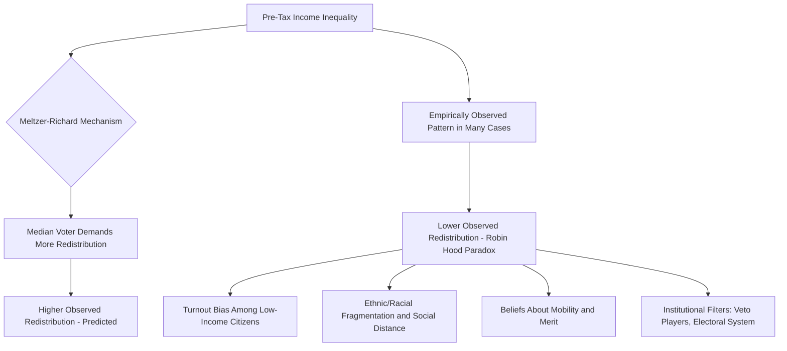

## Political Economy of Redistribution

### Definition and Scope

The political economy of redistribution examines why and how democratic political systems transfer income, wealth, and resources across individuals and groups through taxation, social transfers, and public services, and why the extent of redistribution varies substantially across countries with broadly similar levels of economic development and formally similar democratic institutions. The field combines formal political economy modeling (median voter models of redistribution), comparative institutional analysis (how electoral and welfare state institutions shape redistributive outcomes), and empirical political sociology (who supports redistribution and why).

This subfield overlaps substantially with power resources theory and welfare state scholarship but is distinguished by its more explicit formal-theoretic core: much of the foundational literature models redistribution as the equilibrium outcome of political competition over the tax-and-transfer rate under majority rule.

### The Meltzer-Richard Model

The foundational formal model of democratic redistribution, developed by Allan Meltzer and Scott Richard (1981), extends the median voter theorem to redistributive taxation.

- **Core logic**: Assume income is unequally distributed such that the median voter's income is below the mean income (a realistic assumption given right-skewed income distributions). Under majority rule with a single-dimensional tax-and-transfer policy choice, the median voter's preferred tax rate becomes the equilibrium outcome (by the median voter theorem). Since median income is below mean income, the median voter receives a net transfer from taxation of above-median earners, giving the median voter incentive to prefer a **positive redistributive tax rate**.
- **Key comparative-static prediction**: The model predicts that **greater pre-tax income inequality** (a larger gap between mean and median income) should produce a **more redistributive median-voter-preferred tax rate**, since the median voter's net gain from redistribution increases as the mean-median gap widens.

$$t^* = f\left(\frac{\bar{y} - y_m}{\bar{y}}\right)$$

where $t^*$ is the equilibrium redistributive tax rate, $\bar{y}$ is mean income, and $y_m$ is median income.

- **Key Points**:
  - The model also predicts that franchise extension (broadening the electorate to include lower-income voters, historically a major democratization dynamic) should increase redistribution, since it typically lowers the median voter's income relative to the mean
  - The model has been highly influential precisely because of its sharp, falsifiable comparative-static prediction, making it a central reference point for subsequent empirical testing

### The Robin Hood Paradox

[Inference] A major empirical puzzle that emerged from testing the Meltzer-Richard model: cross-national and cross-time empirical evidence frequently shows the *opposite* of the model's core prediction — countries and periods with **higher pre-tax inequality tend to redistribute less**, not more, a pattern sometimes termed the "Robin Hood paradox" (a term associated with Peter Lindert's comparative historical work). This anomaly has generated substantial subsequent theoretical and empirical literature attempting to explain the gap between the formal model's prediction and observed cross-national patterns.

Proposed explanations for the Robin Hood paradox include:

- **Political power and turnout bias**: Lower-income citizens vote at systematically lower rates than higher-income citizens in many democracies, meaning the *effective* median voter (among actual voters) may have higher income than the population median, weakening the model's core mechanism
- **Racial and ethnic heterogeneity**: Alberto Alesina and Edward Glaeser's comparative work (*Fighting Poverty in the US and Europe*, 2004) argues that racial/ethnic fragmentation reduces support for redistribution by weakening cross-group solidarity and increasing the perceived "social distance" between median voters and likely transfer recipients — offered as a partial explanation for why the US, despite high inequality, redistributes less than more ethnically homogeneous European welfare states
- **Beliefs about the causes of inequality and social mobility**: Comparative survey research finds systematic cross-national differences in whether inequality is attributed to effort/merit versus luck/circumstance, and in perceived social mobility prospects, both of which shape demand for redistribution independent of actual income position — reflected in scholarship contrasting "American exceptionalism" beliefs about opportunity with more structuralist European attitudes
- **Institutional mediation**: Electoral system type, veto player structure, and welfare state institutional legacies (see historical institutionalism and power resources theory) are argued to mediate or block the translation of median-voter redistributive preferences into actual policy, meaning the simple median voter model omits crucial institutional filters between preference and outcome

### Diagram: From Inequality to Redistribution — Competing Causal Pathways

### Electoral System Effects on Redistribution

A major comparative institutional strand examines how electoral system design shapes redistributive outcomes independent of underlying inequality or voter preferences.

- **Proportional representation (PR) systems**: Associated in comparative research (notably work by Torben Iversen and David Soskice) with more redistributive welfare states, theorized to result from PR systems' tendency to produce coalition governments requiring center-left and center-right parties to bargain, and from PR's tendency to generate multiple parties representing distinct income/occupational groups, facilitating cross-class redistributive coalitions
- **Majoritarian/plurality systems**: Associated with lower redistribution, theorized (in the Iversen-Soskice account) to result from majoritarian systems' tendency to produce broad "catch-all" center parties whose median-income supporters may fear that redistributive coalitions under majoritarian rule will subsequently be captured and skewed against them, reducing willingness to support redistribution ex ante — a strategic-uncertainty argument rather than a simple institutional-veto-player argument
- [Inference] This electoral-system-redistribution relationship is one of the more robust cross-national empirical patterns in the field, though causal identification remains contested since electoral system choice is not randomly assigned and may itself be endogenous to pre-existing social coalitions and preferences for redistribution (an issue explored in work on the political origins of electoral systems by Carles Boix)

### Skill Specificity and Redistributive Preferences

Building on Varieties of Capitalism logic, Torben Iversen and Anne Wren, and separately Philipp Rehm, argue that individual-level demand for redistribution (particularly social insurance against income loss) is shaped significantly by **skill specificity** — how portable a worker's skills are across firms and industries.

- **Key Points**:
  - Workers with highly specific skills (deep expertise valuable to a narrow set of employers, common in CME/coordinated economies with strong vocational training systems) face greater income risk if displaced, since their skills do not transfer easily to alternative employment, generating stronger individual-level demand for social insurance/redistribution
  - Workers with general, portable skills (more common in LME/liberal economies with general education systems) face lower re-employment risk and correspondingly weaker individual demand for social insurance
  - This microfoundational account helps explain why CME institutional configurations (which generate high skill specificity) tend to be politically sustained by genuine cross-class coalitions supporting redistributive social insurance, linking VoC-style institutional analysis to individual-level redistributive preference formation

### Example: Explaining the US-Europe Redistribution Gap

**Example**: Comparative political economy scholarship has extensively examined why the United States redistributes substantially less than most Western European democracies despite comparable or higher pre-tax income inequality — a paradigm case of the Robin Hood paradox.

- **Alesina-Glaeser racial fragmentation thesis**: Argues the US's greater racial and ethnic heterogeneity, combined with the historical association between race and welfare recipiency in American political discourse, has weakened cross-racial political solidarity for redistribution relative to more homogeneous European welfare states.
- **Electoral system explanation (Iversen-Soskice)**: Points to the US's majoritarian, single-member-district electoral system (reinforced by strong two-party competition) as generating weaker structural incentives for redistributive coalition-building compared to PR-based European multi-party systems.
- **Skill regime explanation**: Notes that the US's more LME-type political economy (general education, flexible labor markets, weaker vocational training) generates lower average skill specificity and correspondingly weaker individual-level demand for social insurance relative to CME-type European economies.
- **Beliefs and social mobility explanation**: Cites comparative survey evidence (e.g., World Values Survey-based research) showing Americans are substantially more likely than Europeans to attribute income position to individual effort rather than luck or structural circumstance, and to overestimate actual social mobility, both associated with weaker demand for redistribution.

[Inference] Most contemporary scholarship treats these explanations as complementary rather than competing — the US-Europe gap likely reflects the mutually reinforcing combination of institutional (electoral system, welfare state path dependence), demographic (racial fragmentation), economic (skill regime), and ideational (beliefs about mobility and merit) factors rather than any single dominant cause, though the relative weighting of these factors remains actively debated.

### Redistribution Instruments Compared

| Instrument | Mechanism | Typical Association |
| --- | --- | --- |
| Progressive income taxation | Higher marginal rates on higher incomes | Direct redistribution via the tax side |
| Universal cash transfers | Flat transfers to all citizens/residents regardless of income | Social-democratic/universal welfare models |
| Means-tested transfers | Transfers conditional on income/asset thresholds | Liberal/residual welfare models |
| Social insurance (contributory) | Benefits tied to prior contributions, often earnings-related | Conservative/corporatist welfare models |
| In-kind public services | Universal provision of healthcare, education, childcare | Reduces effective inequality without direct cash transfer |

### Major Critiques and Ongoing Debates

- **Limits of the pure median voter framework**: Critics note the Meltzer-Richard model's single-dimensional policy space and assumption of policy-determining median voter preferences abstracts away from multidimensional political competition (redistribution bundled with other issues, e.g., cultural/identity politics), which may better explain why redistributive outcomes diverge from simple income-based predictions.
- **Endogeneity of inequality and redistribution**: Because redistribution itself shapes the post-tax income distribution that subsequently influences future political preferences and coalitions, some scholars argue simple cross-sectional tests of the inequality-redistribution relationship suffer from difficult-to-resolve endogeneity and reverse-causation concerns.
- **Insufficient attention to wealth versus income**: Much of the classical literature focuses on income-based redistribution, with comparatively less formal political economy modeling of wealth taxation and intergenerational wealth transmission, an area of growing scholarly attention (paralleling broader public debate following Thomas Piketty's work on wealth inequality, though Piketty's own work sits more in economics than formal political science modeling).
- **Cross-national survey measurement challenges**: Comparative attitudinal research on redistributive preferences faces persistent measurement and cross-cultural equivalence challenges, complicating clean empirical tests of belief-based explanations for cross-national redistribution gaps.

### Related Topics

- Meltzer-Richard Model and Median Voter Theory of Taxation
- Power Resources Theory and Comparative Welfare States
- Electoral Systems and Redistributive Coalition Formation (Iversen and Soskice)
- Skill Specificity and Social Insurance Preferences (Iversen, Wren, Rehm)
- Racial and Ethnic Fragmentation Effects on Redistribution (Alesina and Glaeser)
- Varieties of Capitalism (institutional foundation for skill-regime arguments)
- Beliefs About Social Mobility and Comparative Political Attitudes
- Wealth Inequality and Political Economy of Taxation