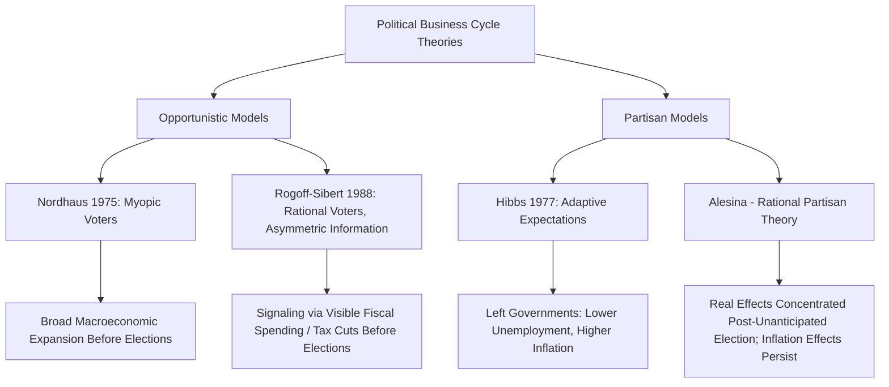

## Political Business Cycles

### Definition and Scope

Political business cycle (PBC) theory examines how electoral incentives shape incumbent governments' macroeconomic and fiscal policy choices, generating systematic, predictable fluctuations in economic policy and outcomes that track the electoral calendar rather than purely economic fundamentals. The field asks whether and how incumbents manipulate monetary policy, fiscal spending, and other policy levers around elections to maximize their probability of reelection, and what economic and institutional conditions enable or constrain such manipulation.

PBC theory is closely related to but analytically distinct from **partisan theory** (covered under political economy of advanced industrial democracies): partisan models explain policy variation by *which party* holds office, while PBC models explain policy variation by *proximity to elections*, regardless of incumbent party identity.

### The Opportunistic (Nordhaus) Model

William Nordhaus's foundational 1975 model proposed the earliest formal political business cycle theory, based on an "opportunistic" assumption about incumbent behavior.

- **Core logic**: Assumes voters are **myopic/adaptive** — they weight recent economic performance heavily in their electoral choice and do not fully anticipate or discount pre-election policy manipulation. Assumes incumbents are **office-motivated** (seeking reelection above any particular policy goal) and face an exploitable short-run Phillips curve trade-off between inflation and unemployment.
- **Predicted pattern**: Incumbents engineer economic expansion (lower unemployment, higher growth) in the run-up to elections through expansionary fiscal and monetary policy, accepting the resulting inflationary cost *after* the election, producing a **regular, predictable electoral cycle** in macroeconomic outcomes synchronized with the electoral calendar regardless of which party wins.

$$\pi_t = \pi_t^e + \alpha(u^* - u_t) + \epsilon_t$$

illustrating the exploitable short-run Phillips-curve logic underlying the opportunistic manipulation mechanism, where $\pi_t$ is inflation, $\pi_t^e$ is expected inflation, $u_t$ is unemployment, and $u^*$ is the natural rate.

- **Key Points**:
  - The Nordhaus model's key vulnerability is its reliance on systematically myopic/non-rational voter expectations — a strong assumption vulnerable to the broader rational expectations critique that swept macroeconomics from the late 1970s onward
  - Empirical testing of the strict Nordhaus opportunistic cycle produced decidedly mixed results across countries and time periods, motivating substantial theoretical refinement

### The Rational Opportunistic Model

Responding to the rational-expectations critique of Nordhaus's myopic-voter assumption, later scholars (notably Kenneth Rogoff and Anne Sibert, 1988; Rogoff, 1990) developed **rational opportunistic** models that preserve the prediction of election-driven policy manipulation without requiring irrational voters.

- **Core logic**: Assumes voters are rational but face **asymmetric information** about incumbent competence — voters cannot directly observe whether the incumbent is a "competent" type (able to deliver services efficiently at lower fiscal cost) or an "incompetent" type. Competent incumbents can signal their type by temporarily manipulating **fiscal policy composition** (shifting spending toward highly visible items, cutting less visible taxes) before elections, since only competent types can afford to do so without excessive fiscal strain — a costly, and therefore credible, signaling mechanism (formally analogous to signaling games in rational choice theory).
- **Predicted pattern**: Rather than a broad macroeconomic expansion (Nordhaus's prediction), the rational opportunistic model predicts more specific **pre-electoral fiscal manipulation** — increases in highly visible spending categories and reductions in taxation shortly before elections, followed by fiscal correction afterward — with the magnitude of manipulation correlated with electoral competitiveness and the transparency of the fiscal system.
- [Inference] This model has generally received stronger and more consistent empirical support than the original Nordhaus formulation, particularly in studies of pre-electoral fiscal deficits (rather than broader macroeconomic aggregates like unemployment), and is generally regarded as having superseded the pure Nordhaus model as the dominant "opportunistic" PBC framework in the contemporary literature.

### The Partisan Business Cycle Model (Hibbs)

Distinct from opportunistic models, the partisan business cycle approach (Douglas Hibbs, 1977, and later Alberto Alesina's **rational partisan theory** refinement) argues that macroeconomic outcomes track *which party* governs rather than proximity to elections per se — this model is covered in greater depth under Political Economy of Advanced Industrial Democracies, but is included here comparatively as the primary alternative to opportunistic PBC logic.

- **Key distinction**: Opportunistic models predict a cycle synchronized with the *electoral calendar* regardless of incumbent party; partisan models predict systematic differences synchronized with *which party wins*, without necessarily any electoral-calendar-driven manipulation
- Rational partisan theory (Alesina) predicts partisan effects on *real* variables (unemployment, growth) should be concentrated in the period immediately following an unanticipated election result, while effects on *inflation* can persist throughout the term — a refinement analogous in structure to the shift from Nordhaus's myopic-voter model to Rogoff-Sibert's rational-voter model

### Diagram: Opportunistic vs. Partisan Political Business Cycle Logic

### Institutional Constraints on Political Business Cycles

Comparative empirical research has identified several institutional factors that condition whether and how strongly political business cycles manifest:

- **Central bank independence**: Higher CBI is generally associated with weaker or absent monetary-policy-driven PBCs, since an independent central bank is, by design, insulated from direct electoral pressure to manipulate monetary policy — though fiscal-side PBCs (which remain under elected governments' direct control) can persist even with high CBI
- **Electoral system and government type**: Coalition governments and systems with dispersed policy authority (more veto players, in Tsebelis's terms) are generally found to exhibit weaker and less predictable PBCs than single-party majority governments with concentrated policy control, since coalition partners can constrain unilateral pre-electoral manipulation
- **Fiscal transparency and budgetary institutions**: Countries with more transparent, rules-based budgetary processes (e.g., strong independent fiscal councils, transparent accounting standards) exhibit smaller pre-electoral fiscal deficits than countries with more opaque budgetary institutions, since transparency reduces incumbents' ability to shift spending into less visible or off-budget categories
- **Level of economic development and democratic institutionalization**: Comparative work (notably Allan Drazen's and others' cross-national empirical testing) finds pre-electoral fiscal manipulation to be considerably stronger and more consistent in developing/newer democracies than in long-established advanced industrial democracies, plausibly reflecting both weaker fiscal institutions and less-informed electorates in the former

### Example: Comparative Pre-Electoral Fiscal Patterns

**Example**: Comparative political economy research on pre-electoral fiscal behavior illustrates institutional conditioning of PBC effects.

- **Established advanced democracies with strong fiscal institutions (e.g., Germany, Nordic states)**: Empirical studies generally find modest or statistically fragile pre-electoral fiscal deficit effects, consistent with strong independent fiscal oversight bodies, transparent budgeting, and often coalition-government power-sharing constraining unilateral manipulation.
- **Younger or less institutionalized democracies (frequently studied in Latin American and post-communist contexts)**: Empirical studies (building on the Drazen-Brender line of research) more consistently find sizable pre-electoral spending increases and tax reductions, particularly in highly visible categories (public sector wages, social transfers, infrastructure spending timed for visible completion before elections), consistent with weaker fiscal transparency and potentially less sophisticated voter monitoring of fiscal manipulation.
- **US state-level and local-level studies**: A substantial empirical literature uses within-country cross-state or cross-municipality variation (holding national institutions constant) to test PBC predictions with reduced confounding from cross-national institutional differences, generally finding more consistent evidence for fiscal-composition-based signaling (Rogoff-Sibert-style) than for broad Nordhaus-style macroeconomic manipulation.

### Major Critiques and Empirical Challenges

- **Mixed and inconsistent cross-national evidence**: The empirical PBC literature has faced persistent challenges from inconsistent findings across countries, time periods, and specification choices, with meta-analytic reviews finding effects considerably more robust for fiscal variables (deficits, spending composition) than for broader macroeconomic aggregates (unemployment, growth, inflation).
- **Identification and endogeneity concerns**: Distinguishing genuine electorally-motivated policy manipulation from coincidental correlation between the electoral calendar and independent economic cycles (or reverse causation, where economic conditions influence election timing in systems with flexible election timing, e.g., many parliamentary systems) remains a significant methodological challenge across the literature.
- **Voter rationality debates**: While the shift from Nordhaus's myopic-voter assumption to Rogoff-Sibert's rational-asymmetric-information framework addressed the most direct rational-expectations critique, some behavioral political economy scholars argue that even the rational-opportunistic model may understate the role of genuine voter myopia and retrospective, performance-based (rather than fully rational, forward-looking) voting documented in the broader economic voting literature.
- **Declining relevance in highly independent-central-bank environments**: [Inference] Given the broad trend toward central bank independence in advanced democracies from the 1990s onward, some scholars argue classical monetary-policy-driven PBC theory (the original Nordhaus mechanism in particular) has become substantially less empirically relevant to contemporary advanced-democracy politics, with the field's empirical center of gravity shifting toward fiscal-side manipulation and toward developing/newer democracy contexts where central bank independence and fiscal transparency remain less consistently institutionalized.

### Related Topics

- Rational Expectations Critique and Its Effect on Macroeconomic Political Theory
- Central Bank Independence and Time-Inconsistency (cross-reference: Political Economy of Advanced Industrial Democracies)
- Partisan Theory of Macroeconomic Policy (Hibbs, Alesina)
- Economic Voting and Retrospective Voting Theory
- Fiscal Transparency and Budgetary Institutions
- Veto Players and Policy Manipulation Constraints (Tsebelis)
- Comparative Political Economy of Newer/Developing Democracies
- Signaling Games and Asymmetric Information in Political Economy